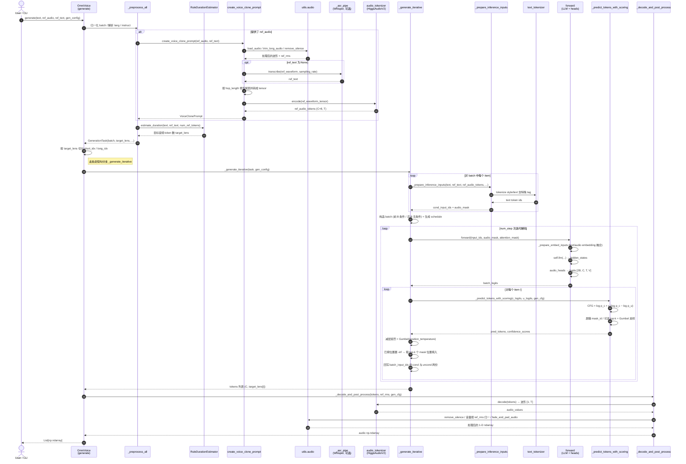

# OmniVoice 推理源码学习笔记

OmniVoice 是 k2-fsa 的多语言零样本 TTS 模型，采用扩散语言模型（mask-then-fill）的架构。推理代码主要分布在 `omnivoice/cli/`、`omnivoice/models/omnivoice.py` 与 `omnivoice/utils/` 三处。

## 一、整体目录

```
omnivoice/
├── cli/
│   ├── infer.py          # 单条文本推理 CLI
│   ├── infer_batch.py    # 多 GPU 批量推理 CLI（多进程）
│   └── demo.py           # Gradio 演示
├── models/
│   └── omnivoice.py      # 核心模型 + 生成 pipeline（1598 行，推理逻辑都在这里）
└── utils/
    ├── audio.py          # 加载/去静音/淡入淡出/分段拼接
    ├── text.py           # 文本切块、加标点、非言语标签
    ├── duration.py       # 基于字符的多语种时长估计器
    ├── voice_design.py   # Voice Design 指令归一化（中英互转/互斥校验）
    └── lang_map.py       # 语言 ID/名 映射
```

## 二、架构图：模块组成

下图展示推理涉及的所有模块、它们的代码位置以及彼此的依赖关系。

```mermaid
flowchart TB
    subgraph User["用户入口层"]
        CLI1["omnivoice/cli/infer.py<br/>单条推理 CLI"]
        CLI2["omnivoice/cli/infer_batch.py<br/>多 GPU 批量推理 CLI"]
        CLI3["omnivoice/cli/demo.py<br/>Gradio 演示"]
        PyAPI["Python API<br/>OmniVoice.from_pretrained / generate"]
    end

    subgraph Core["核心模型层 omnivoice/models/omnivoice.py"]
        Cfg["OmniVoiceConfig<br/>(模型超参)"]
        GenCfg["OmniVoiceGenerationConfig<br/>(解码超参 num_step / cfg / t_shift ...)"]
        Task["GenerationTask<br/>(一次 batch 的状态)"]
        VCP["VoiceClonePrompt<br/>(ref_audio_tokens/ref_text/ref_rms)"]

        subgraph Net["OmniVoice (PreTrainedModel)"]
            LLM["self.llm<br/>HF AutoModel 骨干 Transformer"]
            AEmb["audio_embeddings<br/>8 × 1025 codebook embedding"]
            AHead["audio_heads<br/>Linear → [B,C,T,V] logits"]
            Fwd["forward()<br/>_prepare_embed_inputs"]
        end

        subgraph Pipeline["生成流水线 (方法)"]
            P0["generate()"]
            P1["_preprocess_all()"]
            P2["_prepare_inference_inputs()"]
            P3["_generate_iterative()<br/>N 步 mask 解码"]
            P4["_generate_chunked()<br/>长文本分块"]
            P5["_predict_tokens_with_scoring()<br/>CFG + 采样"]
            P6["_decode_and_post_process()"]
        end
    end

    subgraph Tokenizers["Tokenizer / 编解码层"]
        TT["text_tokenizer<br/>HF AutoTokenizer<br/>(模型自带，带 &lt;|lang_start|&gt; 等特殊 tag)"]
        AT["audio_tokenizer<br/>HiggsAudioV2TokenizerModel<br/>24 kHz, 8 codebook"]
        FE["feature_extractor<br/>AutoFeatureExtractor"]
        ASR["_asr_pipe (可选)<br/>Whisper large-v3-turbo<br/>用于自动转写参考音频"]
    end

    subgraph Utils["辅助工具 omnivoice/utils/"]
        UD["duration.py<br/>RuleDurationEstimator<br/>(600+ 语言字符权重)"]
        UA["audio.py<br/>load_audio / remove_silence /<br/>cross_fade_chunks / fade_and_pad_audio"]
        UT["text.py<br/>chunk_text_punctuation /<br/>add_punctuation / 非言语标签"]
        UV["voice_design.py<br/>instruct 归一化 (中英互转/互斥)"]
        UL["lang_map.py<br/>LANG_IDS / LANG_NAMES"]
    end

    CLI1 --> PyAPI
    CLI2 --> PyAPI
    CLI3 --> PyAPI
    PyAPI --> P0

    P0 --> P1
    P0 --> P3
    P0 --> P4
    P0 --> P6
    P4 --> P3
    P3 --> P2
    P3 --> Fwd
    P3 --> P5

    Fwd --> AEmb
    Fwd --> LLM
    Fwd --> AHead

    P1 --> VCP
    P1 --> UD
    P1 --> UV
    P1 --> UL

    P2 --> TT
    P2 --> UT

    VCP --> AT
    VCP --> UA
    VCP --> ASR

    P6 --> AT
    P6 --> UA

    Cfg -.参数.-> Net
    GenCfg -.参数.-> Pipeline
    Task -.传递.-> Pipeline

    classDef coreFill fill:#E8F1FF,stroke:#3E7CB1,stroke-width:1px
    classDef tokFill fill:#FFF4E5,stroke:#D08B0B,stroke-width:1px
    classDef utilFill fill:#EEF7EC,stroke:#3A8E3A,stroke-width:1px
    classDef userFill fill:#F4E8FF,stroke:#7A4FB5,stroke-width:1px

    class CLI1,CLI2,CLI3,PyAPI userFill
    class Cfg,GenCfg,Task,VCP,LLM,AEmb,AHead,Fwd,P0,P1,P2,P3,P4,P5,P6 coreFill
    class TT,AT,FE,ASR tokFill
    class UD,UA,UT,UV,UL utilFill
```



各模块职责一句话总结：

| 模块 | 文件 | 作用 |
|------|------|------|
| 单条/批量/Demo CLI | `omnivoice/cli/*.py` | 命令行 + 多 GPU 调度 + Gradio 界面 |
| `OmniVoice` 模型 | `omnivoice/models/omnivoice.py` | 主干 Transformer + 8 层 codebook 嵌入/预测头 |
| `text_tokenizer` | HF AutoTokenizer | 文本分词（含 `<\|denoise\|>`、`<\|lang_start\|>` 等 special tag） |
| `audio_tokenizer` | `HiggsAudioV2TokenizerModel` | 音频 ↔ 离散 token（24 kHz，8 codebook）。**音频 token 化由它负责** |
| `feature_extractor` | HF AutoFeatureExtractor | 音频前处理（采样率、归一化） |
| `_asr_pipe` | Whisper（可选） | 没给 `ref_text` 时自动转写参考音频 |
| `RuleDurationEstimator` | `utils/duration.py` | 根据文本字符估计目标音频 token 数 |
| `utils/audio.py` | — | 静音裁剪、交叉淡入淡出、波形 padding |
| `utils/text.py` | — | 标点切块、补标点、`[laughter]` 等非言语标签解析 |
| `utils/voice_design.py` | — | Voice Design 指令归一化与校验 |
| `utils/lang_map.py` | — | 语言 ID/名称映射 |

## 三、时序图：一次 `generate()` 调用的模块交互

下面以 **Voice Cloning 模式**（提供 `ref_audio` + `ref_text`，文本足够短走 `_generate_iterative`）为例画一次完整的调用时序：



几点关键交互说明：

- **`generate()` 是推理总入口**：`from_pretrained()` 只负责把主模型、`text_tokenizer`、`audio_tokenizer`、`feature_extractor`、`duration_estimator` 和可选 `_asr_pipe` 装好；真正的生成从 `model.generate(...)` 开始。
- **音频 token 化**在 `generate()` 热路径里由 `audio_tokenizer` 完成：参考音频先按 `model.sampling_rate` 加载 / 重采样 / 去静音，再按 `hop_length` 修剪尾部，最后由 `audio_tokenizer.encode` 编成 `(8, T)` 的离散 token；生成结束后再由 `audio_tokenizer.decode` 还原成波形。`feature_extractor` 由 `from_pretrained()` 加载，主要提供采样率和前处理配置；数据预处理脚本中会显式调用它把 raw audio 整理成 `input_values`。OmniVoice 主干 LLM 只在“token 空间”里工作，从来不直接处理波形。
- **ASR 只在缺少 `ref_text` 时参与**：Voice Cloning 模式如果只给 `ref_audio` 没给参考文本，`create_voice_clone_prompt` 会调用 `_asr_pipe` 自动转写；如果用户已经提供 `ref_text`，Whisper 不在这条链路里运行。
- **文本特殊 tag**（`<|denoise|>`、`<|lang_start|>Lang<|lang_end|>`、`<|instruct_start|>...<|instruct_end|>`、`<|text_start|>...<|text_end|>`）全部由 `text_tokenizer` 处理；它和音频 token 在同一序列里拼接，靠 `audio_mask` 决定每个位置用哪份 embedding。
- **CFG 在同一次 forward 内完成**：batch 维度 `2B`，前 B 是条件输入，后 B 去掉 style/text 作为无条件输入，省一次前向；`_predict_tokens_with_scoring` 把两者 logits 合并。
- **迭代解码 N 步**：每步根据 `t_shift` 决定要 unmask 多少 token，按 `(confidence − layer_penalty) + Gumbel` 排序选 top-k 个 mask 位置填入并回写，未填位置保持 `audio_mask_id = 1024`。
- 如果文本过长（估计音频 > 30s），`generate` 会改走 `_generate_chunked`，内部对每个 chunk 仍调用 `_generate_iterative`，并用上一段输出当下一段的参考来保持音色稳定。

## 四、CLI 入口

### 1. `omnivoice/cli/infer.py`（单条推理）

非常薄的一层 argparse 包装，核心就两步：

```119:153:omnivoice/cli/infer.py
    args = get_parser().parse_args()

    device = args.device or get_best_device()
    logging.info(f"Loading model from {args.model} on {device} ...")
    model = OmniVoice.from_pretrained(
        args.model, device_map=device, dtype=torch.float16
    )

    logging.info(f"Generating audio for: {args.text[:80]}...")
    audios = model.generate(
        text=args.text,
        ...
    )

    sf.write(args.output, audios[0], model.sampling_rate)
```

它支持三种生成模式（都由参数组合决定）：

- **Voice Cloning**：`--ref_audio` + `--ref_text`
- **Voice Design**：`--instruct "male, British accent"`
- **Auto Voice**：什么都不提供

### 2. `omnivoice/cli/infer_batch.py`（批量推理）

读取 JSONL test list，用 `multiprocessing.ProcessPoolExecutor` 在多 GPU 上分布式跑，每个 worker 自己加载一份模型并各跑自己的子集，结果通过 `soundfile` 落盘。

## 五、核心模型 `omnivoice/models/omnivoice.py`

这是推理的真正核心，结构如下：

### 1. 数据类

- `VoiceClonePrompt`：缓存 `ref_audio_tokens`、`ref_text`、`ref_rms`，可复用。
- `OmniVoiceGenerationConfig`：所有解码超参（`num_step`、`guidance_scale`、`t_shift`、`layer_penalty_factor`、`position_temperature`、`class_temperature`、`audio_chunk_duration` 等）。
- `GenerationTask`：一次 batch 的状态容器（文本、目标 token 长度、语言、指令、参考音频、speed），并支持按“短句/长句”切分（`get_indices`/`slice_task`）。

### 2. `OmniVoiceConfig` & 模型本体

```242:256:omnivoice/models/omnivoice.py
        self.audio_embeddings = nn.Embedding(
            config.num_audio_codebook * config.audio_vocab_size,
            self.config.llm_config.hidden_size,
        )
        self.register_buffer(
            "codebook_layer_offsets",
            torch.arange(config.num_audio_codebook) * config.audio_vocab_size,
        )

        self.audio_heads = nn.Linear(
            self.config.llm_config.hidden_size,
            config.num_audio_codebook * config.audio_vocab_size,
            bias=False,
        )
```

关键架构：

- 内部包装一个 HuggingFace `AutoModel` 作为骨干 LLM。
- 音频 token 用 **8 个 codebook**（`num_audio_codebook=8`），每个 codebook `audio_vocab_size=1025`（含 `audio_mask_id=1024`）。
- 8 个 codebook 的 embedding 拼成一张大表，通过 `codebook_layer_offsets` 把不同层的 token id 偏移到独立段，相加得到一个 frame 的嵌入。
- 输出端 `audio_heads` 一次性预测全部 8 层 logits（reshape 为 `[B, C, T, V]`）。
- codebook 权重 `[8,8,6,6,4,4,2,2]`：越靠后的 codebook 权重越小（语义信息少）。

### 3. `from_pretrained`

不仅加载主模型，还会自动准备好整套推理依赖：

```355:387:omnivoice/models/omnivoice.py
            if not train_mode:
                model.text_tokenizer = AutoTokenizer.from_pretrained(resolved_path)

                audio_tokenizer_path = os.path.join(resolved_path, "audio_tokenizer")

                if not os.path.isdir(audio_tokenizer_path):
                    audio_tokenizer_path = _resolve_model_path(
                        "eustlb/higgs-audio-v2-tokenizer"
                    )
                ...
                model.audio_tokenizer = HiggsAudioV2TokenizerModel.from_pretrained(
                    audio_tokenizer_path, device_map=tokenizer_device
                )
                model.feature_extractor = AutoFeatureExtractor.from_pretrained(
                    audio_tokenizer_path
                )

                model.sampling_rate = model.feature_extractor.sampling_rate
                model.duration_estimator = RuleDurationEstimator()
                if load_asr:
                    model.load_asr_model(model_name=asr_model_name)
```

- **Text tokenizer**：模型自带（用于带 `<|lang_start|>`、`<|instruct_start|>`、`<|text_start|>` 等特殊 tag）。
- **Audio tokenizer**：使用 [`HiggsAudioV2TokenizerModel`](https://huggingface.co/eustlb/higgs-audio-v2-tokenizer)（24 kHz 输出）。注意 MPS 不支持，自动回落到 CPU。
- **Duration estimator**：基于字符规则估计目标音频 token 数（见 `utils/duration.py`，覆盖 600+ 语言）。
- **可选 ASR**：`load_asr=True` 会加载 Whisper 用于自动转写参考音频。

### 4. `generate()` 总流程

```667:710:omnivoice/models/omnivoice.py
        full_task = self._preprocess_all(...)

        short_idx, long_idx = full_task.get_indices(
            gen_config, self.audio_tokenizer.config.frame_rate
        )

        results = [None] * full_task.batch_size

        if short_idx:
            short_task = full_task.slice_task(short_idx)
            short_results = self._generate_iterative(short_task, gen_config)
            ...

        if long_idx:
            long_task = full_task.slice_task(long_idx)
            long_results = self._generate_chunked(long_task, gen_config)
            ...

        generated_audios = []
        for i in range(full_task.batch_size):
            ...
            generated_audios.append(
                self._decode_and_post_process(
                    results[i], full_task.ref_rms[i], gen_config
                )
            )
```

流程：

1. **`_preprocess_all`**：归一化 batch 输入 → 解析语言、指令、构造 `VoiceClonePrompt`、估计目标 token 长度、处理 `duration/speed` 覆盖（如果指定 `duration`，会把它换算成精确帧数，并反推 speed 比例）。
2. 按估计的目标长度划分**短句/长句**（阈值 `audio_chunk_threshold`，默认 30s）：
   - 短句走 `_generate_iterative`（标准 batched 一次性生成）。
   - 长句走 `_generate_chunked`（按标点切文本，逐 chunk 批量生成并以前一段作为参考）。
3. `_decode_and_post_process` 解码音频 token → 拼接 cross-fade → 去静音 → 音量归一 → 边缘 fade/pad。

### 5. 输入构造 `_prepare_inference_inputs`

```1199:1243:omnivoice/models/omnivoice.py
        style_text = ""
        if denoise and ref_audio_tokens is not None:
            style_text += "<|denoise|>"
        lang_str = lang if lang else "None"
        instruct_str = instruct if instruct else "None"
        style_text += f"<|lang_start|>{lang_str}<|lang_end|>"
        style_text += f"<|instruct_start|>{instruct_str}<|instruct_end|>"
        ...
        full_text = _combine_text(ref_text=ref_text, text=text)
        wrapped_text = f"<|text_start|>{full_text}<|text_end|>"
        ...
        target_audio_tokens = torch.full(
            (1, self.config.num_audio_codebook, num_target_tokens),
            self.config.audio_mask_id,
            ...
        )
        parts = [style_tokens, text_tokens]
        if ref_audio_tokens is not None:
            parts.append(ref_audio_tokens.unsqueeze(0).to(self.device))
        parts.append(target_audio_tokens)
        cond_input_ids = torch.cat(parts, dim=2)
```

输入序列布局：

```
[<|denoise|>] [<|lang_start|>Lang<|lang_end|>]
[<|instruct_start|>Style<|instruct_end|>]
[<|text_start|>ref_text+text<|text_end|>]
[ref_audio_tokens]                      ← 仅 voice cloning
[MASK MASK MASK ... MASK]               ← 待预测目标音频 token
```

文本 token 维度是 `[1, 1, N]`，通过 `.repeat(num_audio_codebook, 1)` 复制到 8 层；`audio_mask` 标记哪些位置是音频 token（用音频 embedding），其余位置用文本 embedding（`_prepare_embed_inputs`）。

### 6. 关键：迭代式 mask 填充 `_generate_iterative`

这是 OmniVoice 最核心的解码循环，思想类似 MaskGIT / 离散扩散：

```1349:1374:omnivoice/models/omnivoice.py
        timesteps = _get_time_steps(
            t_start=0.0, t_end=1.0,
            num_step=gen_config.num_step,
            t_shift=gen_config.t_shift,
        ).tolist()
        schedules = []
        for t_len in task.target_lens:
            total_mask = t_len * self.config.num_audio_codebook
            rem = total_mask
            sched = []
            for step in range(gen_config.num_step):
                num = (
                    rem if step == gen_config.num_step - 1
                    else min(math.ceil(total_mask * (timesteps[step+1] - timesteps[step])), rem)
                )
                sched.append(int(num))
                rem -= int(num)
            schedules.append(sched)
```

每个 step 要 “unmask” 多少 token 由 `t_shift` 控制的 schedule 决定。然后：

```1381:1430:omnivoice/models/omnivoice.py
        for step in range(gen_config.num_step):
            batch_logits = self(
                input_ids=batch_input_ids,
                audio_mask=batch_audio_mask,
                attention_mask=batch_attention_mask,
            ).logits.to(torch.float32)

            for i in range(B):
                k = schedules[i][step]
                ...
                c_logits = batch_logits[i : i + 1, :, c_len - t_len : c_len, :]
                u_logits = batch_logits[B + i : B + i + 1, :, :t_len, :]

                pred_tokens, scores = self._predict_tokens_with_scoring(
                    c_logits, u_logits, gen_config
                )

                scores = scores - (layer_ids * gen_config.layer_penalty_factor)
                if gen_config.position_temperature > 0.0:
                    scores = _gumbel_sample(scores, gen_config.position_temperature)

                sample_tokens = tokens[i : i + 1, :, :t_len]
                scores.masked_fill_(
                    sample_tokens != self.config.audio_mask_id, -float("inf")
                )

                _, topk_idx = torch.topk(scores.flatten(), k)
                flat_tokens = sample_tokens.flatten()
                flat_tokens[topk_idx] = pred_tokens.flatten()[topk_idx]
                sample_tokens.copy_(flat_tokens.view_as(sample_tokens))
                ...
```

要点：

- **Classifier-Free Guidance (CFG)**：batch 前一半 `[0..B)` 是带条件输入，后一半 `[B..2B)` 是去掉文本/style 的 “无条件” 输入（共享同一次 forward），两者 logits 在 `_predict_tokens_with_scoring` 中做 CFG。

```1435:1467:omnivoice/models/omnivoice.py
    def _predict_tokens_with_scoring(self, c_logits, u_logits, gen_config):
        if gen_config.guidance_scale != 0:
            c_log_probs = F.log_softmax(c_logits, dim=-1)
            u_log_probs = F.log_softmax(u_logits, dim=-1)
            log_probs = torch.log_softmax(
                c_log_probs + gen_config.guidance_scale * (c_log_probs - u_log_probs),
                dim=-1,
            )
        ...
        log_probs[..., self.config.audio_mask_id] = -float("inf")

        if gen_config.class_temperature > 0.0:
            filtered_probs = _filter_top_k(log_probs, ratio=0.1)
            pred_tokens = _gumbel_sample(
                filtered_probs, gen_config.class_temperature
            ).argmax(dim=-1)
        else:
            pred_tokens = log_probs.argmax(dim=-1)

        confidence_scores = log_probs.max(dim=-1)[0]
        return pred_tokens, confidence_scores
```

- **层惩罚（layer penalty）**：`scores -= layer_id * layer_penalty_factor`，让靠前 codebook 优先被填（粗→细解码顺序）。
- **位置温度**：`_gumbel_sample` 给 scores 加 Gumbel 噪声，引入随机性。
- **类别温度**：`class_temperature=0` 时贪心 argmax；>0 时先 top-k 过滤再 Gumbel 采样。
- **Top-K 选择 + 原地填充**：每步在所有 mask 位置里挑 confidence 最高的 k 个填上，把模型预测同步回 `batch_input_ids` 的两份（cond + uncond），下一步前一些位置就成为已知 context。

### 7. 长文本分块 `_generate_chunked`

```972:1007:omnivoice/models/omnivoice.py
        if all(has_ref):
            for ci in range(max_num_chunks):
                indices = [i for i in range(task.batch_size) if ci < len(all_chunks[i])]
                if not indices:
                    continue
                _run_batch(
                    indices,
                    texts=[all_chunks[i][ci] for i in indices],
                    ref_audios=[task.ref_audio_tokens[i] for i in indices],
                    ref_texts=[task.ref_texts[i] for i in indices],
                )
        else:
            # No reference audio — generate chunk 0 for all items first,
            # then use chunk 0 output as reference for all subsequent chunks.
            ...
```

- 按标点把长文本切到 `audio_chunk_duration` 大小（默认 15s）。
- 有参考音频时，每个 chunk 都用同一个参考。
- 没有参考音频时，**先生成第一段，把它当作后续所有段的参考**，保证音色一致性。
- 最后用 `cross_fade_chunks` 在重叠区做交叉淡入淡出拼接。

### 8. 后处理 `_decode_and_post_process` / `_post_process_audio`

- 调 `audio_tokenizer.decode` 把离散 token 还原为波形。
- 多 chunk → `cross_fade_chunks` 拼接。
- 可选 `remove_silence`（去除过长静音）、按 ref RMS 归一化音量、首尾 `fade_and_pad_audio`。

## 六、辅助 utils

- `utils/duration.py` `RuleDurationEstimator`：基于字符 Unicode 类别（CJK、Hangul、Indic、Latin…）给每个字符分配“语速权重”，从而把目标文本长度映射到目标音频 token 数。
- `utils/text.py`：标点切块、为没有标点的文本补标点、解析 `[laughter]` 等非言语标签。
- `utils/voice_design.py`：把 `instruct` 文本归一到模型词表内的合法属性（中英互译、互斥项校验）。
- `utils/audio.py`：load_audio / trim_long_audio / remove_silence / cross_fade_chunks / fade_and_pad_audio。

## 七、推理调用全链路总结

```
infer.py CLI
  └─ OmniVoice.from_pretrained()                 # 加载 LLM + audio_tokenizer + text_tokenizer + duration_estimator
  └─ model.generate(text, ...)
       ├─ _preprocess_all()                      # 归一化 batch、Voice Clone 预处理、估计 target token 数
       │     └─ create_voice_clone_prompt()      # 可选：load + 去静音 + tokenize ref audio
       ├─ _generate_iterative()                  # 短句：N 步 mask 迭代解码（CFG + 层惩罚 + Gumbel）
       │     └─ _prepare_inference_inputs()      # 拼接 style/text/ref/MASK
       │     └─ self.forward() (batch=2B, CFG)   # _prepare_embed_inputs → llm → audio_heads
       │     └─ _predict_tokens_with_scoring()
       ├─ _generate_chunked()                    # 长句：分段后依旧调 _generate_iterative
       └─ _decode_and_post_process()             # audio_tokenizer.decode → cross-fade → 去静音/音量/淡入淡出
```
