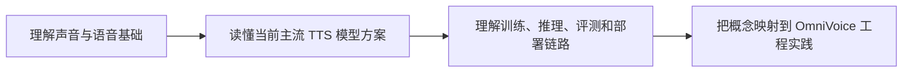
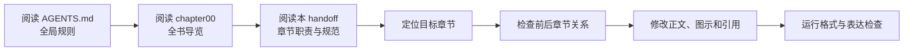
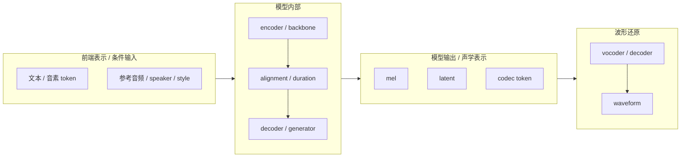

# 书稿优化交接说明

本文档面向后续接手优化本书的 agent。读者导览放在 [第零章：书籍介绍](chapter00_书籍介绍中.md)，这里记录书稿定位、章节职责、写作标准和检查清单。

## 书稿定位

本书是一套面向非算法专业读者的 TTS / OmniVoice 科普与工程书。写作目标不是罗列论文年表，也不是记录某次调试过程，而是帮助读者建立以下能力：



正文应始终以读者理解为中心，解释概念、模块职责、数据流和工程判断。不要把用户与 agent 的讨论过程写入正文。

## 接手优化流程



优化单章时，先看它在三编结构中的位置，再看前后章节是否已经解释过相关概念。基础概念不要在多个章节重复展开，可以用一句话回指前文；工程实践章节可以引用前两编概念，但不要把第三编写成通用原理章。

## 章节职责表

| 章节 | 章节作用 | 优化重点 | 需要避免的问题 |
| --- | --- | --- | --- |
| 第 0 章：书籍介绍 | 面向读者的全书导览 | 保持目标、结构、目录、阅读路径清晰 | 不要堆维护细节，不要写成 agent 工作说明 |
| 第 1 章：TTS 到底在解决什么问题 | 建立 TTS 任务边界 | 讲清输入、输出、控制条件和评价目标 | 不要过早进入模型细节 |
| 第 2 章：声音是什么 | 建立数字声音基础 | 讲清 waveform、采样率、振幅、频率、噪声 | 不要直接跳到神经网络 |
| 第 3 章：人声的产生机制 | 建立人声声学直觉 | 讲清声带、F0、共振峰、声道和音色来源 | 不要写成医学细节大全 |
| 第 4 章：文本前端与音素 | 解释文字到发音结构 | 讲清规范化、G2P、音素、拼音、声调、多音字 | 不要把音素说成声音切片 |
| 第 5 章：语音信号的时频表示 | 解释模型常用声学表示 | 讲清 mel、F0、energy、duration、codec token、latent 的区别 | 不要把 mel、token、latent 说成同一种东西 |
| 第 6 章：语音信息分解 | 解释语音中可控因素 | 讲清谁在说、说了什么、说话方式、发音结构 | 不要把音色、情绪、内容写成天然可完全解耦 |
| 第 7 章：当前主流 TTS 模型方案 | 建立当前方案地图 | 重点讲 mel/vocoder、codec token、Speech LM、continuous latent、flow matching | 不要用历史年表替代当前主流方案 |
| 第 8 章：声学模型 | 展开核心生成模块 | 讲清前端条件如何进入模型、如何对齐、如何生成声学表示 | 不要把声学模型等同于完整 TTS 系统 |
| 第 9 章：Vocoder 与波形生成 | 解释声学表示到 waveform | 讲清 vocoder、codec decoder、AudioVAE decoder 的位置 | 不要把波形还原和声学模型混成一章 |
| 第 10 章：扩散模型与新一代 TTS | 解释 diffusion / flow matching | 讲清生成范式、条件生成、latent diffusion、flow matching | 不要把 diffusion 当成完整 TTS 系统 |
| 第 11 章：工程视角下的模型方案 | 解释工程项目里的模型组成 | 讲清 architecture、checkpoint、tokenizer、config、推理代码的关系 | 不要只讲抽象概念，不映射到项目文件 |
| 第 12 章：模型训练 | 解释模型如何学会说话 | 讲清数据、token、embedding、loss、反向传播、权重更新 | 不要只列训练命令 |
| 第 13 章：模型推理 | 解释模型如何生成声音 | 讲清文本、参考音频、audio tag、采样、decoder / vocoder | 不要把声音克隆说成简单替换内容 token |
| 第 14 章：评测与部署 | 解释生成结果如何成为服务 | 讲清 MOS、WER、相似度、RTF、延迟、bad case 闭环 | 不要只讨论主观听感 |
| 第 15 章：OmniVoice 生态 | 澄清 OmniVoice 名称和边界 | 区分开源模型、网页服务、其他同名产品 | 不要把不同 OmniVoice 产品混写 |
| 第 16 章：OmniVoice 本地实战 | 跑通本地零样本声音克隆 | 讲清环境、依赖、模型下载、参考音频、设备 fallback | 不要只给命令而不解释链路 |
| 第 17 章：OmniVoice 可控生成 | 做可控生成实验 | 讲清 ref_audio、instruct、参数、口音和风格控制 | 不要暗示所有控制因素都能完全独立 |

## 写作标准

- 正文是书稿，不是对话记录。避免“你说得对”“我们刚才讨论”“为什么不这么写”“可以这样区分”等表达。
- 解释概念时优先使用“定义、直觉、工程作用、常见误区、和前后链路的关系”的顺序。
- 讲流程和模块关系时优先使用 left-to-right Mermaid 图，清楚标出数据流。
- 讲架构时使用分组图：同一职能域用虚线框包起来，核心生成模块用高亮色，输出或最终结果用另一种颜色强调。
- 小节定位图要标出“前端表示 / 条件输入”“模型内部”“模型输出 / 声学表示”“波形还原”等层级。如果本节讲多种方案，应画并列分支。
- 表格适合用来比较模块职责、方案差异、常见误区和代表模型；不要用表格替代必要的解释。

## 模型和方案取舍

本书优先帮助读者读懂当前仍有工程价值的 TTS 系统。代表模型和方案应按以下优先级使用：

| 优先级 | 模型 / 方案 | 使用方式 |
| --- | --- | --- |
| 高 | OmniVoice | 作为第三编工程实践主线，也可在前两编作为项目例子 |
| 高 | IndexTTS / IndexTTS2 | 用来解释 token + mel / vocoder 混合路线、声音克隆和情绪控制 |
| 高 | VoxCPM / VoxCPM2 | 用来解释 continuous latent、AudioVAE、flow / diffusion 类生成 |
| 高 | CosyVoice / CosyVoice3 | 用来解释 LLM + speech token + flow matching + vocoder 的混合路线 |
| 中 | F5-TTS / E2-TTS | 用来辅助解释 flow matching、prompt speech、端到端生成直觉 |
| 低 | Tacotron、FastSpeech、FastSpeech2、VITS、Grad-TTS | 作为历史背景或特定机制例子，不作为当前主线反复展开 |

历史方案可以出现，但要服务于当前模型理解。例如 FastSpeech / FastSpeech2 可用于解释显式 duration，Tacotron 可用于解释早期 attention alignment，VITS / Grad-TTS 可用于承接现代生成式 TTS 的过渡。

## 图示标准

推荐图形风格：



画图时优先回答三个问题：

1. 输入是什么。
2. 当前模块处理什么。
3. 输出给谁。

如果图只画了局部模块，应保留上下游概览节点，避免读者不知道它位于完整链路的哪一段。

## Review Checklist

修改完成后，至少检查以下项目：

| 检查项 | 目标 |
| --- | --- |
| 读者视角 | 正文像科普书，而不是聊天记录或调试日志 |
| 章节边界 | 单章只承担自己的核心职责，不抢前后章节内容 |
| 术语一致 | mel、codec token、latent、embedding、checkpoint、vocoder 等术语前后一致 |
| 模型取舍 | 当前主流模型优先，历史模型只作为必要背景 |
| 图示质量 | Mermaid 图是 left-to-right，能看出模块层级、输入输出和数据流 |
| OmniVoice 映射 | 第三编应把概念映射到具体项目文件、命令和推理链路 |
| 格式检查 | 运行 `git diff --check -- books AGENTS.md`，避免 Markdown 空白问题 |
| 表达检查 | 用 `rg` 搜索对话式表达，确保正文没有残留 |

常用检查命令：

```bash
rg -n "我们刚才讨论|你说得对|为什么不这么写|可以这样区分" books
git diff --check -- books AGENTS.md
```
