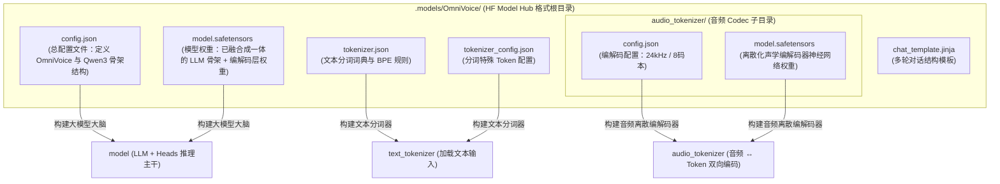
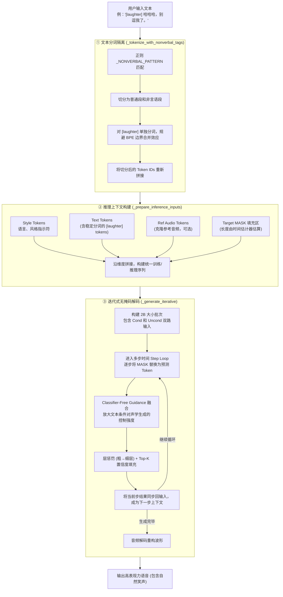

# OmniVoice 技术问答 (QA) 手册

本手册汇总整理了关于 OmniVoice 语音大模型的核心技术点、模型结构体系以及文件架构的常见疑问与专业解答。

---

## 目录
1. [Q1: 为什么在 `.models/OmniVoice/` 目录下找不到独立的 Qwen 模型权重？](#q1-为什么在-modelomnivoice-目录下找不到独立的-qwen-模型权重)
2. [Q2: `.models/OmniVoice/` 下的各类文件是做什么的？它们都是什么格式？](#q2-modelomnivoice-下的各类文件是做什么的它们都是什么格式)
3. [Q3: 文本 Token 化的权重（词表与规则）保存在哪里？](#q3-文本-token-化的权重词表与规则保存在哪里)
4. [Q4: OmniVoice 在推理时是如何支持 `[laughter]`（笑声）等非言语标签的？](#q4-omnivoice-在推理时是如何支持-laughter笑声等非言语标签的)

---

## Q1: 为什么在 `.models/OmniVoice/` 目录下找不到独立的 Qwen 模型权重？

**答：** 因为 Qwen 主干网络（Backbone）的权重已经被**彻底融合打包**进了主模型权重文件 `model.safetensors` 中。

### 核心机制
* **骨架集成（Backbone Integration）**：在代码实现中，OmniVoice 将 `Qwen3ForCausalLM` 实例化为自己内部的 `self.llm` 作为主干模型大脑：
  ```python
  class OmniVoice(PreTrainedModel):
      def __init__(self, config: OmniVoiceConfig, llm: Optional[PreTrainedModel] = None):
          super().__init__(config)
          # ...
          self.llm = llm or AutoModel.from_config(self.config.llm_config)
          self.audio_embeddings = nn.Embedding(...)
          self.audio_heads = nn.Linear(...)
  ```
* **一并序列化保存**：当训练完毕调用 `model.save_pretrained()` 时，HuggingFace 工具链会自动将 OmniVoice 专属的音频 Embedding 权重、Linear Projection 头权重，以及最核心的嵌套子层 `self.llm`（Qwen 权重）全部序列化到同一个 `model.safetensors` 文件中。
* **验证方式**：若您使用 `safetensors` 或 `torch.load` 读取该文件，会发现大批带有 **`llm.`** 前缀的 Tensor（例如 `llm.model.layers.0.self_attn.q_proj.weight`），这证明 Qwen 权重就在其内部。

---

## Q2: `.models/OmniVoice/` 下的各类文件是做什么的？它们都是什么格式？

**答：** 该目录是一个标准的 **HuggingFace 预训练模型仓库（Repository）格式**。各文件职责及格式如下：

### 文件依赖与构建架构图



### 文件详细说明表

| 文件名 | 格式类型 | 说法与作用说明 |
| :--- | :--- | :--- |
| **`config.json`** | JSON 文本 | **主配置文件**。定义了音频码本参数（如 `num_audio_codebook: 8`）并以 `llm_config` 字段的形式完整声明了 Qwen 骨架网络的超参数（包含 `model_type: "qwen3"`, 层数 `28` 等）。 |
| **`model.safetensors`** | Safetensors 二进制 | **大模型权重参数文件**。以安全且极速的内存映射（mmap）零拷贝方式存储所有模型参数（含 Qwen）。 |
| **`tokenizer.json`** | JSON 文本 | **分词合并规则库**。记录了把原始文本切分为子词（Subwords）的 BPE 规则与 15 万余词表索引。 |
| **`tokenizer_config.json`**| JSON 文本 | **分词器偏好设置**。定义了句首句尾、降噪等特殊系统 Token 的行为。 |
| **`chat_template.jinja`** | Jinja2 模板 | **对话流格式化渲染文件**。负责在多轮语音交互中，将角色、指令包装为包含指定 Special Tokens 的系统文本序列。 |
| **`audio_tokenizer/`** | 独立文件夹目录 | **声学 Token 编解码器（HiggsAudioV2）**。内部包含其独立的 `config.json` 和 `model.safetensors` 权重，主要担任“声学声纹特征 ↔ 离散 Codebook ID 序列”的双向编码与还原。 |

---

## Q3: 文本 Token 化的权重（词表与规则）保存在哪里？

**答：** 文本 Token 化的逻辑没有神经网络权重，其所有的**算法切分规则与对应词表映射**均完整保存在：
1. **`.models/OmniVoice/tokenizer.json`**
2. **`.models/OmniVoice/tokenizer_config.json`**

分词器会在模型预加载时首先被构建出来，随后用于处理所有的输入文本：
```python
# 文本 Tokenizer 的初始化代码
model.text_tokenizer = AutoTokenizer.from_pretrained(resolved_path)
```

---

## Q4: OmniVoice 在推理时是如何支持 `[laughter]`（笑声）等非言语标签的？

**答：** 该功能主要依靠**分词隔离设计**、**统一上下文组装**与**多模态迭代无掩码解码**共同实现。

### 推理处理流程



### 关键机制设计决策
1. **为什么要单独分词？**
   在标准字节对编码（BPE）分词器中，`[laughter]` 容易与前后的汉字或英文字母由于拼贴被切分为不同的组合 Token。通过强制将标签匹配并做**隔离式独立分词**，能够确保非言语标签 `[laughter]` 在任何前后文下转换为**完全相同、纯净的 Token ID 序列**，从而让模型在注意力层中更精确地捕获到渲染笑声的触发信号。
2. **模型如何产生笑声？**
   在预训练阶段的数据处理（`OmniVoiceSampleProcessor`）中，音频中包含笑声的区间已被标注了文本标签 `[laughter]`。通过音频遮罩恢复（Masked Audio Generation）目标，模型建立起了“`[laughter]` 的文本 Token 序列 $\rightarrow$ 笑声对应声学特征（离散音频 Token）”的强联合分布。
3. **CFG（分类器自由引导）的作用**：
   在推理时利用 Cond (带文本/标签) 和 Uncond (仅音频) 双路计算 logits 差异，放大文本标签在自注意力网络上的响应程度，避免模型忽略文本中的非言语指示标签，使笑声能够稳定、高表现力地渲染出来。
