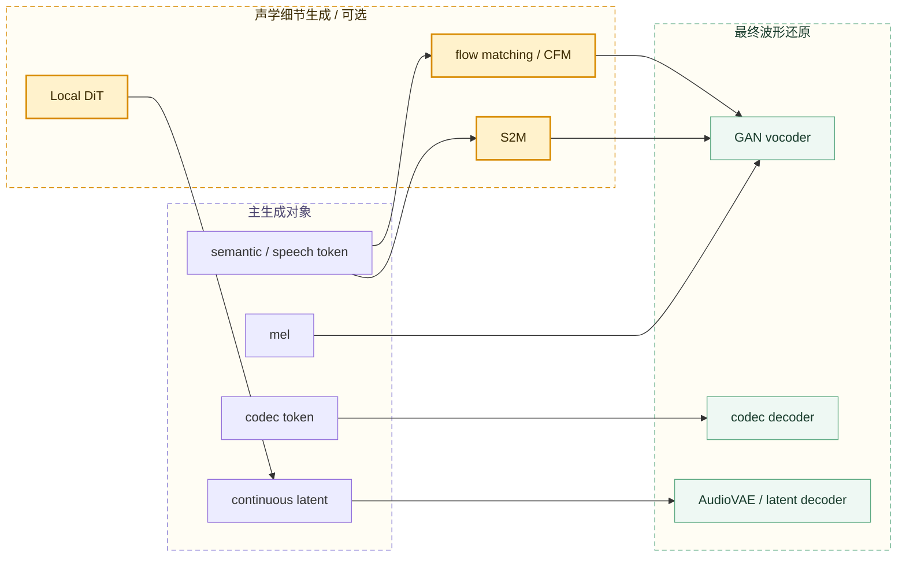

# Chapter 09 Reference: Waveform Restoration Modules

本文件记录第九章《波形还原模块》用到的主要参考资料。正文面向科普读者，不在章节内堆引用；这里保留资料来源、对应模块和使用目的，方便后续 agent 复核或继续扩展。

参考时点：2026-05-24。

## Core Model Families

| 资料 | 链接 | 对应章节用途 |
| --- | --- | --- |
| OmniVoice: Towards Omnilingual Zero-Shot Text-to-Speech with Diffusion Language Models | <https://arxiv.org/abs/2604.00688> | 用于确认 OmniVoice 直接从文本生成 multi-codebook acoustic tokens 的路线。 |
| OmniVoice official repository | <https://github.com/k2-fsa/OmniVoice> | 用于核对 OmniVoice 的工程入口、模型发布与 24 kHz 输出等实现信息。 |
| IndexTTS official repository | <https://github.com/index-tts/index-tts> | 用于确认 IndexTTS / IndexTTS2 的官方发布渠道、工程说明和 BigVGAN 依赖。 |
| IndexTTS2: A Breakthrough in Emotionally Expressive and Duration-Controlled Auto-Regressive Zero-Shot Text-to-Speech | <https://ojs.aaai.org/index.php/AAAI/article/download/40820/44781> | 用于确认 T2S、S2M、BigVGANv2、duration control、emotion / speaker disentanglement 等模块关系。 |
| IndexTTS 2.5 Technical Report | <https://arxiv.org/abs/2601.03888> | 用于补充 IndexTTS2 后续版本对 semantic codec compression 和 S2M 加速的说明。 |
| VoxCPM 2 official documentation | <https://voxcpm.readthedocs.io/en/latest/models/voxcpm2.html> | 用于确认 VoxCPM2 的 AudioVAE V2、48 kHz 输出、continuous latent 与 CFM / DiT 相关描述。 |
| VoxCPM architecture documentation | <https://voxcpm.readthedocs.io/en/latest/models/architecture.html> | 用于理解 VoxCPM 系列 Local Encoder、Text-Semantic LM、Residual Acoustic LM、Local DiT / CFM 的层级。 |
| CosyVoice: A Scalable Multilingual Zero-shot Text-to-speech Synthesizer based on Supervised Semantic Tokens | <https://arxiv.org/abs/2407.05407> | 用于确认 CosyVoice 的 LLM text-to-token 与 conditional flow matching token-to-speech 分层。 |
| CosyVoice 3: Towards In-the-wild Speech Generation | <https://funaudiollm.github.io/cosyvoice3/pdf/CosyVoice3_0.pdf> | 用于确认 CosyVoice3 中 speech tokenizer、Text2Token LM、CFM 等模块关系。 |
| FunAudioLLM / CosyVoice official repository | <https://github.com/FunAudioLLM/CosyVoice> | 用于核对 CosyVoice 系列模型发布、训练 / 推理代码和 flow matching 支持情况。 |

## Vocoder and Audio Decoder Background

| 资料 | 链接 | 对应章节用途 |
| --- | --- | --- |
| HiFi-GAN: Generative Adversarial Networks for Efficient and High Fidelity Speech Synthesis | <https://arxiv.org/abs/2010.05646> | 用于解释 GAN vocoder、generator / discriminator、multi-period / multi-scale 判别器等基本机制。 |
| BigVGAN: A Universal Neural Vocoder with Large-Scale Training | <https://arxiv.org/abs/2206.04658> | 用于解释 BigVGAN 类 vocoder、periodic activation、anti-aliased representation 和高保真泛化。 |
| NVIDIA BigVGAN official repository | <https://github.com/NVIDIA/BigVGAN> | 用于核对 BigVGAN 工程实现、版本和预训练 checkpoint 信息。 |
| SoundStream: An End-to-End Neural Audio Codec | <https://arxiv.org/abs/2107.03312> | 用于理解 neural codec encoder / decoder、RVQ 与 codec token 路线背景。 |
| High Fidelity Neural Audio Compression | <https://arxiv.org/abs/2210.13438> | 用于理解 EnCodec 类 neural audio codec 和离散音频 token 的工程背景。 |

## Reading Notes

第九章不把 vocoder 历史作为主线，而是按工程链路组织：



后续维护时优先检查三件事：

```text
主模型到底生成什么。
中间是否还有 S2M / flow matching / CFM / DiT 这类声学细节生成模块。
最终把表示还原成 waveform 的模块到底是 vocoder、codec decoder，还是 AudioVAE / latent decoder。
```
