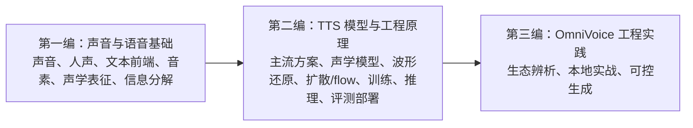

# 第零章：书籍介绍

这本书的目标不是只介绍某一个 OmniVoice demo，而是围绕 TTS（Text-to-Speech）建立一套可持续扩展的知识框架：先理解声音和语音的基本规律，再理解神经 TTS 模型如何把文本、音素、韵律、音色、情绪和风格组织成可生成的声学表示，最后落到训练、推理、评测、部署和 OmniVoice 工程实践。

## 写作目标

本书重点回答两类问题：

1. TTS 相关的基本原理：表征、音素、音色、韵律、情绪、F0、energy、duration、mel、codec token、latent 等术语到底是什么意思，它们在语音信号和模型特征中通常如何分工。
2. TTS 相关的工程技术：声学模型、波形还原、扩散模型、flow matching、模型训练、推理采样、控制、评测和部署如何串成完整工程链路。

这里把“因素”理解为两类：

```text
语音学术语：phoneme 音素、syllable 音节、tone 声调、stress 重音
模型条件因素：speaker、timbre、emotion、style、speed、prosody、accent
```

## 本书结构

本书分成三编：



核心知识地图：

```text
说话人 / 音色：
speaker embedding（说话人向量）, d-vector（声纹向量）, prompt speech（提示语音）

文本内容：
character（字符） / phoneme（音素） / pinyin（拼音） / BPE（子词切分）

说话方式 / 韵律 / 情绪 / 风格：
duration（时长）, pitch/F0（音高/基频）, energy（能量）, pause（停顿）, rhythm（节奏）, emotion embedding（情绪向量）, style embedding（风格向量）, reference encoder（参考编码器）, prosody embedding（韵律向量）

发音结构：
phoneme（音素）, tone（声调）, stress（重音）, syllable（音节）

声学表征：
mel-spectrogram（梅尔频谱）, linear spectrogram（线性频谱）, codec latent（编码潜变量）, acoustic token（声学 token）

生成模型：
autoregressive（自回归）, non-autoregressive（非自回归）, VAE（变分自编码器）, flow（流模型）, GAN（生成对抗网络）, diffusion（扩散模型）, flow matching（流匹配）

工程链路：
data cleaning（数据清洗） → feature extraction（特征提取） → alignment（对齐） → training（训练） → sampling（采样） → evaluation（评测） → deployment（部署）
```

一句话总结：

> 研究扩散 TTS 的关键，不只是学 diffusion，而是先搞清楚 TTS 把“谁在说、说了什么、说话方式、发音结构”分别放进了哪些表示和条件里；然后再理解 diffusion / flow matching 是在 mel、waveform、latent 还是 codec token 空间里做生成。

## 总目录

### 第一编：声音与语音基础

1. [TTS 到底在解决什么问题](chapter01_TTS到底在解决什么问题.md)
2. [声音是什么：波形、采样率与频率](chapter02_声音是什么.md)
3. [人声的产生机制：声带、基频与共振峰](chapter03_人声的产生机制.md)
4. [文本前端与音素：文字不是发音](chapter04_文本前端与音素.md)
5. [语音信号的时频表示：mel、F0、energy、codec token 与 latent](chapter05_语音信号的时频表示.md)
6. [语音信息分解：音色、内容、说话方式与发音结构](chapter06_语音信息分解.md)

### 第二编：TTS 模型与工程原理

7. [当前主流 TTS 模型方案](chapter07_当前主流TTS模型方案.md)
8. [声学模型 Acoustic Model](chapter08_声学模型.md)
9. [波形还原模块：Vocoder、Codec Decoder 与 AudioVAE Decoder](chapter09_波形还原模块.md)
10. [扩散模型与新一代 TTS](chapter10_扩散模型与新一代TTS.md)
11. [工程视角下的模型方案：训练模型到底交付了什么](chapter11_工程视角下的模型方案.md)
12. [模型训练：模型如何从数据里学会说话](chapter12_模型训练.md)
13. [模型推理：模型如何从输入生成声音](chapter13_模型推理.md)
14. [评测与部署：生成结果如何变成稳定服务](chapter14_评测与部署.md)

### 第三编：OmniVoice 工程实践

15. [OmniVoice 生态：开源模型、商业 SaaS 与同名系统](chapter15_OmniVoice生态.md)
16. [OmniVoice 本地实战：零样本声音克隆](chapter16_OmniVoice本地实战.md)
17. [OmniVoice 可控生成：音色克隆与口音修改](chapter17_OmniVoice可控生成.md)

### 扩展知识

18. [扩展知识一：Python List、NumPy Array 与 PyTorch Tensor](chapter18_扩展知识一_数字容器.md)
19. [扩展知识二：神经音频 Codec、Codebook 与语音 Token](chapter19_扩展知识二_神经音频Codec与语音Token.md)
20. [扩展知识三：推理、Transformer 与 OmniVoice 前向计算](chapter20_扩展知识三_推理与Transformer前向计算.md)

## 章节导览

| 章节 | 读者会学到什么 | 核心概念 | 和前后章节的关系 |
| --- | --- | --- | --- |
| 第 1 章：TTS 到底在解决什么问题 | 建立 TTS 的输入、输出和系统目标 | text-to-speech、输入条件、输出音频、评价目标 | 为全书建立任务边界 |
| 第 2 章：声音是什么 | 理解电脑里的声音为什么是波形数据 | waveform、sample rate、amplitude、frequency、noise | 给第 5 章的声学表示打物理基础 |
| 第 3 章：人声的产生机制 | 理解人声为什么有音高、音色和共振 | source-filter model、F0、formant、vocal tract | 连接声音物理和人声特征 |
| 第 4 章：文本前端与音素 | 理解文字为什么不能直接等于发音 | text normalization、G2P、phoneme、tone、stress | 把文本变成模型可用的发音结构 |
| 第 5 章：语音信号的时频表示 | 理解模型常见的声音中间表示 | frame、spectrogram、mel、F0、energy、duration、codec token、latent | 为声学模型、波形还原模块和主流方案做概念准备 |
| 第 6 章：语音信息分解 | 理解一句语音里有哪些可被模型拆开的因素 | speaker、timbre、content、prosody、emotion、style、pronunciation | 解释声音克隆、情绪控制和可控生成的基础 |
| 第 7 章：当前主流 TTS 模型方案 | 建立当前 TTS 技术路线地图 | mel/vocoder、codec token、Speech LM、continuous latent、flow matching | 从基础概念过渡到模型方案 |
| 第 8 章：声学模型 | 理解模型如何把条件变成声学表示 | encoder、backbone、alignment、duration、decoder、acoustic representation | 展开 TTS 方案中的核心生成模块 |
| 第 9 章：波形还原模块 | 理解声学表示如何还原成最终声音 | vocoder、codec decoder、AudioVAE decoder、waveform | 衔接声学模型输出和可播放音频 |
| 第 10 章：扩散模型与新一代 TTS | 理解 diffusion / flow matching 在 TTS 中替换或增强了什么 | diffusion、score、flow matching、latent diffusion、condition | 解释当前很多新模型的生成范式 |
| 第 11 章：工程视角下的模型方案 | 理解“模型”在工程项目里到底由什么组成 | architecture、checkpoint、tokenizer、config、inference code | 从模型原理过渡到训练和推理工程 |
| 第 12 章：模型训练 | 理解模型如何从数据中学到规律 | dataset、token、embedding、loss、backpropagation、checkpoint | 解释权重从哪里来 |
| 第 13 章：模型推理 | 理解模型如何从用户输入生成声音 | tokenizer、reference audio、audio tag、sampling、decoder、vocoder | 解释实际生成链路 |
| 第 14 章：评测与部署 | 理解生成结果如何变成稳定服务 | MOS、WER、speaker similarity、RTF、latency、bad case | 把模型能力落到工程质量 |
| 第 15 章：OmniVoice 生态 | 分清本书关注的 OmniVoice 和其他同名产品 | open-source model、SaaS、ecosystem boundary | 进入项目实践前先明确对象 |
| 第 16 章：OmniVoice 本地实战 | 跑通零样本声音克隆的本地链路 | environment、model download、ref_audio、device fallback、CLI | 把前面概念映射到实际代码 |
| 第 17 章：OmniVoice 可控生成 | 理解如何控制音色、口音、速度和风格 | voice cloning、voice design、instruct、generation parameters | 回到第 6 章的信息分解，并落到实验方法 |
| 第 18 章：扩展知识一 | 理解 Python list、NumPy array、PyTorch Tensor 的区别 | list、ndarray、Tensor、shape、GPU、autograd | 为阅读模型代码、数据预处理和推理张量形状打基础 |
| 第 19 章：扩展知识二 | 理解 neural audio codec 如何把声音变成 token | codec、codebook、RVQ、semantic token、acoustic token | 为理解 OmniVoice 的 audio tokenizer、8 层 codebook token 和 codec token 路线打基础 |
| 第 20 章：扩展知识三 | 理解推理、Transformer 前向计算和 OmniVoice `generate()` / `forward()` 的关系 | inference、forward、self-attention、hidden states、logits、mask-fill | 为读懂 OmniVoice 推理源码和训练 / 推理共用计算路径打基础 |

## 阅读路径

如果目标是快速建立 TTS 研究框架，建议优先读：

```text
第 1 章：TTS 任务
第 5 章：mel / F0 / energy / duration
第 6 章：音色、内容、说话方式、发音结构分解
第 8-10 章：声学模型、波形还原、diffusion / flow matching
第 11 章：工程视角下理解模型交付物
第 12-14 章：训练、推理、评测、部署
```

如果目标是先跑通 demo，可以先读第 15-17 章，但建议回头补第 1-6 章和第 12-13 章，否则很容易只会改参数，不理解参数背后的声学含义。

如果目标是读懂项目代码里的数据形状和变量类型，可以补读第 18 章。它解释 Python list、NumPy array 和 PyTorch Tensor 在文本、音频、LLM 和 OmniVoice 推理链路中的分工。

如果目标是理解 audio tokenizer、codebook、RVQ、semantic token 和 acoustic token，可以补读第 19 章。它把 EnCodec / SpeechTokenizer 这类资料中的核心概念映射到 OmniVoice 的 codec token 链路。

如果目标是理解推理内部如何计算，可以补读第 20 章。它把《Attention Is All You Need》里的 self-attention 和 Transformer 前向计算，映射到 OmniVoice 的 `generate()`、`forward()`、`self.llm`、`audio_heads` 和 `audio_tokenizer.decode()`。

如果目标是接手优化这本书，先读本章建立整体视角，再读 [AGENT_HANDOFF.md](AGENT_HANDOFF.md) 了解章节职责、写作规范和后续优化重点。
