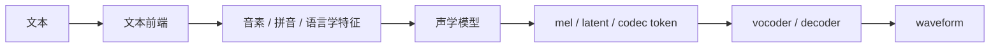

# 第一章：TTS 到底在解决什么问题

本章用于建立全局视角：TTS 不是简单的“文字转音频”，而是把文本中的语言内容、发音方式、节奏停顿、语气情绪、说话人音色等信息，生成连续且自然的语音波形。

## 1.1 任务定义

TTS（Text-to-Speech / Speech Synthesis）的输入通常是文本，输出是可播放的语音波形。但模型真正要学习的是一条更复杂的映射：

```text
文本内容
 → 发音结构
 → 说话方式 / 韵律
 → 说话人音色
 → 声学表征
 → 波形
```

核心术语：

| 术语 | 含义 |
| --- | --- |
| intelligibility 可懂度 | 听者能否听清模型说了什么 |
| naturalness 自然度 | 语音是否像真人自然表达 |
| expressiveness 表现力 | 是否有合适的语气、情绪和节奏 |
| speaker similarity 说话人相似度 | 克隆语音是否像目标说话人 |
| controllability 可控性 | 是否能稳定控制音色、语速、情绪、口音等因素 |

## 1.2 典型系统结构

现代 TTS 系统通常可以拆成以下模块：



每个模块可以先这样理解：

| 模块 | 主要职责 | 常见术语 |
| --- | --- | --- |
| 文本 | 用户输入的原始内容，可能包含中文、英文、数字、日期、单位、标点和缩写 | text（文本）, character（字符）, punctuation（标点） |
| 文本前端 | 把原始文本整理成更适合发音的形式，解决“这个字到底读什么音、哪里停顿”的问题 | text normalization（文本规范化）, word segmentation（分词）, G2P（字音转换）, polyphone disambiguation（多音字消歧） |
| 音素 / 拼音 / 语言学特征 | 用更接近发音的单位描述文本内容，减少原始文字带来的读音歧义 | phoneme（音素）, pinyin（拼音）, tone（声调）, syllable（音节）, stress（重音）, prosody boundary（韵律边界） |
| 声学模型 | 根据发音内容和条件信息，预测中间声学表示；它决定“谁在说、说什么、说话方式、发音结构”的主体结构 | acoustic model（声学模型）, encoder（编码器）, decoder（解码器）, attention（注意力）, duration（时长）, pitch（音高）, energy（能量） |
| mel / latent / codec token | 模型生成的中间声学表示，比 waveform 更容易建模；它们通常混合了内容、音色、韵律和情绪 | mel-spectrogram（梅尔频谱）, latent（潜变量）, codec token（语音编码 token）, acoustic token（声学 token） |
| vocoder / decoder | 把中间声学表示还原成可播放的波形；它主要影响音频细节、清晰度和质感 | vocoder（声码器）, neural decoder（神经解码器）, HiFi-GAN（高保真 GAN 声码器）, BigVGAN（大规模 GAN 声码器）, DiffWave（扩散声码器） |
| waveform | 最终音频波形，也就是播放器真正播放的采样点序列 | waveform（波形）, sample rate（采样率）, amplitude（振幅） |

这里有几个术语先建立直觉即可：

```text
G2P（字音转换）：grapheme-to-phoneme，把文字或字符转成音素。
duration（时长）：每个音素、字或 token 持续多久。
pitch / F0（音高 / 基频）：音高走势，影响语调、情绪和部分说话人特征。
energy（能量）：能量或音量走势，影响力度和表达强弱。
mel-spectrogram（梅尔频谱）：常见声学中间表示，比原始波形更适合声学模型预测。
codec token（语音编码 token）：新一代语音模型常用的压缩语音 token，可以是离散或连续表示。
vocoder（声码器）：把 mel、latent 或 token 转成 waveform 的波形生成模块。
```

现代 TTS 模型不一定严格使用这条完整链路。有些模型会弱化文本前端，有些模型不显式预测 mel，有些模型直接生成 codec token 或 latent；但无论结构怎么变化，它们仍然绕不开这几个问题：谁在说、说了什么、说话方式是什么、发音结构是什么、语音如何表示、最后如何变成 waveform。

## 1.3 两条学习主线

本书按照两条主线组织：

```text
主线 A：TTS 基本原理
文本 → 音素 → 韵律 → 声学表征 → 波形

主线 B：TTS 工程技术
数据 → 模型 → 损失函数 → 训练 → 推理 → 评测 → 部署
```

## 1.4 本章要形成的直觉

TTS 的核心不是“让模型读字”，而是让模型同时解决四件事：

```text
谁在说：speaker identity（说话人身份） / timbre（音色）
说了什么：linguistic content（语言内容）
说话方式：prosody（韵律） / emotion（情绪） / style（风格）
发音结构：phoneme（音素） / tone（声调） / stress（重音）
```

这是一种学习用拆分，不是某本教材固定规定的唯一分类。它的依据来自两层共识：

1. 语音学和传统 TTS 通常会区分文字/语言内容、发音表示、韵律和最终声学波形。例如 Paul Taylor 的《Text-to-Speech Synthesis》把 TTS 看成从 writing（文字信号）到 speech（语音信号）的转换，并单独讨论 pronunciation（发音）和 prosody（韵律）。
2. 神经 TTS 工程里也经常把条件拆成 text / phoneme（文本/音素）、speaker（说话人）、style / prosody（风格/韵律）以及 pitch、energy、duration 等变化信息。FastSpeech 2 显式使用 duration、pitch、energy 作为条件；GST 相关论文则把 speaking style（说话风格）作为可学习的风格表示。

所以这四句话更适合作为入门地图：

```text
谁在说：说话人/音色层
说了什么：内容层
说话方式：韵律/情绪/风格层
发音结构：发音层
```

后面章节会逐步说明：这些信息在真实语音里并不是天然完全分开的，mel、latent、waveform 往往都是混合表示；所谓“分开”，通常依赖模型结构、训练数据和监督信号。
