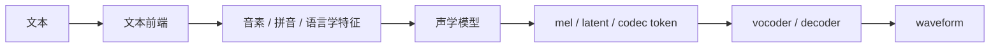

# 第一章：TTS 到底在解决什么问题

本章用于建立全局视角：TTS 不是简单的“文字转音频”，而是把文本中的语言内容、发音方式、节奏停顿、语气情绪、说话人音色等信息，生成连续且自然的语音波形。

## 1.1 任务定义

TTS（Text-to-Speech / Speech Synthesis）的输入通常是文本，输出是可播放的语音波形。但模型真正要学习的是一条更复杂的映射：

```text
文本内容
 → 发音结构
 → 韵律与表达方式
 → 说话人音色
 → 声学表征
 → 波形
```

核心术语：

| 术语 | 含义 |
| --- | --- |
| intelligibility 可懂度 | 听者能否听清模型说了什么 |
| naturalness 自然度 | 语音是否像真人自然表达 |
| expressiveness 表现力 | 是否有合适的语气、情绪和节奏 |
| speaker similarity 说话人相似度 | 克隆语音是否像目标说话人 |
| controllability 可控性 | 是否能稳定控制音色、语速、情绪、口音等因素 |

## 1.2 典型系统结构

现代 TTS 系统通常可以拆成以下模块：



## 1.3 两条学习主线

本书按照两条主线组织：

```text
主线 A：TTS 基本原理
文本 → 音素 → 韵律 → 声学表征 → 波形

主线 B：TTS 工程技术
数据 → 模型 → 损失函数 → 训练 → 推理 → 评测 → 部署
```

## 1.4 本章要形成的直觉

TTS 的核心不是“让模型读字”，而是让模型同时解决四件事：

```text
说什么：linguistic content
怎么读：phoneme / tone / stress
谁在说：speaker identity / timbre
怎么说：prosody / emotion / style
```
