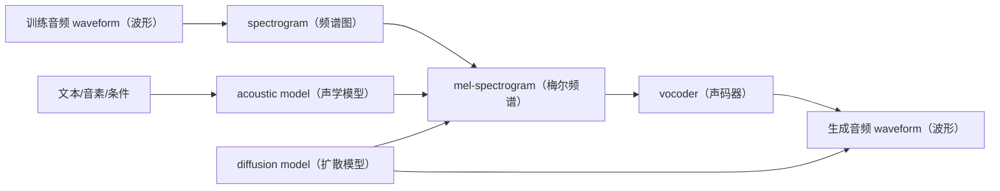

# 第二章：声音是什么 —— 波形、采样率与频率

本章讲 TTS 最终生成的物理对象：声音。对 TTS 来说，所有复杂模型最后都要落到一件事上：生成一段可以播放的 `waveform（波形）`。理解波形后，后续学习 `mel-spectrogram（梅尔频谱）`、`vocoder（声码器）`、扩散去噪才有直觉基础。

## 2.1 声音是一种随时间变化的振动

声音的物理本质是空气压力的快速变化。人说话时，声带、口腔和鼻腔让空气产生振动；这些振动传到麦克风，麦克风再把它变成电信号，最后电脑把电信号记录成一串数字。


可以先把声音想成一条随时间上下起伏的曲线：

```text
时间向右走，声音强弱上下变化。
```

曲线越密、变化越复杂，声音听起来就越丰富；曲线越简单，声音听起来就越单薄。

## 2.2 waveform（波形）：数字音频在电脑里的样子

`waveform（波形）` 是电脑里最直接的音频表示。它可以看成一串随时间排列的采样点：

```text
x = [x1, x2, x3, ..., xT]
```

每个采样点表示某个时刻的 `amplitude（振幅）`，也就是空气压力变化被记录下来的数值。TTS 最终输出的 `.wav` 文件，本质上就是这串采样点加上 `sample rate（采样率）` 等元信息。

一个非常短的直觉例子：

```text
采样点： 0.0, 0.2, 0.5, 0.2, 0.0, -0.2, -0.5, -0.2 ...
听起来：一段周期性振动
```

这里的数字不是文字、音素或语义，而是最终可以驱动扬声器振动的声音数据。

## 2.3 sample rate（采样率）：一秒切多少片

`sample rate（采样率）` 决定电脑每秒记录多少个采样点。采样率越高，一秒钟被切得越细，能记录的高频细节越多，但文件、训练和推理成本也更高。

| 采样率 | 每秒采样点数 | 常见场景 |
| --- | ---: | --- |
| 16 kHz | 16000 | 语音识别、电话语音、轻量语音应用 |
| 22.05 kHz | 22050 | 许多 TTS 训练集和 demo |
| 24 kHz | 24000 | 现代 TTS 常见高质量语音配置 |
| 44.1 kHz | 44100 | 音乐、CD 质量音频 |

例如 24 kHz 的音频，表示每秒有 24000 个采样点：

```text
1 秒声音 = 24000 个数字
10 秒声音 = 240000 个数字
```

这也是为什么直接建模 `waveform（波形）` 很难：一段几秒钟的语音就可能有几十万到上百万个采样点。

## 2.4 amplitude（振幅）：声音大小的基础

`amplitude（振幅）` 描述波形在某个时刻偏离中心线的程度。直觉上，它和声音大小有关。

```text
振幅小：声音更轻、更弱
振幅大：声音更响、更强
```

但需要注意：振幅不等于人耳感受到的完整“响度”。人耳对不同频率的敏感程度不同，所以真实听感还会受到频率、频谱结构和持续时间影响。

在 TTS 里，振幅相关问题常见于：

- 音频整体太小或太大。
- 合成音频出现爆音、削波。
- 不同句子的音量不一致。
- 训练数据响度不统一，导致模型生成不稳定。

## 2.5 frequency（频率）与 pitch（音高）：高低音从哪里来

`frequency（频率）` 表示一秒钟振动多少次，单位是 Hz（赫兹）。频率越高，声音通常听起来越尖；频率越低，声音通常听起来越低沉。

`pitch（音高）` 是人耳感知到的高低音。它和频率强相关，但不是完全等同，因为人耳听感还会受到谐波和音色影响。

```text
频率低：男低音、低沉声音
频率高：女高音、尖细声音
```

在语音里经常会看到 `F0（基频）`。它表示有声语音中最基础的振动频率，通常和人的音高走势关系很大。

```text
F0 上升：听起来像疑问、惊讶或强调
F0 下降：听起来像陈述、结束或低落
```

后续讲 `prosody（韵律）`、`emotion（情绪）` 和 `pitch control（音高控制）` 时，都会反复用到这个概念。

## 2.6 phase（相位）：同一频率下的时间错位

`phase（相位）` 描述的是同样频率的波，在时间上从哪里开始。

可以这样理解：

```text
两个人拍手，速度一样，但一个人早半拍开始。
速度一样 = 频率相同
早半拍 = 相位不同
```

对初学 TTS 来说，相位不需要一开始深入掌握。先记住一个结论即可：

```text
声音不是只有频率和振幅，相位也会影响波形细节。
```

在很多 TTS 系统里，模型先生成 `mel-spectrogram（梅尔频谱）` 这类更容易预测的表示，再交给 `vocoder（声码器）` 还原最终波形。声码器的一部分工作，就是补回足够自然的波形细节。

## 2.7 harmonic（谐波）与 timbre（音色）：为什么同一个音高听起来像不同人

`harmonic（谐波）` 是基频之上的整数倍频率成分。真实的人声通常不是单一频率，而是由基频和许多谐波一起组成。

```text
基频：决定主要音高
谐波：增加声音的丰富度
```

`timbre（音色）` 描述的是“同样音高、同样音量时，为什么这个声音听起来像不同的人或乐器”。

例如，同样唱一个音：

```text
一个老年男声
一个年轻女声
一把小提琴
一支长笛
```

它们的主要音高可能一样，但谐波分布、共振结构和声音质感不同，所以人耳能分辨出来。

对 TTS 来说，`speaker identity（说话人身份）` 和 `timbre（音色）` 强相关。声音克隆想保留的，主要就是这类长期稳定的声学特征。

## 2.8 noise（噪声）与 voiced/unvoiced（有声/无声）

`noise（噪声）` 是不规则、非周期的声音成分。它不一定都是坏东西，人声里本来就有一些噪声成分。

例如：

```text
s、sh、f 这类清音里有明显气流噪声。
录音环境里的风扇声、底噪、混响也属于噪声。
```

`voiced（有声）` 表示发音时声带明显振动，例如很多元音和浊辅音。`unvoiced（无声）` 表示发音时声带不明显振动，主要靠气流摩擦或爆破形成声音。

| 类型 | 直觉 | 例子 |
| --- | --- | --- |
| voiced（有声） | 声带明显振动，有稳定音高 | 元音、m、n、z |
| unvoiced（无声） | 声带不明显振动，更像气流或摩擦声 | s、sh、f、p、t、k |

这对 TTS 很重要：如果模型把有声和无声处理错，听起来就会像读音不清、气声异常或辅音不自然。

## 2.9 本章和 TTS 的关系：waveform 到 mel、vocoder、扩散模型

第 2 章只讲声音的物理基础，不展开完整建模细节。先建立下面这张图的直觉即可：



这张图表达三件事：

1. `waveform（波形）` 是最终音频，但太长、太细，直接建模成本高。
2. `mel-spectrogram（梅尔频谱）` 是更适合模型学习的中间表示，详细内容放到第 5 章。
3. `vocoder（声码器）` 负责把中间声学表示变回波形，详细内容放到第 9 章。

后续你看到 TTS 论文里的 `mel（梅尔频谱）`、`latent（潜变量）`、`codec token（语音编码 token）`、`vocoder（声码器）`、`diffusion denoising（扩散去噪）`，都可以先回到本章的最基础问题：

```text
模型最终到底要生成什么？
答案：一段随时间变化、可以被播放的 waveform（波形）。
```
