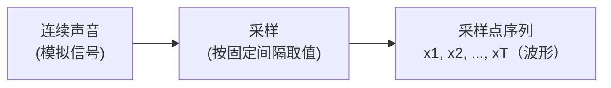
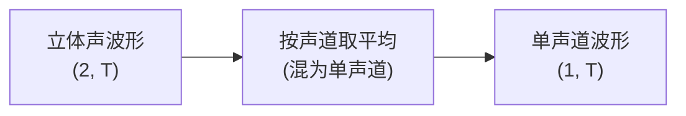
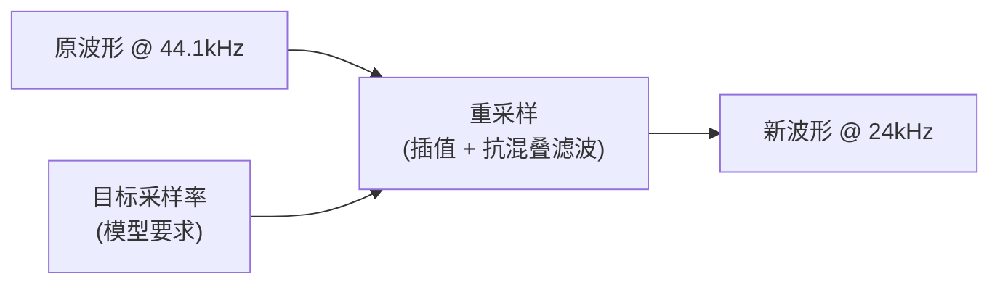
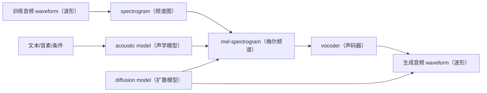

# 第二章：声音是什么 —— 波形、采样率与频率

本章讲 TTS 最终生成的物理对象：声音。对 TTS 来说，所有复杂模型最后都要落到一件事上：生成一段可以播放的 `waveform（波形）`。理解波形后，后续学习 `mel-spectrogram（梅尔频谱）`、`vocoder（声码器）`、扩散去噪才有直觉基础。

本章前半段先建立一条主线：**连续声音是如何一步步变成电脑里的数字、又如何在代码里被存取和换算的**。这条主线串起采样、采样率、量化、声道、数组/张量与重采样几个概念。

## 2.1 声音是一种随时间变化的振动

声音的物理本质是空气压力的快速变化。人说话时，声带、口腔和鼻腔让空气产生振动；这些振动传到麦克风，麦克风再把它变成电信号，最后电脑把电信号记录成一串数字。


可以先把声音想成一条随时间上下起伏的曲线：

```text
时间向右走，声音强弱上下变化。
```

曲线越密、变化越复杂，声音听起来就越丰富；曲线越简单，声音听起来就越单薄。

## 2.2 waveform（波形）：数字音频在电脑里的样子

`waveform（波形）` 是电脑里最直接的音频表示。它可以看成一串随时间排列的采样点：

```text
x = [x1, x2, x3, ..., xT]
```

每个采样点表示某个时刻的 `amplitude（振幅）`，也就是空气压力变化被记录下来的数值。TTS 最终输出的 `.wav` 文件，本质上就是这串采样点加上 `sample rate（采样率）` 等元信息。

一个非常短的直觉例子：

```text
采样点： 0.0, 0.2, 0.5, 0.2, 0.0, -0.2, -0.5, -0.2 ...
听起来：一段周期性振动
```

这里的数字不是文字、音素或语义，而是最终可以驱动扬声器振动的声音数据。

## 2.3 采样与采样点（sample）：把连续声音切成离散数字

声音本身是连续变化的：空气压力随时间平滑起伏，理论上每一个瞬间都有一个值。但电脑只能存有限个数字，于是需要 `sampling（采样）`：按固定的时间间隔，在这条连续曲线上"取值"，每取一次得到的一个数值，就是一个 `sample（采样点）`。



> 图例：左右为数据流；中间方框是处理步骤，两端椭圆描述是数据/表示。

把很多采样点按时间顺序排起来，就是上一节的 `waveform（波形）`。两者的关系可以记成：

```text
采样点（sample）= 某一时刻的一个数值
波形（waveform）= 一长串按时间排列的采样点
```

需要强调的是，单个采样点本身并不携带"音高""音色"这类信息，它只是某一瞬间的振幅读数。音高、音色这些更高级的特征，要靠很多采样点合在一起、再做分析才能体现出来（第 2.10、2.12 节会展开）。

## 2.4 sample rate（采样率）：一秒切多少片

`sample rate（采样率）` 决定电脑每秒记录多少个采样点，单位是 Hz。它其实就是上一节"采样"的密度：采样率越高，一秒钟被切得越细，能记录的高频细节越多，但文件、训练和推理成本也更高。

| 采样率 | 每秒采样点数 | 常见场景 |
| --- | ---: | --- |
| 16 kHz | 16000 | 语音识别、电话语音、轻量语音应用 |
| 22.05 kHz | 22050 | 许多 TTS 训练集和 demo |
| 24 kHz | 24000 | 现代 TTS 常见高质量语音配置 |
| 44.1 kHz | 44100 | 音乐、CD 质量音频 |

例如 24 kHz 的音频，表示每秒有 24000 个采样点：

```text
1 秒声音 = 24000 个数字
10 秒声音 = 240000 个数字
```

这也是为什么直接建模 `waveform（波形）` 很难：一段几秒钟的语音就可能有几十万到上百万个采样点。

## 2.5 量化与位深（quantization / bit depth）：每个采样点存多精细

采样决定了"时间轴上多久取一次值"，`quantization（量化）` 则决定"每个采样点的数值用多精细的刻度来记"。因为电脑用有限位数存数字，连续的振幅必须被近似到最接近的档位上。

`bit depth（位深）` 表示每个采样点用多少比特存储，决定了可用的档位数量：

| 位深 | 大致档位数 | 常见场景 |
| --- | ---: | --- |
| 16-bit | 约 6.5 万 | CD、绝大多数语音/音乐 |
| 24-bit | 约 1678 万 | 录音棚、专业制作 |
| 32-bit float | 浮点表示 | 训练/推理时的内部计算 |

位深太低时，量化带来的误差会以 `quantization noise（量化噪声）` 的形式出现，声音听起来发糙、有底噪。

> 💡 **小科普：采样和量化有什么区别？**
> 采样切的是"时间轴"（多久取一次值），量化切的是"幅度轴"（取到的值精确到哪一档）。两者一起，把连续声音变成电脑能存的离散数字。在代码里，原始 PCM 音频常用整数表示（如 int16），但在喂给模型之前，通常会转换成取值在 [-1, 1] 之间的 **float32 浮点波形**；OmniVoice 内部处理的就是这种浮点波形。

## 2.6 channel（声道）：单声道、立体声与 TTS 的选择

`channel（声道）` 表示同时存在几路独立的波形：

- `mono（单声道）`：一路波形，所有喇叭播放相同内容。
- `stereo（立体声）`：左右两路不同波形，靠左右差异制造"乐器在左、人声在中"的空间定位感。

在代码里，多声道波形通常存成二维数组，形状是 `(声道数, 采样点数)`，例如 `(2, T)` 表示一段立体声。

语音合成关心的是"嗓音本身"——音色、语调、口音，这些信息在单声道里就已经完整保留；立体声的空间感来自录音和混音阶段，对克隆一个人的嗓音没有帮助。所以 TTS 系统通常先把输入音频统一成 **单声道**：把多个声道取平均，合成一路波形。



> 图例：两端椭圆是数据（不同形状的波形数组），中间方框是处理步骤。

## 2.7 波形在代码里的样子：array（数组）与 tensor（张量）

前面反复说波形是"一串采样点"。落到代码里，这串数字就是一个 `array（数组）`：可以按下标访问的有序数值序列。处理音频时最常见两种容器：

- NumPy `array（数组）`：Python 里做数值计算的基础数组，运行在 CPU 上的多维数字表格。
- PyTorch `tensor（张量）`：深度学习框架里的多维数组，和数组很像，但额外能放到 **GPU** 上加速，并支持自动求梯度（训练时需要）。

> 💡 **小科普：tensor（张量）到底是什么？**
> 张量就是"可以有多个维度的数字数组"。一维张量像一条序列（单声道波形），二维张量像一张表格（`(声道, 采样点)` 的波形，或 `(频率, 时间)` 的频谱）。它和 NumPy 数组几乎可以互换，差别在于张量是为神经网络设计的：能在 GPU 上并行计算，还能记录运算过程以便反向传播。

`shape（形状）` 描述各维度的大小，对音频处理很关键：

```text
(T,)        一维：单声道波形，T 个采样点
(1, T)      二维：单声道，但显式带一个声道维
(2, T)      二维：立体声，2 个声道
```

工程中经常要在两者之间转换：很多音频读取库返回的是 NumPy 数组，而模型计算需要张量，于是用 `torch.from_numpy(...)` 转成张量、算完再用 `.numpy()` 转回数组。这正是声音克隆相关代码里反复出现的写法——数据本身没变，只是换了一个适合当前计算环境的容器。

## 2.8 resampling（重采样）：把音频换到另一个采样率

不同来源的音频采样率往往不同：手机录的可能是 48 kHz，老素材可能只有 16 kHz。而模型只在一个 **固定采样率** 下训练和推理，因此需要 `resampling（重采样）`：在尽量不改变"听起来是什么"的前提下，把波形从原采样率换算到目标采样率。

- 采样率降低（如 44.1 kHz → 24 kHz）：采样点变少，称为 `downsampling（下采样）`。
- 采样率升高（如 16 kHz → 24 kHz）：采样点变多，称为 `upsampling（上采样）`。

重采样不是简单地隔点丢弃或复制，而要重新"画出"另一采样率下的曲线，并配合 `anti-aliasing filter（抗混叠滤波）`，避免高频成分错误地折叠成低频杂音。



> 图例：两端椭圆是数据（不同采样率下的波形），中间方框是重采样处理；目标采样率是它的一个参数输入。

> 💡 **小科普：为什么采样率决定能记录的最高频率？**
> 这就是 `Nyquist theorem（奈奎斯特定理）`：采样率必须至少是声音最高频率的 2 倍，才能正确记录。所以 16 kHz 采样最多记到约 8 kHz 的频率成分——这也是为什么采样率越高，能保留的高频细节越多。重采样到更低采样率时，必须先用滤波器去掉超过新上限的高频，否则会产生 `aliasing（混叠）` 失真。

在 OmniVoice 里，任何参考音频读进来后都会先统一成"单声道 + 模型采样率"的波形，再编码成 audio token。其中"换采样率"这一步，就是这里说的重采样。

## 2.9 amplitude（振幅）：声音大小的基础

`amplitude（振幅）` 描述波形在某个时刻偏离中心线的程度。直觉上，它和声音大小有关。

```text
振幅小：声音更轻、更弱
振幅大：声音更响、更强
```

但需要注意：振幅不等于人耳感受到的完整“响度”。人耳对不同频率的敏感程度不同，所以真实听感还会受到频率、频谱结构和持续时间影响。

在 TTS 里，振幅相关问题常见于：

- 音频整体太小或太大。
- 合成音频出现爆音、削波。
- 不同句子的音量不一致。
- 训练数据响度不统一，导致模型生成不稳定。

## 2.10 frequency（频率）与 pitch（音高）：高低音从哪里来

`frequency（频率）` 表示一秒钟振动多少次，单位是 Hz（赫兹）。频率越高，声音通常听起来越尖；频率越低，声音通常听起来越低沉。

`pitch（音高）` 是人耳感知到的高低音。它和频率强相关，但不是完全等同，因为人耳听感还会受到谐波和音色影响。

```text
频率低：男低音、低沉声音
频率高：女高音、尖细声音
```

在语音里经常会看到 `F0（基频）`。它表示有声语音中最基础的振动频率，通常和人的音高走势关系很大。

```text
F0 上升：听起来像疑问、惊讶或强调
F0 下降：听起来像陈述、结束或低落
```

后续讲 `prosody（韵律）`、`emotion（情绪）` 和 `pitch control（音高控制）` 时，都会反复用到这个概念。

## 2.11 phase（相位）：同一频率下的时间错位

`phase（相位）` 描述的是同样频率的波，在时间上从哪里开始。

可以这样理解：

```text
两个人拍手，速度一样，但一个人早半拍开始。
速度一样 = 频率相同
早半拍 = 相位不同
```

对初学 TTS 来说，相位不需要一开始深入掌握。先记住一个结论即可：

```text
声音不是只有频率和振幅，相位也会影响波形细节。
```

在很多 TTS 系统里，模型先生成 `mel-spectrogram（梅尔频谱）` 这类更容易预测的表示，再交给 `vocoder（声码器）` 还原最终波形。声码器的一部分工作，就是补回足够自然的波形细节。

## 2.12 harmonic（谐波）与 timbre（音色）：为什么同一个音高听起来像不同人

`harmonic（谐波）` 是基频之上的整数倍频率成分。真实的人声通常不是单一频率，而是由基频和许多谐波一起组成。

```text
基频：决定主要音高
谐波：增加声音的丰富度
```

`timbre（音色）` 描述的是“同样音高、同样音量时，为什么这个声音听起来像不同的人或乐器”。

例如，同样唱一个音：

```text
一个老年男声
一个年轻女声
一把小提琴
一支长笛
```

它们的主要音高可能一样，但谐波分布、共振结构和声音质感不同，所以人耳能分辨出来。

对 TTS 来说，`speaker identity（说话人身份）` 和 `timbre（音色）` 强相关。声音克隆想保留的，主要就是这类长期稳定的声学特征。

## 2.13 noise（噪声）与 voiced/unvoiced（有声/无声）

`noise（噪声）` 是不规则、非周期的声音成分。它不一定都是坏东西，人声里本来就有一些噪声成分。

例如：

```text
s、sh、f 这类清音里有明显气流噪声。
录音环境里的风扇声、底噪、混响也属于噪声。
```

`voiced（有声）` 表示发音时声带明显振动，例如很多元音和浊辅音。`unvoiced（无声）` 表示发音时声带不明显振动，主要靠气流摩擦或爆破形成声音。

| 类型 | 直觉 | 例子 |
| --- | --- | --- |
| voiced（有声） | 声带明显振动，有稳定音高 | 元音、m、n、z |
| unvoiced（无声） | 声带不明显振动，更像气流或摩擦声 | s、sh、f、p、t、k |

这对 TTS 很重要：如果模型把有声和无声处理错，听起来就会像读音不清、气声异常或辅音不自然。

## 2.14 本章和 TTS 的关系：waveform 到 mel、vocoder、扩散模型

第 2 章只讲声音的物理基础，不展开完整建模细节。先建立下面这张图的直觉即可：



这张图表达三件事：

1. `waveform（波形）` 是最终音频，但太长、太细，直接建模成本高。
2. `mel-spectrogram（梅尔频谱）` 是更适合模型学习的中间表示，详细内容放到第 5 章。
3. `vocoder（声码器）` 负责把中间声学表示变回波形，详细内容放到第 9 章。

后续你看到 TTS 论文里的 `mel（梅尔频谱）`、`latent（潜变量）`、`codec token（语音编码 token）`、`vocoder（声码器）`、`diffusion denoising（扩散去噪）`，都可以先回到本章的最基础问题：

```text
模型最终到底要生成什么？
答案：一段随时间变化、可以被播放的 waveform（波形）。
```
