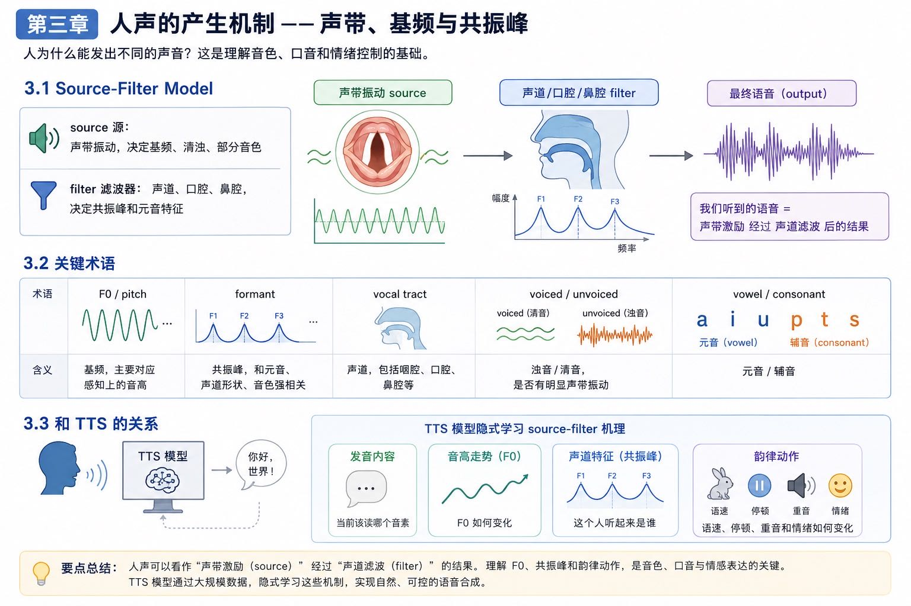

# 第三章：人声的产生机制 —— 声带、基频与共振峰

本章解释“人为什么能发出不同的声音”。这是理解音色、口音和情绪控制的基础。

## 3.1 Source-Filter Model

经典语音学里，人声可以用 source-filter model 建立直觉：

```text
source 源：声带振动，决定基频、清浊、部分音色
filter 滤波器：声道、口腔、鼻腔，决定共振峰和元音特征
```



## 3.2 关键术语

| 术语 | 含义 |
| --- | --- |
| F0 / pitch | 基频，主要对应感知上的音高 |
| formant | 共振峰，和元音、声道形状、音色强相关 |
| vocal tract | 声道，包括咽腔、口腔、鼻腔等 |
| voiced / unvoiced | 浊音/清音，是否有明显声带振动 |
| vowel / consonant | 元音/辅音 |

## 3.3 和 TTS 的关系

很多神经 TTS 模型不显式写 source-filter 公式，但模型内部仍然需要学到类似分工：

```text
发音内容：当前该读哪个音素
音高走势：F0 如何变化
声道特征：这个人听起来是谁
韵律动作：语速、停顿、重音和情绪如何变化
```
