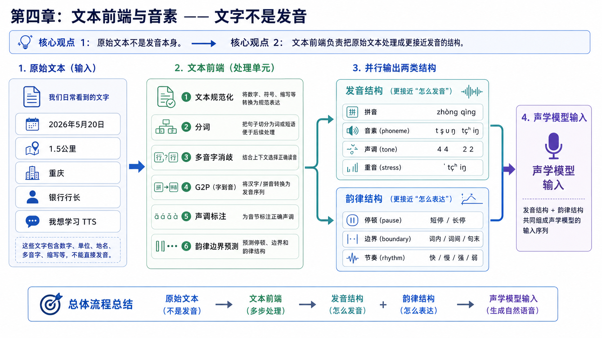
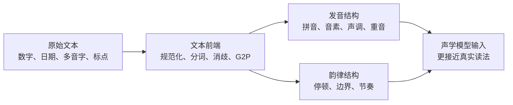
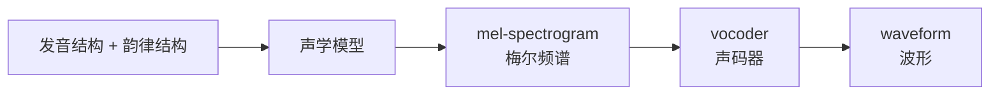

# 第四章：文本前端与音素 —— 文字不是发音

本章讲 TTS（Text-to-Speech，文本转语音）输入模型前需要做什么。很多“读错字”的问题不是声学模型（acoustic model，预测声音特征的模型）不够强，而是文本前端（text frontend，文本预处理模块）没有先把文字转换成正确的发音结构。

对工程同学来说，可以先把文本前端理解成 TTS 系统里的“编译前端”：原始文本像高级语言源码，直接交给后端模型并不可靠；它需要先被规范化、消歧、转换成更接近发音的中间表示。



## 本章导图



这里的关系不是严格的“发音结构 -> 韵律结构 -> 声学模型输入”。更准确地说，文本前端会产出或预测几类信息：发音结构负责“读音是否正确”，韵律结构负责“哪里停顿、节奏如何”，它们共同组成声学模型输入。韵律结构会参考音节、声调、重音等发音信息，但也会受标点、分词、句法和语义影响。

## 4.1 为什么文字不是发音

文字只是书写系统，不等于真实发音。TTS 的输入虽然通常是一段文本，但模型真正需要的是“这句话应该如何发音”。

几个简单例子：

| 原始文本 | 不能直接按字符读的原因 | 文本前端要解决什么 |
| --- | --- | --- |
| `2026年5月20日` | 数字和日期有固定读法 | 读成“二零二六年五月二十日”一类形式 |
| `1.5公里` | 小数、单位需要展开 | 读成“一点五公里” |
| `重庆` | 多音字 | 判断“重”读 `chong2`，不是 `zhong4` |
| `银行行长` | 同一个字在不同词里读音不同 | 判断两个“行”的读法 |
| `我想学习 TTS。` | 中英混读和缩写 | 判断 `TTS` 是逐字母读还是按约定读 |

如果文本前端处理错了，后面的声学模型和 vocoder（声码器，把声学表示变成波形）通常只能“自然地读错”。这和后端服务收到错误的结构化参数类似：下游模块再强，也很难恢复原本意图。

## 4.2 文本前端 text frontend（文本前端）在做什么

文本前端不是一个单独算法，而是一组工程模块。不同语言、不同业务场景会有不同实现，但常见任务大致包括：

| 模块 | 极简解释 | 示例 |
| --- | --- | --- |
| text normalization（文本规范化） | 把数字、日期、单位、符号改成可读形式 | `1.5km` -> “一点五公里” |
| word segmentation（分词） | 找出词边界 | `银行行长` -> `银行 / 行长` |
| polyphone disambiguation（多音字消歧） | 判断多音字具体读法 | `重庆` 的“重”读 `chong2` |
| G2P（字形到音素） | grapheme-to-phoneme，把文字转成发音单位 | `hello` -> 音素序列 |
| tone labeling（声调标注） | 给中文拼音加声调 | `ma1/ma2/ma3/ma4` |
| prosody boundary prediction（韵律边界预测） | 判断哪里停顿、哪里连读 | 标出短暂停顿和句内边界 |

可以把它看成一条“文本到结构化发音信息”的 pipeline（流水线）：


## 4.3 phoneme（音素）是什么

phoneme（音素）可以先理解为“语言中能区分发音的最小单位”。它不是一个具体声音波形，而是一个抽象的发音类别。

例如英文里：

```text
cat /k ae t/
bat /b ae t/
```

`/k/` 和 `/b/` 的差异会改变词义，所以它们是不同 phoneme（音素）。

中文里我们日常更熟悉 pinyin（拼音）。拼音不是严格意义上的国际音标，但对中文 TTS 来说，经常被当作接近发音的输入形式。例如：

```text
文本：重庆
拼音：chong2 qing4
```

这里的 `chong2` 比原始汉字“重”更接近模型需要的发音信息，因为它已经消除了“重”到底读 `zhong4` 还是 `chong2` 的歧义。

## 4.4 phoneme（音素）和 syllable（音节）有什么区别

这是初学 TTS 时很容易混的点。

syllable（音节）是更大的发音单元，通常可以被一次比较完整地发出来；phoneme（音素）是更小的发音单元。

以中文拼音 `ma1` 为例：

```text
音节 syllable：ma1
更细的组成：m + a + tone1
```

以英文 `cat` 为例：

```text
单词：cat
音节 syllable：cat 通常是一个音节
音素 phoneme：/k/ + /ae/ + /t/
```

简单记：

| 概念 | 粒度 | 直觉 |
| --- | --- | --- |
| phoneme（音素） | 更小 | 一个个发音零件 |
| syllable（音节） | 更大 | 一次发出的发音块 |
| pinyin（拼音） | 中文常用发音表示 | 通常包含声母、韵母和声调 |

中文 TTS 常常在“字 / 拼音 / 声母韵母 / 声调”这些粒度之间选择输入方式。英文 TTS 则更常见 character（字符）、phoneme（音素）、BPE（子词切分）等输入方式。

## 4.5 tone（声调）、stress（重音）和 prosody（韵律）

只知道“读什么音”还不够，TTS 还要知道停顿、节奏、语调和力度等韵律结构。

tone（声调）在中文里非常重要。同样是 `ma`，声调不同，意义可能完全不同：

```text
ma1 妈
ma2 麻
ma3 马
ma4 骂
```

stress（重音）在英文里更常见。某些词或句子中，哪个音节更重，会影响自然度和语义重点。

prosody（韵律）是更大的概念，通常包括：

```text
pause（停顿）
boundary（边界）
rhythm（节奏）
pitch / F0（音高 / 基频）
duration（时长）
energy（能量）
```

同一句话：

```text
你真的要去吗？
```

可以读成疑问、惊讶、生气、平静或调侃。文字一样，phoneme（音素）也基本一样，但 prosody（韵律）会明显不同。

## 4.6 发音结构和韵律结构如何进入声学模型

声学模型（acoustic model）通常负责：

```text
文本 / 音素 / 条件信息 -> mel-spectrogram（梅尔频谱）或其他声学表示
```

文本前端的输出会变成声学模型的输入条件。可以先用下面这个工程化视角理解：

| 输入信息 | 解决的问题 | 常见形式 |
| --- | --- | --- |
| linguistic content（语言内容） | 说什么 | 字符、拼音、phoneme（音素） |
| pronunciation（发音结构） | 每个字或词的读音 | pinyin（拼音）、tone（声调）、stress（重音） |
| prosody（韵律结构） | 哪里停顿、节奏如何 | boundary（边界）、pause（停顿）、duration（时长） |
| speaker condition（说话人条件） | 谁在说 | speaker embedding（说话人向量）、prompt speech（提示语音） |
| style condition（风格条件） | 用什么语气说 | style embedding（风格向量）、emotion label（情绪标签） |

在传统两阶段 TTS 里，后续链路通常是：



这一章只需要先理解：文本前端把原始文本变成更适合模型使用的发音和韵律条件。mel-spectrogram（梅尔频谱）和 vocoder（声码器）会在后续章节继续展开。

## 4.7 工程上最常见的文本前端问题

做 TTS 工程时，很多线上问题看起来像“模型效果差”，实际根因可能在文本前端。

| 现象 | 可能原因 | 优先排查 |
| --- | --- | --- |
| 数字读错 | 文本规范化规则缺失 | 数字、日期、金额、单位规则 |
| 多音字读错 | 分词或消歧失败 | 分词结果、上下文特征 |
| 停顿奇怪 | 韵律边界预测不准 | 标点、长句切分、韵律词 |
| 中英混读别扭 | 英文缩写处理不一致 | 缩写词表、语言检测 |
| 长文本漏读或重复 | 切句和模型对齐都有可能 | 先看切句，再看声学模型对齐 |

一个实用原则是：先确认“模型实际拿到的输入是什么”，再判断是不是模型生成问题。对工程同学来说，这相当于先打日志看下游入参，而不是直接怀疑下游服务。

## 4.8 本章小结

本章最重要的结论：

```text
文字不是发音。
文本前端负责把文字变成更接近发音的结构。
phoneme（音素）比 syllable（音节）更细。
中文 TTS 常见输入包括拼音、声调、韵律边界。
发音结构和韵律结构共同影响声学模型输入。
```

后面学习 mel-spectrogram（梅尔频谱）、声学模型（acoustic model）和扩散 TTS（diffusion TTS）时，可以一直带着这个直觉：模型不是直接“看懂文字后发声”，而是依赖一组逐步处理出来的条件信息来生成语音。
