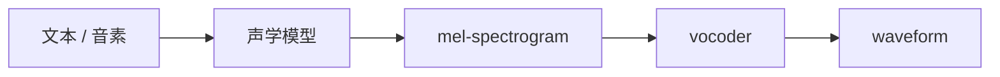

# 第五章：语音信号的时频表示 —— mel、F0、energy 与 codec token

本章是进入 TTS 模型的关键章节。模型通常不会直接从文本生成几十万采样点的 waveform，而是先生成更容易建模的声学表征。

## 5.1 常见声学表示

| 表示 | 作用 |
| --- | --- |
| waveform | 最终音频波形 |
| spectrogram | 频率随时间变化的二维表示 |
| mel-spectrogram | 更接近人耳感知的压缩频谱 |
| F0 / pitch | 音高、语调、部分情绪信息 |
| energy | 音量、力度 |
| duration | 每个音素或字持续多久 |
| codec token | 新一代语音生成常用的离散/连续语音 token |

## 5.2 典型两阶段链路



Tacotron 2、FastSpeech 系列以及许多工程 TTS 系统都可以用这条链路建立第一层理解。

## 5.3 混合表示与解耦

需要特别注意：

```text
mel-spectrogram、codec latent、waveform 都是混合表示。
```

也就是说，它们同时包含“说了什么、谁在说、怎么说、情绪如何、录音环境如何”等信息。真正的解耦通常来自模型结构、监督信号和训练目标，而不是这些表示天然已经分好类。
