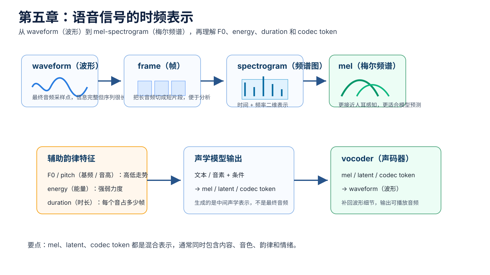
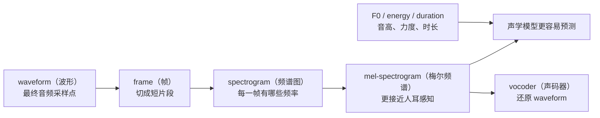
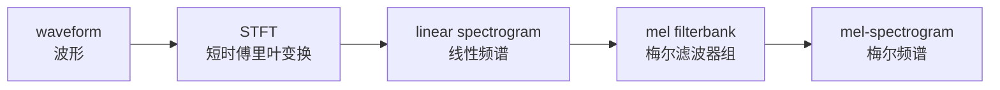
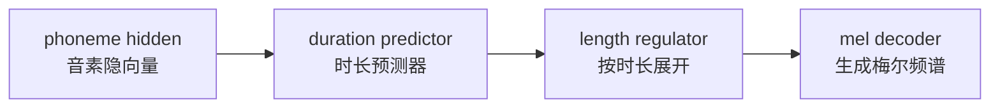

# 第五章：语音信号的时频表示 —— mel、F0、energy 与 codec token

本章是进入 TTS 模型的关键章节。模型通常不会直接从文本生成几十万采样点的 waveform（波形），而是先生成更容易建模的声学表征（acoustic representation，声音的中间表示）。

对工程同学来说，可以先用一个类比理解：waveform（波形）像一大段原始二进制数据，信息最完整，但太长、太细、太难直接建模；mel-spectrogram（梅尔频谱）像一份更结构化的中间数据，损失了一部分细节，但更适合神经网络预测。



## 本章导图



本章只建立直觉，不深入推导 STFT（短时傅里叶变换）公式。你需要先知道这些表示各自解决什么问题，后面读声学模型、vocoder 和 diffusion TTS（扩散式文本转语音）时才不会迷路。

## 5.1 为什么不直接建模 waveform（波形）

waveform（波形）是最终音频在电脑里的样子，本质是一串采样点：

```text
x = [x1, x2, x3, ..., xT]
```

如果采样率是 24 kHz，一秒音频就有 24000 个点。十秒音频就是 240000 个点。对 TTS 来说，输入可能只有几十个字，但输出 waveform（波形）却非常长。

这会带来几个问题：

| 问题 | 直觉解释 |
| --- | --- |
| 序列太长 | 模型要预测的点太多，训练和推理成本高 |
| 局部细节太密 | 每个采样点都受相邻点影响，难以直接学 |
| 文本和波形长度差距大 | 几十个文本 token 要对齐到几十万采样点 |
| 多种合理读法 | 同一句话可以有不同停顿、语气和音高 |

所以很多 TTS 系统采用两阶段思路：


声学模型先预测比较短、比较结构化的 mel-spectrogram（梅尔频谱）；vocoder（声码器）再把它变成最终 waveform（波形）。

## 5.2 frame（帧）：先把声音切成短片段

语音是随时间变化的信号。为了分析它，我们通常不会一次看完整段音频，而是把它切成很多很短的 frame（帧）。

可以先这样理解：

```text
整段音频 -> 第 1 帧 -> 第 2 帧 -> 第 3 帧 -> ...
```

每一帧通常只有几十毫秒。这样做的原因是：在很短的时间内，语音可以近似看成“比较稳定”的声音片段。

常见术语：

| 术语 | 极简解释 |
| --- | --- |
| frame（帧） | 一小段音频片段 |
| window（窗） | 截取一帧时使用的平滑权重 |
| hop size（帧移） | 相邻两帧之间移动多少采样点 |
| overlap（重叠） | 相邻帧之间通常会有部分重叠 |

后面看到 `n_fft`、`win_length`、`hop_length` 这些参数时，可以先把它们理解成“怎么切音频、每片多大、每次移动多远”。

## 5.3 spectrogram（频谱图）：声音里有哪些频率

waveform（波形）只告诉我们振幅随时间怎么变化，但不直接告诉我们“这一刻有哪些频率成分”。spectrogram（频谱图）就是把声音从“时间视角”换成“时间 + 频率视角”。

直觉上：

```text
waveform：横轴是时间，纵轴是振幅
spectrogram：横轴是时间，纵轴是频率，颜色表示强弱
```


spectrogram（频谱图）很适合观察语音，因为人声不是单一频率，而是由基频、谐波、共振峰、噪声等很多成分混合而成。

## 5.4 mel-spectrogram（梅尔频谱）：更接近人耳感知的频谱

mel-spectrogram（梅尔频谱）是在 spectrogram（频谱图）基础上进一步压缩和变换得到的表示。它的核心思想是：人耳对频率的感知不是线性的，低频变化更敏感，高频变化相对没那么敏感。

因此，mel 频率刻度会把频率重新分组，让表示更接近人耳听感。



为什么 TTS 常用 mel-spectrogram（梅尔频谱）？

| 原因 | 解释 |
| --- | --- |
| 比 waveform 短 | 序列长度少很多，训练更容易 |
| 比原始频谱紧凑 | 去掉一些对听感没那么关键的细节 |
| 和人耳感知更接近 | 更符合语音质量的主观听感 |
| 工程生态成熟 | Tacotron、FastSpeech、HiFi-GAN 等大量系统使用 |

但也要记住：mel-spectrogram（梅尔频谱）不是“纯内容表示”。它里面仍然混合了内容、音色、韵律、情绪和录音条件。

## 5.5 F0 / pitch（基频 / 音高）

F0（fundamental frequency，基频）通常对应感知上的 pitch（音高）。如果一段声音是有声的，声带会周期性振动，这个振动的基本频率就是 F0。

简单理解：

```text
F0 高 -> 听起来更高
F0 低 -> 听起来更低
```

F0 对 TTS 很重要，因为它影响：

| 影响维度 | 例子 |
| --- | --- |
| 语调 | 疑问句尾部可能升高 |
| 情绪 | 开心、惊讶、生气时 F0 变化可能更明显 |
| 说话人特征 | 不同说话人的常见 F0 范围不同 |
| 自然度 | F0 过平会像机器读稿 |

注意：F0 不是 timbre（音色）的全部。音色还和共振峰、谐波结构、发声方式、声道形状等有关。F0 主要描述“高低走势”，不是“这个人是谁”。

## 5.6 energy（能量）：声音力度的线索

energy（能量）可以先理解为每一帧声音有多“强”。它和音量、力度、重读有关系，但不完全等同于最终播放音量。

在 TTS 中，energy（能量）常用于控制：

```text
哪里更用力
哪里更轻
一句话的强弱变化
情绪表达的力度
```

例如：

```text
“你真的要去吗？”
```

平静地说，energy（能量）变化可能比较平；惊讶地说，某些词会更强，energy（能量）会有更明显起伏。

## 5.7 duration（时长）：每个发音持续多久

duration（时长）描述一个音素、拼音、字或音节持续多少时间。它是文本长度和声学帧长度之间的重要桥梁。

比如：

```text
文本 / 音素序列：我 想 学 习 TTS
mel 帧序列：     1 2 3 4 5 6 7 8 9 ...
```

模型需要知道每个发音大概占多少帧，否则就容易出现漏读、重复、节奏奇怪等问题。

FastSpeech 类模型里常见 duration predictor（时长预测器）和 length regulator（长度调节器）：



先不需要掌握实现细节，只要记住：duration（时长）解决的是“文本 token 和语音帧怎么对齐”的问题。

## 5.8 codec token（语音编码 token）：新一代语音生成常见表示

近年的语音生成模型不一定只用 mel-spectrogram（梅尔频谱），也会使用 codec token（语音编码 token）。

codec（编解码器）可以把 waveform（波形）压缩成更短的离散或连续表示，再由 decoder（解码器）还原成音频。常见方向包括 SoundStream、EnCodec、neural codec language model（神经音频编码语言模型）等。

可以先这样理解：

```text
waveform -> neural codec encoder -> codec token -> neural codec decoder -> waveform
```

codec token（语音编码 token）的意义是：把很长的原始音频压缩成更适合生成模型处理的 token 序列。这样一些模型就可以像处理文本 token 一样处理语音 token。

| 表示 | 优点 | 代价 |
| --- | --- | --- |
| mel-spectrogram（梅尔频谱） | 简单成熟，TTS 生态强 | 还需要 vocoder，还原细节有限 |
| codec token（语音编码 token） | 更适合大模型和语音 token 建模 | 依赖 codec 质量和训练方式 |
| waveform（波形） | 信息最完整 | 序列太长，直接生成成本高 |

## 5.9 混合表示与解耦

需要特别注意：

```text
mel-spectrogram、codec latent、waveform 都是混合表示。
```

它们同时包含：

```text
说了什么：linguistic content（语言内容）
谁在说：speaker identity（说话人身份） / timbre（音色）
怎么说：prosody（韵律） / style（风格）
情绪如何：emotion（情绪）
录音环境：noise（噪声） / room（房间） / microphone（麦克风）
```

真正的“解耦”通常来自模型结构、监督信号和训练目标，而不是这些表示天然已经分好类。

例如，模型可以显式输入 speaker embedding（说话人向量）来控制“谁在说”，输入 pitch（音高）、energy（能量）、duration（时长）来辅助控制“怎么说”。但最终生成的 mel-spectrogram（梅尔频谱）里，这些信息仍然会混在一起。

## 5.10 本章小结

本章最重要的直觉：

```text
waveform（波形）是最终音频，但太长、太细。
spectrogram（频谱图）把声音变成时间 + 频率二维表示。
mel-spectrogram（梅尔频谱）是 TTS 中常用的中间声学表示。
F0 / pitch（基频 / 音高）描述高低走势。
energy（能量）描述声音强弱。
duration（时长）连接文本 token 和语音帧。
codec token（语音编码 token）是新一代语音生成常见表示。
```

后面学习声学模型时，你会看到模型经常在预测 mel-spectrogram（梅尔频谱）、latent（潜变量）或 codec token（语音编码 token）。后面学习 vocoder（声码器）时，你会看到它如何把这些中间表示还原成 waveform（波形）。
