# 第五章：语音信号的时频表示 —— mel、F0、energy、codec token 与 latent

本章是进入 TTS 模型的关键章节。模型通常不会直接从文本生成几十万采样点的 waveform（波形），而是先生成更容易建模的声学表征（acoustic representation，声音的中间表示）。

对工程同学来说，可以先用一个类比理解：waveform（波形）像一大段原始二进制数据，信息最完整，但太长、太细、太难直接建模；mel-spectrogram（梅尔频谱）像一份更结构化的中间数据，损失了一部分细节，但更适合神经网络预测。

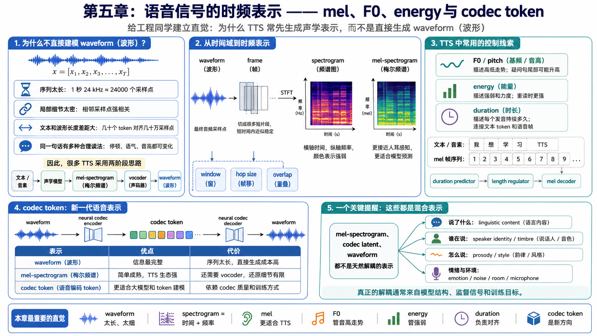

## 本章导图

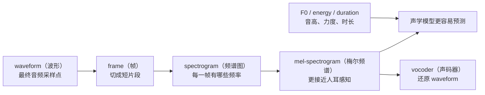

本章只建立直觉，不深入推导 STFT（短时傅里叶变换）公式。你需要先知道这些表示各自解决什么问题，后面读声学模型、vocoder 和 diffusion TTS（扩散式文本转语音）时才不会迷路。

## 5.1 为什么不直接建模 waveform（波形）

waveform（波形）是最终音频在电脑里的样子，本质是一串采样点：

```text
x = [x1, x2, x3, ..., xT]
```

如果采样率是 24 kHz，一秒音频就有 24000 个点。十秒音频就是 240000 个点。对 TTS 来说，输入可能只有几十个字，但输出 waveform（波形）却非常长。

这会带来几个问题：

| 问题 | 直觉解释 |
| --- | --- |
| 序列太长 | 模型要预测的点太多，训练和推理成本高 |
| 局部细节太密 | 每个采样点都受相邻点影响，难以直接学 |
| 文本和波形长度差距大 | 几十个文本 token 要对齐到几十万采样点 |
| 多种合理读法 | 同一句话可以有不同停顿、语气和音高 |

所以很多 TTS 系统采用两阶段思路：


声学模型先预测比较短、比较结构化的 mel-spectrogram（梅尔频谱）；vocoder（声码器）再把它变成最终 waveform（波形）。

## 5.2 frame（帧）：先把声音切成短片段

语音是随时间变化的信号。为了分析它，我们通常不会一次看完整段音频，而是把它切成很多很短的 frame（帧）。

可以先这样理解：

```text
整段音频 -> 第 1 帧 -> 第 2 帧 -> 第 3 帧 -> ...
```

每一帧通常只有几十毫秒。这样做的原因是：在很短的时间内，语音可以近似看成“比较稳定”的声音片段。

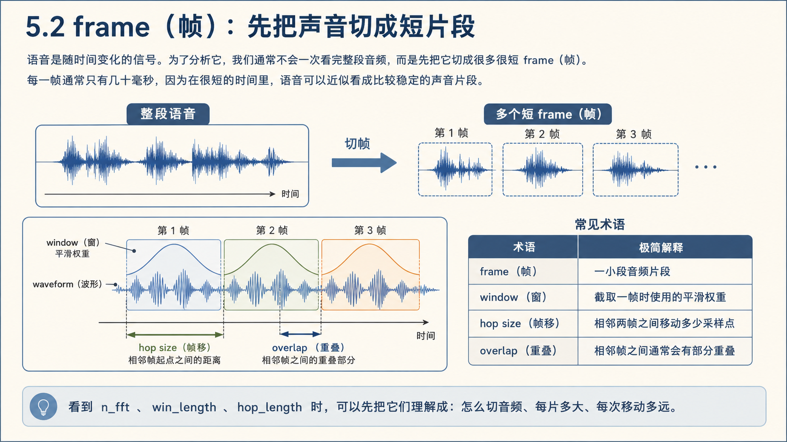

常见术语：

| 术语 | 极简解释 |
| --- | --- |
| frame（帧） | 一小段音频片段 |
| window（窗） | 截取一帧时使用的平滑权重 |
| hop size（帧移） | 相邻两帧之间移动多少采样点 |
| overlap（重叠） | 相邻帧之间通常会有部分重叠 |

后面看到 `n_fft`、`win_length`、`hop_length` 这些参数时，可以先把它们理解成“怎么切音频、每片多大、每次移动多远”。

## 5.3 spectrogram（频谱图）：声音里有哪些频率

waveform（波形）只告诉我们振幅随时间怎么变化，但不直接告诉我们“这一刻有哪些频率成分”。spectrogram（频谱图）就是把声音从“时间视角”换成“时间 + 频率视角”。

直觉上：

```text
waveform：横轴是时间，纵轴是振幅
spectrogram：横轴是时间，纵轴是频率，颜色表示强弱
```


spectrogram（频谱图）很适合观察语音，因为人声不是单一频率，而是由基频、谐波、共振峰、噪声等很多成分混合而成。

## 5.4 mel-spectrogram（梅尔频谱）：更接近人耳感知的频谱

mel-spectrogram（梅尔频谱）是在 spectrogram（频谱图）基础上进一步压缩和变换得到的表示。它的核心思想是：人耳对频率的感知不是线性的，低频变化更敏感，高频变化相对没那么敏感。

因此，mel 频率刻度会把频率重新分组，让表示更接近人耳听感。

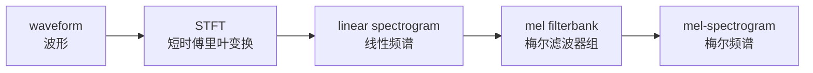

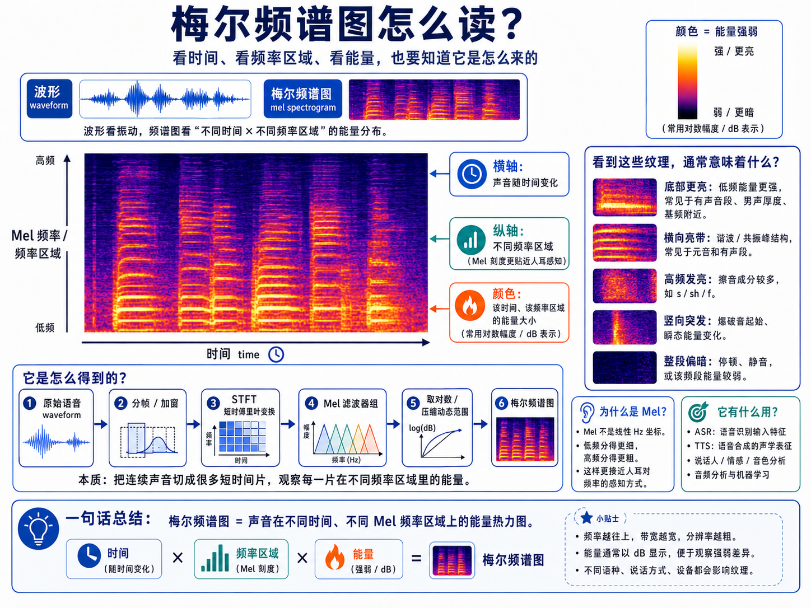

### 5.4.1 如何读懂一张 mel-spectrogram

mel-spectrogram 可以理解成声音的“时间 × 感知频率 × 能量强度”地图。它把一段声音拆成三个维度：

| 维度 | 含义 |
| --- | --- |
| 横轴 | 时间，从左到右表示声音随时间变化 |
| 纵轴 | 频率区域，但不是普通 Hz 频率，而是经过人耳感知压缩的 Mel 频率刻度 |
| 颜色 | 能量 / 响度强弱，颜色越亮通常表示该时间点、该频率区域的声音能量越强 |

所以，mel-spectrogram 上的每一个小格子都可以理解成一个数值：

```text
在某个时间点，某个 Mel 频率区域里，声音有多强。
```

纵轴不是 pitch（音高）本身，而是一组 Mel filter bank（梅尔滤波器组）。它可以粗略理解成：把真实频率从低到高分成很多个“频率桶”。

```text
高频  ↑   s、sh、f 这类摩擦音、气声、细节
      |
中频  |   元音的一些共振结构，人声主体
      |
低频  |   基频、低沉感、男声厚度
      |
      +----------------→ 时间
```

Mel 刻度不是线性的 Hz 频率。人耳对低频变化更敏感，对高频变化相对没那么敏感，所以 Mel filter bank 会让低频分得更细，高频分得更粗。

颜色表示能量强度。具体颜色取决于绘图工具的配色方案，不一定所有图都是红色更强、蓝色更弱；但本质都是：颜色越明显，表示这个时间点和频率区域的能量越强。

普通 waveform（波形图）只直接展示声音随时间的振动强弱：

```text
振幅
 ↑       /\      /\
 |  /\  /  \ /\ /  \
 |_/  \/    V  V    \__
 +----------------------→ 时间
```

mel-spectrogram 则展示不同时间点上，不同频率区域分别有多强：

```text
频率
 ↑  高频  █░░░██░░
 |  中频  ░██████░
 |  低频  ███░░███
 +----------------→ 时间
```

因此，mel-spectrogram 比 waveform 更适合 TTS / 语音模型：它不是只看一条振动曲线，而是把声音拆成更结构化的时间-频率热力图。

为什么 TTS 常用 mel-spectrogram（梅尔频谱）？

| 原因 | 解释 |
| --- | --- |
| 比 waveform 短 | 序列长度少很多，训练更容易 |
| 比原始频谱紧凑 | 去掉一些对听感没那么关键的细节 |
| 和人耳感知更接近 | 更符合语音质量的主观听感 |
| 工程生态成熟 | Tacotron、FastSpeech、HiFi-GAN 等大量系统使用 |

但也要记住：mel-spectrogram（梅尔频谱）不是“纯内容表示”。它里面仍然混合了内容、音色、韵律、情绪和录音条件。

## 5.5 F0 / pitch（基频 / 音高）

F0（fundamental frequency，基频）通常对应感知上的 pitch（音高）。如果一段声音是有声的，声带会周期性振动，这个振动的基本频率就是 F0。

简单理解：

```text
F0 高 -> 听起来更高
F0 低 -> 听起来更低
```

F0 对 TTS 很重要，因为它影响：

| 影响维度 | 例子 |
| --- | --- |
| 语调 | 疑问句尾部可能升高 |
| 情绪 | 开心、惊讶、生气时 F0 变化可能更明显 |
| 说话人特征 | 不同说话人的常见 F0 范围不同 |
| 自然度 | F0 过平会像机器读稿 |

注意：F0 不是 timbre（音色）的全部。音色还和共振峰、谐波结构、发声方式、声道形状等有关。F0 主要描述“高低走势”，不是“这个人是谁”。

在 voice cloning（声音克隆）或跨说话人 TTS 中，高 F0 是一个常见难点。工程上经常会遇到：参考音色像了，但一旦目标语句需要更高 pitch，声音就会变尖、发虚、嘶哑，甚至出现破音或金属感。

这通常不是单纯“音高太高”的问题，而是下面几类因素叠加：

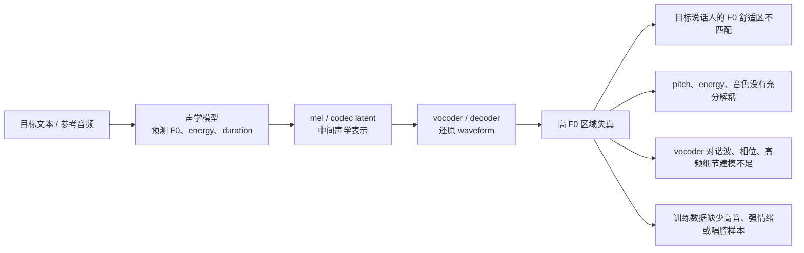

更工程化地说，模型要同时满足三个目标：

```text
像目标说话人
保持目标语句需要的音高和语气
听起来仍然像自然发声
```

这三个目标并不总是兼容。例如，一个低音区男声参考音频，如果被强行生成到很高的 F0，模型可能既保不住原来的 timbre（音色），也保不住自然的 harmonic structure（谐波结构），最后就容易破。

### 高 F0 破音的常见工程处理

| 做法 | 工程直觉 | 已有系统或论文线索 |
| --- | --- | --- |
| F0 范围约束 | 不让生成 F0 长时间超过目标说话人的常见范围 | voice conversion 中常用 log-F0 均值方差映射，把源说话人的 F0 分布对齐到目标说话人 |
| pitch conditioning（显式音高条件） | 不让模型只靠文本隐式猜 pitch，而是把 F0 / pitch 当作可控条件 | FastPitch 显式预测和使用 pitch contour；FastSpeech 2 的 variance adaptor 显式建模 duration、pitch、energy |
| pitch / speaker 解耦 | 尽量把“谁在说”和“怎么起伏”拆开 | Expressive Neural Voice Cloning 使用 speaker encoding、pitch contour、style tokens 做可控克隆 |
| F0-aware vocoder | vocoder 明确看到 F0 或源激励，不只从 mel 里猜周期结构 | uSFGAN、SiFi-GAN、SF-GAN 等 source-filter neural vocoder 使用 F0 或 source excitation 提升 pitch controllability |
| 更强的通用 vocoder | 减少高频毛刺、aliasing、谐波恢复失败 | BigVGAN 使用 periodic activation 和 anti-aliased representation，提升跨场景泛化和高保真还原 |
| 数据覆盖和增强 | 让训练分布覆盖高 F0、强情绪、喊叫、唱腔、跨性别音区 | 表达性 TTS、歌声合成和 zero-shot singing 方向通常更重视 pitch / prosody 覆盖 |
| 推理侧保护 | 生成后检测异常 F0、clipping、高频噪声，必要时降 pitch 或重采样 | 产品工程里常见，但论文通常不会把它作为核心贡献 |

工程实践里最常用、也最容易落地的是前三类：

```text
1. 先统计目标说话人参考音频或训练数据的 F0 分布。
2. 对生成 F0 做 soft clamp，而不是让它无限外推。
3. 使用显式 pitch 条件或 pitch predictor，避免 pitch 完全隐式。
4. 高 F0 场景优先选择 F0-aware vocoder 或更强的通用 vocoder。
5. 对破音样本做自动检测，再降 pitch_scale / 降 energy / 换采样种子重跑。
```

这里的 soft clamp 不是把所有高音都压平，而是当 F0 超出目标说话人的自然范围太多时，逐渐拉回。例如可以把目标说话人的 `P95` 或 `P99` F0 当成警戒区间，而不是简单写死一个全局阈值。不同性别、年龄、唱法、情绪下的合理 F0 范围差异很大，全局阈值很容易误伤。

### 学术上更权威的几条主线

第一条主线是 **F0 分布映射**。voice conversion（声音转换）里很早就有做法：对 log-F0 做均值方差归一化，把源说话人的 F0 分布映射到目标说话人的 F0 分布。这是一个简单但非常实用的基线，适合解释“为什么不能直接搬绝对 F0”。

第二条主线是 **显式韵律建模**。FastPitch 把 fundamental frequency contour（基频轮廓）作为条件，并预测 pitch contour；FastSpeech 2 则通过 variance adaptor 建模 duration、pitch、energy。它们共同说明：pitch 不是可有可无的副产品，而是 TTS 质量、自然度和可控性的关键条件。

第三条主线是 **source-filter（源-滤波器）思想回归到神经 vocoder**。传统语音产生模型会把声带激励和声道滤波分开理解；uSFGAN、SiFi-GAN、SF-GAN、ESTVocoder 这类工作把 F0-based excitation 或 source-filter 结构引入 neural vocoder，目标就是提升高保真和 pitch controllability。对高 F0 破音来说，这条线尤其重要，因为破音经常发生在 waveform 还原阶段。

第四条主线是 **更强的波形生成器与抗 aliasing**。BigVGAN 这类 vocoder 不是只靠更大模型，而是把 periodic activation（周期激活）和 anti-aliased representation（抗混叠表示）加入生成器，以改善音频周期结构和高频伪影。高 F0 场景下，谐波更密、更靠近高频，普通上采样生成器更容易暴露伪影。

所以可以把高 F0 破音看成一个跨模块问题：

```text
声学模型负责：F0 是否合理、是否和 energy / duration / style 协同。
表示层负责：mel 或 codec latent 是否保留足够的周期和高频线索。
vocoder 负责：能否把高 F0 下的谐波、相位和高频细节稳定还原。
数据工程负责：训练集中是否真的见过这些高 F0 发声方式。
推理工程负责：异常样本能否被检测、降级和重试。
```

参考阅读：

- FastPitch: Parallel Text-to-speech with Pitch Prediction：<https://arxiv.org/abs/2006.06873>
- FastSpeech 2: Fast and High-Quality End-to-End Text to Speech：<https://openreview.net/pdf?id=piLPYqxtWuA>
- Expressive Neural Voice Cloning：<https://arxiv.org/abs/2102.00151>
- An overview of voice conversion systems：<https://doi.org/10.1016/j.specom.2017.01.008>
- Unified Source-Filter GAN：<https://arxiv.org/abs/2104.04668>
- Source-Filter-Based Generative Adversarial Neural Vocoder：<https://arxiv.org/abs/2304.13270>
- ESTVocoder: An Excitation-Spectral-Transformed Neural Vocoder Conditioned on Mel Spectrogram：<https://arxiv.org/abs/2411.11258>
- BigVGAN: A Universal Neural Vocoder with Large-Scale Training：<https://arxiv.org/abs/2206.04658>

## 5.6 energy（能量）：声音力度的线索

energy（能量）可以先理解为每一帧声音有多“强”。它和音量、力度、重读有关系，但不完全等同于最终播放音量。

在 TTS 中，energy（能量）常用于控制：

```text
哪里更用力
哪里更轻
一句话的强弱变化
情绪表达的力度
```

例如：

```text
“你真的要去吗？”
```

平静地说，energy（能量）变化可能比较平；惊讶地说，某些词会更强，energy（能量）会有更明显起伏。

## 5.7 duration（时长）：每个发音持续多久

duration（时长）描述一个音素、拼音、字或音节持续多少时间。它是文本长度和声学帧长度之间的重要桥梁。

比如：

```text
文本 / 音素序列：我 想 学 习 TTS
mel 帧序列：     1 2 3 4 5 6 7 8 9 ...
```

模型需要知道每个发音大概占多少帧，否则就容易出现漏读、重复、节奏奇怪等问题。

FastSpeech 类模型里常见 duration predictor（时长预测器）和 length regulator（长度调节器）：

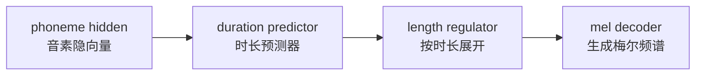

先不需要掌握实现细节，只要记住：duration（时长）解决的是“文本 token 和语音帧怎么对齐”的问题。

### 5.7.1 为什么 duration 是 TTS 落地的核心痛点

在实际产品场景中——尤其是配音（dubbing）、有声读物、视频旁白和字幕对齐——duration 的重要性远超学术论文通常的讨论深度。

一个典型的痛点：

```text
原声音频：1.50 秒
TTS 第 1 次生成：1.82 秒
TTS 第 2 次生成：1.35 秒
TTS 第 3 次生成：2.01 秒
```

同一句文本，多次生成的总时长可能在 1.3 秒到 2.1 秒之间波动。对于需要严格对齐时间轴的场景，这种不稳定是不可接受的。

这里面涉及两个不同但紧密关联的能力：

| 能力 | 核心问题 | 应用场景 |
| --- | --- | --- |
| duration 预测（prediction） | 给定文本，预估它"自然说完"需要多长时间 | 排版预估、字幕时间轴规划、UI 提示 |
| duration 控制（control） | 给定文本和目标时长，让 TTS 在指定时间内说完 | 配音对口型、视频旁白、广告卡时间 |

预测能力让你知道"这段文本大概要讲多久"，控制能力让你能"命令 TTS 在指定时间内讲完"。两者缺一不可。

### 5.7.2 duration 的基本原理

#### 对齐提取：从哪里获得 duration 标签

模型训练时需要知道每个音素"实际占了多少帧"。但训练数据通常只有文本和音频对，并没有逐音素的时间标注。因此需要通过 alignment（对齐）来提取 duration 标签。

常见做法有两大类：

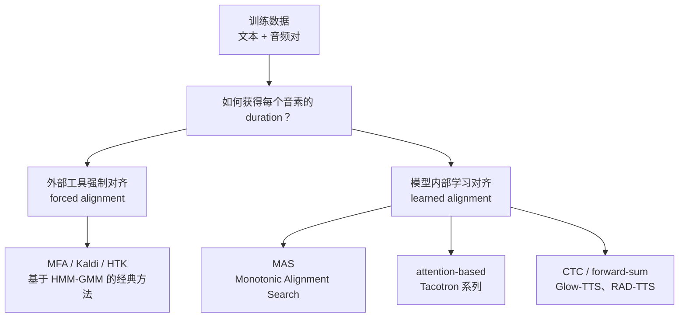

**外部强制对齐（forced alignment）**：用 Montreal Forced Aligner（MFA）或 Kaldi 等工具，基于 HMM-GMM（隐马尔可夫模型 - 高斯混合模型）把音频切分成逐音素的边界。这种方法简单可靠，是 FastSpeech / FastSpeech 2 的标准做法。

```text
输入：音素序列 [w, o, x, iang, x, ue, x, i, T, T, S]
      对应音频 wav
输出：每个音素的起止时间
      w: 0.00-0.08s, o: 0.08-0.15s, ...
→ 每个音素的 duration（帧数）= (结束时间 - 起始时间) / hop_size
```

**模型内部学习对齐**：代表方法是 Glow-TTS 提出的 MAS（Monotonic Alignment Search，单调对齐搜索）。它不依赖外部工具，而是在模型训练过程中，通过动态规划找到文本和 mel 帧之间的最优单调对齐路径。

MAS 的核心约束是单调性：音素序列和帧序列的对应关系必须保持顺序，不能跳回。这和人类发音的物理规律一致——你不可能先说后面的字再说前面的字。

```text
MAS 对齐矩阵示意（简化）：

         帧1  帧2  帧3  帧4  帧5  帧6  帧7
音素 w    ■    ■
音素 o              ■    ■
音素 x                        ■
音素 i                             ■    ■
```

每一行连续的 ■ 就是这个音素对应的帧数，也就是它的 duration。

#### duration predictor（时长预测器）的结构

得到 duration 标签后，就可以训练一个 duration predictor。它的任务是：给定文本（音素）的隐向量，预测每个音素应该持续多少帧。

常见的 duration predictor 结构很简单：

```text
phoneme hidden → Conv1D → ReLU → LayerNorm → Dropout
             → Conv1D → ReLU → LayerNorm → Dropout
             → Linear → 1（标量，预测帧数）
```

训练目标通常是 MSE loss（均方误差）或 MAE loss（平均绝对误差），对象是 log-duration：

```text
L_duration = MSE(predicted_log_duration, log(ground_truth_duration + 1))
```

用 log 的原因是 duration 的分布通常是右偏的（大多数音素很短，少数很长），取 log 可以让分布更接近正态，训练更稳定。

#### length regulator（长度调节器）

有了每个音素的 duration（帧数），length regulator 的工作就是把音素级别的隐向量"展开"成帧级别的序列：

```text
音素隐向量：  [h_w,    h_o,    h_x,    h_i  ]
duration：   [  2,      2,      1,      2   ]
展开后：      [h_w, h_w, h_o, h_o, h_x, h_i, h_i]
```

展开后的序列长度 = 所有 duration 之和 = 总帧数。这就是最终 mel-spectrogram 的时间长度。

### 5.7.3 duration 预测：给定文本，预估时长

duration 预测的目标是：给定一段文本，在不实际生成音频的情况下，预估它被说出来大概需要多长时间。

```text
输入：文本 "你好，欢迎使用语音合成系统"
输出：预估总时长 ≈ 3.2 秒
```

#### 从音素 duration 到总时长

最基本的做法是：把 duration predictor 预测的每个音素的帧数加起来，再乘以每帧的时间步长（hop_size / sample_rate）。

```text
总帧数 = sum(duration_per_phoneme)
总时长 = 总帧数 × (hop_size / sample_rate)

例：总帧数 = 320, hop_size = 256, sample_rate = 24000
总时长 = 320 × (256 / 24000) ≈ 3.41 秒
```

这个计算在推理时几乎是零成本的，因为 duration predictor 只是几层卷积 + 线性层，非常轻量。

#### 影响预测准确性的因素

duration 预测的难点不在模型结构，而在于语音时长本身有很大的合理变化范围：

| 因素 | 对时长的影响 |
| --- | --- |
| 说话人风格 | 有人语速快，有人语速慢 |
| 情绪和语气 | 激动时更快，沉思时更慢 |
| 标点和停顿 | 逗号、句号、省略号暗示不同长度的停顿 |
| 上下文语义 | 重要的词可能被强调拉长 |
| 语言特性 | 中文和英文的音节节奏差异很大 |
| 参考音频 | zero-shot TTS 中参考音频的语速会影响生成 |

因此，duration predictor 给出的是一个"合理的平均预估"，而不是精确的确定值。

#### 工程实践：提高预测准确性

**做法一：条件化 duration predictor**

让 duration predictor 不只看文本，还看其他控制条件：

```text
duration predictor 输入 = phoneme_hidden + speaker_embedding + style_embedding + speaking_rate
```

加入说话人向量后，模型可以学到"这个人说话通常偏快"；加入语速条件后，可以让模型在不同语速下给出不同预测。

**做法二：回归 vs 分类**

除了直接回归一个连续值，也可以把 duration 预测建模成分类问题——预测每个音素属于哪个"时长档位"：

```text
回归：duration = 4.7（直接预测连续值）
分类：duration ∈ [4, 5) → 类别 4（离散化后分类）
```

分类做法的好处是可以输出一个概率分布，从而衡量预测的不确定性。

**做法三：基于规则的时长预估**

在某些系统中——尤其是不使用显式 duration predictor 的模型——可以用更轻量的基于规则的方法来预估时长。核心思想是：不同文字的"发音权重"不同，通过字符权重和参考语速来推算目标时长。

```text
思路：
1. 给每种字符分配发音权重（CJK 汉字 ≈ 3.0, 拉丁字母 ≈ 1.0, 标点 ≈ 0.5, ...）
2. 计算目标文本的总权重 target_weight = sum(char_weights)
3. 从参考音频推算语速 speed_factor = ref_weight / ref_duration
4. 预估时长 = target_weight / speed_factor
```

这种方法不需要神经网络推理，覆盖 600+ 语言的 Unicode 字符分类，对于快速预估"这段文本大概要讲多久"非常实用。缺点是它不考虑停顿、韵律、情绪等细微差异，预估精度有限。

**做法四：整句时长预测器**

如果只关心"整句话多长"而不关心每个音素的细粒度，可以训练一个更简单的句子级回归模型：

```text
输入：文本 token 序列（或 phoneme 序列）
模型：轻量级 encoder（Transformer / BiLSTM）+ 回归头
输出：整句预估时长（秒）
```

这种方式对于 UI 层面的"预估播放时长"很实用，训练数据就是大量的 `(文本, 音频时长)` 对。

### 5.7.4 duration 控制：让 TTS 在指定时间内说完

duration 控制是更难、也更有实用价值的能力。目标是：

```text
输入：文本 "你好，欢迎使用语音合成系统"
     目标时长 = 2.5 秒
输出：总时长 ≈ 2.5 秒的自然语音
```

#### 方法一：全局语速缩放（uniform scaling）

最简单的做法是对 duration predictor 预测的每个音素 duration 乘以一个统一的缩放系数：

```text
predicted_duration_per_phoneme = duration_predictor(phoneme_hidden)
predicted_total_frames = sum(predicted_duration_per_phoneme)
target_total_frames = target_seconds × (sample_rate / hop_size)

scale = target_total_frames / predicted_total_frames

adjusted_duration = round(predicted_duration_per_phoneme × scale)
```

这个方法的优点是零额外训练成本，几乎所有 FastSpeech 类模型都天然支持。缺点是所有音素被等比例缩放，不够自然——现实中人加速说话时，会压缩元音但保留辅音爆破，而不是均匀加速。

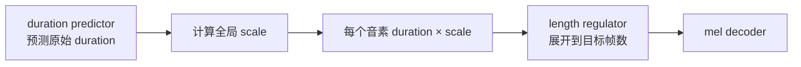

在非 FastSpeech 的架构中，如果模型通过预估 token 数量来决定生成长度，也可以用类似的方式实现语速缩放：

```text
estimated_tokens = duration_estimator.estimate(text, ref_text, ref_duration)
adjusted_tokens = int(estimated_tokens / speed)  # speed > 1 加速, < 1 减速
```

或者直接指定目标时长，由系统换算成目标 token 数：

```text
target_tokens = max(1, int(target_duration_seconds × frame_rate))
```

#### 方法二：非均匀时长分配（per-phoneme reallocation）

更精细的做法是训练一个 duration allocator（时长分配器），让模型自己学习在给定总时长约束下，如何分配每个音素的时长：

```text
输入：phoneme_hidden, target_total_duration
输出：per_phoneme_duration（满足总和 = target_total_frames）
```

核心思想是：不同类型的音素对压缩/拉伸的容忍度不同。

| 音素类型 | 可压缩性 | 直觉 |
| --- | --- | --- |
| 元音（a, o, e, i, u） | 高 | 人可以快说也可以拖长 |
| 辅音爆破（b, p, d, t, g, k） | 低 | 爆破需要最低时间，压太短会模糊 |
| 鼻音（m, n, ng） | 中 | 有一定弹性 |
| 静音 / 停顿（sil, sp） | 高 | 停顿可以大幅缩短或拉长 |

工程上可以用一个带约束的分配策略：

```text
1. 先给每个音素设置最小 duration（min_dur），确保辅音不会被压到无法辨认
2. 用 duration predictor 预测自然 duration 作为"偏好"
3. 按照偏好的比例分配剩余帧（总目标帧 - 最小帧之和）
4. 确保 sum(adjusted_duration) == target_total_frames
```

这种做法比全局缩放自然得多，尤其在大幅加速（如 1.5× 以上）时差异明显。

#### 方法三：推理时搜索（iterative refinement）

对于 autoregressive（自回归）模型或 diffusion（扩散）模型，duration 不是一个显式的输入参数，而是模型自己"决定"什么时候停止。这时控制总时长更困难。

一种实用的工程做法是 iterative search（迭代搜索）：

```text
target = 2.5 秒
tolerance = 0.1 秒

for speed_scale in [0.8, 0.9, 1.0, 1.1, 1.2, ...]:
    audio = tts_generate(text, speed=speed_scale)
    actual_duration = len(audio) / sample_rate
    if abs(actual_duration - target) < tolerance:
        return audio

# 如果没命中，取最接近的
```

这种做法的代价是需要多次推理，但对于不支持显式 duration 控制的模型（如某些 codec language model），这可能是最实用的方案。

#### 方法四：时域后处理（time-stretching）

如果模型已经生成了音频，但时长不对，可以用信号处理方法在波形层面做 time-stretching（时间拉伸），在不改变音高的情况下改变时长：

```text
生成音频：2.1 秒
目标时长：1.5 秒
→ 用 WSOLA / phase vocoder 将音频压缩到 1.5 秒
```

常用工具包括 `rubberband`、`librosa.effects.time_stretch`、`sox tempo`。

| 工具 | 特点 |
| --- | --- |
| Rubber Band Library | 高质量，支持实时，工业级 |
| librosa time_stretch | Python 友好，基于 phase vocoder |
| sox tempo | 命令行工具，简单快速 |
| WSOLA | 经典算法，对语音友好 |

这种方法的优点是不需要重新训练模型，对任何 TTS 系统都适用。缺点是当压缩/拉伸比例过大（如超过 1.5×），音质会明显下降，可能出现金属感、模糊或节奏不自然。

### 5.7.5 综合方案：预测 + 控制的工程架构

在实际配音/dubbing 产品中，duration 预测和控制通常需要联合使用：

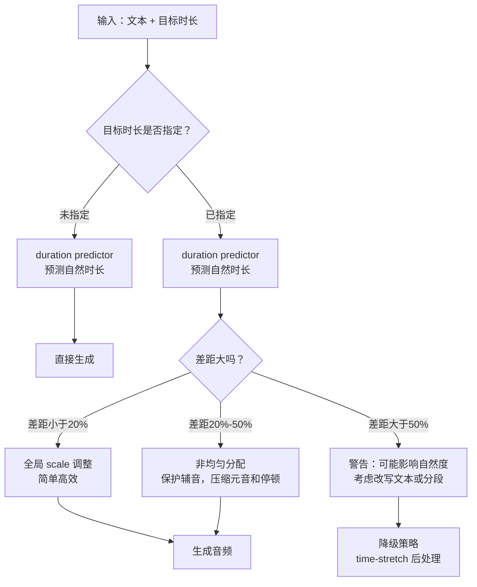

工程实践中的关键经验：

```text
1. 先预测再控制。先用 duration predictor 预估自然时长，再决定需要多大的调整。
   如果自然时长和目标时长差距太大（超过 50%），应该提前告警而不是硬压。

2. 保护最小 duration。每个音素都有一个最小可辨识时长。
   辅音爆破通常需要至少 30-50ms，元音通常需要至少 50-80ms。
   压到这个下限以下，声音会模糊甚至消失。

3. 优先压缩停顿。如果需要缩短总时长，先减少标点停顿和词间间隔，
   这比压缩音素本身对自然度影响更小。

4. 分段策略。对于长文本，按句子或分句分别控制 duration 比整段控制更可靠。
   每个分句有独立的目标时长，误差不会跨句累积。

5. 容忍度设计。配音场景通常不需要精确到毫秒。
   ±100ms 的误差在大多数场景下听感上是可接受的。
   但在口型同步（lip-sync）场景下，误差需要控制在 ±50ms 以内。

6. duration 和 speed 的优先级。当两个参数同时提供时，
   通常 duration（绝对时长）应该覆盖 speed（相对语速），
   因为配音场景要求的是精确的时间对齐，而不是模糊的快慢感觉。
```

### 5.7.6 autoregressive 模型中的 duration 问题

上面的讨论主要针对 non-autoregressive（非自回归）模型（如 FastSpeech 系列），它们有显式的 duration predictor，天然支持 duration 控制。

但在 autoregressive（自回归）模型和最近的 codec language model（如 VALL-E、CosyVoice、ChatTTS）中，duration 是隐式的：模型逐帧或逐 token 生成，由模型自己"决定"什么时候停止。

这带来两个问题：

```text
1. 时长不稳定：同一句话多次生成，时长可能差异很大
2. 难以显式控制：没有一个简单的"目标时长"输入接口
```

对于这类模型，常见的工程应对：

| 策略 | 做法 | 代价 |
| --- | --- | --- |
| 语速 token / prompt | 在输入中加入语速控制 token 或在 prompt 中暗示语速 | 控制精度有限 |
| 多次生成 + 筛选 | 生成多条候选，选最接近目标时长的 | 推理成本翻倍 |
| 后处理 time-stretch | 生成后用 WSOLA / rubberband 调整时长 | 音质有损 |
| 混合架构 | 用 non-autoregressive 的 duration predictor 提供 frame-level guidance | 架构更复杂 |
| 固定目标 token 数 | 预先设定生成的 token 数量，间接控制时长 | 需要准确的 token-时长映射 |

还有一种思路是 mask-fill 解码方式：模型不是逐 token 自回归生成，而是先确定目标段的 token 数量（基于时长预估或直接指定），然后通过迭代填充 MASK token 来生成内容。这种方式天然支持 duration 控制——你决定了多少个 token，也就决定了生成时长。

从产品角度看，如果你的场景对 duration 控制有强需求（如配音、字幕对齐），优先选择支持显式 duration 控制的架构，或者选择那些明确提供 `speed` / `duration` 参数接口的模型。

参考阅读：

- FastSpeech: Fast, Robust and Controllable Text to Speech：<https://arxiv.org/abs/1905.09263>
- FastSpeech 2: Fast and High-Quality End-to-End Text to Speech：<https://openreview.net/pdf?id=piLPYqxtWuA>
- Glow-TTS: A Generative Flow for Text-to-Speech via Monotonic Alignment Search：<https://arxiv.org/abs/2005.11129>
- VALL-E: Neural Codec Language Models are Zero-Shot Text to Speech Synthesizers：<https://arxiv.org/abs/2301.02111>
- Montreal Forced Aligner：<https://montreal-forced-aligner.readthedocs.io/>


## 5.8 codec token（语音编码 token）：新一代语音生成常见表示

近年的语音生成模型不一定只用 mel-spectrogram（梅尔频谱），也会使用 codec token（语音编码 token）。这是一个正在深刻改变 TTS 和语音生成架构的方向，值得花更多篇幅理解。

### 5.8.1 为什么会出现 codec token

mel-spectrogram（梅尔频谱）路线已经非常成熟，但它有两个结构性局限：

```text
1. mel 是连续的浮点矩阵，不能直接当作"token"给语言模型处理。
2. mel 到 waveform 还需要一个独立的 vocoder（声码器），链路更长。
```

随着大语言模型（LLM）的成功，研究者自然想到：能不能把语音也变成离散 token，像文本一样用语言模型来建模？

这就是 codec token（语音编码 token）的核心动机：

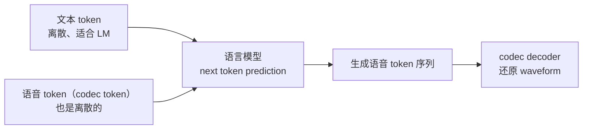

codec（编解码器）可以把 waveform（波形）压缩成更短的离散或连续表示，再由 decoder（解码器）还原成音频。

### 5.8.2 codec 的基本结构：encoder → quantizer → decoder

Neural codec（神经音频编解码器）的核心结构可以拆成三个部分：

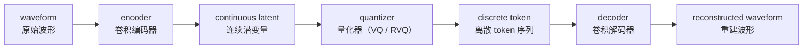

| 模块 | 做什么 | 直觉 |
| --- | --- | --- |
| encoder（编码器） | 把长波形压缩成短的连续向量序列 | 类似图像 VAE 的 encoder |
| quantizer（量化器） | 把连续向量映射到离散 codebook 里最近的"码字" | 每个时间步选一个离散 ID |
| decoder（解码器） | 从离散 token（或量化后的向量）还原波形 | 类似高质量 vocoder |

整条链路可以这样理解：

```text
waveform -> neural codec encoder -> codec token -> neural codec decoder -> waveform
```

如果 codec 训练得好，重建波形和原始波形几乎听不出区别。这样 codec token 就可以作为语音的"高质量压缩表示"。

### 5.8.3 向量量化（VQ）：把连续向量变成离散 token

向量量化（Vector Quantization, VQ）是 codec token 的基础操作。它的核心思想很简单：

```text
维护一个 codebook（码本），里面有 N 个 codeword（码字）。
每个连续向量找到 codebook 里距离最近的码字，用它的编号（index）来代替。
```

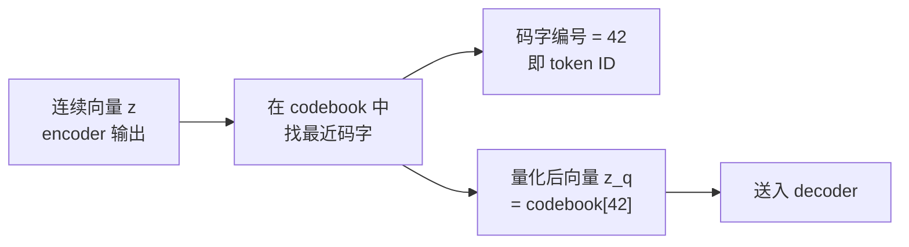

打一个工程类比：

```text
连续向量 = 浮点数坐标
codebook = 一张预先定义好的调色板
VQ = 把任意颜色映射到调色板里最近的颜色
token ID = 调色板里那个颜色的编号
```

codebook 大小通常在 1024 到 16384 之间。codebook 越大，量化越精细，但训练也更难。

### 5.8.4 RVQ（残差向量量化）：分层逐步补充细节

一层 VQ 的精度有限：只用一个码字代替一个连续向量，信息损失可能较大。为了提高还原精度，neural codec 常用 RVQ（Residual Vector Quantization，残差向量量化）。

RVQ 的思路是：

```text
第 1 层：对原始向量做 VQ，得到粗略近似，记录残差（误差）。
第 2 层：对第 1 层的残差再做 VQ，补充更多细节。
第 3 层：对第 2 层的残差继续做 VQ……
依此类推，逐层补充细节。
```

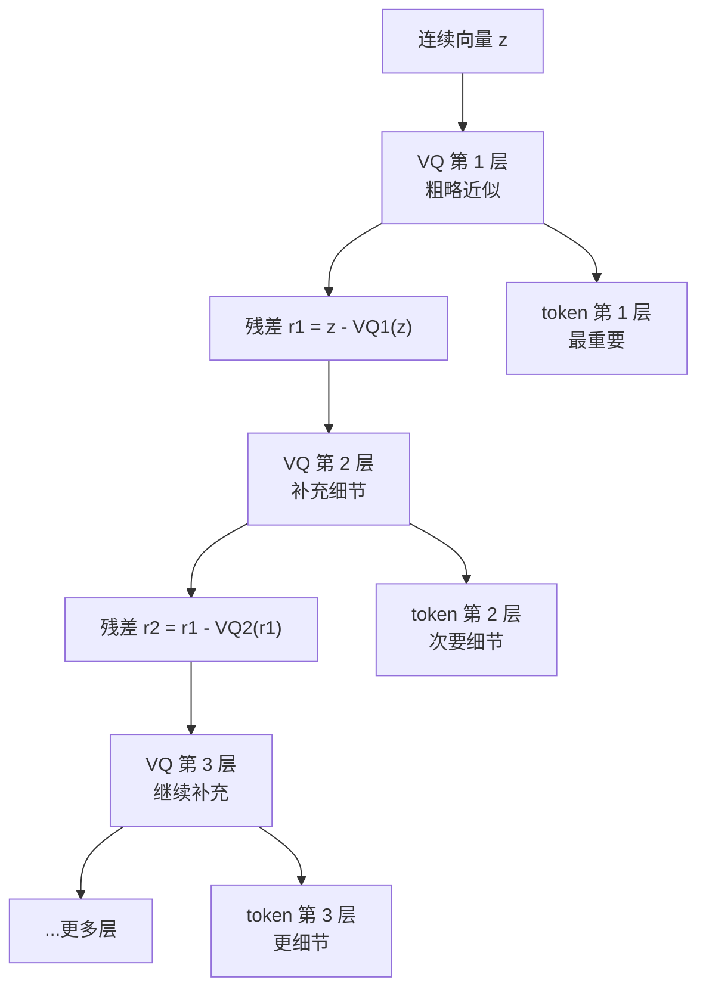

可以这样直觉理解 RVQ 的层级分工：

| RVQ 层 | 捕捉什么 | 直觉 |
| --- | --- | --- |
| 第 1 层 | 语音的粗粒度结构：内容、韵律大轮廓 | 素描稿 |
| 第 2–3 层 | 音色细节、谐波结构 | 上色 |
| 第 4–8 层 | 高频细节、噪声纹理、录音条件 | 精修细节 |

工程上，SoundStream 和 EnCodec 通常用 8 层 RVQ。每一层都有自己独立的 codebook，每个时间步会产生 8 个 token（每层一个）。

所以对于一段 1 秒的音频，如果帧率是 75 Hz、RVQ 有 8 层：

```text
token 总数 = 75 × 8 = 600 个 token / 秒
```

相比 waveform 的 24000 个采样点 / 秒，压缩比非常可观。

### 5.8.5 代表性 codec 系统

| 系统 | 提出方 | 核心特点 |
| --- | --- | --- |
| SoundStream | Google | 最早的端到端 neural audio codec 之一；encoder-RVQ-decoder 结构；使用对抗训练提升音质 |
| EnCodec | Meta (Facebook) | 和 SoundStream 结构类似；支持多码率；开源权重和代码 |
| DAC (Descript Audio Codec) | Descript | 改进量化和训练策略；更高重建质量；支持 44.1 kHz |
| Mimi | Kyutai | 分离 semantic token 和 acoustic token；用于 Moshi 实时对话模型 |
| SpeechTokenizer | 港中文 | 用 HuBERT 蒸馏引导第一层 RVQ 学习语义信息，实现语义和声学的层级解耦 |

它们的共同结构可以归纳为：

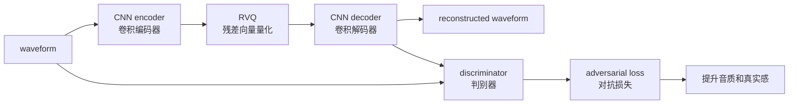

训练目标通常包括：

```text
reconstruction loss（重建损失）：还原波形尽量接近原始
adversarial loss（对抗损失）：让判别器分不出真假
feature matching loss（特征匹配损失）：中间特征层面的一致性
codebook loss（码本损失）：让码字充分利用、均匀分布
```

### 5.8.6 semantic token 与 acoustic token：不同层捕捉不同信息

在很多 codec-based TTS 系统中，会区分两类 token：

| 类型 | 更偏向 | 来源 | 生成顺序 |
| --- | --- | --- | --- |
| semantic token（语义 token） | 说了什么、语言内容、韵律大轮廓 | 通常来自 SSL 模型（如 HuBERT、w2v-BERT）的聚类，或 RVQ 第 1 层 | 先生成 |
| acoustic token（声学 token） | 音色、声学细节、高频纹理 | 通常来自 RVQ 的更深层 | 后生成，补充细节 |

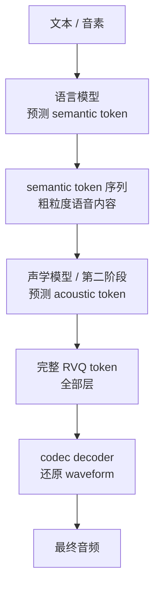

这种分层策略的直觉是：

```text
先解决“说了什么和说话方式”（semantic），再补充“听起来像谁、细节如何”（acoustic）。
```

典型代表是 VALL-E（微软）的两阶段架构：第一阶段用 autoregressive（自回归）模型生成第 1 层 token，第二阶段用 non-autoregressive（非自回归）模型并行生成剩余层 token。

### 5.8.7 离散 token 与连续 latent：两条技术路线

codec 产出的中间表示不一定非得是离散的。实际上有两条路线：

| 路线 | 表示形式 | 生成模型 | 优点 | 代价 |
| --- | --- | --- | --- | --- |
| discrete token（离散 token） | 整数 ID 序列 | 语言模型（next token prediction） | 直接复用 LLM 架构和训练技巧 | 量化误差；codebook 利用率问题 |
| continuous latent（连续潜变量） | 浮点向量序列 | diffusion / flow matching / regression | 无量化损失；信息保留更完整 | 不能直接用 LLM 范式；需要连续生成模型 |

近期趋势是两条路线都在发展：

```text
离散路线：VALL-E、SpeechX、XTTS 等用离散 token + 语言模型。
连续路线：CosyVoice 2、F5-TTS 等用连续 latent + flow matching / diffusion。
混合路线：有些系统用离散 semantic token + 连续 acoustic latent。
```

### 5.8.8 latent（潜变量）：更偏模型内部的中间产物

latent（潜变量、潜在表示）可以理解成模型为了处理数据而产生或使用的**中间产物**。它不是模型权重本身，而是某段输入数据经过 encoder、tokenizer 或模型内部网络之后得到的向量、矩阵或张量。

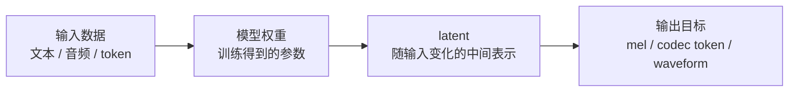

可以把关系先记成：

| 概念 | 它是什么 | 是否随输入变化 |
| --- | --- | --- |
| 模型权重 | 训练得到的参数矩阵或张量 | 推理时通常固定 |
| embedding | token、音素、说话人等对象的向量表示 | 随输入对象变化 |
| latent | 模型内部或 encoder 产生的隐藏表示 | 随每次输入变化 |
| mel / codec token | 常见的语音中间表示 | 随目标语音变化 |

所以 latent 和 mel、codec token 的关系是：

```text
它们都可以是声音信息到 waveform 之前的中间表示。
mel 更像人工设计过的声学图。
codec token 更像离散化后的语音编号序列。
latent 更像模型学出来的连续内部表示或压缩表示。
```

在语音模型里，一个常见链路是：

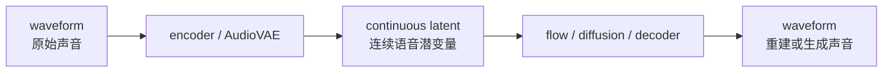

一个系统也可能同时出现 mel、token 和 latent。原因不是“重复造轮子”，而是它们各自擅长不同事情：

| 表示 | 更擅长什么 | 常见位置 |
| --- | --- | --- |
| mel-spectrogram | 声学监督、vocoder 输入、音质相关损失 | 传统 TTS、S2M、mel loss |
| codec token | 离散建模、接入 LLM / Speech LM、语音续写 | codec TTS、prompt-based TTS |
| continuous latent | 连续生成、flow / diffusion、减少离散量化损失 | AudioVAE、latent diffusion、flow matching |

混合系统的直觉是：


对训练和推理来说，latent 这个概念的价值主要体现在四个方面：

| 工作场景 | 了解 latent 的用处 |
| --- | --- |
| 读论文和 README | 判断模型是在生成 mel、codec token、continuous latent，还是 waveform |
| 训练模型 | 明白训练目标是预测 token、回归 mel、去噪 latent，还是做 flow matching |
| 准备数据 | 知道是否需要预先用 encoder / tokenizer 把音频转成 latent 或 token |
| 调试推理效果 | 声音差可能来自主模型，也可能来自 latent encoder / decoder 的重建质量 |

因此，latent 不是一个必须手工操作的单独文件，而是理解现代 TTS 链路时经常出现的“中间货币”。第七章讨论的 continuous latent / flow 路线，就是在这类连续中间空间里做语音生成。

### 5.8.9 codec token 与 mel-spectrogram 的对比

| 维度 | mel-spectrogram（梅尔频谱） | codec token（语音编码 token） |
| --- | --- | --- |
| 表示类型 | 连续浮点矩阵 | 离散整数序列 或 连续潜变量 |
| 压缩程度 | 中等（帧率通常 80–100 Hz） | 更高（帧率通常 25–75 Hz） |
| 还原方式 | 需要 vocoder（如 HiFi-GAN） | 需要 codec decoder |
| 信息保留 | 丢失了相位和部分高频细节 | 取决于 RVQ 层数和 codebook 大小 |
| 与 LLM 兼容 | 不直接兼容，需要额外适配 | 离散 token 天然兼容 LLM 范式 |
| 生态成熟度 | 非常成熟（Tacotron、FastSpeech、HiFi-GAN 等） | 快速发展中（VALL-E、CosyVoice 等） |
| 典型用法 | 传统两阶段 TTS | 新一代 speech language model |

两种表示不是互斥的。工程上经常看到混合使用的系统：比如用 codec encoder 做压缩，用 mel-spectrogram 做辅助损失或条件。

### 5.8.10 codec 质量为什么重要

codec 是整条链路的基座。如果 codec 本身的重建质量不好，生成模型再强也会受限：

```text
codec 重建差 → 即使完美预测了 token，还原出的波形也有瑕疵
codec 重建好 → 生成模型只要预测对 token，就能得到高质量语音
```

常见质量瓶颈：

| 问题 | 表现 |
| --- | --- |
| codebook 利用率低 | 很多码字没被用到，表达能力浪费 |
| 量化误差大 | 高频细节丢失，声音发闷 |
| 训练数据不够多样 | 某些口音、语言、情绪还原效果差 |
| 码率太低 | 过度压缩导致信息不可逆丢失 |

所以在读 codec-based TTS 论文时，一个关键问题是：

```text
它用的 codec 是什么？重建质量如何？token 帧率和 RVQ 层数是多少？
```

参考阅读：

- SoundStream: An End-to-End Neural Audio Codec：<https://arxiv.org/abs/2107.03312>
- High Fidelity Neural Audio Compression (EnCodec)：<https://arxiv.org/abs/2210.13438>
- High-Fidelity Audio Compression with Improved RVQGAN (DAC)：<https://arxiv.org/abs/2306.06546>
- Neural Codec Language Models are Zero-Shot Text to Speech Synthesizers (VALL-E)：<https://arxiv.org/abs/2301.02111>
- SpeechTokenizer: Unified Speech Tokenizer for Speech Language Models：<https://arxiv.org/abs/2308.16692>

## 5.9 混合表示与解耦

需要特别注意：

```text
mel-spectrogram、codec latent、waveform 都是混合表示。
```

它们同时包含：

```text
谁在说：speaker identity（说话人身份） / timbre（音色）
说了什么：linguistic content（语言内容）
说话方式：prosody（韵律） / style（风格）
发音结构：pronunciation（发音结构）
情绪如何：emotion（情绪）
录音环境：noise（噪声） / room（房间） / microphone（麦克风）
```

真正的“解耦”通常来自模型结构、监督信号和训练目标，而不是这些表示天然已经分好类。

### 初学者常见的认知误区

初学者看到 TTS 系统有这么多独立的输入条件时，容易以为输出的 mel-spectrogram（梅尔频谱）里这些信息也是分开存放的。实际恰恰相反：

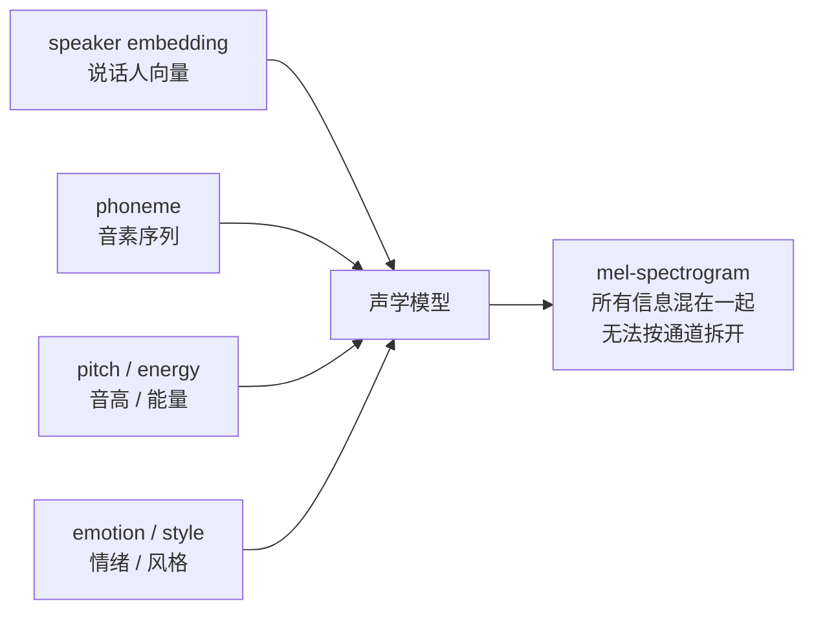

输入侧，条件是分开的、可控的；输出侧，mel-spectrogram 是一张混合了所有信息的“合照”，你看不出哪些像素属于“音色”、哪些像素属于“内容”。

打一个日常类比：

```text
条件输入 = 分别倒入红、蓝、黄三种颜料
mel 输出 = 搅拌后的混合色

你可以控制倒多少红色（音高）、多少蓝色（音色）、多少黄色（情绪），
但搅拌完之后，你无法从混合色里把红色再分离出来。
```

### 模型的输入是分开的，输出是混合的

用更工程的方式理解，下面两张图可以对比看：

**初学者容易以为的结构（输出也分开）：**

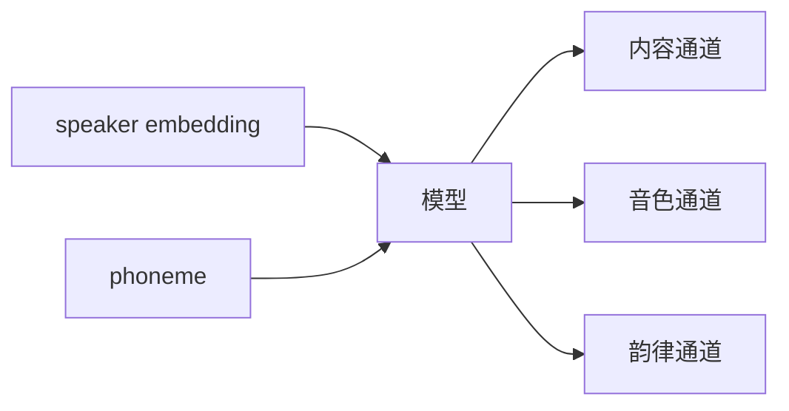

**实际的结构（输出是混合的）：**

```mermaid
flowchart LR
    A["speaker embedding"] --> B["模型"]
    C["phoneme"] --> B
    D["pitch / energy"] --> B
    B --> E["mel-spectrogram<br/>一张混合矩阵<br/>每帧每个 mel bin 都同时<br/>编码了内容+音色+韵律+情绪"]
```

这意味着：即使你给模型分别输入了 speaker embedding（说话人向量）、pitch（音高）、energy（能量）、duration（时长），模型生成的 mel-spectrogram（梅尔频谱）里这些信息仍然会混在一起，无法通过简单的切片或通道分离来提取。

codec token（语音编码 token）和 waveform（波形）也一样：它们都是混合表示，不同信息彼此缠绕在同一组数值里。

### 这对工程意味着什么

```mermaid
flowchart LR
    A["想换音色？"] --> B["不能直接改 mel 的某几行"]
    C["想调情绪？"] --> D["不能直接改 mel 的某几列"]
    E["想控制韵律？"] --> F["必须在模型输入侧控制<br/>或重新训练解耦更好的模型"]
```

所以 TTS 的可控性不是靠在输出表示上做后处理，而是靠在模型输入侧提供更好的条件、在模型结构里设计更好的解耦机制。这也是为什么后面的章节会花大量篇幅讨论 speaker embedding、style token、pitch conditioning 等输入侧的控制方法。

## 5.10 本章小结

本章最重要的直觉：

```text
waveform（波形）是最终音频，但太长、太细。
spectrogram（频谱图）把声音变成时间 + 频率二维表示。
mel-spectrogram（梅尔频谱）是 TTS 中常用的中间声学表示。
F0 / pitch（基频 / 音高）描述高低走势。
energy（能量）描述声音强弱。
duration（时长）连接文本 token 和语音帧。
codec token（语音编码 token）通过 VQ / RVQ 把波形压缩成离散 token，让语音可以像文本一样被语言模型建模。
continuous latent（连续潜变量）是模型在连续空间中使用的语音中间产物，常用于 flow matching、diffusion 或 AudioVAE 类链路。
RVQ（残差向量量化）分层逐步补充细节：第 1 层捕捉粗粒度内容，后续层补充音色和高频细节。
semantic token 和 acoustic token 分别偏向"说了什么"和"听起来像谁"。
codec 的重建质量是整条语音生成链路的基座。
```

后面学习声学模型时，你会看到模型经常在预测 mel-spectrogram（梅尔频谱）、latent（潜变量）或 codec token（语音编码 token）。后面学习 vocoder（声码器）时，你会看到它如何把这些中间表示还原成 waveform（波形）。

## 5.11 QA：codec token 和 mel-spectrogram 到底是什么关系？

### Q1：codec token 和 mel-spectrogram 是两条并行 TTS 技术路线吗？

可以先这样理解：**它们都是 waveform 之前的中间语音表示，但主生成链路通常会选一个作为核心目标**。

传统 mel 路线：

```mermaid
flowchart LR
    A["文本 / 音素"] --> B["声学模型"]
    B --> C["mel-spectrogram<br/>连续浮点矩阵"]
    C --> D["vocoder<br/>HiFi-GAN / BigVGAN 等"]
    D --> E["waveform<br/>最终音频"]
```

新一代 codec token 路线：

```mermaid
flowchart LR
    A["文本 / 参考音频"] --> B["语音生成模型<br/>Speech LM / diffusion LM"]
    B --> C["codec token<br/>离散 ID 序列"]
    C --> D["codec decoder<br/>audio tokenizer 的解码端"]
    D --> E["waveform<br/>最终音频"]
```

所以，mel 和 codec token 可以说是两条主路线，但不是互相排斥的宗派。工程系统里常见三种情况：

| 类型 | 主生成目标 | 最后怎么变声音 | 典型直觉 |
| --- | --- | --- | --- |
| mel TTS | mel-spectrogram | vocoder | 先画一张声学图，再让声码器补波形细节 |
| codec TTS | codec token | codec decoder | 先生成语音 token，再由 codec 解码成波形 |
| 混合 TTS | semantic token、mel、latent 等组合 | vocoder 或 decoder | 先用 token 抓内容，再用 mel / latent 补声学细节 |

### Q2：那主流流程一般两个都会用吗？

**推理主链路不一定两个都会用。** 一个模型如果主目标是 mel，通常就是：

```text
文本 -> mel -> vocoder -> 音频
```

一个模型如果主目标是 codec token，通常就是：

```text
文本 / prompt speech -> codec token -> codec decoder -> 音频
```

但训练、评估或辅助模块里可能会同时出现 mel 和 codec。比如：

```mermaid
flowchart LR
    A["训练音频 waveform"] --> B["codec encoder"]
    B --> C["codec token<br/>主训练目标"]
    A --> D["mel 提取"]
    D --> E["mel loss / STFT loss<br/>辅助音质约束"]
    C --> F["生成模型学习"]
    E --> F
```

这就像一个视频模型主目标是生成像素，但训练时也可以用边缘、深度、感知损失做辅助；辅助特征出现了，不代表推理主链路一定要经过它。

### Q3：当前 OmniVoice 属于哪种？

当前 OmniVoice 更明确地属于 **codec token 路线**。它的核心不是让主模型直接输出 mel，也不是直接输出 waveform，而是：

```mermaid
flowchart LR
    A["文本 token<br/>语言 / 指令 / 文本"] --> B["OmniVoice 主模型<br/>Qwen3 风格 Transformer"]
    C["参考音频"] --> D["audio_tokenizer.encode"]
    D --> E["参考音频 token"]
    E --> B
    B --> F["8 路音频 codebook token"]
    F --> G["audio_tokenizer.decode"]
    G --> H["24kHz waveform"]
```

这也是为什么工程里会看到 `audio_tokenizer`、`num_audio_codebook=8`、`audio_heads`、`audio_tokens` 这些概念。主模型在 token 空间里工作，真正把 token 变成人耳能听的声音，是 audio tokenizer / codec decoder 的职责。

### Q4：IndexTTS / IndexTTS2 用的是什么方案？

IndexTTS / IndexTTS2 更像 **codec token 与 mel/vocoder 的混合路线**。它不是最传统的“文本直接到 mel”单段结构，也不是完全像 OmniVoice 那样“主模型只生成 codec token 后直接 decode”。更接近下面这种多阶段链路：

```mermaid
flowchart LR
    A["文本 / 参考音频"] --> B["T2S 模块<br/>生成 semantic token"]
    B --> C["S2M 模块<br/>semantic-to-mel"]
    C --> D["mel-spectrogram"]
    D --> E["BigVGAN / BigVGANv2"]
    E --> F["waveform"]
```

更细一点看，IndexTTS2 里 semantic token 负责较粗粒度的“说了什么和说话方式”，S2M 模块再把语义表示转成 mel-spectrogram，最后由 BigVGANv2 这类 vocoder 还原波形。IndexTTS 2.5 技术报告还强调了 semantic codec compression，把 semantic codec 帧率从 50 Hz 降到 25 Hz，并升级 S2M 以加速 mel-spectrogram 生成。

所以如果用一句话归类：

```text
IndexTTS / IndexTTS2 = token 负责内容与高层语音结构，mel + vocoder 负责声学细节和最终波形。
```

### Q5：VoxCPM2 用的是什么方案？

VoxCPM2 更像 **continuous latent / tokenizer-free 路线**。它的公开文档强调：VoxCPM2 不是依赖离散 audio tokenizer 生成 codec token，而是在 AudioVAE V2 的连续 latent 空间里做 diffusion-autoregressive 生成。

可以这样画：

```mermaid
flowchart LR
    A["文本 / prompt speech"] --> B["Local Encoder"]
    B --> C["Text-Semantic LM"]
    C --> D["Residual Acoustic LM"]
    D --> E["Local DiT / CFM<br/>生成连续 audio latent"]
    E --> F["AudioVAE V2 decode"]
    F --> G["48kHz waveform"]
```

这里的关键词不是 mel，也不是离散 codec token，而是：

```text
continuous latent
AudioVAE V2
Local DiT
CFM / Conditional Flow Matching
tokenizer-free
```

它仍然有“codec layer / AudioVAE”这样的压缩与还原模块，但主生成对象不是传统 RVQ 离散 token，而是连续语音潜变量。

### Q6：这几个模型放在一起怎么记？

```mermaid
flowchart LR
    A["TTS 中间表示路线"] --> B["mel-spectrogram<br/>连续频谱图"]
    A --> C["codec token<br/>离散语音 token"]
    A --> D["continuous latent<br/>连续语音潜变量"]

    B --> E["传统 Tacotron / FastSpeech<br/>以及 IndexTTS2 的 S2M 后半段"]
    C --> F["OmniVoice<br/>VALL-E 类 speech LM"]
    D --> G["VoxCPM2<br/>AudioVAE latent + CFM"]
```

最短记忆法：

| 模型 | 主要归类 | 一句话 |
| --- | --- | --- |
| OmniVoice | codec token 路线 | 主模型生成 8 路音频 token，audio tokenizer 解码成声音 |
| IndexTTS / IndexTTS2 | token + mel/vocoder 混合路线 | token 抓语义和结构，S2M 生成 mel，BigVGANv2 出波形 |
| VoxCPM2 | continuous latent / tokenizer-free 路线 | 不走离散 codec token 主链路，在 AudioVAE 连续 latent 里生成 |

### Q7：为什么这些路线会同时存在？

因为它们优化的问题不一样：

| 路线 | 优势 | 代价 |
| --- | --- | --- |
| mel-spectrogram | 成熟、稳定、vocoder 生态好 | 不天然适配 LLM token 生成，丢相位和部分高频 |
| codec token | 能把语音变成 token，方便接 LLM / speech LM | 依赖 codec 质量，有量化误差和 codebook 设计问题 |
| continuous latent | 避免离散量化损失，适合 diffusion / flow | 不能直接当普通文本 token 处理，采样和建模更复杂 |

所以读一个 TTS 项目时，可以先问三个问题：

```mermaid
flowchart LR
    A["读一个 TTS 项目"] --> B["主模型生成什么？<br/>mel / codec token / latent"]
    B --> C["谁把中间表示还原成 waveform？<br/>vocoder / codec decoder / VAE decoder"]
    C --> D["训练时有没有辅助表示？<br/>mel loss / STFT loss / semantic token"]
```

这三个问题基本能判断它到底站在哪条技术路线。

参考资料：

- IndexTTS: An Industrial-Level Controllable and Efficient Zero-Shot Text-To-Speech System：<https://arxiv.org/abs/2502.05512>
- IndexTTS2: A Breakthrough in Emotionally Expressive and Duration-Controlled Auto-Regressive Zero-Shot Text-to-Speech：<https://ojs.aaai.org/index.php/AAAI/article/download/40820/44781>
- IndexTTS 2.5 Technical Report：<https://arxiv.org/abs/2601.03888>
- VoxCPM2 官方文档：<https://voxcpm.readthedocs.io/en/latest/models/voxcpm2.html>
- VoxCPM 架构文档：<https://voxcpm.readthedocs.io/en/latest/models/architecture.html>
