# 第六章：语音信息分解 —— 音色、内容、说话方式与发音结构

本章承接前面的声学基础，解释 TTS（Text-to-Speech，文本转语音）系统如何看待一段语音里的不同信息：谁在说、说了什么、说话方式是什么、发音结构是什么。

先说一个关键前提：这些分类不是语音信号里天然贴好的标签，而是语音学、信号处理和神经网络建模里常用的工程抽象。真实的 mel-spectrogram（梅尔频谱）、codec token（语音编码 token）和 waveform（波形）里，这些信息通常是混在一起的。

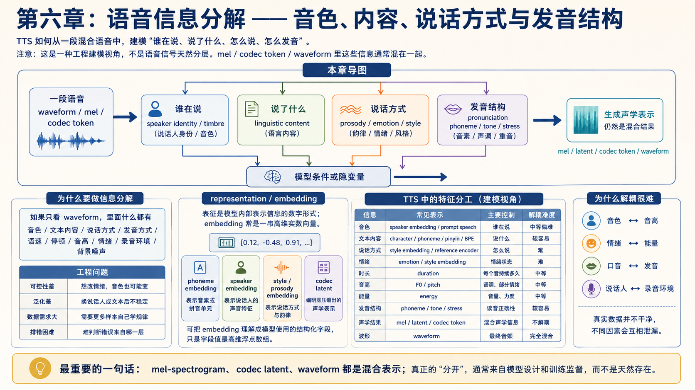

## 本章导图

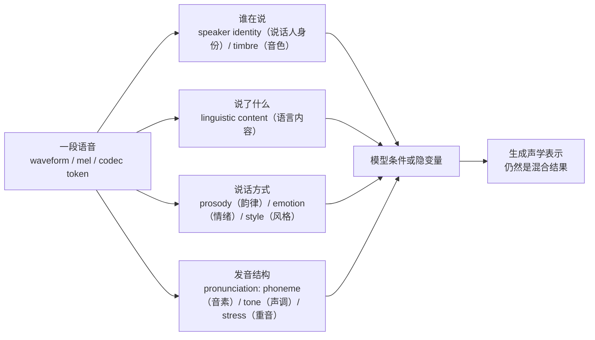

这张图表达的是“建模视角”，不是严格的物理分层。现实中，音色会影响 F0（基频）的范围，情绪会影响音色质感，韵律也会影响听起来像不像某个说话人。

## 6.1 为什么要做信息分解

如果只把语音看成一串 waveform（波形），它里面什么都有：

```text
说话人音色
文本内容
说话方式
发音方式
语速
停顿
音高
情绪
录音环境
麦克风特性
背景噪声
```

TTS 模型如果不做任何结构设计，就要从一个混合信号里同时学会所有东西。这会带来几个工程问题：

| 问题 | 表现 |
| --- | --- |
| 可控性差 | 想只改情绪，却连音色也变了 |
| 泛化差 | 换说话人、换文本后效果不稳定 |
| 数据需求大 | 模型需要大量样本才能自己学到规律 |
| 排错困难 | 不知道错误来自发音、韵律、音色还是 vocoder |

所以 TTS 系统常会显式设计不同条件或隐变量，让模型尽量把不同信息分开处理。

## 6.2 representation（表征）和 embedding（向量表示）

representation（表征）是模型内部用来表示某类信息的数字形式。embedding（向量表示）通常是一串实数向量，例如：

```text
[0.12, -0.48, 0.91, ...]
```

人类不直接读懂这串数字，但模型可以用它表示某类特征。

常见例子：

| 表征 | 极简解释 |
| --- | --- |
| phoneme embedding（音素向量） | 表示一个音素或拼音单元 |
| speaker embedding（说话人向量） | 表示某个说话人的声音特征 |
| style embedding（风格向量） | 表示说话方式、情绪或语气 |
| prosody embedding（韵律向量） | 表示音高、节奏、停顿等动态模式 |
| codec latent（编码潜变量） | codec 编码器压缩出来的声学表示 |

对工程同学来说，可以把 embedding（向量表示）看成模型使用的结构化字段，只不过字段值不是字符串或枚举，而是高维浮点数组。

### 向量表示是在训练时用，还是推理时用？

两者都用，只是目的不同。

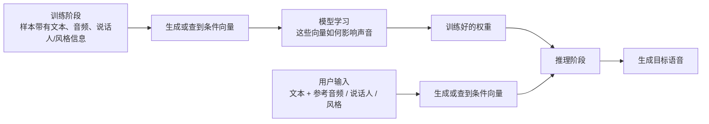

训练时，模型需要看到这些向量，才能学会“不同向量对应不同说话人、不同风格、不同说话方式”。推理时，模型也需要这些向量，才能知道这一次要按哪个说话人、哪种说话方式来生成。

所以不是“训练时有向量，推理时没有”，也不是“推理时临时瞎编一个向量”。更准确地说：

```text
训练时：模型学习如何使用向量。
推理时：系统提供或提取向量，让模型按指定条件生成。
```

### 向量从哪里来？

向量通常有几种来源，不同 TTS 系统会选择不同方案。

| 来源 | 训练时怎么来 | 推理时怎么来 | 常见场景 |
| --- | --- | --- | --- |
| embedding table（向量表） | 每个 speaker id / style id 查一行向量，这些向量跟模型一起训练 | 选择某个已知 speaker id / style id，查同一行向量 | 固定说话人、多说话人 TTS |
| speaker encoder（说话人编码器） | 从训练音频里提取 d-vector、x-vector、ECAPA embedding 等 | 从用户给的参考音频里提取说话人向量 | zero-shot voice cloning |
| reference encoder（参考编码器） | 从参考语音中提取风格、韵律或情绪向量 | 用户给一段参考语音，系统提取相似说话方式 | 风格迁移、情绪克隆 |
| label embedding（标签向量） | 开心、生气、旁白等标签查向量，并参与训练 | 用户选择情绪/风格标签，再查向量 | 可控情绪 TTS |
| 连续特征投影 | F0、energy、duration 等数值经过线性层变成向量 | 推理时预测或指定这些数值，再投影成向量 | FastSpeech 2 类 variance adaptor |
| codec / prompt token | 训练音频先被 tokenizer 编成音频 token | 参考音频被编码成 prompt token | codec-based TTS、OmniVoice 这类系统 |

第一种最容易理解。假设训练集里有 100 个说话人，模型可以维护一个 speaker embedding table：

```text
speaker_0 -> [0.12, -0.48, 0.91, ...]
speaker_1 -> [-0.33, 0.07, 0.55, ...]
speaker_2 -> [0.44, 0.18, -0.21, ...]
...
```

训练时，每条音频样本都带有 speaker id。模型根据 speaker id 查出对应向量，再用这个向量作为条件生成声学表示。训练会不断调整这些向量和模型权重，让同一个 speaker id 对应的音色越来越稳定。

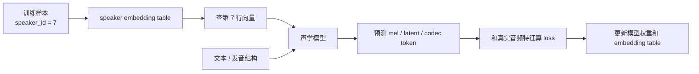

### 如果是没见过的新说话人怎么办？

如果模型只用固定的 speaker id embedding table，那么它通常只能稳定生成训练集中已有的说话人。想支持没见过的新说话人，就需要另一类方法：从参考音频里提取向量，或者直接把参考音频编码成 prompt token。

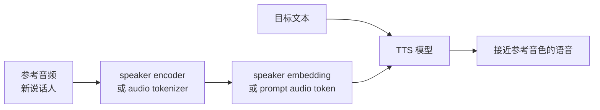

这就是 zero-shot voice cloning（零样本声音克隆）的基本直觉：模型不是靠“这个人已经在表里有一行”，而是靠参考音频临时提取条件。

当前 OmniVoice 更接近这种 prompt / codec token 思路。它不只是拿一个传统的 speaker embedding 向量，而是会把参考音频通过 audio tokenizer 编成音频 token，让主模型在生成时参考这些 token。直觉上，它仍然是在提供“谁在说、说话方式”的条件，只是条件形式不一定是一条单独的向量。

### 这些向量具体怎么用？

进入模型后，向量通常会被加到、拼到或投影到 hidden representation（隐藏表示）里。具体实现不同，但直觉相同：让模型在计算每个音素、每一帧或每个音频 token 时，都能看到这些条件。

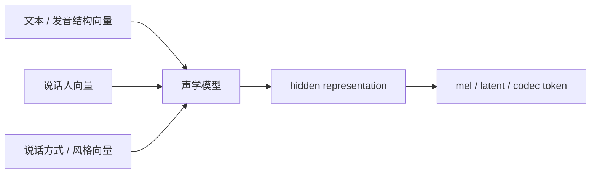

常见用法包括：

| 用法 | 直觉 |
| --- | --- |
| add（相加） | 把说话人或风格信息加到文本 hidden 上 |
| concat（拼接） | 把条件向量拼到每个时间步的输入里 |
| cross-attention（交叉注意力） | 让模型在生成时主动读取参考音频或风格表示 |
| adaptive normalization（自适应归一化） | 用风格/说话人向量调节网络层的缩放和平移 |
| prompt token（提示 token） | 把参考音频 token 放进同一序列，让模型模仿上下文 |

所以，“说话人用向量表示、风格用向量表示”不是一句空话。它通常意味着：

```text
训练数据里要有可学习或可提取的说话人/风格条件；
训练时模型学习这些条件如何影响声音；
推理时系统提供同类型条件；
模型根据条件生成对应的声学表示。
```

## 6.3 “谁在说”：speaker identity（说话人身份）和 timbre（音色）

### 6.3.1 概念和相关因素

speaker identity（说话人身份）和 timbre（音色）强相关，但不完全等价。

timbre（音色）可以先理解为：即使两个声音的 pitch（音高）和 loudness（响度）接近，我们仍然能分辨出是谁在说，或者是钢琴还是小提琴在发声。

语音里的音色和这些因素有关：

```text
声带特点
声道形状
共振峰 formant（共振峰）
谐波结构 harmonic（谐波）
发声习惯
麦克风和录音条件
```

### 6.3.2 常见表示

多说话人 TTS 常见表示：

| 表示 | 用法 |
| --- | --- |
| speaker ID embedding（说话人 ID 向量） | 训练集中每个说话人一个 ID |
| d-vector（声纹向量） | 从参考音频中提取说话人特征 |
| x-vector（声纹向量） | 说话人识别领域常用表示 |
| ECAPA embedding（说话人向量） | 更强的说话人表征之一 |
| prompt speech（提示语音） | zero-shot voice cloning 常用参考音频 |

### 6.3.3 注意事项

speaker embedding（说话人向量）主要承载“谁在说”的线索，但它不等于完整的声音人格，也不等于全部表演方式。

需要注意：音色不只存在 speaker embedding 里。F0 范围、发声习惯、韵律模式、录音环境里也可能泄漏说话人信息。所以在工程里，如果只替换 speaker embedding，而不处理 prosody（韵律）、emotion（情绪）、style（风格）和录音条件，生成结果仍然可能不像目标说话人。

## 6.4 “说了什么”：linguistic content（语言内容）

linguistic content（语言内容）对应“这句话的内容是什么”。在 TTS 中，它通常来自文本前端输出：

```text
character（字符）
pinyin（拼音）
phoneme（音素）
BPE（子词切分）
word（词）
```

### 6.4.1 一个例子：同一句话的不同表示

以这句话为例：

```text
我想喝茶。
```

它可以被拆成几种不同层次的表示：

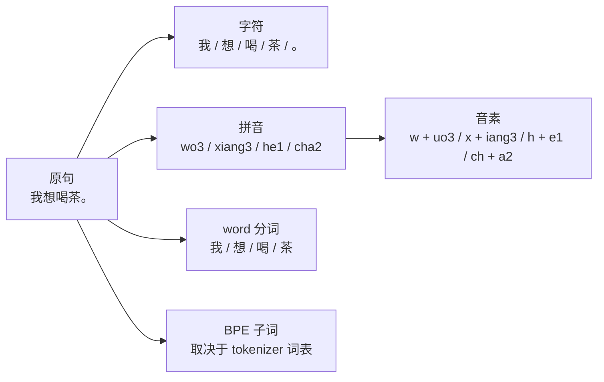

| 表示 | 例子 | 可以怎么理解 |
| --- | --- | --- |
| character（字符） | `我 / 想 / 喝 / 茶 / 。` | 直接按字拆。中文 TTS 经常会先看到这一层。 |
| pinyin（拼音） | `wo3 / xiang3 / he1 / cha2` | 把汉字转成读音，数字表示声调。 |
| phoneme（音素） | `w + uo3 / x + iang3 / h + e1 / ch + a2` | 更接近“发音零件”。这里用声母、韵母和声调示意，实际系统可能用 IPA、声韵母表或自定义音素表。 |
| word（词 / 分词） | `我 / 想 / 喝 / 茶` | 按词语切分，更接近人理解句子的方式。复杂句子里会更有用，例如 `甄嬛 / 想 / 喝茶`。 |
| BPE（子词切分） | 可能是 `我 / 想 / 喝 / 茶 / 。`，也可能合并成更长片段 | 按 tokenizer 的词表和规则切，不一定等于人类意义上的词。 |

BPE（子词切分）和 word（分词）不是同一个东西。word 更偏语言学和人类理解，BPE 更偏工程实现：它关心“这个模型词表里有哪些片段”，所以同一句话换一个 tokenizer，切分结果可能不同。

### 6.4.2 “相对容易监督”是什么意思？

这部分相对容易监督，因为训练数据里通常天然带着文本。也就是说，一条训练样本往往长这样：

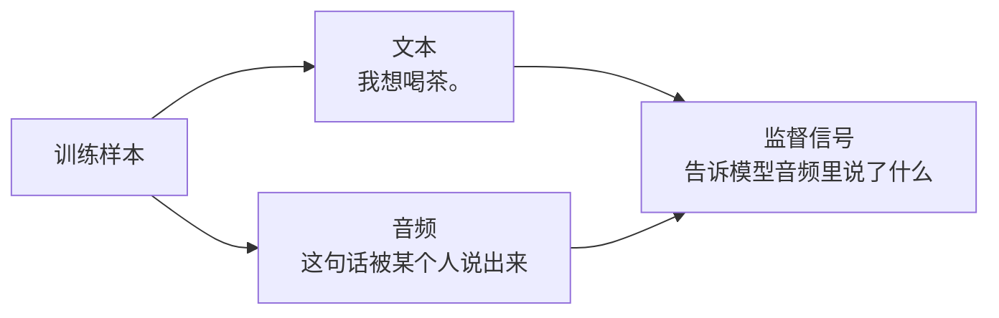

这里的“监督”可以先理解成“答案”。如果训练数据给了音频，也给了对应文本，那么模型至少知道：这段声音应该对应“我想喝茶。”这句话。

它只是“相对容易”，不是完全简单。因为文本只告诉模型整段音频说了什么，不一定直接告诉模型：

```text
每个字从第几秒开始
每个音素持续多久
哪里应该停顿
哪个字应该重读
声调和连读怎么自然衔接
```

所以 linguistic content（语言内容）比 emotion（情绪）、style（风格）更容易标注，但真正对齐到声音细节，仍然需要模型去学习。

### 6.4.3 为什么知道一句话，仍然可能说得不自然？

但“知道说了什么”不等于“能自然地说出来”。同一句话可以有很多合理说话方式，所以还需要时长、音高、能量、停顿和发音结构等信息。

还是用“我想喝茶。”举例。文字内容一样，但说法可以完全不同：

| 场景 | 可能的说法 | 变化在哪里 |
| --- | --- | --- |
| 平静陈述 | `我想喝茶。` | 语速平稳，停顿少。 |
| 撒娇或委屈 | `我……想喝茶。` | 停顿变长，能量变弱，尾音可能更软。 |
| 不耐烦 | `我想喝茶。` | 语速更快，重音可能落在“茶”。 |
| 开玩笑 | `我想喝茶呀。` | 语调更上扬，节奏更活。 |

如果模型只学到了文本内容，它可能能把字读对，但容易变成“硬读”：没有合适的停顿，没有重音，没有角色状态，也没有情绪变化。自然的 TTS 需要同时决定：

```text
说哪些字
每个字怎么发音
每个音持续多久
哪里停顿
音高怎么起伏
能量怎么变化
整体像谁在说、以什么方式说
```

这也是为什么后面要继续讲 prosody（韵律）、emotion（情绪）、style（风格）和 pronunciation（发音结构）：它们共同决定一句话是不是“像人在说”。

## 6.5 说话方式：prosody（韵律）、emotion（情绪）和 style（风格）

prosody（韵律）描述语音随时间变化的说话方式，通常包括：

```text
duration（时长）
pause（停顿）
rhythm（节奏）
pitch / F0（音高 / 基频）
energy（能量）
intonation（语调）
```

emotion（情绪）和 style（风格）经常通过这些韵律特征体现出来。

例如同一句话：

```text
我知道了。
```

可以说成：

```text
平静
开心
生气
委屈
冷漠
不耐烦
```

文本内容和发音结构可能几乎不变，但 F0（基频）曲线、energy（能量）、duration（时长）、pause（停顿）和 voice quality（嗓音质感）都会变化。

所以更稳妥的说法是：

> 情绪通常通过韵律、能量、音高、时长和声音质感共同体现；它不是只藏在某一个单独特征里。

## 6.6 pronunciation（发音结构）：phoneme、tone 和 stress

pronunciation（发音结构）负责描述文本对应哪些发音单位，以及这些单位有哪些语言层面的读音约束。它通常包括：

```text
phoneme（音素）
pinyin（拼音）
tone（声调）
stress（重音）
syllable（音节）
```

例如中文：

```text
文本：重庆
拼音：chong2 qing4
```

例如英文：

```text
text: record
不同词性下 stress（重音）可能不同
```

发音结构解决的是“读音正确性”问题。多音字、英文缩写、中英混读、口音差异，很多都和这一层有关。

tone（声调）和 stress（重音）也会影响韵律，但在 TTS 工程里，它们常常先作为文本前端或发音词典的一部分进入模型。比如中文三声和四声会改变词义，英文 `record` 的词重音会影响词性；这些更接近“这个词应该发成什么样”。

## 6.7 为什么解耦很难

disentanglement（解耦）指的是让不同信息尽量由不同表示控制。例如：

```text
文本控制“说什么”
speaker embedding 控制“谁在说”
style embedding 控制“说话方式”
duration / pitch / energy 控制韵律细节
```

难点在于真实数据并不是这样干净分布的。

几个常见纠缠：

| 纠缠 | 解释 |
| --- | --- |
| 音色和音高 | 不同说话人的常见 F0 范围不同 |
| 情绪和能量 | 愤怒、兴奋往往能量更强 |
| 口音和发音 | 口音会改变某些音素的实际发音 |
| 风格和时长 | 慢速、播音腔、聊天腔的 duration 分布不同 |
| 说话人和录音环境 | 某个说话人可能只在特定麦克风下录过音 |

如果训练数据中“某个说话人永远只用一种情绪说话”，模型就很难判断这个特征到底属于 speaker（说话人）还是 emotion（情绪）。

### 6.7.1 为什么“一个人只有一种情绪”会让模型混淆？

可以把模型想象成一个只看样本规律的学习器。它看到的不是人类概念里的“音色”和“情绪”，而是一堆文本、音频和标签之间的统计关系。

如果训练数据长这样：

| 说话人 | 文本 | 情绪 | 音频表现 |
| --- | --- | --- | --- |
| A | 你在干嘛 | 愤怒 | 声音高、能量强、语速快 |
| A | 我知道了 | 愤怒 | 声音高、能量强、语速快 |
| B | 你在干嘛 | 平静 | 声音低、能量弱、语速稳 |
| B | 我知道了 | 平静 | 声音低、能量弱、语速稳 |

模型就会发现：只要是 A，就总是“愤怒的声音”；只要是 B，就总是“平静的声音”。这时它很难知道：

```text
A 的声音高、能量强，是因为 A 的音色如此？
还是因为 A 的训练样本全是愤怒情绪？
```

这就是 speaker（说话人）和 emotion（情绪）的纠缠。对模型来说，这两个因素在数据里总是一起出现，就像被粘在了一起。

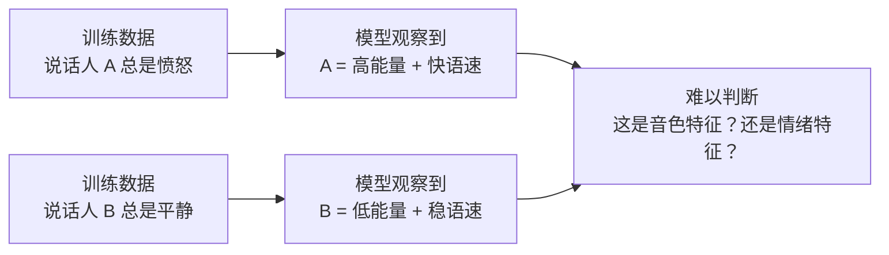

### 6.7.2 什么样的数据更容易让模型学会分开？

更准确地说，模型要学会某个因素，通常需要这个因素在训练数据里是一个“会变化的变量”，而不是一个永远不变的常量。

如果训练样本里只有一种情绪，比如全部都是“愤怒”，那么 emotion（情绪）对模型来说就不是一个可切换的变量，而更像数据集的默认说话状态。模型可能会学到“这个数据集里的声音普遍更用力、更急、更冲”，但它很难知道这些变化应该由 `[angry]` 这样的情绪标签控制。

因此，更理想的训练数据需要两类对照：

| 对照方式 | 例子 | 主要帮助模型学什么 |
| --- | --- | --- |
| 同一说话人，多种情绪 | A 愤怒 / A 开心 / A 平静 | 哪些变化来自 emotion（情绪） |
| 同一种情绪，多个说话人 | A 愤怒 / B 愤怒 / C 愤怒 | 哪些情绪表现可以跨 speaker（说话人）保持 |

第一类对照更关键。它让模型看到：说话人没有变，文本也可以尽量接近，但声音的能量、语速、重音、音高走向发生了变化，这些变化更可能来自 emotion（情绪）。

第二类对照也有价值，但它不能单独完成情绪学习。它的作用是防止模型把“愤怒”误认为某一个人的专属说话习惯。多个说话人都表达愤怒时，模型才更有机会学到跨说话人的情绪共性。

例如，训练数据可以尽量覆盖下面这种组合：

| 说话人 | 文本 | 情绪 | 音频 |
| --- | --- | --- | --- |
| A | 你在干嘛 | 愤怒 | A 愤怒地说这句话 |
| A | 你在干嘛 | 开心 | A 开心地说这句话 |
| A | 你在干嘛 | 平静 | A 平静地说这句话 |
| B | 你在干嘛 | 愤怒 | B 愤怒地说这句话 |
| B | 你在干嘛 | 开心 | B 开心地说这句话 |
| B | 你在干嘛 | 平静 | B 平静地说这句话 |

这样模型才有机会同时观察到两件事：

```text
同一个人可以有不同情绪。
不同的人也可以表达同一种情绪。
```

这会帮助模型把 speaker identity（说话人身份）和 emotion（情绪）拆开：

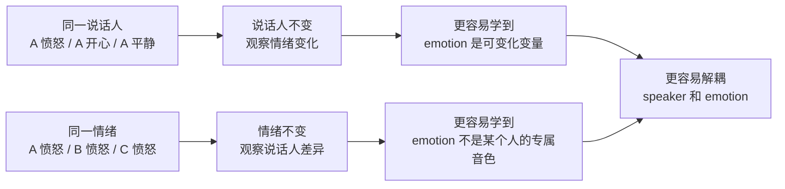

### 6.7.3 支持音频标签的模型可能怎么学？

支持 audio tag（音频标签）或 style tag（风格标签）的模型，通常也需要在训练中看到“标签”和“声音表现”之间的对应关系。

在 codec token 路线里，可以先把训练流程理解成这样：

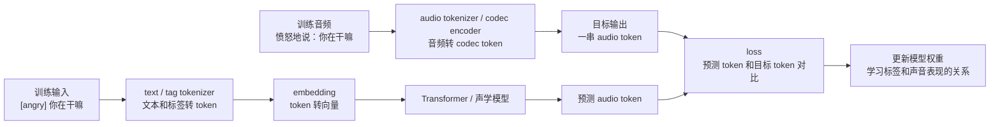

比如训练样本里可能包含：

```text
文本：[angry] 你在干嘛
音频：愤怒地说“你在干嘛”

文本：[happy] 你在干嘛
音频：开心地说“你在干嘛”

文本：[laugh] 我真的服了
音频：带笑地说“我真的服了”
```

这样训练多了以后，模型才可能学到：

```text
[angry] 往往对应更强 energy、更明显重音、更快或更硬的节奏。
[happy] 往往对应更明亮的语调、更上扬的 F0、更轻快的节奏。
[laugh] 往往对应笑声、气息变化或带笑的发声方式。
```

推理时，流程方向会变成：

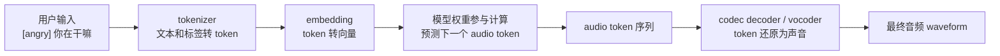

这里最重要的是：模型并不是先生成一个完整的“愤怒向量”，再把这个向量直接转成声音。更常见的做法是，模型根据输入文本、audio tag、说话人条件和上下文，一步一步预测 audio token。`[angry]` 这样的标签会影响模型内部状态，从而改变后续 audio token 的概率分布。

#### 注意事项

标签不是魔法开关。模型是否真的听标签，取决于训练数据里标签是否稳定、覆盖是否足够、标注是否一致，以及模型结构是否允许这些标签影响生成过程。如果训练数据里 `[angry]` 对应的音频并不稳定，或者某个说话人从来没有对应情绪的样本，那么推理时输入这个标签，效果也可能不明显，甚至变得奇怪。

不要把情绪理解成“某一个固定维度”。例如，不是第 10 维永远代表愤怒、第 23 维永远代表开心。真实模型里的 emotion（情绪）更像一种分布式模式，散落在 embedding、hidden state（隐藏状态）、attention（注意力）和多层网络参数里。某种情绪会让很多维度一起发生变化，而不是只拨动一个维度开关。

也不要把模型输出理解成“直接输出声音”。在 codec token 路线里，模型通常输出的是 audio token，后面还需要 codec decoder 或 vocoder 把 token 还原成 waveform（波形）。所以更准确的说法是：输入的文本和音频标签会转成 token / embedding；模型根据这些条件预测 audio token；最后由解码器把 audio token 变成声音。

### 6.7.4 声音克隆 TTS：不是替换内容，而是条件生成

voice cloning TTS（声音克隆文本转语音）很容易被误解成：先把参考音频编码成 token，再把里面代表“说什么”的 token 替换成目标文本，最后得到新的音频。

这个说法有一定直觉价值，但并不准确。更准确的理解是：

```text
参考音频提供“像谁说、可能怎么说”的条件。
目标文本提供“要说什么”的条件。
模型根据这些条件重新生成一段新的声学表示。
```

也就是说，声音克隆不是在原始音频 token 上做“内容替换”，而是把参考音频当成 prompt speech（提示语音）或 speaker condition（说话人条件），再让模型围绕目标文本生成新的 audio token、mel-spectrogram 或 latent。

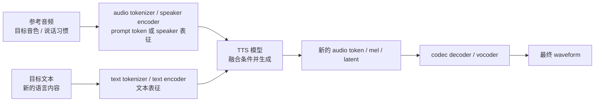

一些强调解耦的模型，会试图把输入条件拆得更清楚：

```text
text condition：说什么
speaker condition：谁在说
emotion / style condition：怎么说
```

这些条件进入模型后，并不是像剪纸一样从三个向量里各自摘下一块再拼成结果。更常见的是，它们通过 attention（注意力）、condition embedding（条件向量）、prompt token（提示 token）或其他融合结构共同影响生成过程。

因此，可以把这类模型理解为：

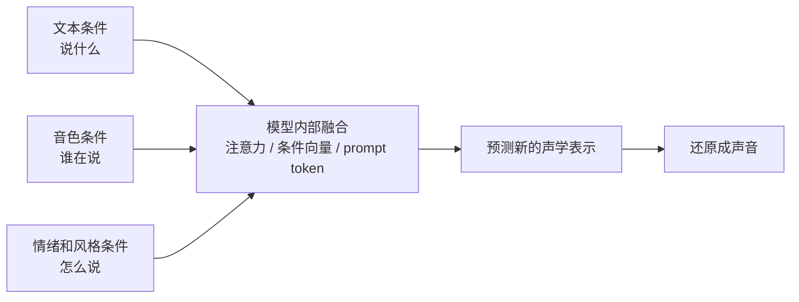

一句话总结：

> 声音克隆 TTS 不是“把原声音里的内容 token 换成新文本”，而是“用参考音频提供音色和说话方式线索，用目标文本提供内容线索，再由模型重新生成一段新声音”。

本章先建立“哪些信息需要被表示和解耦”的概念。模型如何在训练中学会这些关系，见第十二章；模型如何在推理时使用文本、参考音频和 audio tag 生成声音，见第十三章。

## 6.8 TTS 中的特征分工

下面这张表是工程建模视角，不是绝对物理真理。

| 信息 | 常见表示 | 主要控制什么 | 是否容易解耦 |
| --- | --- | --- | --- |
| 音色 | speaker embedding（说话人向量） / prompt speech（提示语音） | 谁在说 | 中等偏难 |
| 文本内容 | character（字符） / phoneme（音素） / pinyin（拼音） / BPE（子词切分） | 说什么 | 较容易 |
| 说话方式 | reference encoder（参考编码器） / style token（风格 token） | 整体说话方式 | 难 |
| 情绪 | emotion embedding（情绪向量） / style embedding（风格向量） | 情绪状态、语气倾向 | 难 |
| 时长 | duration（时长） | 每个音持续多久 | 中等 |
| 音高 | F0（基频） / pitch（音高） | 语调、音高、部分情绪 | 中等 |
| 能量 | energy（能量） | 音量、力度 | 中等 |
| 发音结构 | phoneme（音素） / tone（声调） / stress（重音） | 读音正确性 | 较容易 |
| 声学结果 | mel（梅尔频谱） / latent（潜变量） / codec token（语音编码 token） | 混合声学信息 | 不解耦 |
| 波形 | waveform（波形） | 最终音频 | 完全混合 |

最重要的一句话：

> TTS 里的 mel-spectrogram（梅尔频谱）、codec latent（编码潜变量）、waveform（波形）都是混合表示；真正“分开”的信息，通常来自模型设计和训练监督，而不是天然存在。

## 6.9 本章小结

本章最重要的直觉：

```text
语音是一种混合信号。
音色、内容、说话方式、发音结构、韵律和情绪会互相影响。
说话方式解决“这句话以什么状态呈现”，发音结构解决“读音是否正确”。
模型里的“分解”是为了可控性、泛化和可解释性。
mel / latent / codec token / waveform 本身都不是干净解耦的表示。
```

接下来第七章进入当前主流 TTS 模型方案，第八章讲 acoustic model（声学模型），第九章讲 vocoder（声码器），第十章再专门展开 diffusion（扩散模型）和 flow matching（流匹配）如何在 mel、waveform、latent 或 codec token 空间中做生成。
