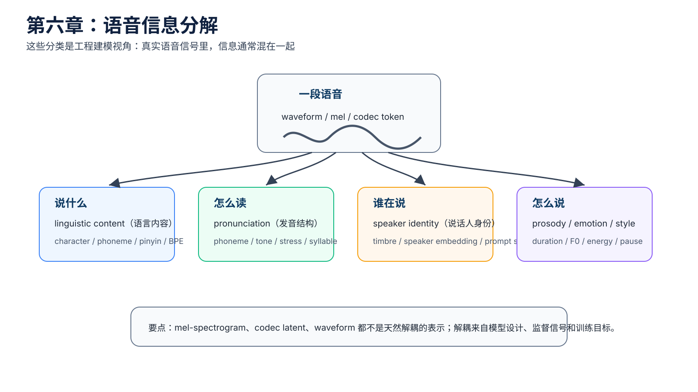
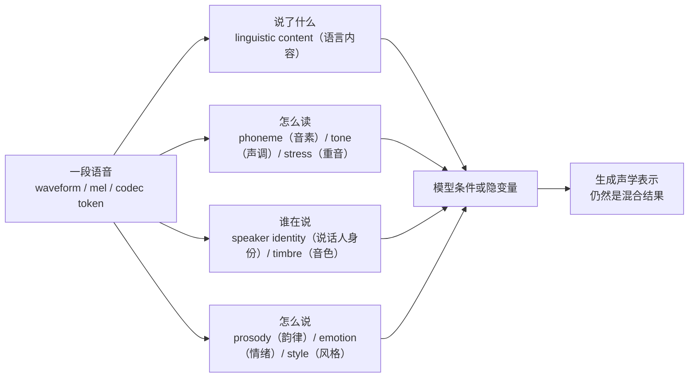

# 第六章：语音信息分解 —— 表征、音色、韵律与情绪

本章承接前面的声学基础，解释 TTS（Text-to-Speech，文本转语音）系统如何看待一段语音里的不同信息：说了什么、怎么读、谁在说、怎么说、情绪如何。

先说一个关键前提：这些分类不是语音信号里天然贴好的标签，而是语音学、信号处理和神经网络建模里常用的工程抽象。真实的 mel-spectrogram（梅尔频谱）、codec token（语音编码 token）和 waveform（波形）里，这些信息通常是混在一起的。



## 本章导图



这张图表达的是“建模视角”，不是严格的物理分层。现实中，音色会影响 F0（基频）的范围，情绪会影响音色质感，韵律也会影响听起来像不像某个说话人。

## 6.1 为什么要做信息分解

如果只把语音看成一串 waveform（波形），它里面什么都有：

```text
文本内容
发音方式
说话人音色
语速
停顿
音高
情绪
录音环境
麦克风特性
背景噪声
```

TTS 模型如果不做任何结构设计，就要从一个混合信号里同时学会所有东西。这会带来几个工程问题：

| 问题 | 表现 |
| --- | --- |
| 可控性差 | 想只改情绪，却连音色也变了 |
| 泛化差 | 换说话人、换文本后效果不稳定 |
| 数据需求大 | 模型需要大量样本才能自己学到规律 |
| 排错困难 | 不知道错误来自发音、韵律、音色还是 vocoder |

所以 TTS 系统常会显式设计不同条件或隐变量，让模型尽量把不同信息分开处理。

## 6.2 representation（表征）和 embedding（向量表示）

representation（表征）是模型内部用来表示某类信息的数字形式。embedding（向量表示）通常是一串实数向量，例如：

```text
[0.12, -0.48, 0.91, ...]
```

人类不直接读懂这串数字，但模型可以用它表示某类特征。

常见例子：

| 表征 | 极简解释 |
| --- | --- |
| phoneme embedding（音素向量） | 表示一个音素或拼音单元 |
| speaker embedding（说话人向量） | 表示某个说话人的声音特征 |
| style embedding（风格向量） | 表示说话方式、情绪或语气 |
| prosody embedding（韵律向量） | 表示音高、节奏、停顿等动态模式 |
| codec latent（编码潜变量） | codec 编码器压缩出来的声学表示 |

对工程同学来说，可以把 embedding（向量表示）看成模型使用的结构化字段，只不过字段值不是字符串或枚举，而是高维浮点数组。

## 6.3 “说什么”：linguistic content（语言内容）

linguistic content（语言内容）对应“这句话的内容是什么”。在 TTS 中，它通常来自文本前端输出：

```text
character（字符）
pinyin（拼音）
phoneme（音素）
BPE（子词切分）
word（词）
```

这部分相对容易监督，因为训练数据里有文本。模型至少知道每段音频对应哪句话。

但“知道说什么”不等于“能自然地说出来”。同一句话可以有很多合理读法，所以还需要发音、时长、音高、能量、停顿等信息。

## 6.4 “怎么读”：phoneme（音素）、tone（声调）和 stress（重音）

pronunciation（发音结构）负责描述文本应该怎么读。它通常包括：

```text
phoneme（音素）
pinyin（拼音）
tone（声调）
stress（重音）
syllable（音节）
```

例如中文：

```text
文本：重庆
拼音：chong2 qing4
```

例如英文：

```text
text: record
不同词性下 stress（重音）可能不同
```

发音结构解决的是“读音正确性”问题。多音字、英文缩写、中英混读、口音差异，很多都和这一层有关。

## 6.5 “谁在说”：speaker identity（说话人身份）和 timbre（音色）

speaker identity（说话人身份）和 timbre（音色）强相关，但不完全等价。

timbre（音色）可以先理解为：即使两个声音的 pitch（音高）和 loudness（响度）接近，我们仍然能分辨出是谁在说，或者是钢琴还是小提琴在发声。

语音里的音色和这些因素有关：

```text
声带特点
声道形状
共振峰 formant（共振峰）
谐波结构 harmonic（谐波）
发声习惯
麦克风和录音条件
```

多说话人 TTS 常见表示：

| 表示 | 用法 |
| --- | --- |
| speaker ID embedding（说话人 ID 向量） | 训练集中每个说话人一个 ID |
| d-vector（声纹向量） | 从参考音频中提取说话人特征 |
| x-vector（声纹向量） | 说话人识别领域常用表示 |
| ECAPA embedding（说话人向量） | 更强的说话人表征之一 |
| prompt speech（提示语音） | zero-shot voice cloning 常用参考音频 |

需要注意：音色不只存在 speaker embedding（说话人向量）里。F0 范围、发声习惯、韵律模式、录音环境里也可能泄漏说话人信息。

## 6.6 “怎么说”：prosody（韵律）、emotion（情绪）和 style（风格）

prosody（韵律）描述语音随时间变化的说话方式，通常包括：

```text
duration（时长）
pause（停顿）
rhythm（节奏）
pitch / F0（音高 / 基频）
energy（能量）
intonation（语调）
```

emotion（情绪）和 style（风格）经常通过这些韵律特征体现出来。

例如同一句话：

```text
我知道了。
```

可以读成：

```text
平静
开心
生气
委屈
冷漠
不耐烦
```

文本内容和发音结构可能几乎不变，但 F0（基频）曲线、energy（能量）、duration（时长）、pause（停顿）和 voice quality（嗓音质感）都会变化。

所以更稳妥的说法是：

> 情绪通常通过韵律、能量、音高、时长和声音质感共同体现；它不是只藏在某一个单独特征里。

## 6.7 为什么解耦很难

disentanglement（解耦）指的是让不同信息尽量由不同表示控制。例如：

```text
文本控制“说什么”
speaker embedding 控制“谁在说”
style embedding 控制“怎么说”
duration / pitch / energy 控制韵律细节
```

难点在于真实数据并不是这样干净分布的。

几个常见纠缠：

| 纠缠 | 解释 |
| --- | --- |
| 音色和音高 | 不同说话人的常见 F0 范围不同 |
| 情绪和能量 | 愤怒、兴奋往往能量更强 |
| 口音和发音 | 口音会改变某些音素的实际发音 |
| 风格和时长 | 慢速、播音腔、聊天腔的 duration 分布不同 |
| 说话人和录音环境 | 某个说话人可能只在特定麦克风下录过音 |

如果训练数据中“某个说话人永远只用一种情绪说话”，模型就很难判断这个特征到底属于 speaker（说话人）还是 emotion（情绪）。

## 6.8 TTS 中的特征分工

下面这张表是工程建模视角，不是绝对物理真理。

| 信息 | 常见表示 | 主要控制什么 | 是否容易解耦 |
| --- | --- | --- | --- |
| 文本内容 | character（字符） / phoneme（音素） / pinyin（拼音） / BPE（子词切分） | 说什么 | 较容易 |
| 发音 | phoneme（音素） / tone（声调） / stress（重音） | 怎么读 | 较容易 |
| 时长 | duration（时长） | 每个音持续多久 | 中等 |
| 音高 | F0（基频） / pitch（音高） | 语调、音高、部分情绪 | 中等 |
| 能量 | energy（能量） | 音量、力度 | 中等 |
| 音色 | speaker embedding（说话人向量） / prompt speech（提示语音） | 谁在说 | 中等偏难 |
| 情绪 | emotion embedding（情绪向量） / style embedding（风格向量） | 语气、表达方式 | 难 |
| 风格 | reference encoder（参考编码器） / style token（风格 token） | 整体说话方式 | 难 |
| 声学结果 | mel（梅尔频谱） / latent（潜变量） / codec token（语音编码 token） | 混合声学信息 | 不解耦 |
| 波形 | waveform（波形） | 最终音频 | 完全混合 |

最重要的一句话：

> TTS 里的 mel-spectrogram（梅尔频谱）、codec latent（编码潜变量）、waveform（波形）都是混合表示；真正“分开”的信息，通常来自模型设计和训练监督，而不是天然存在。

## 6.9 本章小结

本章最重要的直觉：

```text
语音是一种混合信号。
内容、发音、音色、韵律、情绪和风格会互相影响。
模型里的“分解”是为了可控性、泛化和可解释性。
mel / latent / codec token / waveform 本身都不是干净解耦的表示。
```

接下来第七章进入 TTS 模型演化，第八章讲 acoustic model（声学模型），第九章讲 vocoder（声码器），第十章再专门展开 diffusion（扩散模型）和 flow matching（流匹配）如何在 mel、waveform、latent 或 codec token 空间中做生成。
