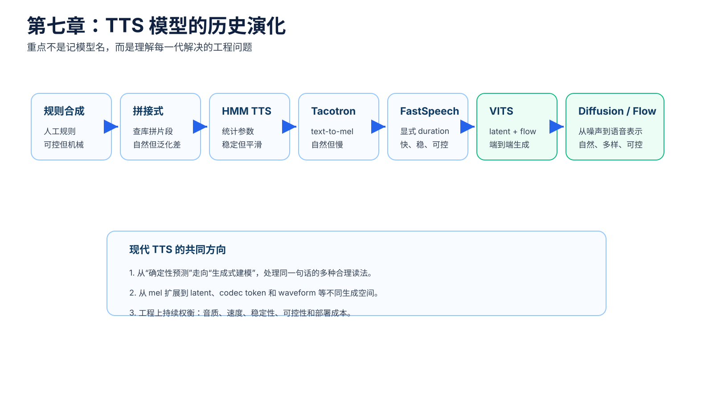
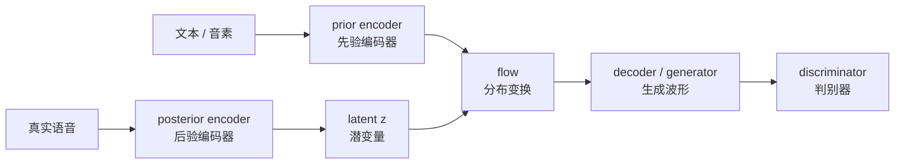
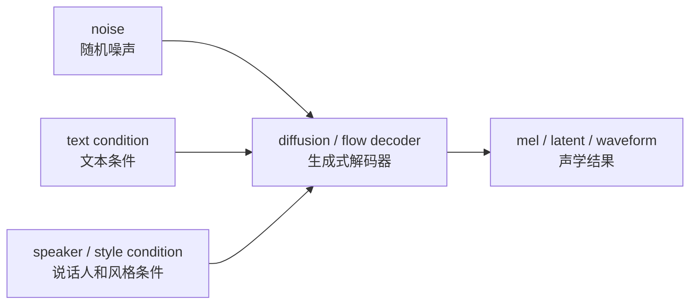

# 第七章：TTS 模型的历史演化 —— 从规则系统到生成式模型

本章用于建立模型路线图：今天的 diffusion TTS（扩散式文本转语音）、flow matching TTS（流匹配文本转语音）和 codec-based TTS（基于语音编码 token 的文本转语音）不是凭空出现的，而是从规则系统、拼接系统、统计参数系统和神经 TTS 一路演化而来。

对工程同学来说，本章不要求你记住每篇论文的所有结构细节，而是先看清楚每一代方案在解决什么工程问题：音质、速度、稳定性、可控性、数据需求和部署成本。



## 本章导图


这条线不是严格替代关系。现实工程里，不同路线会长期共存：有的系统仍然用 FastSpeech 类声学模型加 HiFi-GAN 类 vocoder（声码器），有的系统会用 diffusion（扩散模型）生成 mel-spectrogram（梅尔频谱），也有系统直接走 codec token（语音编码 token）或 prompt-based TTS（基于提示语音的文本转语音）。

## 7.1 先看完整演化顺序

可以先按下面这条顺序建立大图：

```text
规则合成
 -> 拼接式合成
 -> HMM 统计参数合成
 -> Tacotron / Tacotron 2
 -> FastSpeech / FastSpeech 2
 -> VITS
 -> diffusion TTS
 -> codec / flow matching / speech language model
```

每一代模型的核心变化，通常不是“模型名字更先进”，而是生成语音的方式变了：

| 阶段 | 生成方式 | 主要优势 | 主要问题 |
| --- | --- | --- | --- |
| 规则合成 | 人工规则生成参数 | 可解释、可控 | 声音机械，规则维护困难 |
| 拼接式合成 | 从录音库里找片段拼接 | 在覆盖范围内很自然 | 数据库依赖强，泛化差 |
| HMM TTS | 统计模型预测声学参数 | 稳定、可控、体积小 | 音质偏平滑，不够自然 |
| Tacotron 类 | 神经网络从文本生成 mel | 自然度大幅提升 | 自回归慢，attention 容易错 |
| FastSpeech 类 | 显式 duration，并行生成 mel | 快、更稳定、更可控 | 依赖对齐和时长预测 |
| VITS 类 | latent（潜变量）+ flow（流模型）+ GAN（生成对抗网络） | 端到端、音质强 | 训练复杂，调试难 |
| Diffusion / Flow 类 | 从噪声到语音表示的生成建模 | 多样性和自然度强 | 推理步数、速度、控制复杂 |
| Codec / Speech LM 类 | 把语音变成 token 序列建模 | 适合大模型范式 | 依赖 codec 质量和 token 设计 |

## 7.2 规则合成：人工把“怎么发音”写出来

早期 speech synthesis（语音合成）主要依赖人工规则。系统会根据语言学知识、发音规则和声学规则生成声音。

可以粗略理解为：

```text
文本 -> 语言规则 -> 发音规则 -> 声学参数 -> 波形
```

这种路线的优点是可解释：哪里停顿、哪个音怎么读，很多地方都能追到规则。但缺点也很明显：真实人声变化太复杂，靠人工规则很难覆盖自然语音的细节。

从工程角度看，它像一个超大规则引擎：开始可控，后期维护成本越来越高，声音效果也容易“硬”。

## 7.3 拼接式合成：从录音库里找片段拼起来

拼接式合成的思路是：既然人工生成声音不够自然，那就录大量真人语音，把合适的片段拼起来。

典型流程可以理解为：


它的优势是在命中录音库覆盖范围时，声音可以很自然，因为真实片段本来就是人录的。

它的问题也来自录音库：

| 问题 | 解释 |
| --- | --- |
| 覆盖依赖强 | 没录过的组合很难自然生成 |
| 数据体积大 | 需要大量高质量录音片段 |
| 风格不灵活 | 想换情绪、语速、说话人很困难 |
| 拼接痕迹 | 片段边界处理不好会有不连续感 |

这条路线帮助我们理解一个关键事实：自然语音不是只有“读音正确”，还需要片段之间的韵律连续。

## 7.4 HMM TTS：把语音变成统计参数预测

HMM TTS（Hidden Markov Model TTS，隐马尔可夫模型文本转语音）把语音合成从“查片段”推进到“预测声学参数”。

可以先这样理解：

```text
文本特征 -> 统计模型 -> F0 / 谱参数 / 时长 -> vocoder -> waveform
```

HMM TTS 的优点是稳定、体积小、可控，也比较适合当时的计算资源。它通常会显式建模 duration（时长）、F0（基频）等参数。

但它的声音常被认为偏平滑、偏机械。原因之一是统计模型容易预测“平均化”的声学参数，而真实人声有很多细节和变化。

这对后面的神经 TTS 很重要：TTS 不只是预测一个平均答案，而是要生成自然、多样、细节丰富的语音。

## 7.5 Tacotron 类：神经网络直接做 text-to-mel

Tacotron / Tacotron 2 是神经 TTS 的重要转折点。它把很多手工特征工程收进神经网络，用 sequence-to-sequence（序列到序列）模型从文本生成 mel-spectrogram（梅尔频谱）。

典型结构：


关键术语：

| 术语 | 极简解释 |
| --- | --- |
| encoder（编码器） | 把输入文本变成隐藏表示 |
| attention（注意力） | 决定当前生成帧关注哪个文本位置 |
| decoder（解码器） | 根据隐藏表示生成 mel |
| autoregressive（自回归） | 当前输出依赖之前输出，逐步生成 |
| teacher forcing（教师强制） | 训练时喂真实上一帧，帮助模型学习 |

Tacotron 类模型让语音自然度大幅提升，但也带来工程问题：

| 问题 | 直觉解释 |
| --- | --- |
| 推理慢 | 自回归逐帧生成，难以完全并行 |
| attention 崩溃 | 对齐错了会漏读、重复、跳字 |
| 长文本不稳 | 文本越长，对齐越容易出问题 |
| 可控性有限 | duration、pitch、energy 不一定显式可控 |

## 7.6 FastSpeech 类：把对齐和时长显式拿出来

FastSpeech 类模型的核心目标是解决 Tacotron 类模型的慢和不稳定。

它把“文本位置对应多少语音帧”这个问题显式建模：


FastSpeech 2 进一步引入 variance adaptor（变化信息适配器），常见显式特征包括：

```text
duration（时长）
pitch / F0（音高 / 基频）
energy（能量）
```

这对工程很重要，因为它让模型有了更清晰的控制入口：

| 控制项 | 影响 |
| --- | --- |
| duration（时长） | 语速、节奏、是否拖长 |
| pitch（音高） | 语调、疑问感、情绪起伏 |
| energy（能量） | 重音、力度、表达强弱 |

代价是：系统更依赖 alignment（对齐）和特征提取。数据预处理错了，duration / pitch / energy 的监督也会错。

## 7.7 VITS 类：端到端、潜变量、flow 和 GAN

VITS 是经典神经 TTS 到生成式 TTS 之间的重要过渡。它把多种生成建模思想放进一个系统里：

```text
VAE（变分自编码器）
normalizing flow（标准化流）
GAN（生成对抗网络）
stochastic duration predictor（随机时长预测器）
end-to-end training（端到端训练）
```

可以先用这张简化图理解：



本阶段最重要的观念变化是：TTS 不再只是“给定文本预测一个确定 mel”，而是开始显式处理 one-to-many problem（一对多问题）。

同一句话可以有很多合理读法，VITS 类模型通过 latent variable（潜变量）和 stochastic duration（随机时长）来表达这种不确定性。

## 7.8 Diffusion / Flow：把声学生成看成从噪声到语音表示

Diffusion TTS（扩散式文本转语音）的直觉是：

```text
训练时：干净语音表示 -> 加噪
推理时：随机噪声 -> 多步去噪 -> 干净语音表示
```

对应到 TTS：



扩散模型可以放在不同位置：

| 放置位置 | 例子 | 直觉 |
| --- | --- | --- |
| mel diffusion（梅尔扩散） | 文本条件下生成 mel | 替换声学 decoder |
| waveform diffusion（波形扩散） | 条件下直接生成波形 | 更接近 diffusion vocoder |
| latent diffusion（潜空间扩散） | 在压缩表示中生成 | 降低计算量 |
| codec token / latent generation（语音编码表示生成） | 生成 codec 表示 | 适合新一代语音模型 |

Flow matching（流匹配）可以先粗略理解为 diffusion（扩散模型）的近邻路线：它也学习从简单分布到真实数据的生成路径，但训练目标和采样方式不同。后面第十章会展开。

## 7.9 Codec / Speech LM：把语音变成 token 来建模

近年来，很多语音生成系统开始把音频通过 neural codec（神经音频编解码器）压缩成 discrete token（离散 token）或 continuous latent（连续潜变量）。

简化流程：

```text
waveform -> codec encoder -> semantic / acoustic token -> 生成模型 -> codec decoder -> waveform
```

这条路线和大语言模型更接近：模型不一定直接预测 mel，而是预测语音 token 序列。它更适合 zero-shot voice cloning（零样本声音克隆）、speech continuation（语音续写）、speech editing（语音编辑）等任务。

但它也带来新依赖：codec 本身的重建质量、token 层级设计、语义 token 和声学 token 的分工都会影响最终效果。

## 7.10 本章小结

本章最重要的直觉：

```text
规则合成强调人工可控。
拼接式合成强调真实片段。
HMM TTS 强调统计参数和稳定控制。
Tacotron 类把 text-to-mel 交给神经网络。
FastSpeech 类把 duration / pitch / energy 显式拿出来。
VITS 类引入 latent、flow、GAN 和端到端训练。
Diffusion / Flow 类把语音生成看成从噪声到数据的生成过程。
Codec / Speech LM 类把语音压缩成更适合大模型处理的 token。
```

后面第八章会把注意力放到 acoustic model（声学模型）本身：它如何把文本、音素、说话人、风格等条件变成 mel、latent 或 codec token。
