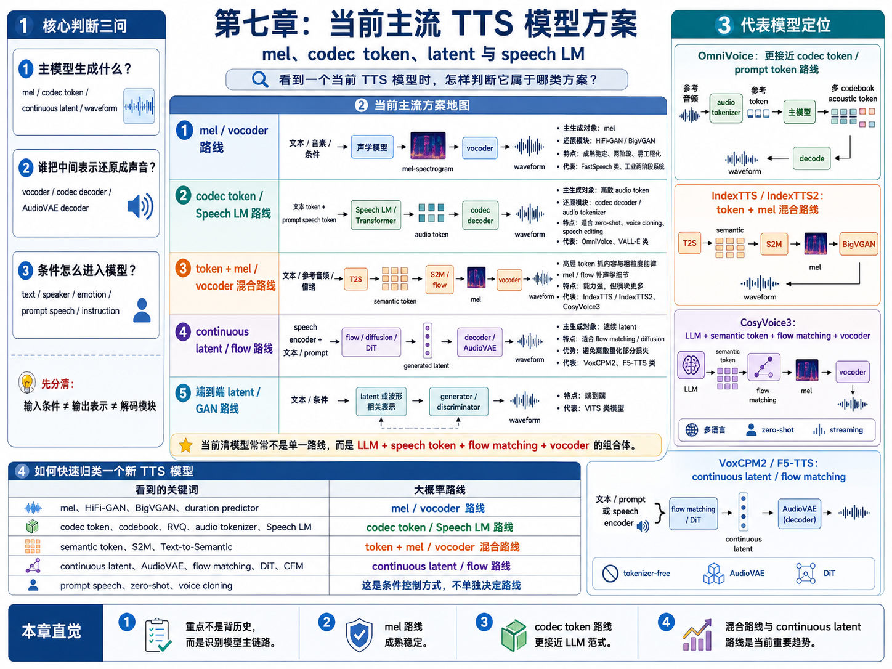
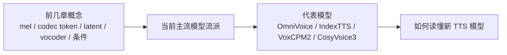
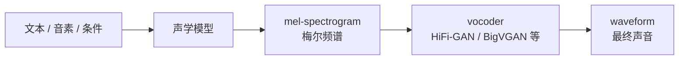
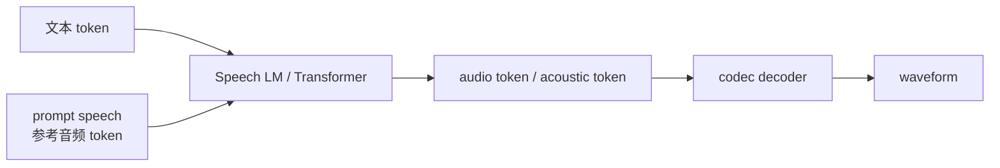
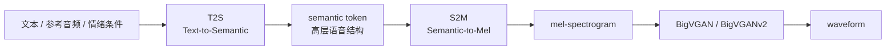
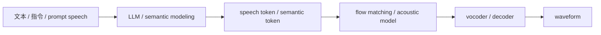
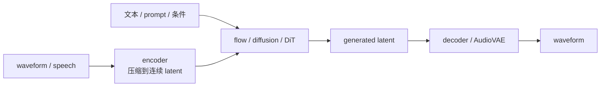
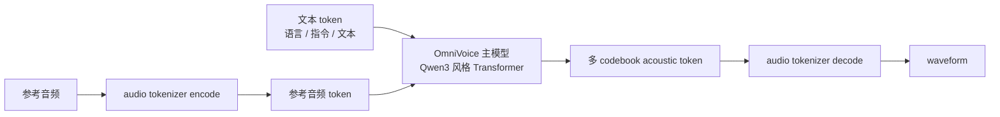
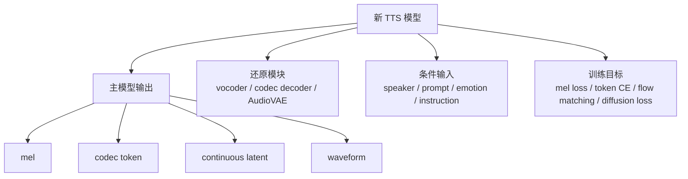

# 第七章：当前主流 TTS 模型方案 —— mel、codec token、latent 与 speech LM

前几章已经把 TTS（Text-to-Speech，文本转语音）的关键零件拆开讲过：文本前端、音素、mel-spectrogram（梅尔频谱）、codec token（语音编码 token）、speaker / emotion 条件、vocoder（声码器）、diffusion（扩散模型）和 flow matching（流匹配）。

当前主流 TTS 模型可以组织成一张方案地图。分类重点包括四个层面：

```text
模型生成什么中间表示
中间表示如何还原成 waveform
文本、说话人、情绪和参考音频如何作为条件进入模型
代表模型在工程链路中如何组合这些模块
```

当前强模型通常不是单一路线，而是把 LLM、speech token、flow matching、vocoder、prompt speech 和后训练组合在一起。OmniVoice、IndexTTS / IndexTTS2、VoxCPM2、CosyVoice3 可以作为理解当前主流方案的代表模型。



## 方案导图



## 7.1 当前主流方案的分类维度

当前主流 TTS 模型可以从三个工程维度理解：

```text
第一，主生成对象：mel、codec token、continuous latent 或 waveform。
第二，还原模块：vocoder、codec decoder、AudioVAE decoder 或端到端 generator。
第三，条件输入：文本、音素、说话人、情绪、参考音频、指令或 audio tag。
```

早期技术与当前方案存在如下工程关联：

| 技术背景 | 对当前方案的启发 |
| --- | --- |
| 规则合成 | 可控性来自显式规则，但自然度和维护成本限制明显 |
| 拼接式合成 | 真实录音片段能带来自然度，但覆盖和泛化能力有限 |
| HMM TTS | duration、F0、声学参数可以被显式建模 |
| Tacotron / FastSpeech | text-to-mel、attention、duration 和并行生成成为现代系统的重要基础 |

现代方案的核心差异，主要体现在“生成空间”和“还原声音的模块”上。

## 7.2 用前几章概念看当前主流方案

工程归类时，优先观察三个要素：

```text
主模型生成什么：mel、codec token、continuous latent，还是 waveform。
声音如何还原：vocoder、codec decoder，还是 AudioVAE decoder。
条件如何进入：文本、说话人、情绪、参考音频、指令或 audio tag。
```

这三个要素决定模型的主链路。

| 主流方案 | 主生成对象 | 还原声音的模块 | 代表模型或系统 |
| --- | --- | --- | --- |
| mel / vocoder 路线 | mel-spectrogram | HiFi-GAN、BigVGAN 等 vocoder | FastSpeech 类、很多工业两阶段系统 |
| codec token / Speech LM 路线 | 离散 audio token / acoustic token | codec decoder / audio tokenizer | OmniVoice、VALL-E 类模型 |
| token + mel / vocoder 混合路线 | semantic token + mel | S2M + BigVGAN / flow + vocoder | IndexTTS / IndexTTS2、CosyVoice 系列 |
| continuous latent / flow 路线 | 连续语音潜变量 | AudioVAE / decoder | VoxCPM2、F5-TTS 类 flow matching 系统 |
| 端到端 latent / GAN 路线 | latent 或波形相关表示 | generator / discriminator | VITS 类模型 |

这些方案不是互斥分类。当前很多模型会组合两三种思路：例如用 LLM 生成语义 token，再用 flow matching 生成声学细节，最后用 vocoder 输出波形。

## 7.3 mel / vocoder 路线：成熟稳定的两阶段 TTS

mel / vocoder 是成熟稳定的两阶段工程路线：



这条路线和第五章讲的 mel-spectrogram 直接相关。mel 是连续浮点矩阵，比 waveform 短、比原始波形更适合建模，但仍然包含内容、音色、韵律、情绪等混合信息。

它的优势：

```text
生态成熟
调试路径清晰
vocoder 工具丰富
适合做稳定工程系统
```

它的局限：

```text
mel 不是 token，不天然适合 LLM 范式
mel 丢掉相位和部分高频细节
音色、情绪、韵律仍然混在一张声学图里
```

FastSpeech 类模型可以看作这条路线的典型代表：文本或音素先经过 encoder，再通过 duration、pitch、energy 等条件生成 mel，最后用 vocoder 还原波形。

## 7.4 codec token / Speech LM 路线：把语音变成 token

codec token 路线的核心是第五章讲过的这条链路：

```text
waveform -> neural codec encoder -> codec token -> neural codec decoder -> waveform
```

一旦语音被压缩成离散 token，就可以更自然地接近语言模型范式：



这类模型适合做：

```text
zero-shot voice cloning（零样本声音克隆）
prompt-based TTS（基于提示语音的文本转语音）
speech continuation（语音续写）
speech editing（语音编辑）
```

OmniVoice 更接近这条路线。主模型不直接输出 mel 或 waveform，而是在 token 空间里生成多 codebook acoustic token，再由 audio tokenizer / codec decoder 还原成声音。

这条路线的核心依赖是 codec 质量。如果 codec token 本身重建不好，后面的生成模型再强，也会受到上限影响。

## 7.5 token + mel / vocoder 混合路线：IndexTTS / CosyVoice3

很多当前强模型采用分层处理：

```text
高层 token 负责内容、语义、粗粒度韵律
mel / latent / flow 负责声学细节
vocoder / decoder 负责最终波形
```

IndexTTS / IndexTTS2 是这类混合路线的代表之一：



这种设计先用 token 表示内容、语义和粗粒度韵律，再用 mel 和 vocoder 补充声学细节。IndexTTS2 强调 duration control（时长控制）和 speaker identity / emotion disentanglement（说话人身份与情绪解耦），对应第六章讲过的“谁在说”和“说话方式”的特征分离问题。

CosyVoice3 也属于混合路线。它是 LLM-based TTS 系统，强调 zero-shot multilingual speech synthesis（零样本多语言语音合成）、speech tokenizer、post-training 和 streaming。CosyVoice 系列里，LLM、supervised semantic tokens、flow matching、vocoder / decoder 共同参与生成，体现出“语言模型 + 语音 tokenizer + 声学生成器”的组合式趋势。



这类混合路线的优点是能力强、可扩展，适合 zero-shot、情绪、跨语言和流式场景；代价是模块多，训练、调试、归因都会更复杂。

## 7.6 continuous latent / flow 路线：VoxCPM2、F5-TTS 类

continuous latent / flow 路线在连续潜变量空间中建模语音，不依赖离散 codec token 作为主生成对象。

这条路线和第五章的 continuous latent、以及第十章的 flow matching 直接相关：



VoxCPM2 是这一路线的代表之一。它强调 tokenizer-free（不依赖离散 audio tokenizer）和 continuous speech representations（连续语音表示），并通过 AudioVAE V2 这类模块输出高采样率音频。它的主链路更偏连续 latent 生成，而不是“离散 codec token -> codec decoder”。

F5-TTS 则是 flow matching 路线的典型参考。它使用 flow matching 和 DiT（Diffusion Transformer）做非自回归 TTS，强调 zero-shot、自然度、速度和简化对齐设计。

这条路线的优势：

```text
避免离散量化带来的部分信息损失
适合 flow matching / diffusion 这类连续生成模型
可以在压缩空间里降低建模难度
```

它的挑战：

```text
不能直接像文本 token 一样接入普通 LLM
依赖 encoder / decoder 的压缩和重建质量
采样策略、速度和稳定性需要专门设计
```

## 7.7 OmniVoice 的方案定位

OmniVoice 在方案地图中更接近 codec token / prompt token 路线：



方案定位可以概括为：

```text
codec token / prompt token 路线
```

OmniVoice 属于 codec token 路线，并不表示系统只包含 codec。文本前端、音素或语言 token、参考音频、speaker / style 条件、采样参数、decoder 质量等模块仍然共同决定最终效果。

和前面章节的对应关系：

| 前面概念 | 在 OmniVoice 里的位置 |
| --- | --- |
| codec token | 主模型生成的声学 token |
| prompt speech | 参考音频被编码成 token，作为条件 |
| speaker / timbre | 从参考音频里提供“谁在说”的线索 |
| style / emotion | 可能通过文本标签、提示语音或训练分布影响生成 |
| decoder / vocoder | audio tokenizer decode 负责把 token 还原成声音 |

## 7.8 新 TTS 模型的阅读方法

阅读一个新的 TTS 模型时，可以按下面的分析顺序拆解：



常见关键词和路线之间的对应关系如下：

| 关键词 | 路线判断 |
| --- | --- |
| mel、HiFi-GAN、BigVGAN、duration predictor | mel / vocoder 路线 |
| codec token、codebook、RVQ、audio tokenizer、Speech LM | codec token / Speech LM 路线 |
| semantic token、S2M、Text-to-Semantic | token + mel / vocoder 混合路线 |
| continuous latent、AudioVAE、flow matching、DiT、CFM | continuous latent / flow 路线 |
| prompt speech、zero-shot、voice cloning | 条件控制方式，不单独决定路线 |
| speaker embedding、emotion embedding、style prompt | 输入条件，不等于输出表示 |

阅读模型方案时，需要区分“输入条件”和“输出表示”：

```text
speaker / emotion / prompt speech 是条件。
mel / codec token / latent / waveform 是生成对象或中间表示。
vocoder / decoder 是还原声音的模块。
```

## 7.9 小结

不同方案更适合用“工程取舍”来理解，而不是简单划分成固定优缺点。很多当前模型本身就是混合路线：一个系统可以同时使用 speech token、mel、flow matching 和 vocoder。因此，下面的表格只用于帮助定位主链路，不表示某种路线的限制无法被改进。

| 方案 | 代表方案 / 模型 | 适合场景 | 主要工程取舍 | 常见缓解方式 |
| --- | --- | --- | --- | --- |
| mel / vocoder 路线 | FastSpeech 类、传统 text-to-mel + HiFi-GAN / BigVGAN 系统 | 稳定 TTS、清晰调试链路、工业两阶段系统 | mel 是连续声学表示，内容、音色、韵律和情绪仍然混在一起；最终音质依赖 vocoder | 更强 vocoder、显式 duration / F0 / energy 控制、flow acoustic model |
| codec token / Speech LM 路线 | OmniVoice、VALL-E 类、prompt-based Speech LM | LLM 范式、zero-shot voice cloning、语音续写和语音编辑 | codec token 质量决定上限；多 codebook 生成和采样策略更复杂 | 更强 audio tokenizer、分层 token、并行生成、蒸馏和后训练 |
| token + mel / vocoder 混合路线 | IndexTTS / IndexTTS2、CosyVoice / CosyVoice3 | 兼顾语义结构和声学细节，适合情绪、跨语言和可控生成 | 模块多，T2S、S2M、vocoder 之间可能出现误差传递 | 联合训练、模块对齐、后训练、显式时长和情绪控制 |
| continuous latent / flow 路线 | VoxCPM2、F5-TTS 类、AudioVAE + flow / diffusion 系统 | 连续生成、自然度、避免离散量化带来的部分信息损失 | 训练和采样策略更复杂；不像离散 token 那样直接接入普通 LLM | flow matching、AudioVAE、采样加速、蒸馏和流式生成设计 |
| 端到端 latent / GAN 路线 | VITS 类、latent + GAN generator 系统 | 结构紧凑、端到端优化、低延迟场景 | 可解释性和可控性相对弱，训练稳定性依赖损失设计 | 条件建模、辅助 loss、判别器设计、分阶段预训练 |

小结：

```text
当前 TTS 模型可以通过主链路识别方案类型。
mel / vocoder 路线成熟稳定，适合工程两阶段系统。
codec token / Speech LM 路线把语音变成 token，适合 LLM 和 prompt-based TTS。
IndexTTS / CosyVoice3 这类模型常走混合路线：token 抓高层结构，mel / flow / vocoder 补声学细节。
VoxCPM2 / F5-TTS 类路线强调 continuous latent、flow matching 和连续生成。
OmniVoice 更接近 codec token / prompt token 路线。
```

后面第八章会把注意力放到 acoustic model（声学模型）本身：它如何把文本、音素、说话人、风格等条件变成 mel、latent 或 codec token。

## 参考资料

- CosyVoice3 Hugging Face 模型卡：<https://huggingface.co/FunAudioLLM/Fun-CosyVoice3-0.5B-2512>
- CosyVoice3 论文：<https://arxiv.org/abs/2505.17589>
- IndexTTS2 论文：<https://arxiv.org/abs/2506.21619>
- IndexTTS 2.5 Technical Report：<https://arxiv.org/abs/2601.03888>
- VoxCPM2 项目页：<https://voxcpm.space/>
- F5-TTS 论文：<https://arxiv.org/abs/2410.06885>
