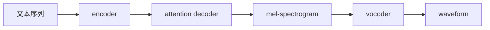

# 第八章：声学模型 Acoustic Model

声学模型负责把文本、音素和条件信息转换成声学表示。

```text
文本 / 音素 / 条件 → mel / latent / codec token
```

## 8.1 常见组件

需要逐步掌握：

```text
encoder
decoder
attention
alignment
length regulator
duration predictor
variance adaptor
posterior encoder
latent variable
```

## 8.2 Tacotron 类模型

Tacotron / Tacotron 2 属于自回归 TTS：



核心概念：

```text
autoregressive
attention alignment
teacher forcing
exposure bias
stop token
```

## 8.3 FastSpeech 类模型

FastSpeech / FastSpeech 2 属于非自回归 TTS，核心思想是先预测 duration，再把文本 hidden states 展开，并行生成 mel。

FastSpeech 2 进一步引入：

```text
duration
pitch
energy
```

这些显式条件有助于处理同一句文本对应多种合理语音的 one-to-many 问题。

## 8.4 VITS 类模型

VITS 是连接经典 TTS 与生成模型的重要过渡：

```text
VAE
normalizing flow
GAN
stochastic duration predictor
end-to-end training
```

它让 TTS 从“确定性 mel 预测”逐步走向“潜变量生成建模”。
