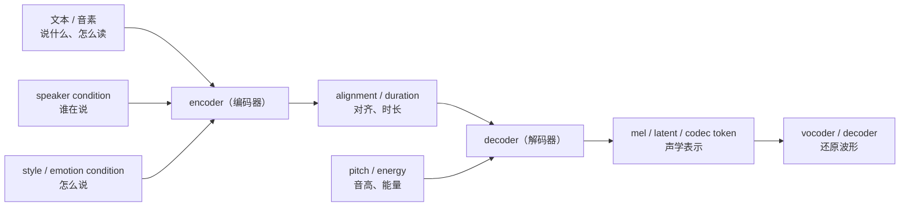
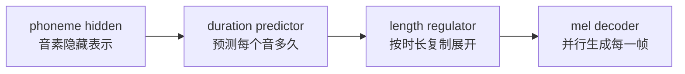
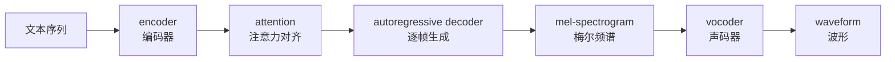

# 第八章：声学模型 Acoustic Model —— 从发音条件到声学表示

声学模型（acoustic model）负责把文本、音素和条件信息转换成声学表示。它是 TTS（Text-to-Speech，文本转语音）里最核心的“中间生成器”之一。

可以先记住一句话：

```text
声学模型决定“说什么、谁在说、怎么说”如何变成 mel / latent / codec token。
```

这里的输出还不是最终音频。最终 waveform（波形）通常还需要 vocoder（声码器）或 codec decoder（编码解码器的解码端）还原。


## 本章导图



这张图是工程视角，不是所有模型都完全长这样。Tacotron 类模型更依赖 attention（注意力）隐式对齐，FastSpeech 类模型更依赖 duration（时长）显式展开，VITS / diffusion / flow 类模型还会引入 latent（潜变量）或 noise（噪声）。

## 8.1 声学模型到底输入什么、输出什么

声学模型的输入通常不是原始文本，而是文本前端处理后的结构化条件。

常见输入：

| 输入 | 极简解释 |
| --- | --- |
| character（字符） | 原始或规范化后的字符 |
| phoneme（音素） | 更接近发音的最小单位 |
| pinyin（拼音） | 中文 TTS 常用发音表示 |
| tone（声调） | 中文音高类别信息 |
| stress（重音） | 英文常见重音信息 |
| speaker embedding（说话人向量） | 控制谁在说 |
| style embedding（风格向量） | 控制说话方式 |
| emotion label（情绪标签） | 控制情绪类别 |
| prompt speech（提示语音） | 从参考音频中提取音色和风格 |

常见输出：

| 输出 | 极简解释 | 后续模块 |
| --- | --- | --- |
| mel-spectrogram（梅尔频谱） | TTS 最常见中间声学表示 | vocoder |
| latent（潜变量） | 压缩后的连续声学表示 | decoder / vocoder |
| codec token（语音编码 token） | neural codec 产生的离散或连续表示 | codec decoder |

工程上可以把声学模型看成一个“从结构化请求生成中间结果”的服务：

```text
入参：文本发音结构 + 说话人条件 + 风格条件
出参：一段声学表示
```

如果入参里的发音、时长、说话人、风格本身就错了，后面的 vocoder 很难补救。

## 8.2 encoder（编码器）：把输入条件变成模型能用的表示

encoder（编码器）负责把离散输入变成 hidden representation（隐藏表示）。例如：

```text
phoneme id -> embedding -> encoder -> phoneme hidden states
```

你可以把 encoder（编码器）理解成后端服务里的“特征整理层”：它不直接输出音频，而是把输入条件整理成后续 decoder（解码器）更容易使用的表示。

常见 encoder 会处理：

```text
音素顺序
上下文关系
声调 / 重音
说话人条件
语言条件
风格条件
```

在现代模型中，encoder 可能是 RNN（循环神经网络）、CNN（卷积神经网络）、Transformer（自注意力网络）或 DiT（Diffusion Transformer，扩散 Transformer）的一部分。

## 8.3 alignment（对齐）：文本 token 如何对应语音帧

alignment（对齐）是 TTS 中非常关键的问题。

文本通常很短：

```text
我 / 想 / 学 / 习 / TTS
```

mel 帧却很多：

```text
frame 1, frame 2, frame 3, ..., frame 300
```

模型必须知道“哪个文本 token 对应哪些语音帧”。如果对齐错了，就容易出现：

```text
漏读
重复读
跳字
停顿奇怪
长文本崩溃
```

不同模型处理 alignment（对齐）的方式不同：

| 路线 | 对齐方式 | 代表直觉 |
| --- | --- | --- |
| Tacotron 类 | attention（注意力）隐式学习 | 边生成边看文本位置 |
| FastSpeech 类 | duration（时长）显式展开 | 每个音素占几帧先算出来 |
| VITS / Grad-TTS 类 | MAS 等单调对齐 | 学习文本和语音的单调对应 |
| CTC 类方法 | CTC alignment（连接时序分类对齐） | 从序列监督中估计对齐 |

语音对齐通常有一个强假设：发音顺序和文本顺序基本一致。这叫 monotonic alignment（单调对齐）。TTS 大多依赖这个性质。

## 8.4 duration（时长）：最直接的对齐形式

duration（时长）描述每个音素、拼音、字或音节持续多少帧。

例如：

```text
phoneme:  n i h ao
duration: 5 4 6  8
```

这表示第一个音素占 5 帧，第二个音素占 4 帧，以此类推。

FastSpeech 类模型里，duration predictor（时长预测器）和 length regulator（长度调节器）非常关键：



工程上，duration（时长）一旦出错，现象通常很明显：

| duration 问题 | 可能现象 |
| --- | --- |
| 某些音预测太短 | 吞字、发音不清 |
| 某些音预测太长 | 拖音、节奏慢 |
| 边界预测不稳 | 停顿奇怪 |
| 长文本 duration 累积误差 | 后半句节奏漂移 |

## 8.5 decoder（解码器）：生成声学表示

decoder（解码器）负责根据 encoder 输出和条件信息生成声学表示。

不同模型的 decoder 形态差异很大：

| decoder 类型 | 生成方式 | 典型问题 |
| --- | --- | --- |
| autoregressive decoder（自回归解码器） | 一帧一帧生成 | 慢，容易 exposure bias |
| non-autoregressive decoder（非自回归解码器） | 并行生成所有帧 | 依赖 duration 和对齐质量 |
| diffusion decoder（扩散解码器） | 从噪声逐步去噪 | 推理步数和速度 |
| flow matching decoder（流匹配解码器） | 学习噪声到数据的路径 | 采样器和条件设计 |

Tacotron 类 decoder 通常输出 mel-spectrogram（梅尔频谱）。现代模型也可能输出 latent（潜变量）或 codec token（语音编码 token）。

## 8.6 attention（注意力）：为什么 Tacotron 会漏读和重复

attention（注意力）用于在生成每一帧时选择当前应该关注哪个文本位置。

简化理解：

```text
当前要生成第 120 帧 mel
模型需要知道：这帧大概对应文本里的哪个音素？
attention 给出一个权重分布
```

理想情况下，attention 会从左到右稳定移动：

```text
第 1 个音素 -> 第 2 个音素 -> 第 3 个音素 -> ...
```

如果 attention 停在同一个位置太久，就可能重复读。如果 attention 跳过某些位置，就可能漏读。

所以 Tacotron 类模型虽然自然度高，但长文本和复杂文本场景下需要额外工程保护，例如：

```text
文本切句
attention 约束
重复检测
最大输出长度限制
fallback 机制
```

## 8.7 variance adaptor（变化信息适配器）：控制 pitch、energy、duration

FastSpeech 2 中常见 variance adaptor（变化信息适配器），它把一些影响韵律和表达的特征显式加入模型。

常见变量：

```text
duration（时长）
pitch / F0（音高 / 基频）
energy（能量）
```

这三个变量分别解决：

| 变量 | 控制什么 | 工程直觉 |
| --- | --- | --- |
| duration（时长） | 每个音持续多久 | 语速和节奏 |
| pitch（音高） | F0 走势 | 语调和情绪起伏 |
| energy（能量） | 每帧强弱 | 重音和表达力度 |

它们不是全部韵律信息，但足够建立一个可控入口。很多情绪、风格、语气变化，最终都会在这几个曲线上体现一部分。

## 8.8 Tacotron 类模型：自然但慢，依赖 attention

Tacotron / Tacotron 2 属于 autoregressive TTS（自回归文本转语音）。

结构直觉：



核心概念：

| 术语 | 极简解释 |
| --- | --- |
| autoregressive（自回归） | 当前输出依赖之前输出 |
| teacher forcing（教师强制） | 训练时使用真实上一帧辅助学习 |
| exposure bias（暴露偏差） | 训练和推理时输入分布不一致 |
| stop token（停止标记） | 预测什么时候结束生成 |
| attention alignment（注意力对齐） | 让声学帧对应文本位置 |

工程判断：

```text
如果问题是长文本漏读、重复读，先怀疑 attention / 对齐。
如果问题是音质粗糙，可能更接近 vocoder 或声学表示质量问题。
```

## 8.9 FastSpeech 类模型：快、稳、可控

FastSpeech / FastSpeech 2 属于 non-autoregressive TTS（非自回归文本转语音）。它不再逐帧生成，而是通过 duration（时长）把文本隐藏表示展开后并行生成 mel。

核心结构：

```text
phoneme -> encoder -> duration/pitch/energy -> length regulator -> decoder -> mel
```

优势：

| 优势 | 解释 |
| --- | --- |
| 快 | 可以并行生成帧 |
| 稳 | 不依赖逐帧 attention 漂移 |
| 可控 | duration、pitch、energy 可以作为显式控制项 |
| 工程友好 | 更容易定位时长、音高、能量问题 |

代价：

```text
需要更可靠的对齐数据。
需要提取 pitch / energy 等监督特征。
预测结果可能比自回归模型更平均，需要更好的建模或后处理。
```

## 8.10 VITS 类模型：声学模型和 vocoder 边界变模糊

VITS 类模型把 acoustic model（声学模型）和 vocoder（声码器）的边界变得不那么清晰。它不一定先显式生成 mel，再用独立 vocoder 还原波形，而是通过 latent（潜变量）和 generator（生成器）端到端生成语音。

关键组件：

```text
posterior encoder（后验编码器）
prior encoder（先验编码器）
latent z（潜变量）
normalizing flow（标准化流）
stochastic duration predictor（随机时长预测器）
adversarial loss（对抗损失）
feature matching loss（特征匹配损失）
```

它重要的原因不是“必须学会 VITS 所有公式”，而是它展示了现代 TTS 的几个趋势：

```text
用潜变量表达一对多读法。
用 flow 改善分布建模。
用 GAN 提升波形真实感。
把多个模块放到端到端训练里。
```

## 8.11 声学模型常见排错入口

工程实践中，可以按下面方式初步定位问题：

| 现象 | 优先怀疑 |
| --- | --- |
| 字读错 | 文本前端、G2P、多音字消歧 |
| 漏读 / 重复 | alignment、attention、duration |
| 语速奇怪 | duration predictor、切句策略 |
| 语调平 | pitch / F0 建模、风格条件 |
| 力度不自然 | energy 建模、训练数据风格 |
| 音色不像 | speaker embedding、prompt speech、训练数据 |
| 音质毛刺 / 爆音 | vocoder、采样率、音频预处理 |

一个实用原则：

```text
先看声学模型输入是否正确，再听声学模型输出，再判断 vocoder。
```

如果模型有中间 mel 可视化，排查会更容易：mel 已经异常，问题多半在声学模型或输入条件；mel 看起来正常但音频有毛刺，问题更可能在 vocoder 或音频后处理。

## 8.12 本章小结

本章最重要的直觉：

```text
声学模型把文本、音素、说话人、风格等条件变成声学表示。
alignment（对齐）连接文本 token 和语音帧，是 TTS 稳定性的关键。
duration（时长）是最直接、最工程化的对齐形式。
Tacotron 类依赖 attention，声音自然但推理慢、长文本不稳。
FastSpeech 类显式建模 duration / pitch / energy，更快、更稳、更可控。
VITS 类把 latent、flow、GAN 和端到端训练引入 TTS。
```

下一章进入 vocoder（声码器）：它负责把 mel、latent 或 codec representation（语音编码表示）变成最终 waveform（波形）。
