# 第八章：声学模型 Acoustic Model —— 从发音条件到声学表示

声学模型（acoustic model）负责把文本、音素、说话人、风格、情绪等条件转换成声学表示。它不是完整 TTS 系统的全部，而是完整链路里的核心生成模块。

本章围绕一个主线展开：

```text
原始输入 -> 前置编码 / 条件准备 -> 声学模型生成 -> mel / latent / codec token
```

声学模型的输出通常还不是最终音频。最终 waveform（波形）需要由 vocoder（声码器）、codec decoder（语音编码解码器的解码端）或 AudioVAE decoder 继续还原。第九章会专门讲这一段。

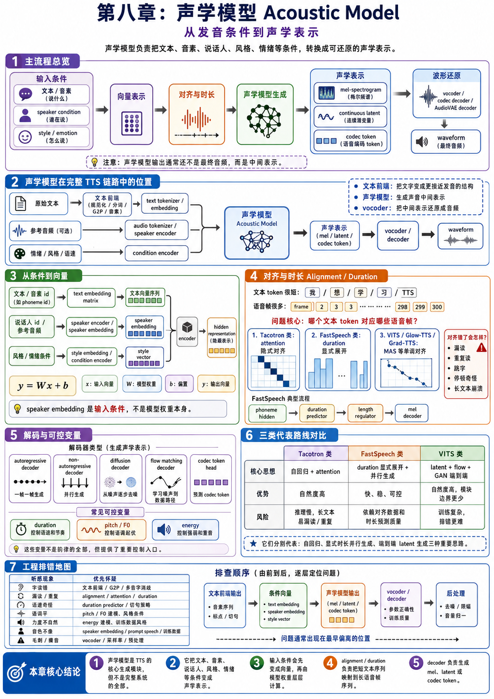

## 本章导图

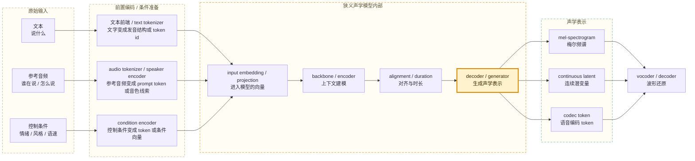

这张图是工程视角，不要求所有模型都完全长成这样。当前阅读 TTS 模型时，重点通常放在 Transformer / LLM 主干、codec token、diffusion / flow matching、显式 duration、MAS / CTC 等对齐机制上；RNN、CNN、Tacotron 这类更早期路线只保留为背景概念。

这里采用“狭义声学模型”的口径：text tokenizer、audio tokenizer、condition encoder 属于进入声学模型前的前置编码或条件准备；input embedding、backbone、alignment、decoder / generator 属于主生成模型内部。实际工程里有些模块会被打包在同一个 Python 类或同一个 checkpoint 里，但理解链路时先按职责拆开更清楚。

## 本章目录

| 章节 | 主题 | 解决的问题 |
| --- | --- | --- |
| 8.1 | 声学模型在完整 TTS 方案中的位置 | 声学模型和文本前端、tokenizer、vocoder 的关系 |
| 8.2 | 从条件到向量：权重、embedding 与 encoder | 文本、说话人、风格等条件如何进入模型计算 |
| 8.3 | 对齐与时长：文本 token 如何落到语音帧 | 为什么会漏读、重复、节奏错乱 |
| 8.4 | 解码、可控变量与声学表示方案 | decoder 如何生成 mel、latent、codec token 等并列声学表示 |
| 8.5 | 当前更值得关注的声学模型路线 | duration、MAS / CTC、diffusion / flow、codec token 路线如何读 |
| 8.6 | 工程排错与本章小结 | 从听感现象判断问题属于哪一段 |

## 8.1 声学模型在完整 TTS 方案中的位置

本节在总体架构中的位置：

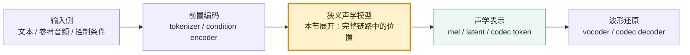

完整 TTS 方案是一条从文本到波形的生产链。狭义声学模型位于链路中段，前面接收文本、参考音频和控制条件的编码结果，后面输出可被还原成音频的中间表示。

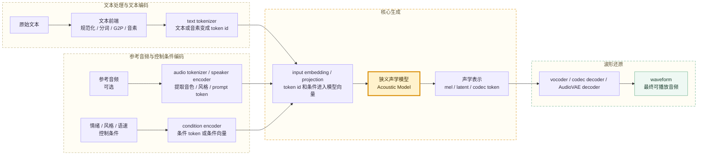

完整链路中，各模块的职责如下。最后一列强调 OmniVoice 的实现思想：这一段主要依靠规则、神经模型、训练权重，还是推理调度逻辑。

| 模块 | 所在位置 | 主要职责 | 输出给后续模块的内容 | OmniVoice 中的实现思想 |
| --- | --- | --- | --- | --- |
| 文本前端 | 前置处理 | 处理数字、日期、多音字、分词、G2P、音素、声调、停顿边界 | 字符、拼音、音素、声调、重音、停顿等结构化发音信息 | 主要是规则与数据字段驱动：推理时做文本清理、标点补齐、长文本切分、非言语标签识别；训练时可以使用数据中已准备好的 `text_pinyin`。它不是单独训练出来的大模型前端。 |
| text tokenizer | 前置编码 | 把文本或音素切成 token id | 文本 token id 序列 | tokenizer 是确定性的分词 / 编码规则。它决定“符号怎么编号”，本身不是声学模型的核心生成能力。 |
| input embedding / projection | 声学模型输入层 | 把 token id 或条件 id 查表 / 投影成向量 | 可进入 backbone 计算的向量序列 | embedding 是训练出来的参数矩阵，通常跟 Qwen3 主干一起属于主模型权重。文本先变成 token id，再查表变成主干可处理的向量。 |
| audio tokenizer / speaker encoder | 前置或旁路神经编码模块 | 从参考音频中提取音色、风格、语速、prompt token 或 acoustic token | 说话人向量、风格向量、prompt token | 这是神经音频 codec 模型，不是手写规则。OmniVoice 没有额外抽一个传统 speaker embedding，而是把参考音频编码成 8 层 codec token，让音色、语速、风格等信息随 prompt token 一起进入主模型。 |
| condition encoder | 前置条件编码，部分参数可属于模型输入层 | 把情绪、风格、语速、语言、口音等控制条件编码成 token 或向量 | 条件 token、条件向量 | 规则规范化 + 文本 token 化 + 学习到的 embedding。语言、声音设计指令、非言语标签先被写成特殊 token 或文本片段，再交给主模型理解；没有独立的“情绪小模型”专门编码这些条件。 |
| 声学模型 | 狭义主生成模型 | 综合文本、发音、说话人和风格条件，生成声音中间表示 | mel、continuous latent、codec token | 这是核心神经模型。OmniVoice 用 Qwen3 Transformer 主干做上下文建模，目标不是生成 mel，而是用 mask-fill / diffusion language model 风格逐步补全 8 层 audio codebook token。 |
| vocoder / codec decoder / AudioVAE decoder | 波形还原模块 | 把声学表示还原成可播放音频 | waveform | 这是神经 codec decoder。OmniVoice 走 codec token 路线，不经过显式 `mel -> vocoder`；生成出的 codec token 直接由音频 tokenizer 的 decoder 还原成 24 kHz waveform。 |
| 推理控制与后处理 | 模型外工程调度 | 管理切句、采样参数、长文本拼接、响度、格式转换、异常重试 | 稳定的音频文件或服务响应 | 主要是工程规则、启发式和采样策略：时长估计、长文本分块、CFG 强度、迭代步数、去静音、响度调整、淡入淡出等都属于模型外的推理调度与音频后处理。 |

OmniVoice 的这张表要特别注意一件事：它属于 codec token / speech LM 路线，主模型直接生成语音编码 token；表中的 mel、vocoder 是通用 TTS 概念，用来帮助理解模块边界，但不是 OmniVoice 当前推理链路的主输出形式。

声学模型常见输入和输出如下。

| 输入 | 极简解释 |
| --- | --- |
| character（字符） | 原始或规范化后的字符 |
| phoneme（音素）/ pinyin（拼音） | 更接近发音的结构 |
| tone（声调）/ stress（重音） | 中文声调或英文重音信息 |
| speaker embedding（说话人向量） | 控制谁在说 |
| style embedding（风格向量） | 控制说话方式 |
| emotion label（情绪标签） | 控制情绪类别 |
| prompt speech（提示语音） | 从参考音频中提取音色、风格和上下文 |

| 输出 | 极简解释 | 后续模块 |
| --- | --- | --- |
| mel-spectrogram（梅尔频谱） | TTS 常见中间声学表示 | vocoder |
| continuous latent（连续潜变量） | 压缩后的连续声学表示 | decoder / vocoder |
| codec token（语音编码 token） | neural codec 产生的离散或多码本表示 | codec decoder |

声学模型生成的是“可还原的声音中间表示”，不是最终声音文件。如果文本前端、参考音频或条件向量本身有问题，后面的 vocoder 很难完全补救。

## 8.2 从条件到向量：权重、embedding 与 encoder

本节在总体架构中的位置：

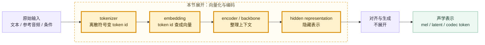

模型不能直接对“文字字符串”或“音频文件路径”做计算。进入声学模型前，文本、音素、说话人、风格和情绪都需要变成向量。

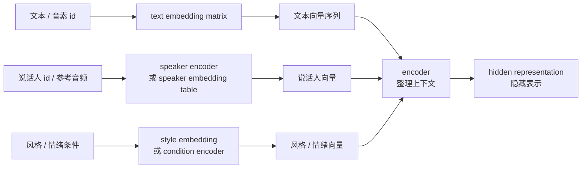

这些向量进入模型后，会被模型权重层层变换。最小的计算直觉是：

```text
y = W x + b
```

| 符号 | 含义 | 工程直觉 |
| --- | --- | --- |
| `x` | 输入向量 | 文本、音素、说话人、风格等条件变成的数字表示 |
| `W` | 权重矩阵 | 模型训练出来的参数，决定如何变换输入 |
| `b` | 偏置向量 | 给输出增加可学习的平移量 |
| `y` | 输出向量 | 下一层继续处理的 hidden representation |

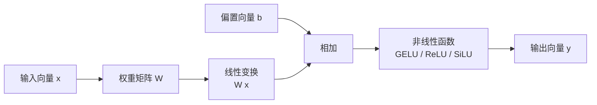

真实模型不是只做一次矩阵乘法。它会把向量变换堆很多层，并加入 attention（注意力）、normalization（归一化）、residual connection（残差连接）等结构。模型权重也不是一个单独矩阵，而是一组矩阵、向量和高维张量的集合。

| 权重类型 | 常见形态 | 作用 |
| --- | --- | --- |
| embedding matrix（嵌入矩阵） | 二维矩阵 | 把 token id 查成向量 |
| attention Q/K/V matrix | 二维矩阵 | 让每个位置读取上下文 |
| MLP projection matrix | 二维矩阵 | 对 hidden vector 做非线性变换 |
| LayerNorm 参数 | 向量 | 稳定每层数值分布 |
| output head matrix | 二维矩阵 | 把 hidden vector 投影成输出概率 |
| codec / audio head | 多个矩阵 | 把 hidden vector 解释成音频 token 概率 |

speaker embedding（说话人向量）是输入条件，不是模型权重本身。二者的关系如下。

| 概念 | 是什么 | 会不会随每次请求变化 |
| --- | --- | --- |
| 模型权重 | 训练好的矩阵 / 张量参数 | 通常不变 |
| speaker embedding | 描述“谁在说”的条件向量 | 随说话人或参考音频变化 |
| text embedding | 描述“说什么”的输入向量 | 随文本变化 |
| style / emotion embedding | 描述说话方式的条件向量 | 随风格、情绪或提示变化 |

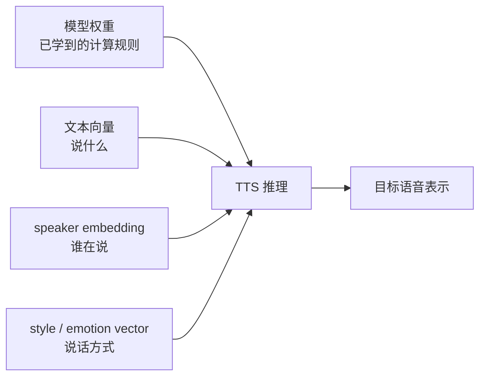

如果训练数据覆盖了足够多说话人，并且模型结构允许说话人信息有效进入生成过程，模型会形成一个相对连续的 speaker space（说话人空间）。新的参考音频可以被编码成这个空间里的一个位置，然后模型按这个位置生成相似音色。

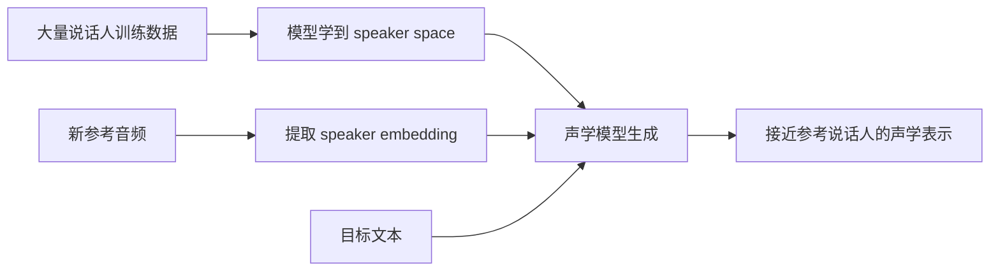

speaker embedding 的效果取决于多件事：训练说话人覆盖是否丰富、向量表达力是否足够、模型是否真的使用这个条件、参考音频质量是否可靠，以及后续 decoder / vocoder 能否保住音色细节。

encoder（编码器）承担“整理输入条件”的职责。它会把文本、音素、声调、重音、说话人、语言、风格等条件整理成 hidden representation（隐藏表示），再交给后续对齐模块或 decoder 使用。

```text
phoneme id -> embedding -> encoder -> phoneme hidden states
```

早期 TTS 系统里，encoder 曾经大量使用 RNN（循环神经网络）或 CNN（卷积神经网络）。当前读主流 TTS 模型时，更值得关注的是 Transformer、Conformer、DiT（Diffusion Transformer）或 LLM 主干。RNN / CNN 在本书里只作为历史背景，不作为后续学习重点。

## 8.3 对齐与时长：文本 token 如何落到语音帧

本节在总体架构中的位置：

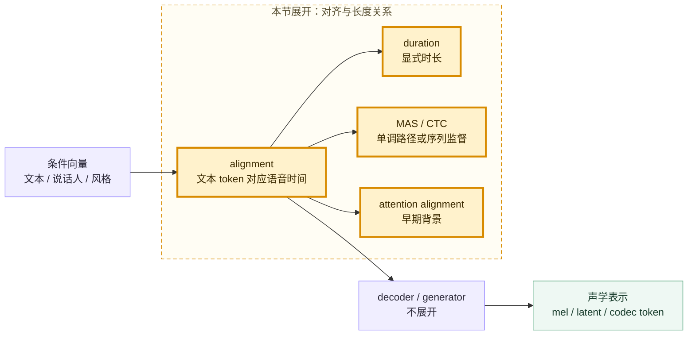

alignment（对齐）是 TTS 稳定性的关键问题。文本通常很短：

```text
我 / 想 / 学 / 习 / TTS
```

mel 帧或声学帧却很多：

```text
frame 1, frame 2, frame 3, ..., frame 300
```

模型必须知道“哪个文本 token 对应哪些语音帧”。对齐错了，常见现象包括：

```text
漏读
重复读
跳字
停顿奇怪
长文本崩溃
```

不同模型处理 alignment 的方式不同。这里最容易混淆的是：attention、Transformer、diffusion / flow 并不在同一个层级上。

| 机制 | 它是什么 | 和 attention / Transformer / diffusion-flow 的关系 | 当前阅读价值 |
| --- | --- | --- | --- |
| attention alignment | 一种隐式对齐机制 | Tacotron 类模型边生成 mel 边用 attention 看文本位置；这是“对齐用的 attention”，不是现代 Transformer 主干本身 | 作为背景理解即可，重点是知道它容易漏读、重复 |
| Transformer / LLM 主干 | 一种网络骨架 | Transformer 使用 self-attention 做上下文建模，但“用了 Transformer”不等于“用 attention 做文本-语音帧对齐” | 当前非常重要；OmniVoice 的 Qwen3 主干就属于这一层 |
| duration + length regulator | 显式时长对齐 | 通常可以和 Transformer encoder 搭配；它不是 diffusion，也不是 attention alignment | 仍然重要，很多工程系统需要显式语速、停顿和可控性 |
| MAS 等单调对齐 | 训练时寻找文本和语音帧的单调路径 | 常见于 Glow-TTS、VITS、Grad-TTS 一类 flow / latent 路线 | 重要，适合理解“文本顺序和发音顺序基本一致”这个假设 |
| CTC alignment | 从序列监督中估计对齐 | 常见于部分现代 flow matching / end-to-end TTS 方案，用来减少外部对齐依赖 | 重要，读 F5-TTS、E2 TTS、Matcha-TTS 等方案时经常遇到 |
| diffusion / flow matching | 生成范式，不是对齐方式本身 | diffusion / flow 负责“怎么从噪声或路径生成声学表示”；仍然可能需要 duration、MAS、CTC 或其他方式处理文本到语音长度关系 | 当前非常重要，但要和 alignment 分开理解 |

语音对齐通常依赖一个强假设：发音顺序和文本顺序基本一致。这叫 monotonic alignment（单调对齐）。当前很多强模型即使不显式写出“duration predictor”，也通常仍在利用这个顺序约束。

duration（时长）是最直接的对齐形式，描述每个音素、拼音、字或音节持续多少帧。

```text
phoneme:  n i h ao
duration: 5 4 6  8
```

显式 duration 路线里，duration predictor（时长预测器）和 length regulator（长度调节器）是两类常见组件。这里关注的是“先估计文本单位占多久，再把短文本序列展开成更长的声学时间序列”这个思想，而不是某个具体早期模型。

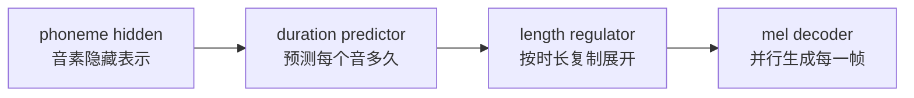

duration 一旦出错，听感通常很明显。

| duration 问题 | 可能现象 |
| --- | --- |
| 某些音预测太短 | 吞字、发音不清 |
| 某些音预测太长 | 拖音、节奏慢 |
| 边界预测不稳 | 停顿奇怪 |
| 长文本 duration 累积误差 | 后半句节奏漂移 |

attention（注意力）需要分成两种语境理解。第一种是早期 Tacotron 类模型里的 alignment attention：生成每一帧 mel 时，模型用 attention 决定当前应该关注哪个文本位置。

```text
当前要生成第 120 帧 mel
模型需要判断：这帧大概对应文本里的哪个音素？
attention 给出一个权重分布
```

理想 alignment attention 会从左到右稳定移动。如果停在同一个位置太久，容易重复读；如果跳过某些位置，容易漏读。因此这一路线在本章只作为背景，用来解释“为什么对齐会影响稳定性”。

第二种是 Transformer 里的 self-attention。它负责让序列内部各个位置交换上下文信息，是当前 LLM / speech LM / DiT 模型的核心结构之一。它不直接等同于“文本 token 对应哪几个语音帧”的 alignment，但可以作为主干网络的一部分，承载文本、prompt token、codec token 之间的上下文建模。

## 8.4 解码、可控变量与声学表示方案

本节在总体架构中的位置：

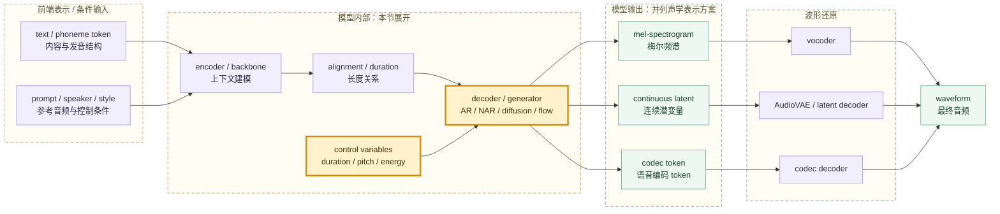

本节讨论的是 decoder / generator 如何把模型内部表示转换成不同声学表示。mel-spectrogram、continuous latent、codec token 是并列的输出空间；它们都还不是最终音频，后面分别接 vocoder、latent decoder 或 codec decoder。

decoder（解码器）负责根据 encoder 输出、对齐信息和条件向量生成声学表示。不同模型的 decoder 形态差异很大。

| decoder 类型 | 生成方式 | 典型关注点 |
| --- | --- | --- |
| autoregressive decoder（自回归解码器） | 一帧一帧生成 | 自然度、速度、exposure bias |
| non-autoregressive decoder（非自回归解码器） | 并行生成所有帧 | duration 和对齐质量 |
| diffusion decoder（扩散解码器） | 从噪声逐步去噪 | 推理步数和采样速度 |
| flow matching decoder（流匹配解码器） | 学习噪声到数据的路径 | 条件设计和采样器 |
| codec token head | 预测语音 codec token | 多码本预测和 token 质量 |

不同路线的 decoder 输出空间不同：传统两阶段系统常输出 mel-spectrogram（梅尔频谱），VITS / flow / diffusion 路线可能输出 latent（潜变量）或 mel，speech LM / codec 路线则可能直接输出 codec token（语音编码 token）。

显式韵律控制里常见 variance adaptor（变化信息适配器）这类设计，它把影响韵律和表达的特征显式加入模型。这里关注的是控制变量本身：duration、pitch / F0、energy。

| 变量 | 控制什么 | 工程直觉 |
| --- | --- | --- |
| duration（时长） | 每个音持续多久 | 语速和节奏 |
| pitch / F0（音高 / 基频） | F0 走势 | 语调和情绪起伏 |
| energy（能量） | 每帧强弱 | 重音和表达力度 |

这些变量不是全部韵律信息，但提供了很重要的可控入口。许多情绪、风格、语气变化，最终都会在时长、音高和能量曲线上体现一部分。

## 8.5 当前更值得关注的声学模型路线

本节在总体架构中的位置：

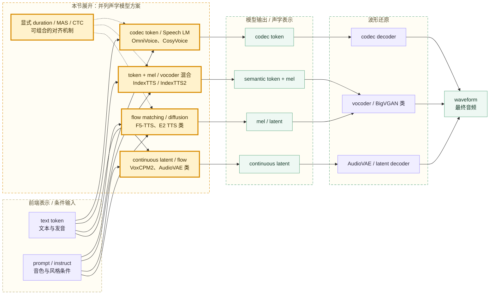

当前阅读 TTS 模型时，更有价值的是抓住“生成空间”和“对齐机制”这两个问题，而不是背旧模型年表。

| 路线 | 当前重点 | 常见代表 | 和第 8 章概念的关系 |
| --- | --- | --- | --- |
| duration / 显式时长路线 | 先预测或约束每个文本单位持续多久，再生成声学表示 | IndexTTS2 等强调 duration control 的混合路线、许多工程化两阶段系统 | duration、pitch、energy 是显式控制入口，适合理解语速、停顿和韵律控制 |
| MAS / flow / VITS 路线 | 在 latent 或 mel 空间里建模，同时用单调对齐学习文本到语音的路径 | Glow-TTS、VITS、Grad-TTS | MAS 负责单调对齐，flow / latent 负责更灵活的声学分布建模 |
| diffusion / flow matching 路线 | 从噪声或连续路径生成 mel、latent 或 codec 表示 | Grad-TTS、Matcha-TTS、F5-TTS、E2 TTS、VoxCPM2 类方案 | diffusion / flow 是生成方式；对齐可能来自 duration、MAS、CTC 或文本条件建模 |
| codec token / speech LM 路线 | 把语音表示成 token，让语言模型式主干生成 audio token | OmniVoice、CosyVoice、AudioLM / VALL-E 类思路 | 文本 token、prompt audio token 和目标 audio token 进入同一序列，重点是 tokenizer、codebook、mask-fill 或 autoregressive decoding |
| Transformer / LLM 主干路线 | 用 Transformer 做长上下文建模，统一处理文本、条件和语音 token | OmniVoice 的 Qwen3 主干、CosyVoice 的 LLM 组件 | Transformer 是主干骨架，不等于一种对齐方式；它可以服务于 codec token、diffusion、flow 或其他生成路线 |

Tacotron / Tacotron 2 属于更早期的自回归 mel 生成路线，历史地位很重要，但当前学习重点不需要放在它的完整结构上。保留它的主要价值，是理解 alignment attention 为什么会导致漏读、重复，以及为什么后来很多系统转向 duration、MAS、CTC、flow matching 或 codec token。

## 8.6 工程排错与本章小结

本节在总体架构中的位置：

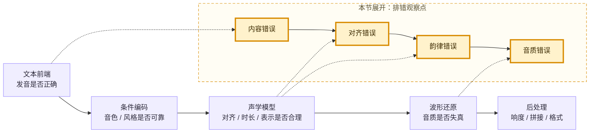

工程实践中，可以根据听感现象初步定位问题。

| 现象 | 优先怀疑 |
| --- | --- |
| 字读错 | 文本前端、G2P、多音字消歧 |
| 漏读 / 重复 | alignment、attention、duration |
| 语速奇怪 | duration predictor、切句策略 |
| 语调平 | pitch / F0 建模、风格条件 |
| 力度不自然 | energy 建模、训练数据风格 |
| 音色不像 | speaker embedding、prompt speech、训练数据 |
| 音质毛刺 / 爆音 | vocoder、采样率、音频预处理 |

排查顺序通常从输入开始：

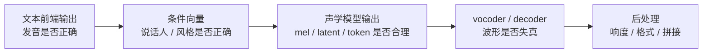

如果模型能导出中间 mel 或 token，排查会更明确：声学表示已经异常，问题多半在输入条件、对齐或声学模型；声学表示看起来正常但音频有毛刺、爆音或金属感，问题更可能在 vocoder、采样率或音频后处理。

本章核心结论：

```text
声学模型是完整 TTS 方案中的主生成模块，但不是完整系统的全部。
它把文本、音素、说话人、风格和情绪等条件变成声学表示。
输入条件会先变成向量，再由模型权重层层计算。
alignment 和 duration 负责把短文本序列映射到长语音帧序列。
attention alignment 是早期 Tacotron 类路线的对齐方式；Transformer self-attention 是当前主干建模机制，二者不是同一层级。
diffusion / flow matching 是生成范式，不是对齐方式本身；它通常还要配合 duration、MAS、CTC 或其他条件建模机制。
decoder 负责生成 mel、latent 或 codec token。
当前读主流 TTS，更应关注 duration、MAS / CTC、diffusion / flow、codec token 和 Transformer / LLM 主干。
```

下一章进入 vocoder（声码器）：它负责把 mel、latent 或 codec representation（语音编码表示）变成最终 waveform（波形）。
