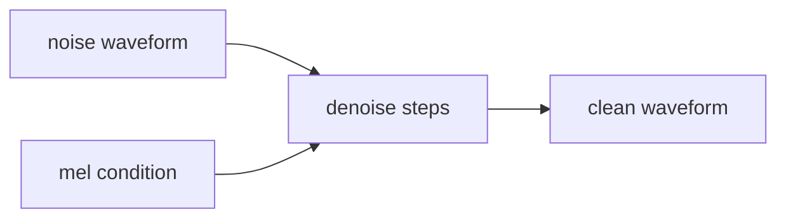

# 第九章：Vocoder 与波形生成

Vocoder 负责把声学表示变成最终 waveform。

```text
mel-spectrogram → waveform
latent → waveform
codec representation → waveform
```

## 9.1 常见 vocoder

```text
Griffin-Lim
WaveNet
WaveRNN
WaveGlow
MelGAN
Parallel WaveGAN
HiFi-GAN
DiffWave
BigVGAN
```

## 9.2 GAN Vocoder

以 HiFi-GAN 为例，其核心思想是：

```text
generator 生成波形
discriminator 判断真假
通过对抗训练提升音质
```

需要理解：

```text
multi-period discriminator
multi-scale discriminator
adversarial loss
feature matching loss
mel reconstruction loss
```

## 9.3 Diffusion Vocoder

DiffWave 代表了 diffusion vocoder 路线：在 mel 条件下，从噪声波形逐步去噪生成 clean waveform。



本章要回答的问题：

```text
扩散模型是在 mel 空间生成，还是直接在 waveform 空间生成？
vocoder 决定了哪些声音细节和质感？
```
