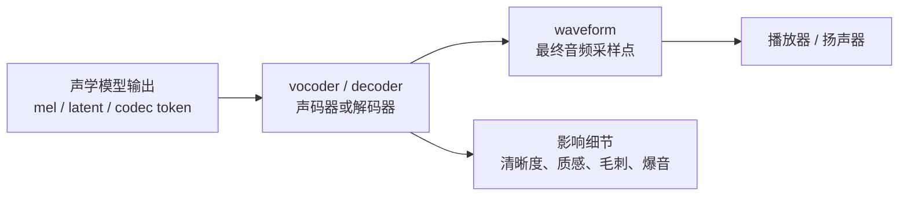
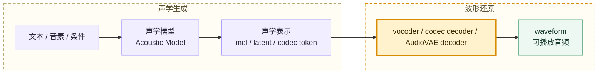
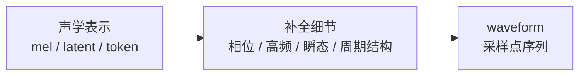
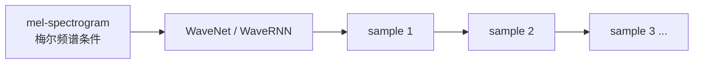
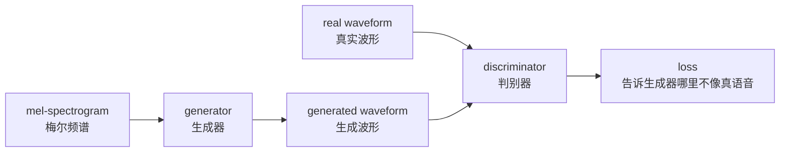
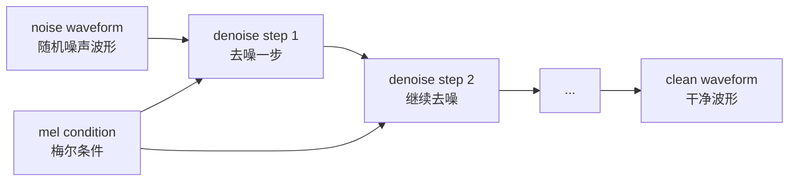

# 第九章：Vocoder 与波形生成 —— 从声学表示还原到声音

Vocoder（声码器）负责把声学表示变成最终 waveform（波形）。如果声学模型生成的是“声音蓝图”，vocoder 就负责把蓝图还原成真正可以播放的音频采样点。

常见链路如下：

```text
mel-spectrogram（梅尔频谱） -> vocoder（声码器） -> waveform（波形）
continuous latent（连续潜变量） -> decoder / vocoder -> waveform（波形）
codec token（语音编码 token） -> codec decoder（编码解码器的解码端） -> waveform（波形）
```

本章重点建立工程判断能力：哪些问题更像声学模型的问题，哪些问题更像 vocoder 或 decoder 的问题。


## 本章导图



## 本章目录

| 章节 | 主题 | 解决的问题 |
| --- | --- | --- |
| 9.1 | Vocoder 在完整 TTS 方案中的位置 | 它和声学模型如何分工 |
| 9.2 | 从声学表示到 waveform：还原为什么难 | mel、latent、token 到波形并非简单转换的原因 |
| 9.3 | 神经 vocoder 的主要路线 | WaveNet、flow、GAN、diffusion、codec decoder 分别代表什么 |
| 9.4 | 工程主流：HiFi-GAN、BigVGAN 与 GAN vocoder | 为什么 GAN vocoder 常见、快、质量高 |
| 9.5 | diffusion vocoder 与 codec decoder | 扩散声码器和 codec token 路线如何还原声音 |
| 9.6 | 工程选型、排错与本章小结 | 如何根据听感定位 vocoder 问题 |

## 9.1 Vocoder 在完整 TTS 方案中的位置

声学模型输出的 mel、latent 或 codec token 不是最终音频文件。vocoder / decoder 的职责是把这些中间表示还原成 waveform。



两阶段 TTS 中，常见分工如下。

| 模块 | 输入 | 输出 | 主要负责 |
| --- | --- | --- | --- |
| acoustic model（声学模型） | 文本、音素、说话人、风格 | mel / latent / codec token | 谁在说、说什么、说话方式、发音结构 |
| vocoder / decoder | mel / latent / codec representation | waveform | 音质、细节、清晰度、真实感 |

现实系统里二者会互相影响。声学模型输出的中间表示本身质量差，vocoder 只能尽力还原；vocoder 泛化差，也可能把正常的声学表示还原成有毛刺、金属感或高频缺失的声音。

## 9.2 从声学表示到 waveform：还原为什么难

mel-spectrogram（梅尔频谱）描述“每个时间片有哪些频率能量”，但它不是音频文件。它丢掉或压缩了一部分波形细节，例如 phase（相位）、高频细节、微小瞬态和采样点级别的结构。

```text
mel-spectrogram 像压缩后的中间表示。
waveform 像最终可播放的原始采样点。
vocoder 像高质量解码器和细节补全器。
```

Griffin-Lim 是理解这个问题的经典起点。它可以从 spectrogram（频谱图）的幅度信息估计 waveform，但质量有限。它揭示了一个核心事实：

```text
只有频谱幅度还不够，波形还原还需要恢复相位和细节。
```

这也是现代 TTS 大量使用 neural vocoder（神经声码器）的原因。神经网络可以从大量真实音频中学习“什么样的波形听起来像真实语音”。



## 9.3 神经 vocoder 的主要路线

vocoder 路线可以粗略分成几类。

| 路线 | 代表 | 极简解释 |
| --- | --- | --- |
| 算法式重建 | Griffin-Lim | 从幅度谱估计波形，质量有限 |
| 自回归神经 vocoder | WaveNet、WaveRNN | 逐采样点生成，质量高但慢 |
| flow vocoder（流式声码器） | WaveGlow | 用可逆变换建模波形 |
| GAN vocoder（对抗声码器） | MelGAN、Parallel WaveGAN、HiFi-GAN、BigVGAN | 用判别器提升真实感，推理快 |
| diffusion vocoder（扩散声码器） | DiffWave | 从噪声逐步去噪生成波形 |
| codec decoder（编码解码器解码端） | SoundStream / EnCodec 类 | 从 codec token 还原波形 |

WaveNet 类 vocoder 曾经大幅提升神经语音合成质量。它直接建模 waveform，通常以 mel-spectrogram 作为条件。



这类模型的问题是 autoregressive（自回归）：一个采样点一个采样点生成。音质可以很好，但推理速度和部署成本会成为问题。后续的 Parallel WaveGAN、HiFi-GAN、BigVGAN 等路线重点解决速度、稳定性和高频细节。

## 9.4 工程主流：HiFi-GAN、BigVGAN 与 GAN vocoder

GAN vocoder（生成对抗声码器）是工程中非常常见的路线。它由 generator（生成器）和 discriminator（判别器）对抗训练。



generator 负责生成音频，discriminator 负责判断音频像不像真实录音。训练过程中，generator 会被逼着生成更接近真实录音分布的波形。

常见 loss 如下。

| loss | 极简解释 |
| --- | --- |
| adversarial loss（对抗损失） | 让生成波形更像真实波形 |
| feature matching loss（特征匹配损失） | 让判别器中间特征也接近真实音频 |
| mel reconstruction loss（梅尔重建损失） | 让生成音频再提 mel 后接近目标 mel |

HiFi-GAN 是很多 TTS 工程中常见的 neural vocoder。它的重点是高保真和高效率，常被用在 mel -> waveform 的两阶段系统中。

| 组件 | 极简解释 |
| --- | --- |
| multi-period discriminator（多周期判别器） | 从不同周期视角判断波形，关注语音周期性 |
| multi-scale discriminator（多尺度判别器） | 从不同时间尺度判断波形，关注整体和局部真实感 |

人声中 voiced sound（有声音）通常包含声带周期振动，波形会有周期结构。判别器如果能专门看这种周期模式，就更容易发现生成音频的假感。

BigVGAN 可以看作 GAN vocoder 继续增强的一类代表。它关注更高质量、更强泛化和更好的波形细节建模。工程选型时通常关注以下维度。

| 维度 | 需要关注 |
| --- | --- |
| 音质 | 是否清晰、自然、少金属感 |
| 速度 | RTF（实时率）是否满足服务要求 |
| 采样率 | 16k / 22.05k / 24k / 44.1k 是否匹配 |
| 泛化 | 换说话人、换语言、换风格是否稳定 |
| 训练难度 | 是否容易收敛，是否容易出爆音 |

## 9.5 diffusion vocoder 与 codec decoder

DiffWave 代表 diffusion vocoder（扩散声码器）路线。它可以在 mel 条件下，从噪声波形逐步去噪生成 clean waveform（干净波形）。



diffusion vocoder 和 diffusion acoustic model 的区别在于生成空间不同。

| 类型 | 扩散发生在哪里 | 输出 |
| --- | --- | --- |
| diffusion vocoder（扩散声码器） | waveform（波形）空间 | 最终音频 |
| diffusion acoustic model（扩散声学模型） | mel / latent 等声学表示空间 | 还需要 vocoder 或 decoder |

当系统使用 codec token（语音编码 token）时，波形还原模块通常是 codec decoder。

```text
waveform -> codec encoder -> codec token -> codec decoder -> waveform
```

在 TTS 中，生成模型可能不再输出 mel，而是输出 codec token。

```text
文本 / prompt speech -> 生成模型 -> codec token -> codec decoder -> waveform
```

这条路线适合 speech language model（语音语言模型）和 zero-shot voice cloning（零样本声音克隆），但 codec 的质量会直接限制最终音质。

## 9.6 工程选型、排错与本章小结

排错时可以先按听感现象区分问题来源。

| 听感问题 | 更可能优先排查 |
| --- | --- |
| 字读错、漏读、重复 | 文本前端、alignment（对齐）、声学模型 |
| 语速奇怪、停顿奇怪 | duration（时长）、韵律预测、切句 |
| 音色不像 | speaker embedding（说话人向量）、prompt speech（提示语音）、训练数据 |
| 毛刺、爆音、金属感 | vocoder、采样率、音频预处理 |
| 声音闷、细节少 | vocoder 能力、mel 质量、高频建模 |
| 音量忽大忽小 | loudness（响度）归一化或能量分布问题 |

vocoder 排查中最常见的硬条件，是确认训练和推理的音频参数一致。

```text
sample_rate
n_fft
hop_length
win_length
n_mels
fmin
fmax
```

这些参数不一致，会导致 vocoder 输入分布偏移。输入分布偏了，即使模型本身质量很好，也可能出现发闷、金属感、爆音或细节缺失。

本章核心结论：

```text
vocoder / decoder 负责把 mel、latent 或 codec representation 变成 waveform。
mel 不是音频，波形还原需要补回相位、高频、瞬态和采样点级细节。
GAN vocoder 常用于高效高质量语音生成，HiFi-GAN 和 BigVGAN 是常见代表。
diffusion vocoder 在 waveform 空间逐步去噪生成音频。
codec decoder 是 codec token 路线里的波形还原模块。
排错时要把“内容是否说对”和“波形是否还原好”分开看。
```

下一章进入 diffusion（扩散模型）与 flow matching（流匹配）：它们不仅可以用于波形还原，也可以作为 acoustic model（声学模型）的生成式 decoder。
