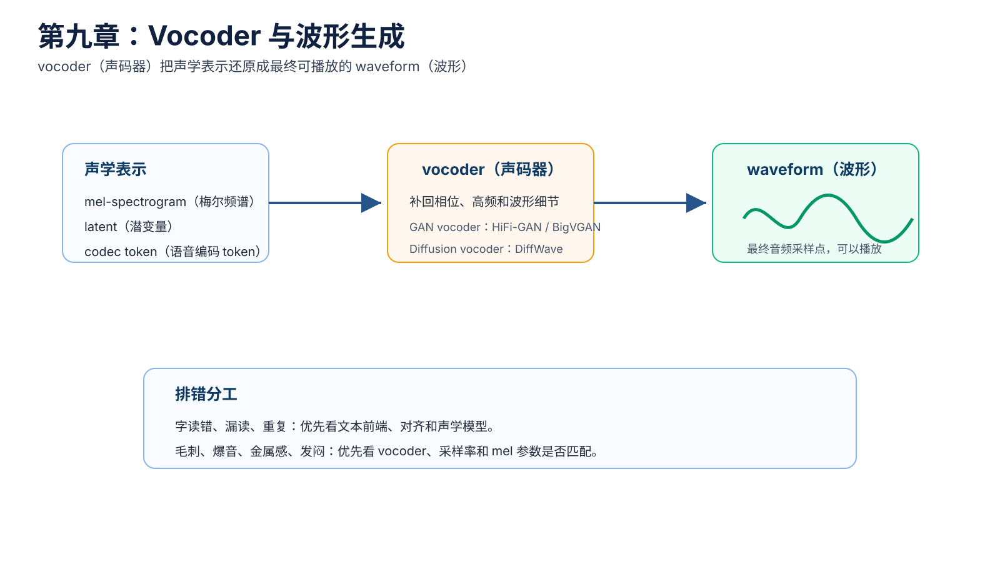
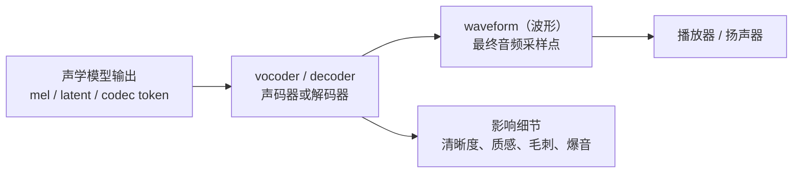
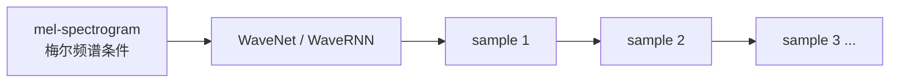
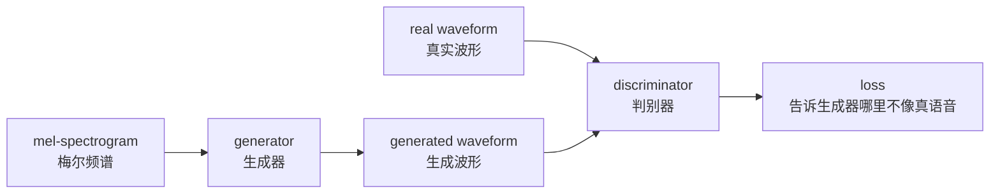
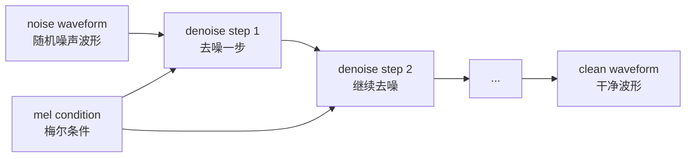

# 第九章：Vocoder 与波形生成 —— 从声学表示还原到声音

Vocoder（声码器）负责把声学表示变成最终 waveform（波形）。如果 acoustic model（声学模型）像是在生成“声音蓝图”，vocoder 就是在根据蓝图合成真正可以播放的音频。

常见链路是：

```text
mel-spectrogram（梅尔频谱） -> vocoder（声码器） -> waveform（波形）
latent（潜变量） -> decoder / vocoder -> waveform（波形）
codec token（语音编码 token） -> codec decoder（编码解码器的解码端） -> waveform（波形）
```

本章目标不是让你马上训练一个 vocoder，而是先建立判断能力：哪些问题更像声学模型的问题，哪些问题更像 vocoder 的问题。



## 本章导图



## 9.1 vocoder（声码器）到底解决什么问题

mel-spectrogram（梅尔频谱）不是音频文件，它只是声学表示。它描述了“每个时间片有哪些频率能量”，但不直接等于可以播放的 waveform（波形）。

vocoder（声码器）要做的事情是：

```text
根据声学表示，生成一串连续的音频采样点。
```

这一步很难，因为 mel-spectrogram（梅尔频谱）丢掉了一部分细节，例如 phase（相位）和高频细节。vocoder 需要把这些细节“补回来”。

可以用工程类比理解：

```text
mel-spectrogram 像压缩后的中间表示。
waveform 像最终可播放的原始数据。
vocoder 像一个高质量解码器和细节补全器。
```

## 9.2 vocoder 和 acoustic model（声学模型）的分工

两阶段 TTS 中，常见分工如下：

| 模块 | 输入 | 输出 | 主要负责 |
| --- | --- | --- | --- |
| acoustic model（声学模型） | 文本、音素、说话人、风格 | mel / latent / codec token | 说什么、怎么读、韵律大结构 |
| vocoder（声码器） | mel / latent / codec representation | waveform | 音质、细节、清晰度、真实感 |

排错时可以先用这条经验：

| 听感问题 | 更可能优先排查 |
| --- | --- |
| 字读错、漏读、重复 | 文本前端、alignment（对齐）、声学模型 |
| 语速奇怪、停顿奇怪 | duration（时长）、韵律预测、切句 |
| 音色不像 | speaker embedding（说话人向量）、prompt speech（提示语音）、训练数据 |
| 毛刺、爆音、金属感 | vocoder、采样率、音频预处理 |
| 声音闷、细节少 | vocoder 能力、mel 质量、高频建模 |

当然，现实中两者会互相影响。声学模型输出的 mel 本身质量差，vocoder 也只能尽力还原。

## 9.3 从传统 vocoder 到神经 vocoder

常见 vocoder 路线可以粗略分成几类：

| 路线 | 代表 | 极简解释 |
| --- | --- | --- |
| 算法式重建 | Griffin-Lim | 从幅度谱估计波形，质量有限 |
| 自回归神经 vocoder | WaveNet、WaveRNN | 逐采样点生成，质量高但慢 |
| flow vocoder（流式声码器） | WaveGlow | 用可逆变换建模波形 |
| GAN vocoder（对抗声码器） | MelGAN、Parallel WaveGAN、HiFi-GAN、BigVGAN | 用判别器提升真实感，推理快 |
| diffusion vocoder（扩散声码器） | DiffWave | 从噪声逐步去噪生成波形 |
| codec decoder（编码解码器解码端） | SoundStream / EnCodec 类 | 从 codec token 还原波形 |

当前工程里，GAN vocoder 尤其常见，因为它能在音质和速度之间取得比较好的平衡。

## 9.4 Griffin-Lim：理解 vocoder 问题的起点

Griffin-Lim 是一种传统算法，可以从 spectrogram（频谱图）的幅度信息估计 waveform（波形）。

它重要的地方不在于现在一定要用它，而是它让我们看到一个问题：

```text
只有频谱幅度还不够，还需要恢复相位等细节。
```

这也是为什么现代 TTS 大多使用 neural vocoder（神经声码器）。神经网络可以从大量数据中学习“什么样的波形听起来像真实语音”。

## 9.5 WaveNet / WaveRNN：高质量但推理慢

WaveNet 类 vocoder 曾经大幅提升神经语音合成质量。它直接建模 waveform（波形），通常以 mel-spectrogram（梅尔频谱）作为条件。

简化结构：



它的问题是 autoregressive（自回归）：一个采样点一个采样点生成。音质可以很好，但推理速度和部署成本会成为问题。

这推动了后续 Parallel WaveGAN、HiFi-GAN 等更快 vocoder 的发展。

## 9.6 GAN vocoder：用判别器逼近真实波形

GAN vocoder（生成对抗声码器）的核心是 generator（生成器）和 discriminator（判别器）对抗训练。



可以先这样理解：

```text
generator 负责生成音频。
discriminator 负责判断音频像不像真实录音。
generator 被训练到越来越能骗过 discriminator。
```

常见 loss（损失函数）：

| loss | 极简解释 |
| --- | --- |
| adversarial loss（对抗损失） | 让生成波形更像真实波形 |
| feature matching loss（特征匹配损失） | 让判别器中间特征也接近真实音频 |
| mel reconstruction loss（梅尔重建损失） | 让生成音频再提 mel 后接近目标 mel |

GAN vocoder 的优点是推理快、音质好。缺点是训练不稳定，需要注意数据质量、采样率、判别器设计和 loss 权重。

## 9.7 HiFi-GAN：工程上非常常见的 vocoder

HiFi-GAN 是很多 TTS 工程中常见的 neural vocoder（神经声码器）。它的设计重点是高保真和高效率。

它有两个非常重要的判别器思路：

| 组件 | 极简解释 |
| --- | --- |
| multi-period discriminator（多周期判别器） | 从不同周期视角判断波形，关注语音周期性 |
| multi-scale discriminator（多尺度判别器） | 从不同时间尺度判断波形，关注整体和局部真实感 |

为什么周期性重要？

人声中 voiced sound（有声音）通常包含声带周期振动，波形会有周期结构。判别器如果能专门看这种周期模式，就更容易发现生成音频的假感。

HiFi-GAN 类 vocoder 常见链路：

```text
mel -> upsampling（上采样） -> generator（生成器） -> waveform
```

这里的 upsampling（上采样）可以先理解为：mel 帧数量比 waveform 采样点少得多，生成器需要把低时间分辨率的 mel 条件扩展成高时间分辨率的波形。

## 9.8 DiffWave：diffusion vocoder（扩散声码器）

DiffWave 代表 diffusion vocoder（扩散声码器）路线。它可以在 mel 条件下，从噪声波形逐步去噪生成 clean waveform（干净波形）。

直觉流程：



它和 mel diffusion（梅尔扩散）的区别在于生成空间不同：

| 类型 | 扩散发生在哪里 | 输出 |
| --- | --- | --- |
| diffusion vocoder（扩散声码器） | waveform（波形）空间 | 最终音频 |
| diffusion acoustic model（扩散声学模型） | mel / latent 等声学表示空间 | 还需要 vocoder 或 decoder |

扩散 vocoder 的优势是生成质量潜力强，问题是采样步数可能带来推理速度压力。

## 9.9 BigVGAN 与更强的波形细节建模

BigVGAN 可以看作 GAN vocoder 继续增强的一类代表。它关注更高质量、更强泛化和更好的波形细节建模。

对初学者来说，先不用急着吃透结构细节，只需要知道：

```text
vocoder 的发展重点之一，是让生成音频更清晰、更稳定、更少毛刺，同时推理足够快。
```

实际工程选 vocoder 时，通常要看：

| 维度 | 需要关注 |
| --- | --- |
| 音质 | 是否清晰、自然、少金属感 |
| 速度 | RTF（实时率）是否满足服务要求 |
| 采样率 | 16k / 22.05k / 24k / 44.1k 是否匹配 |
| 泛化 | 换说话人、换语言、换风格是否稳定 |
| 训练难度 | 是否容易收敛，是否容易出爆音 |

## 9.10 codec decoder：新一代语音 token 的还原器

当系统使用 codec token（语音编码 token）时，vocoder 的角色可能由 codec decoder（编码解码器的解码端）承担。

简化流程：

```text
waveform -> codec encoder -> codec token -> codec decoder -> waveform
```

在 TTS 中，生成模型可能不再输出 mel，而是输出 codec token：

```text
文本 / prompt speech -> 生成模型 -> codec token -> codec decoder -> waveform
```

这条路线适合 speech language model（语音语言模型）和 zero-shot voice cloning（零样本声音克隆），但 codec 的质量会直接限制最终音质。

## 9.11 vocoder 常见工程问题

常见问题和排查方向：

| 现象 | 可能原因 |
| --- | --- |
| 爆音、尖刺 | 音频预处理异常、训练数据脏、vocoder 不稳定 |
| 金属感 | vocoder 泛化差、mel 质量差、高频建模不足 |
| 声音发闷 | 高频缺失、mel 参数不匹配、vocoder 能力不足 |
| 音量忽大忽小 | loudness（响度）归一化或能量分布问题 |
| 采样率不对 | 训练和推理采样率不一致 |
| 语音内容错 | 通常不是 vocoder 首要问题，先查声学模型 |

一个很实用的检查：

```text
确认 mel 提取参数和 vocoder 训练参数一致。
```

例如 `sample_rate`、`n_fft`、`hop_length`、`win_length`、`n_mels`、`fmin`、`fmax` 不一致，都可能让 vocoder 输入分布偏掉。

## 9.12 本章小结

本章最重要的直觉：

```text
vocoder 负责把 mel / latent / codec representation 变成 waveform。
mel 不是音频，vocoder 需要补回波形细节。
GAN vocoder 常用于高效高质量语音生成。
HiFi-GAN 通过多周期、多尺度判别器提升真实感。
DiffWave 代表 waveform diffusion vocoder 路线。
codec decoder 是 codec token 路线里的波形还原模块。
```

下一章进入 diffusion（扩散模型）与 flow matching（流匹配）：它们不仅可以当 vocoder，也可以作为 acoustic model（声学模型）的生成式 decoder。
