# 第九章：波形还原模块 —— Vocoder、Codec Decoder 与 AudioVAE Decoder

第八章讲的是声学模型如何把文本、发音结构、说话人和风格条件变成声学表示。本章接着讲下一段：这些声学表示如何通过 vocoder、codec decoder 或 AudioVAE decoder 变成最终可以播放的 waveform（波形）。

在完整 TTS（Text-to-Speech，文本转语音）系统里，**波形还原模块**位于声学模型之后，承担下游的声音生成任务。vocoder、codec decoder、AudioVAE decoder 都可以出现在这一层。它们通常不直接决定“这句话应该读成什么内容”，但会强烈影响最终声音的清晰度、真实感、细节、毛刺、爆音、采样率和推理延迟。

本章围绕三层关系展开：主生成对象是什么，中间是否还有声学细节生成，最终由哪个模块还原 waveform。9.1 会用定位图展开这三层。

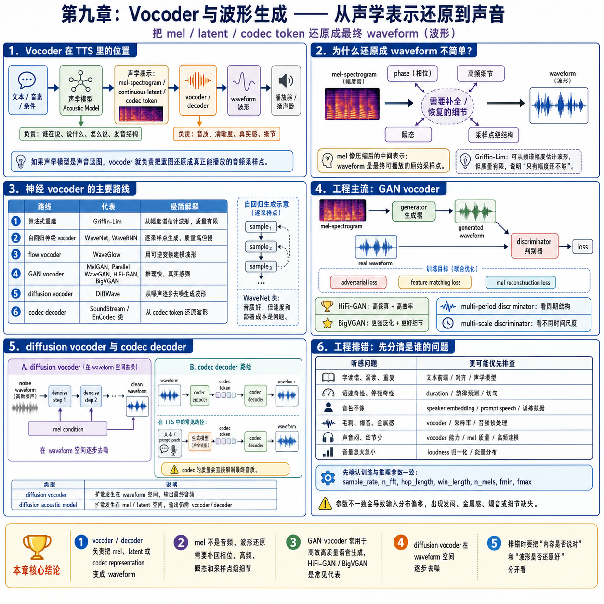

本章重点建立四种工程判断能力：

```text
第一，知道波形还原模块在 TTS 系统里的位置。
第二，知道它主要影响最终结果的哪些部分。
第三，能按输入输出理解不同波形还原方案。
第四，知道模型训练完成后，推理时哪些地方还能干预，哪些地方不能硬改。
```

## 本章目录

| 章节 | 主题 | 解决的问题 |
| --- | --- | --- |
| 9.1 | 波形还原模块在完整 TTS 方案中的位置 | vocoder、codec decoder、AudioVAE decoder 和声学模型、文本前端、后处理如何分工 |
| 9.2 | 这个模块影响最终结果的哪些部分 | 哪些听感问题更像波形还原问题 |
| 9.3 | 从声学表示到 waveform：还原为什么难 | mel、latent、token 到波形并非简单格式转换 |
| 9.4 | 按主生成对象拆解波形还原链路 | mel vocoder、codec decoder、AudioVAE decoder 和组合链路如何工作 |
| 9.5 | 主流系统里的选型对照 | OmniVoice、IndexTTS2、VoxCPM2、CosyVoice3 的输入输出怎么读 |
| 9.6 | 工程实践提示：选型、推理期干预与排错 | 如何选型、哪些能调、如何把内容问题和音质问题分开 |
| 9.7 | 本章小结 | 本章应该记住哪些判断 |

## 9.1 波形还原模块在完整 TTS 方案中的位置

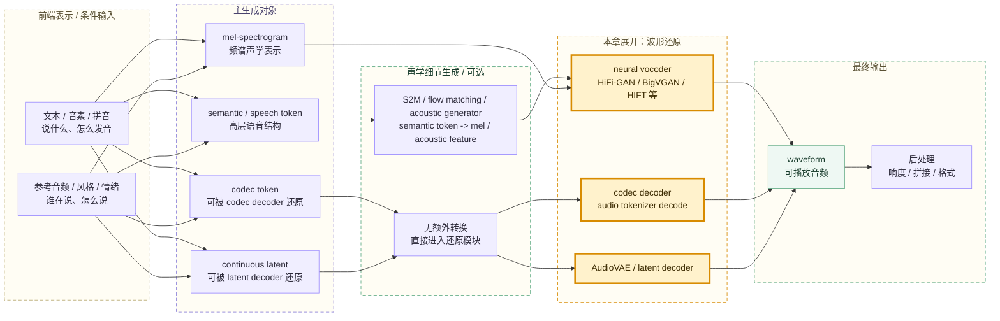

声学模型输出的 mel、latent 或 codec token 属于声音中间表示，需要经过还原模块才能变成 waveform。semantic / speech token 更靠近高层语音结构，通常还要先经过 S2M、flow matching 或 acoustic generator，才能进入真正的波形还原模块。

> 💡 **小科普：vocoder 和 decoder 有什么区别？**
>
> **vocoder** 是更具体的波形还原模型叫法，常见输入是 mel-spectrogram，输出是 waveform。**decoder** 是更泛的“解码端 / 还原端”叫法，可以出现在不同层级：声学模型里的 acoustic decoder 生成 mel、latent 或 codec token；codec decoder / AudioVAE decoder 则把 codec token 或 latent 还原成 waveform。

decoder 在 TTS 中常见于两个层级：

| 叫法 | 所在位置 | 输入 | 输出 | 工程含义 |
| --- | --- | --- | --- | --- |
| acoustic decoder / generator | 声学模型内部 | hidden representation、条件、对齐信息 | mel / latent / codec token | 声学模型的一部分，负责生成声音中间表示 |
| vocoder | 声学模型之后 | mel / spectrogram | waveform | 波形还原路线之一，常见于 mel 路线 |
| codec decoder / AudioVAE decoder | 声学模型之后 | codec token / continuous latent | waveform | 与 vocoder 并列的波形还原路线，常见于 token 或 latent 路线 |

完整链路使用“波形还原模块”作为总称，包含 vocoder、codec decoder 和 AudioVAE decoder。声学模型内部的 acoustic decoder 虽然也叫 decoder，但它输出的是中间声学表示，不是最终可播放声音。

完整链路中，常见模块分工如下：

| 模块 | 主要负责 | 典型输入 | 典型输出 | 层级提醒 |
| --- | --- | --- | --- | --- |
| 文本前端 / G2P | 文字规范化、音素、拼音、声调、多音字 | 原始文本 | 发音结构或文本 token | 前端输入层 |
| 主生成模型 / speech generator | 生成主目标表示 | 文本、音素、参考音频、条件 | semantic token / mel / latent / codec token | 声学生成层 |
| 声学细节生成 / acoustic generator | 把高层 token 落到更细的声学表示 | semantic / speech token、prompt 条件 | mel、acoustic feature、continuous representation | 可选中间层 |
| vocoder / codec decoder / AudioVAE decoder | 把可还原表示变成波形 | mel / codec token / continuous latent | waveform | 本章核心层 |
| 后处理 | 让音频适合交付和播放 | waveform | wav / mp3 / stream | 工程交付层 |

工程上可以把第九章这段理解成：

```text
主生成模型决定“先生成哪一种声音中间对象”。
声学细节生成模块决定“高层 token 如何落到可还原的声学表示”。
波形还原模块决定“这个表示还原成波形后听起来有多干净、真实、稳定”。
```

现实系统里，声学模型和波形还原模块会互相影响。声学模型输出已经错了，波形还原模块很难救回读错、漏读和韵律错乱；波形还原模块泛化差，也可能把正常的中间表示还原成有毛刺、金属感或高频缺失的声音。

## 9.2 这个模块影响最终结果的哪些部分

波形还原模块对最终结果影响很大，但它影响的维度和声学模型不一样。

| 听感维度 | 更像谁负责 | 工程解释 |
| --- | --- | --- |
| 内容是否读对 | 文本前端、对齐、声学模型 | 波形还原模块通常不理解文本内容 |
| 漏读、重复、跳字 | 声学模型、alignment、duration | 中间表示本身的时序已经有问题 |
| 语速、停顿、节奏 | duration、韵律建模、推理切句 | vocoder 会还原节奏，但通常不主动决定文本单位时长 |
| 音色是否像 | prompt speech、speaker 表征、声学模型、decoder | 音色线索需要被生成模型使用，也要被 decoder 保住 |
| 清晰度和细节 | 波形还原模块、声学表示质量 | 高频、瞬态、齿音、气声等细节很依赖还原模块 |
| 毛刺、爆音、金属感 | 波形还原模块、采样率、音频预处理 | 常见于输入分布不匹配、采样率配置不一致或 decoder 泛化差 |
| 发闷、带宽窄 | 波形还原模块、mel 参数、训练音频带宽 | 高频建模不足或目标采样率偏低时更明显 |
| 延迟和吞吐 | 波形还原模块、采样步数、部署后端 | 波形还原可能成为服务延迟的关键部分 |

一个实用判断是：

```text
如果“说的内容、停顿、节奏”已经错了，优先看文本前端、对齐和声学模型。
如果“内容基本对，但声音糊、炸、刺、金属、发闷”，优先看波形还原模块、采样率和音频参数。
```

波形还原模块不是边缘性的方案选型。它不一定决定语义内容，但会直接决定最终音频是否可听、耐听、稳定、适合上线。

## 9.3 从声学表示到 waveform：还原为什么难

waveform 是一串非常密集的采样点。以 24 kHz 音频为例，1 秒声音就有 24000 个采样点。声学模型通常先生成更短、更好建模的中间表示，再交给下游模块还原成采样点序列。

不同声学表示丢失或压缩的信息并不一样。mel-spectrogram（梅尔频谱）描述“每个时间片有哪些频率能量”，缺少 phase（相位）、高频细节、微小瞬态和采样点级别的周期结构。codec token 是离散索引，需要回到 codec 自己学到的 codebook 和 decoder 空间。continuous latent 是连续压缩坐标，需要由配套的 latent decoder 上采样并还原细节。

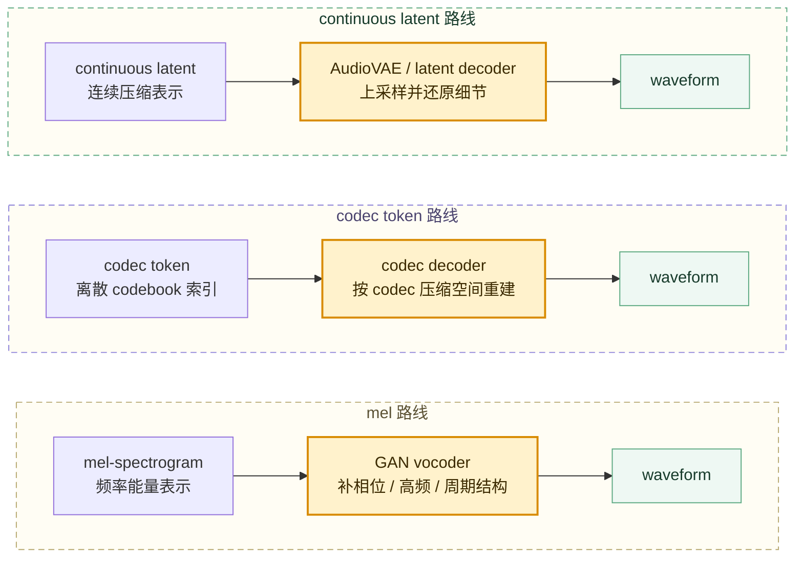

传统算法也可以尝试从 spectrogram（频谱图）的幅度信息估计 waveform，但质量有限。这个现象揭示了一个核心事实：

```text
对 mel / spectrogram 路线来说，只有频谱幅度还不够，波形还原还需要恢复相位和细节。
```

现代 neural vocoder（神经声码器）和 neural audio decoder（神经音频解码器）会从大量真实音频里学习“什么样的波形听起来像真实语音”。它们属于学习出来的生成模块，并非普通格式转换器。

## 9.4 按主生成对象拆解波形还原链路

OmniVoice、IndexTTS2、VoxCPM2、CosyVoice3 这类系统中的波形还原链路，通常可以按“主生成对象、声学细节生成、最终波形还原”三层阅读。常见工程形态可以归纳为四类：

| 链路类型 | 主生成对象 | 声学细节生成 / 中间转换 | 最终波形还原 | 典型对应系统 |
| --- | --- | --- | --- | --- |
| mel -> GAN vocoder | mel-spectrogram | 通常不需要额外转换 | GAN vocoder | IndexTTS / IndexTTS2、许多混合路线 |
| codec token -> codec decoder | codec token / acoustic token | 通常直接进入 codec decoder | codec decoder | OmniVoice、部分 Speech LM 路线 |
| continuous latent -> AudioVAE decoder | continuous speech latent | latent 由上游生成或修正 | AudioVAE / latent decoder | VoxCPM2、连续表示路线 |
| speech token -> flow/S2M -> waveform restoration | semantic / speech token | flow matching、S2M 或 acoustic generator 生成 mel / acoustic feature | 波形还原模块 | CosyVoice / CosyVoice3 类级联系统 |

diffusion vocoder 和 diffusion / flow matching acoustic generator 属于不同层级。diffusion vocoder 在 waveform 空间逐步去噪生成最终波形；diffusion / flow matching acoustic generator 在 mel、latent 或与 token 条件相关的声学表示空间里生成中间表示。第十章会继续展开 diffusion / flow matching 作为新一代 TTS 生成范式的作用。

### 9.4.1 GAN vocoder：把 mel-spectrogram（梅尔频谱）补成波形

GAN vocoder 是 vocoder 的一种神经网络实现方式。vocoder 是模块职责，表示“把声学表示还原成 waveform”；GAN vocoder 是实现路线，表示“用 GAN 的训练方式训练一个能从 mel 生成 waveform 的 vocoder”。

常见的 HiFi-GAN、BigVGAN 都属于这类思路。它们在推理时接收 mel-spectrogram，输出 waveform；在训练时额外使用 discriminator（判别器）来提高生成波形的真实感。

| 名词 | 所属关系 | 在链路里的含义 | 推理时是否参与生成 |
| --- | --- | --- | --- |
| vocoder | 完整 TTS 系统里的波形还原模块 | 把声学表示还原成 waveform 的职责名 | 参与 |
| GAN vocoder | vocoder 的一种实现方式 | 用 GAN 训练方式得到的神经 vocoder | 参与，实际运行主体通常是其中的 generator |
| generator（生成器） | GAN vocoder 的训练组件，也是最终部署组件 | 从 mel 生成 waveform 的模型 | 参与，是推理时真正运行的主体 |
| discriminator（判别器） | GAN vocoder 的训练组件 | 训练时判断真实波形和生成波形的模型 | 通常不参与最终推理 |
| loss（损失） | GAN vocoder 训练过程中的优化信号 | 训练时计算出来的差距信号，用来更新 generator / discriminator 权重 | 不参与最终推理 |

mel -> GAN vocoder 是工程中很常见的成熟路线。声学模型先生成 mel-spectrogram，vocoder 再把 mel 还原成 waveform。

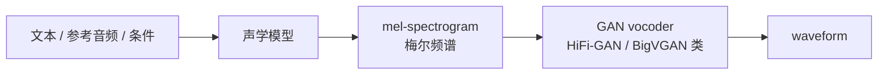

**推理阶段**只需要 generator。此时输入是一段 mel-spectrogram，输出是一段 waveform。

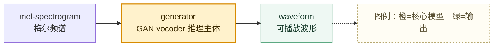

**训练阶段**会同时使用 generator 和 discriminator。generator 负责把 mel 生成波形；discriminator 负责看真实波形和生成波形的差异；loss 把这些差异变成可反向传播的训练信号。

> 💡 **小科普：real waveform 和 target mel 是什么关系？**
>
> real waveform 是训练样本里的真实录音；target mel 是从这段真实录音中提取出来的梅尔频谱。训练时，generator 用 target mel 作为输入，生成 generated waveform；discriminator 用 real waveform 作为真样本对照；mel reconstruction loss 会把 generated waveform 再提 mel，并和 target mel 对比。

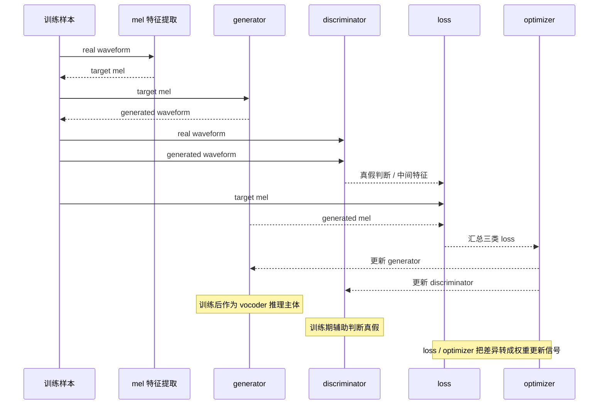

GAN vocoder 的训练对象包括 generator 和 discriminator 的权重。训练完成后，推理服务通常只使用 generator，把它当成真正的 vocoder。discriminator 的价值在训练阶段，它提供更强的真实性约束，帮助 generator 生成更像真实录音的波形。

> 💡 **小科普：loss 是什么？**
>
> loss（损失）是训练时计算出来的“差距分数”。它把“生成结果和目标结果差多少”变成一个数字，optimizer 再根据这个数字更新模型权重。在 GAN vocoder 里，loss 属于训练期优化信号，用来训练 generator / discriminator；推理部署时运行的是训练后的 generator。

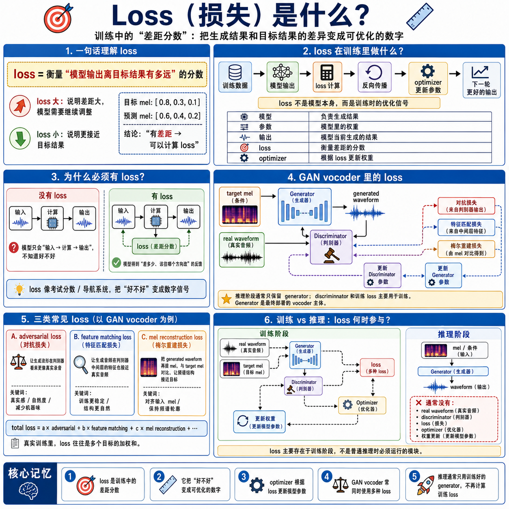

常见 loss 包括：

| loss | 约束谁 | 极简解释 |
| --- | --- | --- |
| adversarial loss（对抗损失） | 主要约束 generator，也训练 discriminator | 让生成波形在判别器看来更像真实录音 |
| feature matching loss（特征匹配损失） | 约束 generator | 让生成音频经过判别器中间层时，特征也接近真实音频 |
| mel reconstruction loss（梅尔重建损失） | 约束 generator | 把 generated waveform 再提 mel，与 target mel 对比，让频谱结构接近真实录音 |

mel 已经描述了每个时间片的频率能量，但缺少相位、高频和采样点级细节。GAN vocoder 的 generator 学习补齐这些细节；discriminator 在训练时提供“是否像真实录音”的反馈；多个 loss 共同把反馈转成模型权重更新。

这条路线的工程优点是快、成熟、容易单独替换和调试。需要小心的是 mel 配置必须匹配，包括 `sample_rate`、`n_fft`、`hop_length`、`n_mels`、`fmin`、`fmax` 等。mel 参数不匹配时，vocoder 很容易发闷、爆音或出现金属感。

### 9.4.2 codec decoder：把 codec token（语音 token）还原成声音

codec token 路线把语音压缩成离散 token。神经音频 codec 链路通常包含两个处理单元：**codec encoder** 负责把 waveform 压缩成 codec token，**codec decoder** 负责把 codec token 还原成 waveform。TTS 推理更关注 decoder 这一端，因为主模型通常已经直接生成目标 codec token。

在波形还原这一层，**codec decoder 和 GAN vocoder 是并列路线**：GAN vocoder 通常接收 mel-spectrogram，codec decoder 接收 codec token。二者输入不同，训练方式和内部结构不同，但工程职责都是把某种声音中间表示还原成 waveform。

> 💡 **小科普：codec token 的角色**
>
> codec token 可以理解成神经音频 codec 产生的“离散声音编码”，是模型之间传递的中间表示。codec encoder 的工作是编码压缩，codec decoder 的工作是波形还原；在波形还原链路里，decoder 端承担类似 vocoder 的职责。

完整 codec 通常包含 encoder 和 decoder 两个处理单元，中间产物是 codec token：

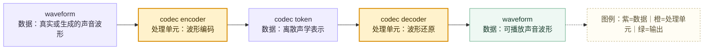

TTS 推理时，主模型通常只负责生成目标 codec token，codec decoder 再把这些 token 还原成 waveform。

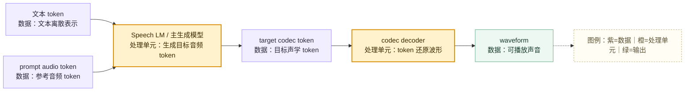

这条路线适合 speech LM（语音语言模型）和 zero-shot voice cloning（零样本声音克隆），因为文本 token、参考音频 token 和目标音频 token 可以更自然地组织在同一套序列建模框架里。

它的关键边界是：codec token 空间和 codec decoder 强绑定。不同 tokenizer、codebook 数量、token rate、采样率或 decoder 版本不匹配，通常不能随便互换。OmniVoice 就属于这类需要关注 audio tokenizer / codec decoder 的路线。

### 9.4.3 AudioVAE decoder：把 continuous latent（连续潜变量）还原成高采样率音频

<u><strong><em>链路位置</em></strong></u>

continuous latent 路线使用连续潜变量作为主要语音表示。主生成模型在连续空间里生成或修正语音表示，后面的 AudioVAE / latent decoder 再把连续表示还原成 waveform。本小节讨论 latent decoder 这一步；waveform 空间的 diffusion vocoder 属于另一类波形生成模块。

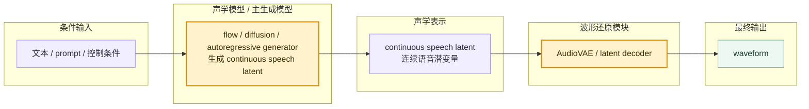

条件输入负责告诉系统“说什么、像谁说、按什么风格说”。这些条件通常不会直接进入 AudioVAE decoder，而是先交给声学模型使用；decoder 看到的是后面生成出来的 continuous latent。

图中的 flow、diffusion、autoregressive generator 是声学模型内部可能采用的生成方式。它们的目标不是直接输出 waveform，而是生成或修正 continuous speech latent，让后面的 decoder 有可还原的连续声学表示可以使用。

<u><strong><em>方案优势</em></strong></u>

这条路线的直觉是：连续表示可能保留更多细腻声学变化，例如情绪、气声、节奏和局部音色细节；同时又比直接生成原始 waveform 更短、更适合模型处理。它和 codec token 路线的区别在于，codec token 先把声音压成离散编号，continuous latent 则保留连续坐标；前者更适合接入普通序列建模，后者更适合 flow / diffusion 这类连续生成范式。

VoxCPM2 这类连续表示路线的重点在于生成连续语音表示，再通过 AudioVAE V2 这类 decoder 输出音频。它仍然有压缩和还原模块，但主生成对象不是传统 RVQ 离散 token，而是连续语音潜变量。

<u><strong><em>技术解释</em></strong></u>

> 💡 **小科普：continuous latent 不是“隐藏的音频文件”**
>
> continuous latent 是一串连续向量，通常按时间排列，每个向量压缩一小段声音上下文。它不像 codec token 那样是离散编号，也不像 mel-spectrogram 那样是人工设计的频谱图，而是 AudioVAE / encoder-decoder 系统从真实音频中学出来的连续压缩坐标。

从技术上看，AudioVAE 类链路先学习一个可还原的 latent space（潜变量空间）。训练阶段，真实 waveform 先经过 encoder 压缩成 continuous latent，decoder 再尝试从 latent 重建 waveform；训练目标会约束重建音频在波形、频谱和听感上接近真实录音。这个过程让 decoder 学会一件事：**只要输入落在它熟悉的 latent space 里，就能把压缩坐标展开成高采样率波形**。

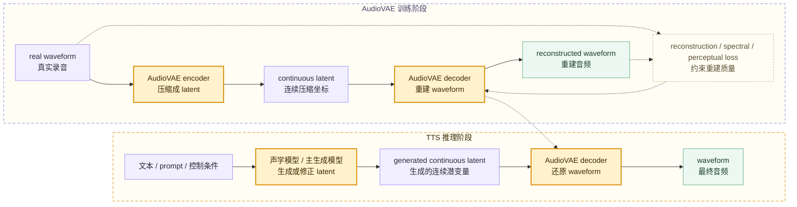

推理阶段的关键变化是：真实音频 encoder 不再是主链路。声学模型直接生成或修正 continuous latent，AudioVAE decoder 接收这些 latent 并展开为 waveform。decoder 的工作不是理解文本，也不是重新决定语义内容，而是把已经生成好的连续声学表示还原成采样点级声音。

| 技术点 | 含义 | 对波形还原的影响 |
| --- | --- | --- |
| continuous latent 是浮点向量序列 | 每个时间位置是一组连续数值，不是离散 token id | 可以表达更细的强弱、气声、局部音色和韵律变化 |
| latent space 和 decoder 成套训练 | decoder 只熟悉训练时形成的潜变量分布 | 换 decoder、换 latent 维度或换采样率通常不能直接兼容 |
| decoder 负责上采样和细节补全 | latent 比 waveform 短得多，缺少采样点级细节 | decoder 要补出周期结构、高频、瞬态和相位相关细节 |
| 主生成模型负责 latent 质量 | flow / diffusion / autoregressive generator 生成 decoder 的输入 | latent 偏离训练分布时，输出容易糊、炸、金属感或音色漂移 |
| 高采样率来自 decoder 设计与训练目标 | 输出采样率由 AudioVAE / decoder 配置和训练数据决定 | 不能只靠后处理把低质量 latent 变成真正高保真音频 |

AudioVAE decoder 输出的是采样点级 waveform，后面通常只再接响度、格式、拼接或流式分包等工程后处理。这里已经进入可播放音频层，声音里的毛刺、爆音、带宽不足或高频缺失，往往要回到 latent 质量、decoder 能力、采样率配置和训练数据覆盖范围中排查。

它的工程边界也很明确：latent decoder 必须和 latent space 成套使用。decoder 只熟悉训练时形成的潜变量分布；换 decoder、换 latent 维度、换采样率或换 AudioVAE 版本时，通常不能直接兼容。

### 9.4.4 flow/S2M + vocoder：把 speech token（语音 token）分层生成再还原

还有一类当前很常见的强系统采用分层组合。speech / semantic token 通常作为高层语音结构，flow matching、S2M 或 acoustic generator 会把它转换成更细的声学表示，再交给波形还原模块生成 waveform。

```text
高层 speech / semantic token 负责内容、语义和粗粒度韵律。
flow matching / S2M / acoustic generator 负责生成更细的声学表示。
波形还原模块负责把声学表示还原成 waveform。
```

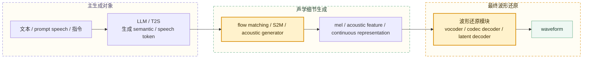

CosyVoice / CosyVoice3 这类系统适合用这种分层视角理解。LLM 或 T2S 模块负责高层 token 建模，flow matching 或声学生成器负责把 token 变成更细的声学表示，最后再由波形还原模块输出波形。

这类方案的优势是能力强、扩展性好，适合 zero-shot、多语言、情绪、流式等复杂场景。代价是模块更多，排错时需要区分：问题出在 LLM token 生成、flow 声学生成，还是最后的波形还原模块。

## 9.5 主流系统里的选型对照

当前主流 TTS 系统通常组合使用 LLM、speech token、flow matching、vocoder、codec decoder、AudioVAE 和推理调度。阅读系统方案时，可以按以下问题定位模块边界：

```text
主模型生成什么？
中间是否还有声学细节生成？
最终还原模块输入是什么？
还原模块输出什么？
这个选择带来什么工程优势和限制？
```

下面按主要模型族做模块级对照。

| 系统 / 路线 | 主生成对象 | 声学细节生成 / 中间转换 | 最终波形还原模块 | 还原模块输入 | 还原模块输出 | 工程理解 |
| --- | --- | --- | --- | --- | --- | --- |
| OmniVoice | 多 codebook audio / acoustic token | 通常直接进入 audio tokenizer decode | audio tokenizer decode / codec decoder | codec token | 24 kHz waveform | 主模型在 token 空间生成声音表示，音频 tokenizer 的 decoder 负责把 token 变回波形 |
| IndexTTS2 | 自回归 semantic token | S2M 生成 mel-spectrogram，必要时结合 GPT latent 等稳定声学细节 | BigVGANv2 类 vocoder | mel / acoustic feature | waveform | 强调 duration control、情绪和音色解耦，最终由 vocoder 把 mel 类表示落到波形 |
| VoxCPM2 | continuous speech representation | Local DiT / CFM 等上游模块生成或修正 continuous latent | AudioVAE V2 / latent decoder | continuous latent | 48 kHz waveform | 不以离散 audio token 为主，重点是连续表示、AudioVAE 解码和高采样率输出 |
| CosyVoice3 / CosyVoice 系列 | LLM 生成 speech / semantic token | flow matching / acoustic generator 把 token 转成更细声学表示 | 波形还原模块 | mel、acoustic feature 或连续声学表示 | waveform | 体现“LLM token -> flow/acoustic generator -> waveform restoration”的级联式趋势 |

这些系统在波形还原链路中的位置如下：

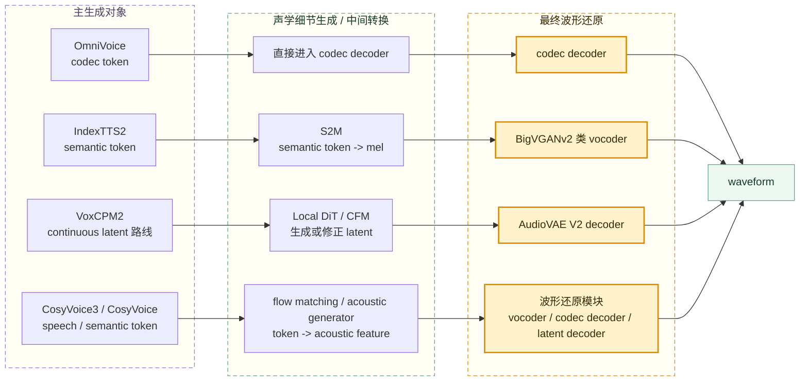

## 9.6 工程实践提示：选型、推理期干预与排错

前面几节回答“有哪些模块”和“不同系统怎么落地”。工程实践还要再问三件事：选型时看什么，推理时哪些能调，出问题时先查哪一层。

### 9.6.1 选型时真正要看的问题

分析一个 TTS 方案时，波形还原部分可以按下面几个问题拆：

| 问题 | 为什么重要 |
| --- | --- |
| 主生成对象是什么 | 决定它是 mel、codec token、continuous latent，还是还要继续转换的 semantic token |
| 中间是否还有声学细节生成 | 避免把 flow matching / S2M 误当成最终 vocoder |
| 最终还原模块输入是什么 | 输入不兼容时，decoder 再强也不能正常工作 |
| 输出采样率是多少 | 直接影响带宽、清晰度、文件大小和部署成本 |
| 是否支持流式 | 影响首包延迟和实时服务体验 |
| 能否单独替换 | 影响工程调优和系统升级空间 |
| 坏音质如何排查 | 决定要看 mel 参数、codec token、latent 分布还是后处理 |

不同选型的输入输出差异，会直接影响工程能力：

| 选型 | 优势 | 需要小心 |
| --- | --- | --- |
| mel -> GAN vocoder | 成熟、快、好排查 | mel 参数和采样率必须匹配，mel 本身压缩了相位和部分高频细节 |
| codec token -> codec decoder | 适合 speech LM、prompt speech、离散 token 建模 | codec token 空间绑定 decoder，codec 质量限制最终上限 |
| continuous latent -> AudioVAE decoder | 保留连续细节，适合 flow / diffusion 类生成 | latent 空间和 decoder 强绑定，采样和部署复杂度更高 |
| speech token -> flow/S2M -> vocoder | 能把高层语义和声学细节分层建模 | 模块多，归因时要分清 token 生成、声学细节生成和最终波形还原 |

可以把选型判断压缩成一句话：

```text
先看主模型生成什么，再看中间是否还要转换，最后看波形还原模块接收什么输入；输入空间不兼容，所谓“换一个更强 decoder”通常不会生效。
```

### 9.6.2 推理期哪些环节还能干预

模型训练完成后，权重通常不会在普通推理中更新。工程可控性按模块层级分布：上游输入会改变生成内容和声学表示，采样会改变生成分布，decoder 配置会影响波形还原，后处理只负责交付形态。

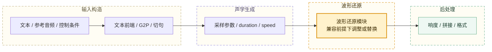

常见可干预点如下：

| 环节 | 推理时能做什么 | 边界 |
| --- | --- | --- |
| 文本规范化 | 把数字、日期、缩写写成更稳定的读法 | 只能影响输入发音结构，不能让模型学会训练中没有的发音规律 |
| G2P / 拼音 / 音素 | 指定多音字读法、外语发音、中文声调 | 需要模型训练时见过或能理解对应符号 |
| 切句和停顿 | 控制长文本分块、标点、静音间隔 | 切得太碎会破坏上下文和韵律连续性 |
| prompt speech / speaker 条件 | 换参考音频、参考文本、音色描述 | 参考音频质量差会污染音色和风格 |
| duration / speed | 控制整体时长、语速或部分节奏 | 过度拉伸会导致不自然、吞字或拖音 |
| sampling steps / temperature / guidance | 权衡稳定性、多样性、条件遵从和速度 | 参数只能改变生成分布，不能补出模型完全没学到的能力 |
| 波形还原模块 | 在兼容前提下换更强的还原模块，或调整解码配置 | 输入表示、采样率、mel 参数、codec token 空间必须兼容 |
| 后处理 | 响度归一化、去静音、淡入淡出、格式转换 | 后处理不能修复已经读错或已经严重失真的生成内容 |

工程上可以归纳为：

```text
文本到音素、拼音、多音字、切句、参考音频、duration、speed、采样参数、音频后处理，通常都是推理期比较灵活的干预点。
波形还原模块也可能是推理期可替换或可调的部分，但必须满足表示空间和配置兼容。
已经训练好的主模型权重和 decoder 权重本身，普通推理时通常不更新；如果能力缺失，往往需要重新训练、微调或换模型方案。
```

推理期干预需要沿着模型训练时见过的接口进行。TTS 的每个模块都有自己的输入分布，偏离输入分布的强行修改容易带来毛刺、音色漂移、节奏异常或生成失败。

### 9.6.3 工程排错：把内容问题和音质问题分开

排错时可以先按听感现象区分问题来源。

| 听感问题 | 更可能优先排查 |
| --- | --- |
| 字读错、漏读、重复 | 文本前端、G2P、alignment、声学模型 |
| 语速奇怪、停顿奇怪 | duration、韵律预测、切句策略 |
| 音色不像 | prompt speech、speaker 表征、声学模型、波形还原模块是否保住音色细节 |
| 毛刺、爆音、金属感 | 波形还原模块、采样率、音频预处理 |
| 声音闷、细节少 | 波形还原能力、mel 质量、高频建模、目标采样率 |
| 音量忽大忽小 | loudness（响度）归一化、能量分布、后处理 |
| 流式首包慢 | 主模型生成速度、波形还原模块速度、服务调度 |

vocoder 排查中最常见的硬条件，是确认训练和推理的音频参数一致。

```text
sample_rate
n_fft
hop_length
win_length
n_mels
fmin
fmax
codec codebook 配置
latent 维度和帧率
```

这些参数不一致，会导致输入分布偏移。输入分布偏了，即使模型本身质量很好，也可能出现发闷、金属感、爆音或细节缺失。

如果系统能导出中间表示，排查会更清晰：

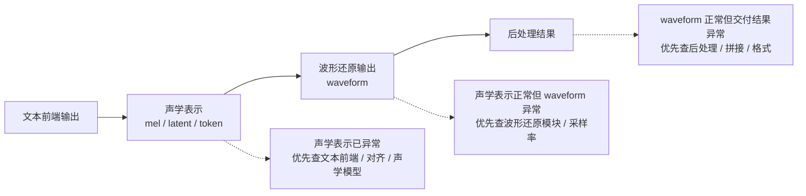

## 9.7 本章小结

本章核心结论：

```text
vocoder、codec decoder 和 AudioVAE decoder 都属于完整 TTS 链路里的波形还原模块，位于声学模型之后。
它主要影响音质、细节、真实感、毛刺、爆音、带宽、延迟和稳定性。
mel、codec token、continuous latent 是不同声学表示，对应不同还原模块。
semantic / speech token、flow matching、波形还原模块分别处在不同层级：token 偏高层结构，flow / S2M 偏声学细节生成，vocoder、codec decoder、AudioVAE decoder 偏最终波形还原。
OmniVoice、IndexTTS2、VoxCPM2、CosyVoice3 的差异，可以从“主生成对象 -> 中间声学生成 -> 最终还原模块输入输出”来读。
训练完成后的推理干预主要发生在输入构造、发音控制、采样参数、解码配置和后处理上。
排错时要把“内容是否说对”和“波形是否还原好”分开看。
```

下一章进入 diffusion（扩散模型）与 flow matching（流匹配）：它们不仅可以用于 waveform 空间的 vocoder，也可以作为 acoustic model / speech generator 在 mel、latent 或 codec token 空间里的生成范式。
