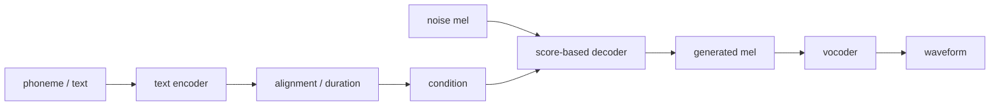

# 第十章：扩散模型与新一代 TTS

本章进入后半部分的核心：扩散模型、条件生成、latent diffusion、codec 表征与 flow matching。

## 10.1 扩散模型基本思想

```text
训练时：
干净数据 x0 → 加噪 → xt

推理时：
随机噪声 xT → 去噪 → x0
```

对应到 TTS：

```text
noise
 + text condition
 + speaker condition
 + style condition
 → mel / latent / waveform
```

## 10.2 条件扩散

TTS 几乎一定是条件生成：

```text
p(x | c)
```

其中：

```text
x = mel / latent / waveform / codec token
c = text, phoneme, speaker, emotion, style, prompt speech, language
```

常见条件注入方式：

```text
condition encoder
cross-attention
adaptive layer norm
classifier-free guidance
condition dropout
masked generation
```

## 10.3 Diffusion TTS 替换了哪个模块

以 Grad-TTS 这类模型建立直觉：



扩散模型可以作为 acoustic decoder，也可以作为 vocoder，还可以在 latent 或 codec token 空间做生成。

## 10.4 Flow Matching

Flow matching 可以先粗略理解为：

```text
Diffusion：从噪声逐步去噪
Flow matching：学习从噪声到数据的连续变换路径
```

现代 TTS 中，flow matching 常和 DiT、masked speech generation、prompt-based TTS 结合，用于提升自然度、可控性和推理效率。
