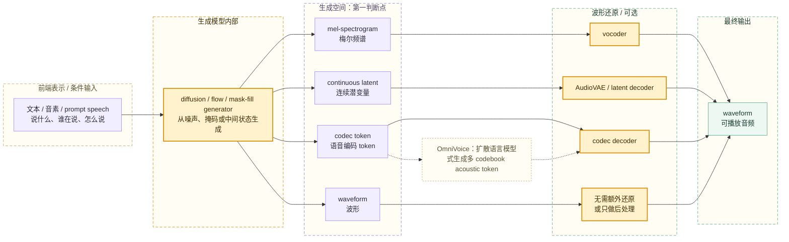
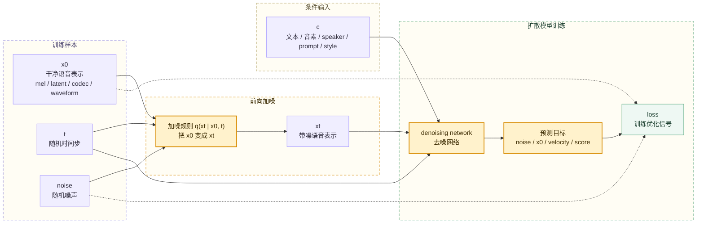
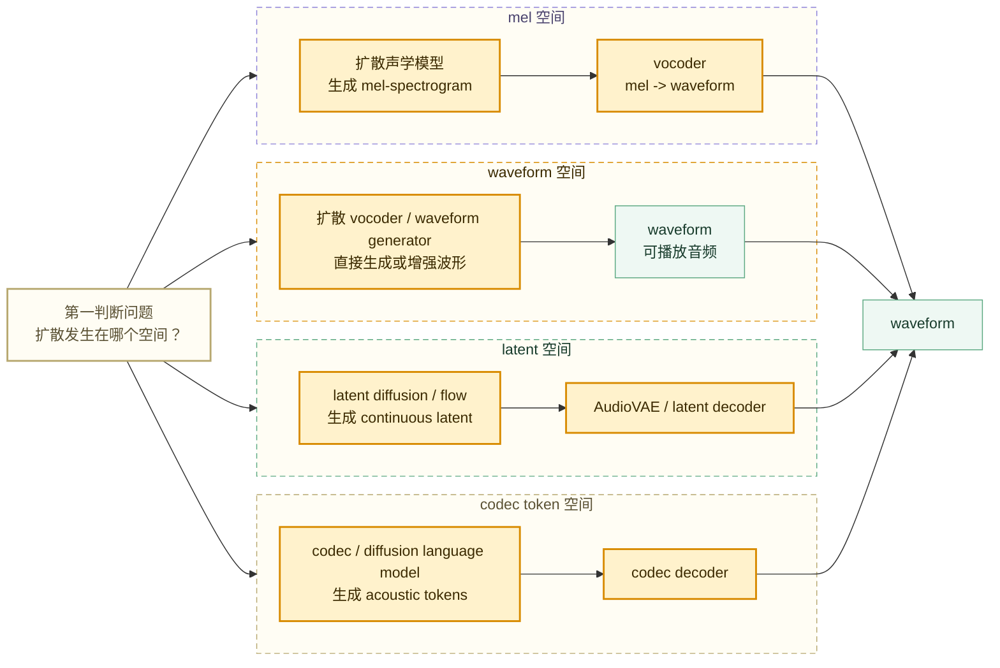
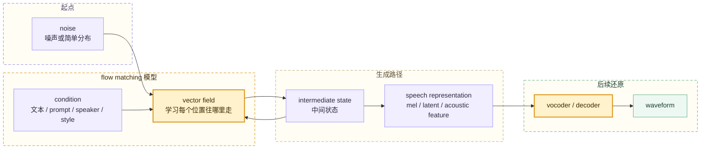
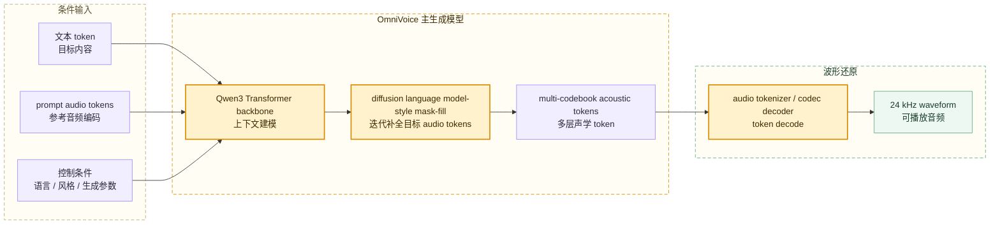

# 第十章：扩散模型与新一代 TTS —— diffusion、flow matching 与 OmniVoice

扩散模型（diffusion model）在 TTS（Text-to-Speech，文本转语音）里不是一个独立的完整系统，而是一类**生成范式**。它可以放在声学模型里生成 mel、latent 或 codec token，也可以放在波形还原层直接生成 waveform；新一代系统还常把 diffusion 和 flow matching、Transformer / LLM 主干、codec token、prompt speech 组合起来。

读 diffusion TTS 方案时，第一步不是问“它是不是扩散模型”，而是问：

```text
扩散发生在哪个空间？
```

这个问题决定了模型在生成什么、后面还需要哪个还原模块、推理速度为什么快或慢，以及它更像 OmniVoice、VoxCPM2、CosyVoice，还是传统 mel + vocoder 路线。

## 本章导读

本章用三条线索读 diffusion TTS：

| 线索 | 要回答的问题 | 典型结论 |
| --- | --- | --- |
| 概念 | diffusion / flow matching 在学什么 | 从噪声、掩码或中间状态生成语音表示 |
| 优势 | 为什么 TTS 需要生成式建模 | 同一句话可以有多种合理音色、节奏、情绪和细节 |
| 模块 | diffusion 放在系统哪里 | 声学模型、latent / codec 生成、vocoder 都可能使用 diffusion 类方法 |

扩散或 flow 在 TTS 里的位置如下：



图里的四个生成空间是本章主线。mel、latent、codec token 和 waveform 都是不同层级的对象，不能混成一种“扩散输出”。

## 10.1 扩散模型在 TTS 里解决什么问题

TTS 有一个天然难点：同一句文本可以有很多合理读法。

```text
你真的要去吗？
```

这句话可以读成疑问、惊讶、生气、调侃、平静或不相信。文本内容一样，但 duration（时长）、pitch / F0（音高 / 基频）、energy（能量）、pause（停顿）、voice quality（嗓音质感）和情绪表达都可能不同。

传统确定性模型容易学到“平均读法”。生成式模型更适合表达这种一对多关系：

```text
同一个条件 c，可以生成多个合理的 x。
```

其中：

```text
c = 文本、音素、说话人、情绪、风格、prompt speech
x = mel、waveform、continuous latent 或 codec token
```

diffusion / flow matching 在 TTS 里的价值可以概括为：

| 价值 | 工程含义 |
| --- | --- |
| 建模多样性 | 同一文本可以生成不同情绪、节奏、语气和音色细节 |
| 支持条件生成 | 文本、音色、prompt speech、style 都能作为条件进入模型 |
| 适配不同生成空间 | 可以生成 mel、latent、codec token，也可以直接生成 waveform |
| 改善自然度 | 逐步生成或连续路径生成更容易补足细节和随机性 |
| 代价是推理复杂 | 多步采样、采样器、缓存、蒸馏和 RTF 都会成为工程问题 |

扩散模型不是“让 TTS 读懂文本”的模块。文本理解、发音结构、音素、prompt 条件和音色表征仍然来自前端、编码器、Transformer / LLM 主干或音频 tokenizer。diffusion 主要回答的是：**在给定条件下，如何生成更自然的语音表示**。

## 10.2 训练和推理：加噪、去噪与 loss

扩散模型的基本直觉是两句话：

```text
训练时：把干净数据变成带噪数据，让模型学习如何恢复。
推理时：从噪声或中间状态开始，逐步生成干净语音表示。
```

训练流程由数据、条件、模型和 loss 四类对象组成：



常见预测目标包括：

| 预测目标 | 直觉 |
| --- | --- |
| noise prediction（噪声预测） | 预测加进去的噪声 |
| x0 prediction（干净样本预测） | 直接预测原始干净语音表示 |
| velocity prediction（速度预测） | 预测从噪声到数据路径上的速度变量 |
| score prediction（分数预测） | 预测往高概率数据区域移动的方向 |

这些目标公式不同，但读 TTS 方案时可以先统一理解为：模型在学习如何把带噪表示拉回“像真实语音”的区域。

推理阶段和训练阶段的差异是：推理时没有真实答案 x0，也不计算训练 loss。系统从随机噪声、掩码 token 或中间状态开始，按采样器一步步生成目标语音表示。

## 10.3 按生成空间分类：mel、waveform、latent 与 codec token

diffusion TTS 的核心分类不是“用了什么网络名”，而是**生成空间在哪里**。



常见路线如下：

| 路线 | diffusion / flow 生成什么 | 后续模块 | 代表直觉 |
| --- | --- | --- | --- |
| acoustic diffusion | mel-spectrogram 或声学特征 | vocoder | Grad-TTS 类模型把扩散用作 acoustic decoder |
| waveform diffusion | waveform | 可能只需后处理 | DiffWave 类模型把扩散用作 vocoder / waveform generator |
| latent diffusion / flow | continuous latent | AudioVAE / latent decoder | VoxCPM2、F5-TTS / E2-TTS 类路线帮助理解连续空间生成 |
| codec token diffusion / DLM | codec token / acoustic token | codec decoder | OmniVoice 这类系统在多 codebook token 空间生成 |

这里的层级不能混淆：

```text
diffusion / flow matching 是生成方式。
mel、waveform、latent、codec token 是生成空间。
vocoder、AudioVAE decoder、codec decoder 是波形还原模块。
Transformer / LLM 是主干网络。
alignment / duration 是文本到语音时序关系的处理机制。
```

## 10.4 条件生成与控制强度

TTS 几乎一定是 conditional generation（条件生成）。模型不是随便生成一段语音，而是在条件 c 的约束下生成目标 x：

```text
p(x | c)
```

其中：

```text
x = mel / waveform / continuous latent / codec token
c = text, phoneme, speaker, emotion, style, prompt speech, language
```

常见条件如下：

| 条件 | 控制什么 |
| --- | --- |
| text / phoneme（文本 / 音素） | 说什么、发音结构 |
| duration（时长） | 每个音持续多久 |
| pitch / F0（音高 / 基频） | 语调和音高走势 |
| energy（能量） | 强弱和力度 |
| speaker / prompt speech（说话人 / 提示语音） | 谁在说、音色和局部风格 |
| emotion / style（情绪 / 风格） | 说话方式 |

条件进入模型的方式可能是 condition encoder、cross-attention、adaptive layer norm、prefix token、prompt token 或 condition dropout。不同论文术语不同，但工程目的相同：让生成模型知道“该按什么约束生成”。

classifier-free guidance（无分类器引导）常用于条件生成。训练时，模型既见过有条件输入，也见过条件被丢掉的输入；推理时，对两种预测做组合，以增强条件控制力。

| guidance 太低 | guidance 太高 |
| --- | --- |
| 条件不明显，音色、风格或文本遵从可能偏弱 | 声音可能僵硬、失真、不自然，甚至牺牲多样性 |

guidance scale 是控制强度旋钮，不是万能开关。对声音克隆和情绪控制来说，过强的条件约束可能让声音更像参考，但也可能让韵律变窄、音质变硬。

## 10.5 Flow matching 和新一代 TTS

flow matching（流匹配）和 diffusion 很接近，都是从简单分布生成复杂数据分布的生成范式。区别在于，diffusion 常被理解为“逐步加噪 / 去噪”，flow matching 更强调学习从噪声到数据的连续变换速度场。

```text
Diffusion：学习多步去噪过程。
Flow matching：学习从噪声到数据的连续路径和速度方向。
```

flow matching 的直觉是一条从噪声到语音表示的生成路径：



现代 TTS 中，flow matching 常和 DiT（Diffusion Transformer）、prompt speech、speech infilling、zero-shot TTS、latent generation、mel generation 结合。CosyVoice / CosyVoice3、F5-TTS / E2-TTS、VoxCPM2 这类系统都可以帮助建立这种直觉：生成模型不一定直接吐 waveform，而是先生成某种声学表示，再交给 vocoder 或 decoder。

flow matching 的工程价值通常体现在三点：

| 价值 | 工程含义 |
| --- | --- |
| 路径更直接 | 可以减少采样步数或更好地控制采样轨迹 |
| 适合连续空间 | mel、continuous latent、acoustic feature 都适合用连续路径建模 |
| 易和 Transformer 结合 | DiT / Transformer 主干可以承接文本和 prompt 条件 |

## 10.6 OmniVoice 的位置：扩散语言模型式 codec token 生成

OmniVoice 适合作为理解“diffusion 不只发生在 mel 或 waveform 上”的例子。它不是传统 `mel -> vocoder` 路线，也不是直接在原始 waveform 上做扩散；它更接近 **codec token / speech LM 路线**：主模型用 diffusion language model-style architecture（扩散语言模型式架构）直接生成多 codebook acoustic tokens，再由音频 tokenizer / codec decoder 还原为 waveform。



该链路分为三层：

| 层级 | OmniVoice 中的直觉 | 和 diffusion TTS 的关系 |
| --- | --- | --- |
| 条件输入 | 文本 token、参考音频 token、控制条件 | 决定说什么、像谁、以什么方式生成 |
| 主生成模型 | Transformer 主干 + diffusion language model-style mask-fill | diffusion 风格发生在目标 audio token 生成过程 |
| 波形还原 | codec decoder 把 acoustic tokens 还原成 waveform | 第九章讨论的 codec decoder 路线 |

所以 OmniVoice 中“扩散”的读法不是“扩散声码器”，也不是“mel diffusion acoustic model”。更准确的工程理解是：**主模型在 codec token 空间里做扩散语言模型式生成，最后由 codec decoder 还原波形**。

## 10.7 阅读清单与工程小结

读 diffusion / flow TTS 论文或 README 时，按下面问题拆解：

| 问题 | 为什么重要 |
| --- | --- |
| 输入条件是什么 | text、phoneme、prompt speech、speaker、style 决定控制能力 |
| 生成空间在哪里 | mel、waveform、latent、codec token 决定系统层级 |
| diffusion / flow 替换了哪个模块 | 声学模型、vocoder、latent generator 或 codec generator 不能混为一谈 |
| 后面是否还需要 decoder | 判断是否依赖 vocoder、AudioVAE decoder 或 codec decoder |
| 是否需要 alignment / duration | 决定文本长度和语音长度如何对应 |
| 条件如何注入 | cross-attention、AdaLN、prefix token、prompt token 会影响可控性 |
| 训练目标是什么 | noise、x0、velocity、score 或 flow matching 影响训练和采样 |
| 推理需要多少步 | 直接影响延迟、RTF 和流式可用性 |
| 主要提升是什么 | 音质、自然度、速度、可控性、zero-shot 能力要分开看 |
| 和 OmniVoice 的关系是什么 | 判断它是否属于 codec token / DLM 风格、latent flow，还是 mel/vocoder 路线 |

扩散 TTS 工程落地还要关注速度。扩散模型常被说慢，是因为推理通常需要多步采样：

```text
noise -> step 1 -> step 2 -> ... -> clean output
```

常见加速方向包括 DDIM、DPM-Solver、distillation（一致性蒸馏或少步蒸馏）、consistency model、latent / codec 空间生成、flow matching、条件缓存和流式调度。最终要落到 RTF（real-time factor，实时率）：

```text
RTF < 1：生成速度快于实时播放。
RTF = 0.1：10 秒音频约 1 秒生成。
```

本章核心结论：

```text
diffusion / flow matching 是生成范式，不是完整 TTS 系统本身。
TTS 是条件生成，条件包括文本、发音、说话人、prompt speech、情绪和风格。
读 diffusion TTS 的第一问是“扩散发生在哪个空间”。
mel、waveform、continuous latent、codec token 对应不同模块边界和工程取舍。
OmniVoice 适合按 codec token / diffusion language model-style 路线理解。
推理步数、采样器、decoder 依赖和 RTF 是工程落地必须检查的指标。
```

下一章进入工程视角下的模型方案：理解“训练模型”在工程里到底交付了哪些权重、配置、tokenizer、codec、推理代码和前后处理。
