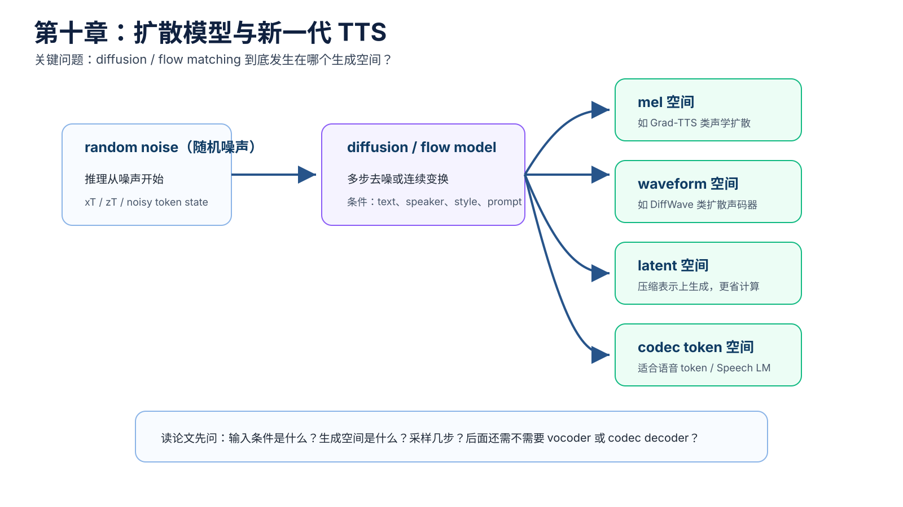
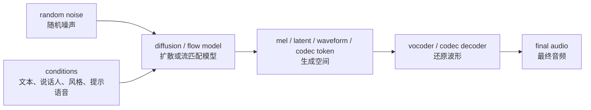
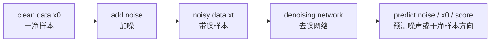
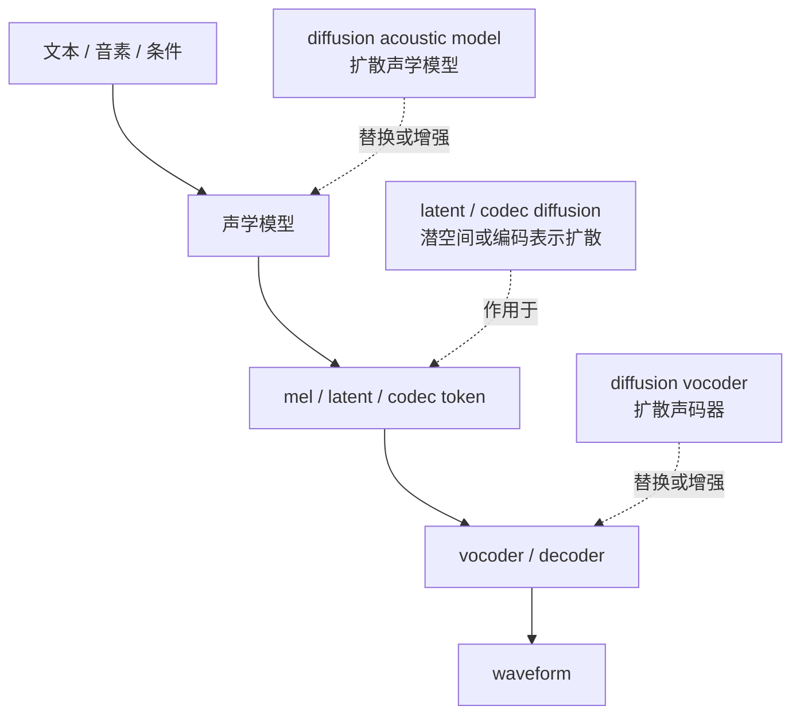
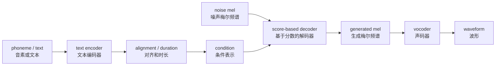
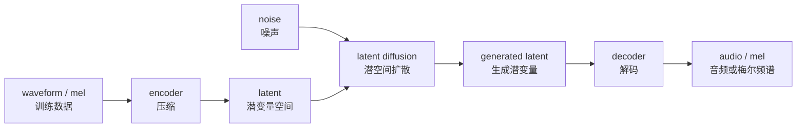
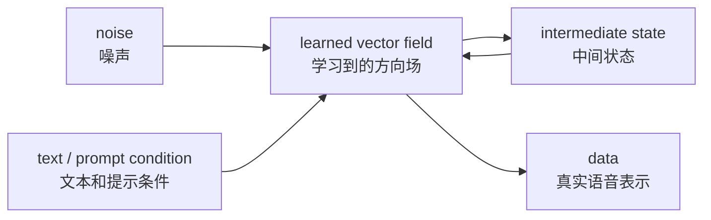

# 第十章：扩散模型与新一代 TTS —— diffusion、latent、codec 与 flow matching

本章进入本书后半部分的核心：diffusion model（扩散模型）、conditional generation（条件生成）、latent diffusion（潜空间扩散）、codec representation（语音编码表示）与 flow matching（流匹配）。

先说结论：研究 diffusion TTS（扩散式文本转语音）时，不能只看“是不是扩散模型”，还要看扩散发生在哪个空间：

```text
mel-spectrogram（梅尔频谱）空间
waveform（波形）空间
latent（潜变量）空间
codec token（语音编码 token）空间
```

不同空间的计算成本、音质上限、控制方式和工程复杂度都不一样。



## 本章导图



## 10.1 为什么 TTS 会需要生成式模型

TTS 有一个天然难点：one-to-many problem（一对多问题）。

同一句文本可以有很多合理读法：

```text
你真的要去吗？
```

它可以表达疑问、惊讶、生气、调侃、平静或不相信。文本内容一样，但 duration（时长）、pitch / F0（音高 / 基频）、energy（能量）、pause（停顿）和 voice quality（嗓音质感）都可能不同。

传统确定性模型容易学到“平均读法”。生成式模型的目标之一，就是更好地建模这种多样性：

```text
同一个条件 c，可以生成多个合理的 x。
```

这里：

```text
c = 文本、音素、说话人、风格、提示语音
x = mel、waveform、latent 或 codec token
```

## 10.2 diffusion model（扩散模型）的基本直觉

扩散模型可以先用两句话理解：

```text
训练时：把干净数据逐步加噪，让模型学习如何去噪。
推理时：从随机噪声开始，逐步去噪生成干净数据。
```

简化流程：



对应到 TTS：

```text
noise
 + text condition（文本条件）
 + speaker condition（说话人条件）
 + style condition（风格条件）
 -> mel / latent / waveform
```

你暂时不需要一开始就吃透所有公式，只需要先建立这个直觉：

```text
扩散模型不是一次性生成最终结果，而是学习“如何一步步把噪声变成语音表示”。
```

## 10.3 forward process（前向过程）和 reverse process（反向过程）

扩散模型里常见两个过程：

| 过程 | 极简解释 | TTS 中的直觉 |
| --- | --- | --- |
| forward process（前向过程） | 给真实样本加噪 | 把真实 mel 或 waveform 变脏 |
| reverse process（反向过程） | 从噪声逐步去噪 | 生成新的 mel 或 waveform |

训练时通常随机采样 timestep（时间步）：

```text
1. 取真实样本 x0
2. 随机采样 t
3. 给 x0 加噪得到 xt
4. 把 xt、t 和条件 c 输入模型
5. 模型预测 noise（噪声）、x0（干净样本）或 velocity（速度）
6. 计算 loss（损失）
```

常见预测目标：

| 目标 | 极简解释 |
| --- | --- |
| noise prediction（噪声预测） | 预测加进去的噪声 |
| x0 prediction（干净样本预测） | 直接预测原始干净样本 |
| velocity prediction（速度预测） | 预测噪声到数据路径上的速度变量 |
| score prediction（分数预测） | 预测往高概率数据区域移动的方向 |

这些目标公式不同，但对初学阶段可以先统一理解为：模型学习从带噪表示恢复干净语音表示。

## 10.4 conditional diffusion（条件扩散）：TTS 几乎一定是条件生成

纯扩散模型可以无条件生成样本，但 TTS 必须听文本和条件。

条件形式可以写成：

```text
p(x | c)
```

其中：

```text
x = mel / latent / waveform / codec token
c = text, phoneme, speaker, emotion, style, prompt speech, language
```

常见条件：

| 条件 | 控制什么 |
| --- | --- |
| text / phoneme（文本 / 音素） | 说什么、怎么读 |
| duration（时长） | 每个音持续多久 |
| pitch / F0（音高 / 基频） | 语调和音高走势 |
| energy（能量） | 强弱和力度 |
| speaker embedding（说话人向量） | 谁在说 |
| emotion / style（情绪 / 风格） | 怎么说 |
| prompt speech（提示语音） | 参考音色和说话方式 |

常见条件注入方式：

```text
condition encoder（条件编码器）
cross-attention（交叉注意力）
adaptive layer norm（自适应层归一化）
classifier-free guidance（无分类器引导）
condition dropout（条件丢弃）
```

## 10.5 classifier-free guidance（无分类器引导）：控制条件强度

classifier-free guidance（无分类器引导）常用于条件生成。它的直觉是：训练时让模型既见过“有条件”的输入，也见过“条件被丢掉”的输入；推理时对两种预测做组合，增强条件控制力。

在 TTS 中，它可能用于增强：

```text
文本遵从
说话人相似度
风格遵从
情绪表达
```

但 guidance scale（引导强度）不是越大越好：

| guidance 太低 | guidance 太高 |
| --- | --- |
| 条件不明显，音色或风格不够像 | 声音可能僵硬、失真、不自然 |

这和工程调参很像：它是一个控制强度旋钮，不是万能开关。

## 10.6 diffusion 到底替换了 TTS 的哪个模块

这是理解 diffusion TTS 的关键问题。

扩散模型可以放在多个位置：



几种常见情况：

| 路线 | 扩散生成什么 | 后面还需要什么 |
| --- | --- | --- |
| acoustic diffusion（声学扩散） | mel 或 latent | vocoder / decoder |
| waveform diffusion（波形扩散） | waveform | 可能直接输出音频 |
| diffusion vocoder（扩散声码器） | waveform | 以 mel 为条件 |
| latent diffusion（潜空间扩散） | compressed latent | decoder |
| codec diffusion（编码表示扩散） | codec representation | codec decoder |

所以看到一篇 diffusion TTS 论文时，第一步就问：

```text
扩散发生在哪个空间？
```

## 10.7 Grad-TTS：扩散声学模型的经典直觉

Grad-TTS 可以作为理解 mel diffusion acoustic model（梅尔扩散声学模型）的入口。

简化结构：



它的重点是：扩散模型主要替换或增强 acoustic decoder（声学解码器），生成的是 mel-spectrogram（梅尔频谱），不是直接生成最终音频。

这和 DiffWave 不同：

| 模型直觉 | 扩散空间 |
| --- | --- |
| Grad-TTS 类 | mel 空间 |
| DiffWave 类 | waveform 空间 |

## 10.8 latent diffusion（潜空间扩散）：为什么不总在 waveform 或 mel 上做

waveform（波形）太长，直接扩散计算量大。mel-spectrogram（梅尔频谱）更短，但仍然可能不是最适合现代生成模型的空间。

latent diffusion（潜空间扩散）的思路是：

```text
先用 encoder 把语音压缩到 latent。
扩散模型在 latent 空间生成。
最后用 decoder 把 latent 还原成音频或声学表示。
```

简化流程：



优势：

```text
序列更短，计算更省。
生成空间更规整，模型更容易学。
可以和 codec / autoencoder 结合。
```

代价：

```text
需要一个足够好的 encoder / decoder。
latent 是否保留音色、情绪和细节，取决于压缩表示设计。
```

## 10.9 codec representation（语音编码表示）与 speech language model（语音语言模型）

codec-based TTS（基于语音编码的文本转语音）会先把语音压缩成 token 或 latent：

```text
waveform -> codec encoder -> codec token -> codec decoder -> waveform
```

生成模型可以预测：

```text
semantic token（语义 token）
acoustic token（声学 token）
RVQ token（残差向量量化 token）
continuous codec latent（连续编码潜变量）
```

简单区分：

| 表示 | 更偏向 |
| --- | --- |
| semantic token（语义 token） | 说了什么、粗粒度内容 |
| acoustic token（声学 token） | 音色、细节、声学质感 |
| RVQ token（残差向量量化 token） | 分层补充声学细节 |

这条路线和 LLM（大语言模型）范式更接近，因为模型可以像处理文本 token 一样处理语音 token。但最终质量强依赖 codec：codec 重建不好，生成模型再强也会受限。

## 10.10 flow matching（流匹配）：新一代 TTS 的重要路线

Flow matching（流匹配）可以先这样理解：

```text
Diffusion：学习多步去噪过程。
Flow matching：学习从噪声到数据的连续变换速度场。
```

更直觉一点：

```text
有一条从噪声分布走到真实语音分布的路径。
flow matching 学习每个位置该往哪里走。
```

简化图：



现代 TTS 中，flow matching 常和这些东西结合：

```text
DiT（Diffusion Transformer，扩散 Transformer）
masked speech generation（掩码语音生成）
speech infilling（语音补全）
zero-shot TTS（零样本文本转语音）
prompt-based TTS（基于提示语音的文本转语音）
```

你可以把它看作 diffusion（扩散模型）附近的一类生成建模方法：目标仍然是条件生成自然语音，但训练目标、采样路径和工程取舍不同。

## 10.11 推理速度：扩散模型为什么常被说慢

扩散模型通常需要多步采样：

```text
noise -> step 1 -> step 2 -> ... -> clean output
```

步数越多，通常生成越慢。TTS 服务又很关注延迟，所以采样速度是关键工程问题。

常见加速方向：

| 方法 | 极简解释 |
| --- | --- |
| DDIM | 用更少步数采样 |
| DPM-Solver | 更高效的扩散采样器 |
| distillation（蒸馏） | 把多步模型压成少步模型 |
| consistency model（一致性模型） | 学习少步甚至一步生成 |
| latent diffusion（潜空间扩散） | 在更短表示上生成 |
| flow matching（流匹配） | 通过不同路径和采样方式提速 |
| condition cache（条件缓存） | 缓存文本编码结果 |

工程指标常用 RTF（real-time factor，实时率）：

```text
RTF < 1：生成速度快于实时播放
RTF = 0.1：10 秒音频约 1 秒生成
```

## 10.12 读 diffusion TTS 论文时先问这 10 个问题

看到一篇扩散或流匹配 TTS 论文，可以按下面顺序拆：

```text
1. 输入是什么？text、phoneme、prompt speech 还是其他条件？
2. 输出是什么？mel、waveform、latent 还是 codec token？
3. 生成空间在哪里？扩散或 flow 发生在哪个表示上？
4. 是否需要 alignment（对齐）？
5. 是否显式建模 duration / pitch / energy？
6. 条件如何注入？cross-attention、AdaLN 还是拼接？
7. 训练目标是什么？noise、x0、velocity、score 还是 flow matching？
8. 推理需要多少步？
9. 是否还需要 vocoder 或 codec decoder？
10. 主要提升是音质、速度、可控性还是 zero-shot 能力？
```

这套问题比死记模型名更有用。

## 10.13 本章小结

本章最重要的直觉：

```text
TTS 是条件生成，不是无条件生成。
diffusion 学习从噪声逐步生成语音表示。
关键问题是扩散发生在哪个空间：mel、waveform、latent 或 codec token。
Grad-TTS 类模型把 diffusion 用作 acoustic decoder。
DiffWave 类模型把 diffusion 用作 vocoder。
latent / codec 路线通过压缩表示降低建模难度。
flow matching 是和 diffusion 关系很近的新一代生成建模路线。
推理步数、采样器和 RTF 是扩散 TTS 工程落地必须关注的问题。
```

下一章先进入工程视角下的模型方案：理解“训练模型”在工程里到底交付了哪些权重、配置、tokenizer、codec、推理代码和前后处理。之后再进入训练工程。
