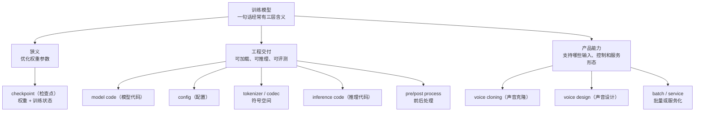
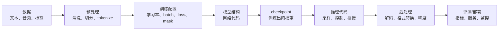
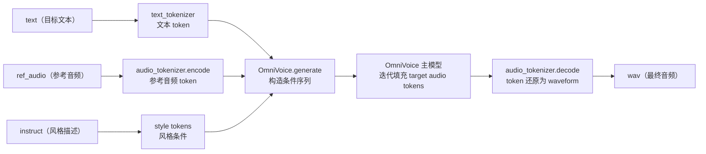
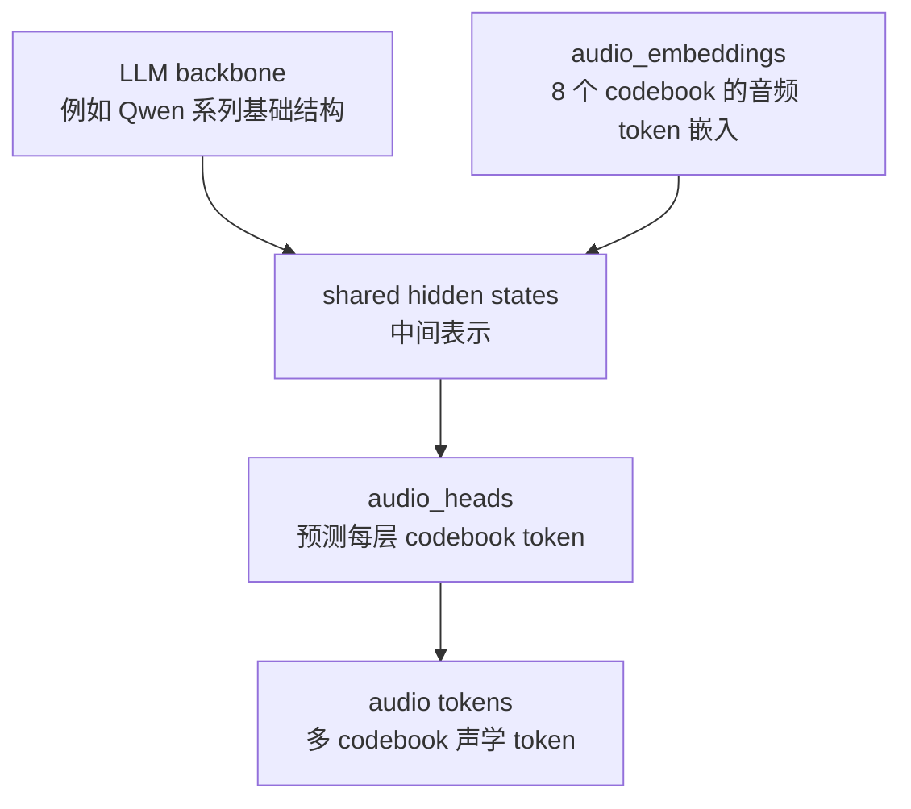
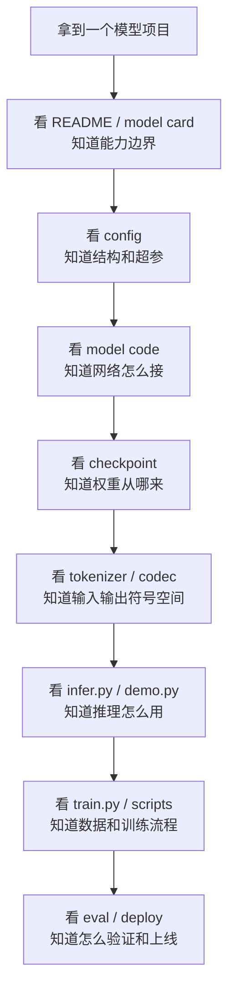

# 第十一章：工程视角下的模型方案 —— “训练模型”到底交付了什么

对工程开发来说，一个很重要的新认知是：我们平时说“训练了一个模型”，很多时候不是指“只得到一个权重文件”，而是指得到一套能从数据走到推理服务的方案。

狭义地说，training model（训练模型）是在固定模型结构上，用数据优化 parameters（参数），最后保存 checkpoint（检查点）。广义地说，算法同学交付的 model（模型）通常包括模型结构、权重、tokenizer、codec、训练配置、推理代码、前后处理逻辑和评测方法。

## 本章导图



## 11.1 “训练模型”这句话的三种含义

### 11.1.1 最狭义：训练出一组权重

最狭义的 model（模型）可以理解为：

```text
model architecture（模型结构） + parameters（参数权重）
```

训练做的事情是：给定模型结构、训练数据和 loss（损失函数），不断更新参数，让模型在训练目标上表现更好。

训练结束后通常会保存：

```text
checkpoint（检查点） = 权重 + 配置 + 训练状态
```

如果只是推理，通常只需要权重和配置；如果还要 resume training（恢复训练），还可能需要 optimizer state（优化器状态）、scheduler state（学习率调度状态）、global step（训练步数）等。

### 11.1.2 工程上：训练出一套可用方案

工程里说“这个模型能用了”，通常至少意味着：

```text
输入能被正确预处理
模型权重能被正确加载
推理代码知道怎么构造输入
输出能被正确后处理
评测方法能说明效果
部署代码能稳定运行
```

也就是说，model（模型）经常只是整套方案里的核心部件，而不是全部。

### 11.1.3 算法项目里：新模型可能只训练了部分权重

现代 AI 项目很少总是从零开始训练。常见情况包括：

| 训练方式 | 极简解释 | 交付物特点 |
| --- | --- | --- |
| pretraining（预训练） | 从大规模数据训练基础模型 | 成本最高，权重最完整 |
| finetuning（微调） | 在已有模型上继续训练 | 基础权重来自别人，新权重来自自己 |
| adapter / LoRA（适配层） | 只训练少量新增参数 | 需要基础模型 + 适配权重一起用 |
| continued training（继续训练） | 从某个 checkpoint 接着训 | 新模型继承旧模型能力 |
| post-training（后训练） | 针对偏好、安全、任务能力再训练 | 往往改变行为方式，不一定改变结构 |

所以“我们训练了一个模型”可能实际是：

```text
已有基础模型
 + 新增结构
 + 自己的数据
 + 部分参数训练
 + 特定推理策略
 = 一个新的可用方案
```

## 11.2 模型方案一般由哪些部分组成

可以把一个 AI 模型项目看成下面这条链路：



从文件和配置角度看，常见项目大致有这些内容：

| 类别 | 常见文件或配置 | 作用 |
| --- | --- | --- |
| 模型结构 | `model.py`、`models/`、`architecture` 配置 | 定义网络怎么计算 |
| 权重 | `model.safetensors`、`pytorch_model.bin`、`*.pt`、`checkpoint-*` | 保存训练出的参数 |
| 模型配置 | `config.json`、`model_config.yaml` | 定义 hidden size、层数、vocab size 等 |
| tokenizer | `tokenizer.json`、`vocab.json`、`special_tokens_map.json` | 决定文本如何变成 token |
| codec / vocoder | `audio_tokenizer/`、`vocoder/`、`codec_model` | 决定语音如何编码或还原 |
| 训练配置 | `train_config.json`、`deepspeed_config.json` | 学习率、batch、训练步数、精度、并行策略 |
| 数据配置 | `data_config.json`、`manifest`、`jsonl`、`webdataset` | 告诉训练程序读哪些数据 |
| 预处理脚本 | `prepare_data.py`、`extract_features.py` | 把原始数据变成训练样本 |
| 训练入口 | `train.py`、`trainer.py` | 组织 dataloader、loss、optimizer、保存 checkpoint |
| 推理入口 | `infer.py`、`server.py`、`demo.py` | 决定用户怎么调用模型 |
| 后处理 | audio normalize、trim silence、decode、format convert | 把模型输出变成可用结果 |
| 评测脚本 | `eval/`、`wer.py`、`mos.py`、`sim.py` | 评价效果和回归质量 |
| 环境依赖 | `pyproject.toml`、`requirements.txt`、`Dockerfile` | 保证别人能复现运行环境 |

工程排查时，不要只问“权重在哪”。更应该问：

```text
输入格式是什么？
tokenizer / codec 是哪个版本？
推理代码怎么拼输入？
采样参数默认是什么？
后处理有没有改变输出？
评测脚本和线上服务是否使用同一套预处理？
```

## 11.3 OmniVoice 里“模型方案”对应哪些文件

OmniVoice 是一个很适合理解这个问题的例子。它看起来是一个 TTS（Text-to-Speech，文本转语音）模型，但工程上是一套完整的生成链路。

### 11.3.1 推理链路

OmniVoice 的本地推理不是“文本直接进一个权重文件，然后直接出 wav”。简化后是：



这里至少有四类东西共同工作：

| 部件 | OmniVoice 对应位置 | 作用 |
| --- | --- | --- |
| 推理 CLI | [`../omnivoice/cli/infer.py`](../omnivoice/cli/infer.py) | 解析 `text/ref_audio/instruct/duration/speed` 等参数 |
| 主模型代码 | [`../omnivoice/models/omnivoice.py`](../omnivoice/models/omnivoice.py) | 定义 LLM 主干、audio embedding、audio heads 和生成逻辑 |
| 文本 tokenizer | `AutoTokenizer.from_pretrained(...)` | 把文本和特殊 tag 变成 token |
| 音频 tokenizer / codec | `HiggsAudioV2TokenizerModel` | 负责音频 token 和 waveform 之间的互转 |
| 时长估计 | [`../omnivoice/utils/duration.py`](../omnivoice/utils/duration.py) | 根据文本和参考音频估算目标 token 长度 |
| 音频工具 | [`../omnivoice/utils/audio.py`](../omnivoice/utils/audio.py) | 加载、裁剪、归一化、后处理音频 |

因此，`k2-fsa/OmniVoice` 作为一个可用模型，至少依赖：

```text
OmniVoice 主 checkpoint
+ text tokenizer
+ audio tokenizer / codec
+ 推理代码
+ 采样与控制参数
+ 音频后处理
```

缺其中任何一块，最终能力都会变形。例如：主模型能生成 audio token，但如果没有 audio tokenizer 的 `decode`，就无法还原成 waveform（波形）。

### 11.3.2 主模型结构不只是一个普通 LLM

在 [`../omnivoice/models/omnivoice.py`](../omnivoice/models/omnivoice.py) 中，OmniVoice 主模型可以粗略理解成：

```text
LLM backbone（语言模型主干）
+ audio_embeddings（音频 token 输入嵌入）
+ audio_heads（音频 token 输出头）
+ audio codebook 配置
```

简化图：



这也解释了为什么“新的 TTS 模型”可能不是从零训练的。它可能继承一个已有 LLM 的语言理解和生成能力，然后新增音频 token 相关结构，再用 TTS 数据训练这些能力。

### 11.3.3 训练入口和配置

OmniVoice 的训练入口在 [`../omnivoice/cli/train.py`](../omnivoice/cli/train.py)，核心流程很工程化：

```text
读取 train_config
读取 data_config
build_model_and_tokenizer
build_dataloaders
OmniTrainer.train()
保存 checkpoints
```

对应配置主要在：

| 文件 | 作用 |
| --- | --- |
| [`../examples/config/train_config_finetune.json`](../examples/config/train_config_finetune.json) | 微调训练配置，包含 `init_from_checkpoint`、学习率、步数、batch 等 |
| [`../examples/config/train_config_multilingual.json`](../examples/config/train_config_multilingual.json) | 多语言训练配置 |
| [`../examples/config/data_config_finetune.json`](../examples/config/data_config_finetune.json) | 微调数据 manifest 路径 |
| [`../examples/config/ds_config_zero2.json`](../examples/config/ds_config_zero2.json) | DeepSpeed ZeRO 配置 |
| [`../omnivoice/training/config.py`](../omnivoice/training/config.py) | `TrainingConfig` 字段定义 |
| [`../omnivoice/training/builder.py`](../omnivoice/training/builder.py) | 根据配置构建模型、tokenizer、dataloader |
| [`../omnivoice/training/trainer.py`](../omnivoice/training/trainer.py) | 训练循环、loss、保存、评估等 |

其中一个关键点是：`train_config_finetune.json` 里有 `init_from_checkpoint: "k2-fsa/OmniVoice"`。这说明 finetune（微调）不是从零开始，而是在已有 checkpoint 上继续训练。

### 11.3.4 数据预处理和 token 空间

TTS 项目和普通文本模型不同，训练数据不只是文本。OmniVoice 需要把音频变成模型能预测的 audio tokens（音频 token）。

相关文件包括：

| 文件 | 作用 |
| --- | --- |
| [`../omnivoice/scripts/extract_audio_tokens.py`](../omnivoice/scripts/extract_audio_tokens.py) | 从音频中提取 audio tokens |
| [`../omnivoice/scripts/extract_audio_tokens_add_noise.py`](../omnivoice/scripts/extract_audio_tokens_add_noise.py) | 提取 token 时加入噪声/混响增强 |
| [`../omnivoice/scripts/jsonl_to_webdataset.py`](../omnivoice/scripts/jsonl_to_webdataset.py) | 把 JSONL 数据转成 WebDataset |
| [`../omnivoice/data/processor.py`](../omnivoice/data/processor.py) | 把样本处理成模型输入格式 |
| [`../omnivoice/data/collator.py`](../omnivoice/data/collator.py) | batch 拼接、padding、mask 处理 |
| [`../omnivoice/data/dataset.py`](../omnivoice/data/dataset.py) | 数据读取 |

对工程同学来说，这些文件和模型权重同样关键。数据预处理如果变了，训练出来的权重就可能不兼容旧推理代码。

### 11.3.5 推理代码决定能力如何暴露

推理代码决定了模型能力如何被使用。OmniVoice 的命令行入口在 [`../pyproject.toml`](../pyproject.toml) 中注册：

```text
omnivoice-infer       -> omnivoice.cli.infer:main
omnivoice-infer-batch -> omnivoice.cli.infer_batch:main
omnivoice-demo        -> omnivoice.cli.demo:main
```

这些入口暴露的是不同使用方式：

| 入口 | 面向场景 |
| --- | --- |
| `omnivoice-infer` | 单条文本生成 |
| `omnivoice-infer-batch` | 批量生成、多 GPU 推理 |
| `omnivoice-demo` | Gradio Web UI 交互体验 |

同一个模型权重，因为推理代码不同，使用灵活性也会不同。例如 `infer.py` 暴露了：

```text
ref_audio：声音克隆
instruct：声音设计
duration：指定音频时长
speed：控制语速
num_step：控制迭代生成步数
guidance_scale：控制条件引导强度
denoise：控制去噪逻辑
```

这些不是“权重文件自己暴露出来的按钮”，而是推理代码把模型能力包装成了工程接口。

## 11.4 常见项目里如何识别“模型方案”

看一个新 AI 项目时，可以按下面顺序拆：



一套模型方案通常要回答这些问题：

| 问题 | 为什么重要 |
| --- | --- |
| 输入是什么 | 文本、音频、图片、prompt、控制条件都要明确 |
| 输出是什么 | 是 waveform、mel、token、embedding，还是 JSON |
| 权重从哪来 | 从零训练、继续训练、微调、LoRA，含义不同 |
| tokenizer / codec 是什么 | 决定符号空间，错版本会直接不兼容 |
| 推理策略是什么 | 采样步数、temperature、guidance 会影响结果 |
| 前后处理是什么 | 线上效果经常被切句、归一化、格式转换影响 |
| 训练配置是什么 | 学习率、batch、mask、loss 决定训练行为 |
| 评测怎么做 | 没有固定评测，模型升级很难判断好坏 |

## 11.5 一个工程判断：交付 checkpoint 不等于交付模型能力

如果算法同学只给一个 checkpoint（检查点），工程上通常还不够。你至少还需要确认：

```text
这个 checkpoint 对应哪份代码 commit？
对应哪份 config？
使用哪个 tokenizer / codec / vocoder？
输入字段和 shape 是什么？
默认推理参数是什么？
是否需要外部模型，例如 ASR、vocoder、speaker encoder？
是否有前处理和后处理？
是否有最小可运行 demo？
是否有评测脚本和基准结果？
```

对 TTS 尤其如此，因为音频链路里常常有多个模型或模块：

```text
文本前端
声学模型 / 生成模型
codec 或 vocoder
后处理
评测 ASR / speaker similarity 模型
```

其中某些模块可能是别人训练的，某些模块才是当前项目训练的。

## 11.6 本章小结

本章最重要的结论：

```text
训练模型，狭义上是训练权重；
工程上是交付一套能稳定加载、推理、评测和部署的方案。
```

以 OmniVoice 为例，真正可用的“模型”包括：

```text
主模型结构和权重
+ text tokenizer
+ audio tokenizer / codec
+ duration estimator
+ 推理代码
+ 训练配置
+ 数据预处理
+ 后处理和评测
```

所以以后看到“模型”这个词，可以先问：

```text
你说的是权重文件？
还是 checkpoint 目录？
还是 Hugging Face 模型仓库？
还是包含推理代码和前后处理的一整套方案？
```

这几个答案不同，工程接入成本和风险也完全不同。
