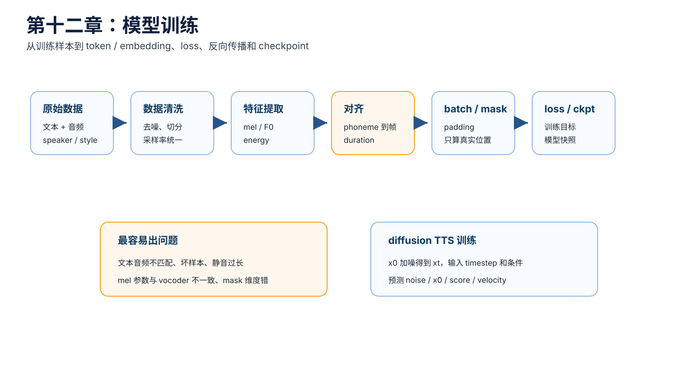
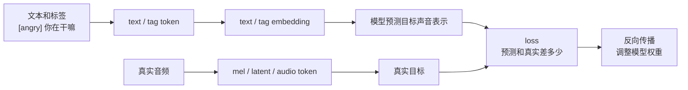
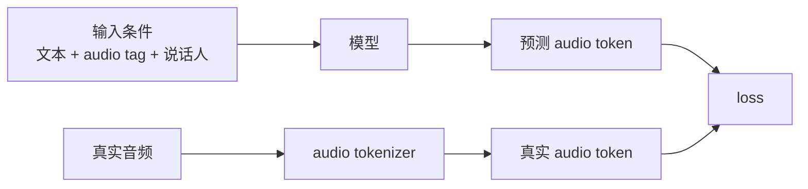
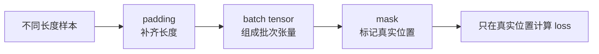
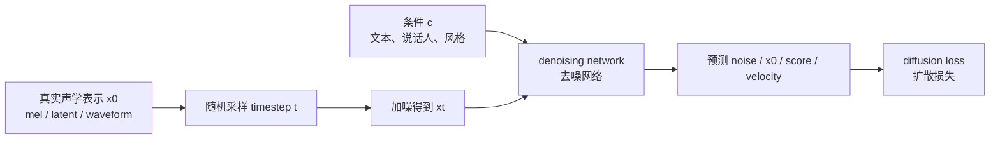

# 第十二章：模型训练 —— 模型如何从数据里学会说话

TTS（Text-to-Speech，文本转语音）的训练，不只是把音频喂给模型。更准确地说，它是在让模型反复观察“输入条件”和“目标声音表示”之间的关系，再通过 loss（损失）和反向传播调整权重。

本章既讲工程流程，也讲训练背后的直觉：token 怎么变成 embedding，标签怎么和声音表现建立关系，loss 为什么能推动权重更新，checkpoint 到底保存了什么。

如果对 dataset、sample、DataLoader、batch、step 和 epoch 的层级关系还不熟悉，可以先读 [《模型训练的基本说明》](模型训练的基本说明.md)。该文也把这些概念映射到 OmniVoice 的实际训练循环。

训练主线可以先这样看：

```text
训练样本 -> token / embedding -> 模型预测 -> loss -> 反向传播 -> 更新权重 -> checkpoint
```

一个干净、对齐准确、标注一致的数据集，往往比盲目换更复杂模型更重要。协议错了，模型会学到错误规律。



## 本章导图


## 12.1 模型训练到底是在学什么

训练不是让模型把每条录音背下来，而是让模型学会一套“从条件生成声音表示”的计算规则。

以一条样本为例：

```text
文本：[angry] 你在干嘛
音频：某个说话人愤怒地说“你在干嘛”
```

训练时，系统会把文本、标签、参考信息和音频都变成模型能计算的数字表示：



如果模型预测出来的声音表示不像真实目标，loss 就会变大。训练程序会根据这个误差调整权重。重复很多次以后，模型逐渐学到：

```text
看到某类文本，应该生成对应发音内容。
看到某个 speaker 条件，应该更像这个说话人。
看到某个 emotion / style 标签，应该调整能量、音高、节奏和声音质感。
```

所以，训练的核心不是“音频进模型，模型吐答案”，而是：

> 模型不断预测、犯错、比较、修正，最后把这些统计关系写进权重。

## 12.2 token、embedding 和目标输出

训练样本进入模型前，通常会被拆成不同类型的 token 或连续特征。

| 内容 | 训练时可能怎么表示 | 作用 |
| --- | --- | --- |
| 文本 | character / phoneme / BPE token | 告诉模型说什么 |
| 音频 | mel / latent / codec token | 作为预测目标或中间表示 |
| 说话人 | speaker id / speaker embedding / prompt token | 告诉模型谁在说 |
| 情绪风格 | audio tag / emotion label / style embedding | 告诉模型怎么说 |

token 进入模型后，会先查表或投影成 embedding（向量）。这些向量不是人类能直接读懂的标签说明，而是模型计算用的数字坐标。

在 codec token 路线里，训练目标经常可以理解成：



这里要注意两个常见误解：

```text
第一，模型不是直接输出最终声音，而是先输出 mel、latent 或 audio token。
第二，情绪、音色、风格不是固定藏在某几个维度里，而是分布在很多层和很多维度形成的整体模式。
```

这一点和第六章讲的语音信息分解是同一件事：训练希望模型学会把“说什么、谁在说、怎么说”分别当成可使用的条件，但真实表示里这些信息仍然会互相纠缠。

## 12.3 数据集长什么样

TTS 训练数据最基本的形式是 text-audio pair（文本音频对）：

```text
文本：你好，欢迎使用语音合成系统。
音频：对应这句话的录音文件
```

常见元信息：

| 字段 | 极简解释 |
| --- | --- |
| audio path（音频路径） | wav / flac / mp3 文件位置 |
| transcript（转写文本） | 音频对应文字 |
| speaker id（说话人 ID） | 多说话人训练需要 |
| language（语言） | 中文、英文、中英混合等 |
| emotion label（情绪标签） | 开心、生气、平静等 |
| style label（风格标签） | 播音、聊天、客服等 |
| sample rate（采样率） | 16k、24k、44.1k 等 |

最小可训练数据看起来简单，但真正难的是质量一致性。

## 12.4 数据清洗：TTS 训练的第一道质量门

常见数据清洗包括：

```text
采样率统一
响度归一化
静音裁剪
文本清洗
音频文本匹配检查
坏样本过滤
长音频切分
说话人标签检查
情绪标签检查
语言标签检查
音频质量检查
```

常见坏样本：

| 问题 | 影响 |
| --- | --- |
| 文本和音频不匹配 | 模型学到错误发音 |
| 背景噪声大 | 生成音频带噪或音质下降 |
| 采样率混乱 | 特征提取和 vocoder 训练不一致 |
| 音量差异大 | energy（能量）分布不稳定 |
| 静音过长 | duration（时长）和停顿建模异常 |
| 切分错误 | 一条样本里包含多句话或少半句话 |
| 说话人标签错 | speaker embedding（说话人向量）混乱 |
| 情绪标签错 | emotion control（情绪控制）变差 |

一个实用原则：

```text
先听坏样本，再调模型。
```

如果训练集里大量文本音频不匹配，模型 loss（损失）再低也不代表效果会好。

## 12.5 文本清洗和文本前端

训练阶段的文本处理要和推理阶段尽量一致。否则模型训练时看到一种输入，线上推理时看到另一种输入，会产生 distribution shift（分布偏移）。

常见处理：

```text
文本规范化
数字、日期、金额、单位展开
中英文标点统一
多音字消歧
G2P（字形到音素）
拼音 / 音素转换
声调标注
韵律边界预测
```

例子：

```text
原始：2026年5月20日，行长去了重庆。
处理后：二零二六年五月二十日，银行行长去了 chong2 qing4。
```

真实系统不会一定长这样，但核心是：训练和推理必须使用一致的规范。

## 12.6 mel extraction（梅尔特征提取）

mel extraction（梅尔特征提取）把 waveform（波形）变成 mel-spectrogram（梅尔频谱）。

常见参数：

| 参数 | 极简解释 |
| --- | --- |
| sample_rate（采样率） | 每秒多少采样点 |
| n_fft（FFT 点数） | 频率分析窗口大小 |
| win_length（窗长） | 每帧使用多少采样点 |
| hop_length（帧移） | 相邻帧间隔多少采样点 |
| n_mels（梅尔通道数） | mel 频带数量 |
| fmin / fmax（频率范围） | 最低和最高分析频率 |

这些参数必须和 vocoder（声码器）训练时一致。否则声学模型输出的 mel 和 vocoder 期望的 mel 分布不一致，可能出现音质下降、金属感、爆音等问题。

## 12.7 F0、energy 和 duration 特征

FastSpeech 2 类模型和很多可控 TTS 系统会显式使用：

```text
F0 / pitch（基频 / 音高）
energy（能量）
duration（时长）
```

它们分别解决：

| 特征 | 解决的问题 |
| --- | --- |
| F0 / pitch（基频 / 音高） | 语调、音高走势、部分情绪变化 |
| energy（能量） | 重音、力度、强弱变化 |
| duration（时长） | 文本 token 对应多少语音帧 |

注意：这些特征本身也会有提取误差。例如 F0 extractor（基频提取器）在清音、噪声、气声、嘶哑声上可能不稳定。训练前最好做分布检查和异常值过滤。

## 12.8 alignment（对齐）：训练流程的核心难点

alignment（对齐）用于确定文本 token 和语音帧之间的关系。

简化例子：

```text
phoneme:  n i h ao
mel帧:    1 2 3 4 5 6 7 8 9 ...
```

模型需要知道每个 phoneme（音素）对应哪些帧，才能学习 duration（时长）和声学变化。

常见对齐方法：

| 方法 | 极简解释 |
| --- | --- |
| forced alignment（强制对齐） | 用外部对齐器把文本和音频对齐 |
| MFA（Montreal Forced Aligner） | 常用强制对齐工具之一 |
| CTC alignment（CTC 对齐） | 用 CTC 类模型估计序列对齐 |
| MAS（Monotonic Alignment Search，单调对齐搜索） | 在单调约束下搜索文本和语音对齐 |
| attention alignment（注意力对齐） | 模型训练中隐式学对齐 |

TTS 对齐通常依赖 monotonic（单调）假设：

```text
语音发音顺序大体和文本顺序一致。
```

如果数据里有漏字、插话、笑声、背景人声，对齐会更困难。

## 12.9 loss（损失函数）：每个 loss 在约束什么

不同模型使用不同 loss（损失函数）。看到 loss 时，不要只记名字，要问它在约束什么。

| loss | 约束什么 |
| --- | --- |
| mel reconstruction loss（梅尔重建损失） | 预测 mel 接近真实 mel |
| L1 / L2 loss（绝对误差 / 平方误差） | 数值接近目标 |
| duration loss（时长损失） | 时长预测接近真实对齐 |
| pitch loss（音高损失） | F0 / pitch 预测接近目标 |
| energy loss（能量损失） | 能量预测接近目标 |
| KL loss（KL 散度损失） | 约束潜变量分布 |
| adversarial loss（对抗损失） | 让生成音频更像真实音频 |
| feature matching loss（特征匹配损失） | 让判别器中间特征接近 |
| diffusion loss（扩散损失） | 约束噪声、x0、score 或 velocity 预测 |
| flow matching loss（流匹配损失） | 约束生成路径上的速度场 |

按模型类型看：

| 模型类型 | 典型 loss |
| --- | --- |
| Tacotron 类 | mel loss、stop token loss |
| FastSpeech 类 | mel、duration、pitch、energy loss |
| VITS 类 | reconstruction、KL、duration、adversarial、feature matching |
| GAN vocoder | adversarial、feature matching、mel loss |
| Diffusion TTS | noise prediction / score matching |
| Flow matching TTS | vector field / flow matching loss |

## 12.10 batch、padding 和 mask

语音样本长度差异很大。同一个 batch（批次）里，文本长度和 mel 长度都可能不同。

为了组成张量，训练时通常要 padding（填充）：

```text
样本 A：100 帧
样本 B：250 帧
样本 C：180 帧
padding 到 250 帧
```

但 padding 出来的位置不是真实数据，所以计算 loss 时要用 mask（掩码）忽略它们。



常见长度处理策略：

| 策略 | 极简解释 |
| --- | --- |
| length bucket（长度分桶） | 长度相近的样本放一起 |
| dynamic batching（动态批次） | 按总帧数控制 batch 大小 |
| gradient accumulation（梯度累积） | 小 batch 多步累积模拟大 batch |
| max length filtering（最大长度过滤） | 过滤过长异常样本 |

mask 是 TTS 工程里非常容易出 bug 的地方。mask 维度错了，模型可能在 padding 区域学到无意义模式。

## 12.11 训练流程中的工程配置

常见训练配置：

```text
mixed precision（混合精度）
distributed training（分布式训练）
checkpoint（模型快照）
EMA（指数滑动平均）
learning rate schedule（学习率调度）
warmup（学习率预热）
gradient clipping（梯度裁剪）
```

几个实用解释：

| 配置 | 作用 |
| --- | --- |
| mixed precision（混合精度） | 降低显存占用、提升速度 |
| EMA（指数滑动平均） | 推理时常用更平滑的模型参数 |
| warmup（预热） | 前期逐步增大学习率，减少训练不稳定 |
| gradient clipping（梯度裁剪） | 避免梯度爆炸 |
| checkpoint（模型快照） | 保存模型，支持恢复和挑选最佳版本 |

## 12.12 diffusion TTS 的训练流程

diffusion TTS（扩散式文本转语音）训练流程可以先这样看：



典型步骤：

```text
1. 取一条语音的 mel、latent 或 waveform。
2. 随机采样 timestep（时间步）t。
3. 给干净样本 x0 加噪得到 xt。
4. 输入 xt、t、文本条件、说话人条件、风格条件。
5. 网络预测噪声、干净样本、score 或 velocity。
6. 计算 diffusion loss。
```

常见训练细节：

```text
timestep embedding（时间步向量）
noise schedule（噪声调度）
loss weighting（损失权重）
condition dropout（条件丢弃）
classifier-free guidance training（无分类器引导训练）
EMA（指数滑动平均）
```

需要特别注意：

```text
mel diffusion 比 waveform diffusion 计算量通常更小。
latent diffusion 通常更省，但依赖 encoder / decoder 质量。
少步采样通常需要采样器、蒸馏或训练目标配合。
```

## 12.13 训练监控和失败样本

训练时不要只看总 loss。TTS 需要同时看客观指标、可视化和听感。

建议关注：

| 监控项 | 说明 |
| --- | --- |
| train / valid loss | 是否收敛、是否过拟合 |
| mel 可视化 | 是否有明显断裂、塌缩、异常条纹 |
| duration 分布 | 是否过短、过长、异常集中 |
| F0 分布 | 是否过平、异常尖峰 |
| generated samples | 固定文本定期合成试听 |
| bad case list | 记录漏读、重复、爆音、音色漂移样本 |

一个成熟训练流程通常会保留固定评测集，每隔一定 step 合成一批音频，用于横向比较 checkpoint。

## 12.14 本章小结

本章最重要的直觉：

```text
TTS 训练质量高度依赖数据质量。
训练的本质是用 loss 和反向传播把条件与目标声音表示之间的关系写进权重。
文本前端、mel 参数、F0 / energy / duration 提取要和模型设计一致。
alignment（对齐）是训练稳定性的关键。
padding 和 mask 处理错误会直接污染 loss。
不同 loss 对应不同约束，不要只看 loss 名字。
diffusion TTS 训练的核心是加噪、条件输入和去噪目标。
```

下一章会从训练走向推理：训练好的权重如何和文本、参考音频、audio tag、采样参数一起生成声音。
