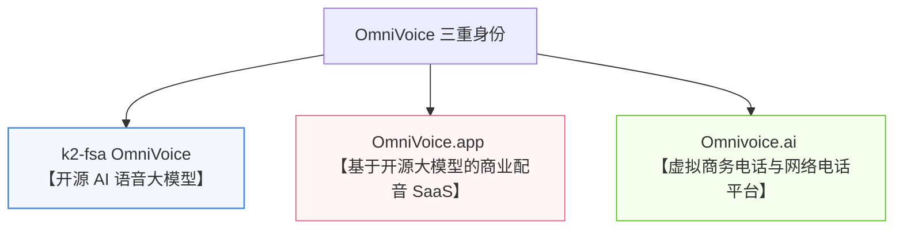

# 第十三章：OmniVoice 生态 —— 开源模型、商业 SaaS 与同名系统

在涉足 AI 语音合成的奇妙世界时，许多初学者（甚至是资深架构师）在搜索“OmniVoice”时，经常会陷入深深的困惑：“为什么我搜出来的东西，一会儿是 GitHub 上的开源项目，一会儿是按积分扣费的配音网站，一会儿又变成了可以接听美国电话的企业客服系统？”

本章作为工程案例部分的入口，厘清“OmniVoice”的三重身份，并从商业与技术的双重维度，将它与当前主流的开源 TTS 大模型进行一次横向对比。

---

## 13.1 名字背后的秘密：OmniVoice 的三重身

在当前的科技和商业生态中，**"OmniVoice"** 实际上代表了三个在技术底层、应用场景和运营主体上都截然不同的领域：

### 1. 第一身：k2-fsa OmniVoice（开源 AI 语音大模型 —— 本书的核心主角）
*   **研发团队**：由知名开源语音及学术团队 **k2-fsa**（新一代 Kaldi / Sherpa 团队）主持开发。
*   **技术本质**：这是一款下一代**多语言零样本（Zero-shot）语音生成大模型**。它基于轻量且强大的大语言模型底座（如 Qwen 系列）进行多模态扩展，拥有极其恐怖的生成速度与顶尖的发音还原度。
*   **授权许可**：采用 **Apache 2.0** 协议完全开源，允许任何企业和个人**免费商用**，没有专利和商业化门槛。

### 2. 第二身：OmniVoice.app（商业化 AI 语音生成云服务）
*   **技术本质**：这是围绕 k2-fsa 团队的开源大模型，由第三方商业公司进行云端托管和封装的可视化网页平台。
*   **服务形式**：面向不需要写代码、不想配置显卡环境的普通用户（如自媒体视频创作者、文案策划）。提供可视化的声音克隆、声音设计及文本配音功能。
*   **计费模式**：采用 **Credit (积分) 充值计费**。1 个积分通常可以合成约 1000 个字。提供 9.9 美元至 49.9 美元不等的阶梯积分包，积分永久有效。

### 3. 第三身：Omnivoice.ai（企业虚拟电话通讯平台）
*   **技术本质**：这是一个运营已久的**虚拟企业电话系统（VoIP）与商务网络电话服务**。
*   **核心功能**：帮助小微企业或独立出海团队，在没有实体电话线和硬件的情况下，在线申请美国、加拿大本地号码，设置多级交互式语音菜单（“按 1 转销售，按 2 转客服”）以及多人共享客服邮箱。
*   **注意**：**它与 AI 开源语音大模型没有任何技术关联，纯属同名。**

---

## 13.2 行业主流开源 TTS 大模型横向深度大比拼

为了帮您在庞大的语音大模型版图中找准定位，我们将 **k2-fsa OmniVoice** 与当前市面上最火爆的四款开源/开放 TTS 模型进行了多维度的深度横评：

| 特性维度 | **k2-fsa OmniVoice** | **Alibaba CosyVoice (v1/v2)** | **ChatTTS** | **GPT-SoVITS** | **Bark (Suno)** |
| :--- | :--- | :--- | :--- | :--- | :--- |
| **主要架构** | 单阶段扩散语言模型 (Diffusion LM-style) | 两阶段 (Autoregressive + Flow Matching) | 自回归生成式大模型 | 两阶段 (AR + VITS/HiFi-GAN) | 自回归 GPT 编解码架构 |
| **推理速度** | **极快** (RTF ~0.025) **40x 实时** | **较快** (支持流式推理) 约 3x~5x 实时 | **中等** 自回归导致长文本变慢 | **中等** 两阶段管线导致耗时 | **较慢** 自回归解码计算成本高 |
| **多语言支持**| **极强** (支持 **600+ 语言**) | **强** (中英日韩粤) | **一般** (中英为主) | **强** (中英日韩粤等) | **强** (多国语言，但质量不稳定) |
| **声音克隆** | **零样本 (Zero-shot)** 仅需 3~25s 参考音频 | **零样本 (Zero-shot)** 仅需 3s 参考音频 | **不支持/支持极弱** (以随机 Speaker 种子为主) | **极强 (少样本微调最逼真)** 也支持 Zero-shot | **零样本** 依靠 Prompt 间接克隆 |
| **声音设计** | **完美支持** (通过自然语言描述控制) | **不支持** (必须提供参考音频) | **部分支持** (通过 seed 调整风格) | **不支持** (必须提供参考音频) | **支持** (通过 Prompt 间接控制) |
| **细粒度控制**| **强** (支持笑声/叹气/音素纠音) | **极强** (情绪和细粒度控制力极高) | **极强** (口语化呼吸、吞音最自然) | **一般** (受限于参考音频) | **较强** (但控制精度较为随机) |
| **开源许可** | **Apache 2.0** (商用友好) | **Apache 2.0** (商用友好) | **限制性商用** (体量大需授权) | **MIT** (商用友好) | **MIT** (商用友好) |

---

## 13.3 如何选择？—— 黄金场景选型建议

在不同的商业与技术架构下，没有“最强的模型”，只有“最适合当前场景的模型”：

*   **💡 场景 A：如果您需要搭建高并发、低延迟的商业客服后台或智能硬件**
    *   **首选推荐**：**k2-fsa OmniVoice**
    *   **选型理由**：它的非自回归单阶段扩散架构带来了恐怖的 **40x 推理速度（实时率 RTF ~0.025）**。在大规模高并发或实时语音对话（如 AI 伴侣、车载语音、高并发播报）中，能为您省下 80% 以上的 GPU 算力成本，并实现近乎零延迟的秒级响应。
*   **💡 场景 B：如果您需要完美复刻、1比1还原某位特定名人的声音（如虚拟主播、明星配音）**
    *   **首选推荐**：**GPT-SoVITS**
    *   **选型理由**：虽然它需要少样本微调（最好有 1~5 分钟原声录音并训练），但经过微调后的声音相似度与发音习惯还原度，依然是当前开源界的“天花板”级别。
*   **💡 场景 C：如果您需要生成极其口语化、包含自然呼吸、笑声和吞音的中文对话（如有声小说配音、短视频解说）**
    *   **首选推荐**：**ChatTTS**
    *   **选型理由**：ChatTTS 在处理中文日常口语时的语气、叹气、自言自语拟真度无与伦比，听起来极像真人用微信发出的语音条。
*   **💡 场景 D：如果您有出海业务，需要极广的多语言支持和“口音修改（声音设计）”**
    *   **首选推荐**：**k2-fsa OmniVoice**
    *   **选型理由**：单一模型支持 global 600 多种小语种，且唯一完美支持通过 `instruct`（自然语言描述控制词）在零样本克隆的基础上动态纠正或扭曲口音，是跨境业务和多国本地化配音的最佳利器。

在下一章中，我们将离开理论，卷起袖子，带您在本地一步步搭建起 OmniVoice 的实战克隆环境，亲身体验这场技术风暴！
