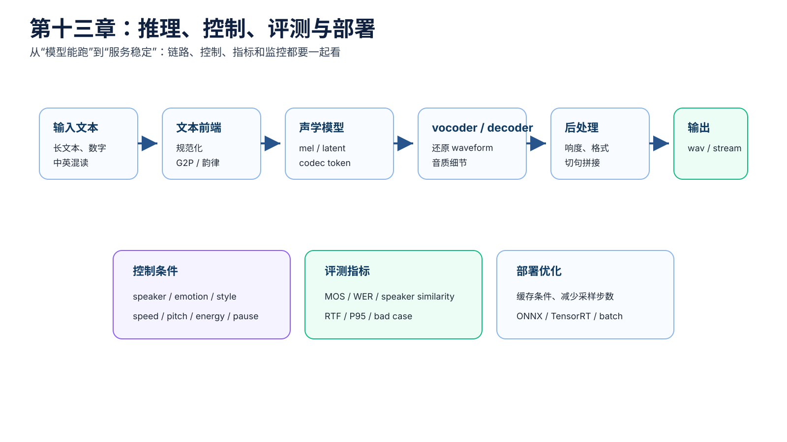
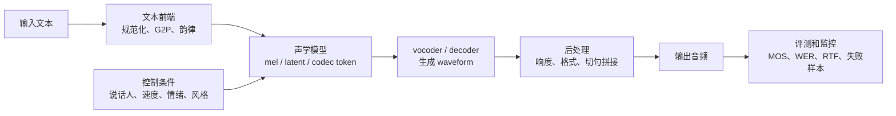
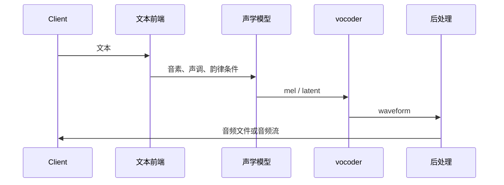
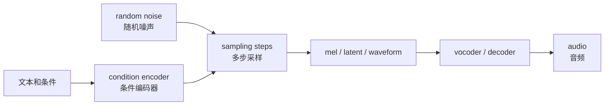

# 第十三章：推理、控制、评测与部署 —— 从模型到稳定服务

本章从“模型能训练”走向“模型能稳定服务”。训练成功只是第一步，真正落地还要处理推理延迟、控制能力、音质评测、失败样本、部署优化和线上监控。

对工程同学来说，可以先把 TTS 服务看成一条多模块链路：

```text
文本请求 -> 文本前端 -> 声学模型 -> vocoder / decoder -> 音频后处理 -> 返回音频
```

任何一个模块出问题，最终听感都会变差。



## 本章导图



## 13.1 普通两阶段 TTS 推理流程

典型两阶段 TTS 推理：

```text
输入文本
 -> 文本前端
 -> 音素 / 拼音 / 韵律边界
 -> 声学模型生成 mel-spectrogram
 -> vocoder 生成 waveform
 -> 音频后处理
 -> 输出音频
```

简化图：



排查问题时，要先确认每个模块的输入输出：

```text
文本前端输出是否读音正确？
声学模型输出是否漏读或重复？
vocoder 是否引入毛刺或爆音？
后处理是否改变响度或采样率？
```

## 13.2 diffusion TTS 推理流程

diffusion TTS（扩散式文本转语音）的推理多了采样过程：

```text
输入文本和条件
 -> 编码条件
 -> 初始化随机噪声
 -> 多步去噪
 -> 得到 mel / latent / waveform
 -> vocoder 或 decoder
 -> 输出音频
```

简化图：



常见推理参数：

| 参数 | 影响 |
| --- | --- |
| sampling steps（采样步数） | 步数多通常更慢，质量可能更稳 |
| temperature（温度） | 控制随机性和多样性 |
| guidance scale（引导强度） | 控制条件遵从强度 |
| seed（随机种子） | 控制可复现性 |
| speed control（语速控制） | 调整 duration 或整体时长 |

## 13.3 控制维度：TTS 可以控制什么

常见控制维度：

```text
speaker（说话人）
emotion（情绪）
style（风格）
speed（语速）
pitch（音高）
energy（能量）
pause（停顿）
accent（口音）
language（语言）
voice age（声音年龄感）
voice gender（声音性别感）
```

但要注意：这些维度并不是完全独立的。例如 emotion（情绪）会影响 pitch（音高）、energy（能量）、duration（时长）和 voice quality（嗓音质感）；speaker（说话人）也会影响常见 F0 范围和说话习惯。

## 13.4 控制方式：从显式特征到 prompt

常见控制方法：

| 控制方法 | 极简解释 |
| --- | --- |
| duration / pitch / energy control（时长、音高、能量控制） | 直接改韵律相关特征 |
| speaker embedding（说话人向量） | 指定谁在说 |
| emotion embedding（情绪向量） | 指定情绪类别或强度 |
| style embedding（风格向量） | 指定整体说话方式 |
| prompt speech（提示语音） | 从参考音频提取音色和风格 |
| natural language prompt（自然语言提示） | 用文字描述风格或情绪 |
| classifier-free guidance（无分类器引导） | 调整条件遵从强度 |
| inpainting（局部重生成） | 只重生成某段音频 |

一个重要权衡：

```text
控制越强，越可能牺牲自然度。
自然度越高，控制往往越难精确。
```

工程上通常要根据业务目标选择：有的场景更重视音色相似度，有的场景更重视发音准确，有的场景更重视情绪表现。

## 13.5 长文本推理：切句、停顿和拼接

长文本是 TTS 服务常见难点。

如果整段直接输入模型，可能出现：

```text
漏读
重复
后半段节奏漂移
显存占用过高
推理延迟过长
句间停顿不自然
```

常见做法是先切句：


切句不是简单按字符数切。它要考虑：

```text
标点
语义边界
最大 token 数
最大音频时长
中英混排
数字和缩写
```

拼接时还要控制句间 pause（停顿），否则听起来会过密或断裂。

## 13.6 评测：主观指标和客观指标

TTS 评测分主观和客观两类。

主观评测：

| 指标 | 极简解释 |
| --- | --- |
| MOS（平均意见分） | 人听后给自然度或音质打分 |
| CMOS（比较平均意见分） | 两个系统对比谁更好 |
| AB test（AB 测试） | 两段音频二选一 |
| preference test（偏好测试） | 听众选择更喜欢的结果 |
| speaker similarity test（说话人相似度测试） | 判断像不像目标说话人 |
| emotion similarity test（情绪相似度测试） | 判断情绪是否匹配 |

客观评测：

| 指标 | 极简解释 |
| --- | --- |
| WER（词错误率） | 用 ASR 检查发音内容是否正确 |
| CER（字错误率） | 中文场景常用字符错误率 |
| MCD（梅尔倒谱失真） | 衡量声学距离，不能完全代表听感 |
| F0 RMSE（基频均方根误差） | 衡量音高预测误差 |
| duration error（时长误差） | 衡量时长预测误差 |
| speaker verification similarity（说话人验证相似度） | 用声纹模型衡量音色相似 |
| emotion classification accuracy（情绪分类准确率） | 用分类器辅助评估情绪控制 |
| RTF（实时率） | 衡量推理速度 |

要注意：

```text
客观指标不能完全代表人耳感受。
```

例如 mel loss 很低，声音可能仍然发闷；WER 很低，情绪表现可能仍然差。

## 13.7 根据目标选择评测指标

不同研究目标应该选择不同指标：

| 研究目标 | 主要评测 |
| --- | --- |
| 音质 | MOS、CMOS、人工听测 |
| 发音准确 | WER、CER、人工听测 |
| 音色克隆 | speaker similarity、人工相似度测试 |
| 情绪控制 | emotion similarity、MOS、偏好测试 |
| 韵律自然 | MOS、F0 / duration 分析 |
| 推理效率 | RTF、P95 延迟、吞吐 |
| 长文本稳定性 | 漏读率、重复率、人工 bad case |

一个实用评测集通常包含：

```text
短句
长句
数字日期
多音字
中英混读
不同情绪
不同说话人
难读专有名词
```

## 13.8 RTF（实时率）和延迟

RTF（real-time factor，实时率）是 TTS 推理常用速度指标：

```text
RTF = 生成耗时 / 音频时长
```

例子：

```text
生成 10 秒音频耗时 1 秒，RTF = 0.1
生成 10 秒音频耗时 12 秒，RTF = 1.2
```

通常：

```text
RTF < 1 表示快于实时播放。
RTF 越低，生成越快。
```

但服务端还要关注：

```text
P50 / P95 / P99 延迟
队列等待时间
文本前端耗时
声学模型耗时
vocoder 耗时
音频编码和上传耗时
```

只看模型 kernel 时间是不够的。

## 13.9 部署优化

常见部署优化方向：

```text
模型导出
ONNX
TensorRT
TorchScript
量化
半精度推理
批量推理
流式生成
缓存文本前端
缓存 speaker embedding
缓存 prompt speech 表征
音频后处理优化
```

按模块看：

| 模块 | 可优化点 |
| --- | --- |
| 文本前端 | 规则缓存、词典缓存、批处理 |
| 条件编码器 | 缓存 speaker / prompt 表征 |
| diffusion sampler | 减少 sampling steps、使用更快采样器 |
| vocoder | TensorRT、批量推理、半精度 |
| 音频后处理 | 避免重复重采样和格式转换 |

扩散模型特别要关注采样步数。少步采样能提升速度，但可能损失自然度或稳定性。

## 13.10 服务化常见问题

TTS 服务中常见问题：

| 问题 | 可能原因 |
| --- | --- |
| 数字读错 | 文本规范化缺规则 |
| 多音字读错 | G2P 或消歧失败 |
| 英文缩写奇怪 | 缩写词表或语言识别问题 |
| 漏读重复 | 对齐、长文本切分、模型稳定性 |
| 音频爆音 | vocoder、采样率、音频预处理 |
| 音色漂移 | prompt 太短、speaker embedding 不稳 |
| 情绪不明显 | 情绪标签弱、guidance 太低、训练数据不足 |
| 延迟高 | diffusion steps 多、vocoder 慢、排队严重 |
| 显存高 | batch 太大、长文本、模型过大 |

线上建议记录：

```text
输入文本
文本前端输出
说话人 / 风格条件
模型版本
采样参数
音频时长
各阶段耗时
失败原因
bad case 音频
```

这些日志能帮助区分文本前端问题、声学模型问题、vocoder 问题和服务资源问题。

## 13.11 流式生成

某些场景希望边生成边播放，减少首包延迟。这叫 streaming TTS（流式文本转语音）。

流式 TTS 要解决：

```text
文本如何增量切分
模型是否支持分块生成
块之间韵律是否连续
vocoder 是否能流式输出
前后块是否有拼接痕迹
```

流式生成的难点是上下文不完整。模型还没看到后面的文本，就要先生成前面的音频，所以自然度和全局韵律控制可能更难。

## 13.12 本章小结

本章最重要的直觉：

```text
推理链路比模型本身更长，文本前端、声学模型、vocoder 和后处理都可能出问题。
控制 TTS 时，要理解 speaker、emotion、style、duration、pitch、energy 之间会互相影响。
评测要同时看主观听感和客观指标。
RTF、P95 延迟和失败样本是部署必须关注的工程指标。
线上服务要记录足够中间信息，才能定位是文本、模型、vocoder 还是资源问题。
```

后续第十三到十五章会进入 OmniVoice 相关生态和本地实战，把前面这些概念映射到具体工具、参数和调试流程。
