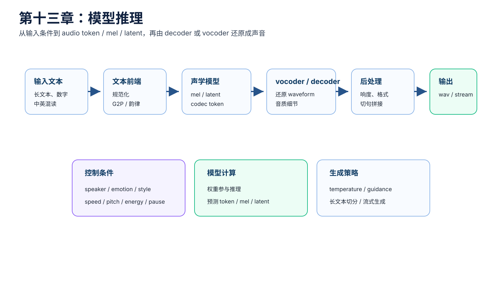
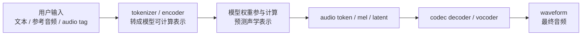
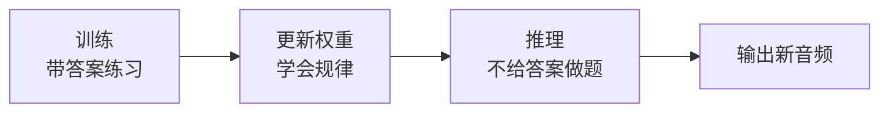
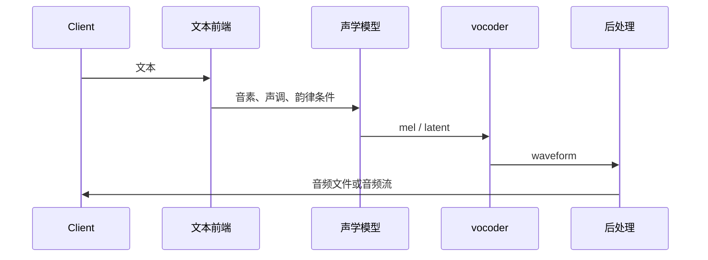
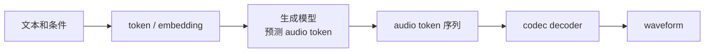
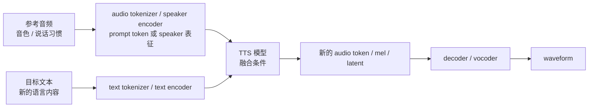
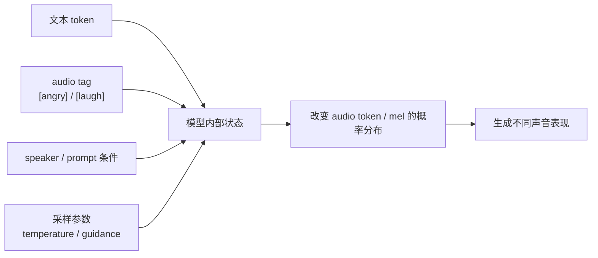
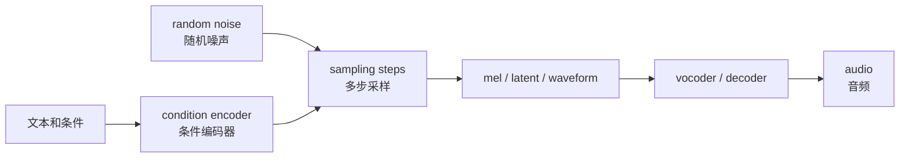
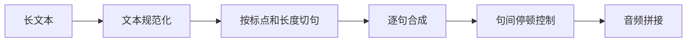

# 第十三章：模型推理 —— 模型如何从输入生成声音

训练结束后，模型权重已经学到了一套“如何根据条件生成声音表示”的计算规则。推理（inference）就是把用户本次输入的文本、参考音频、audio tag（音频标签）和采样参数送进这套计算规则，生成一段新的声音。

本章重点不是上线部署，而是解释推理本身：

```text
用户输入 -> token / embedding -> 模型计算 -> audio token / mel / latent -> decoder / vocoder -> waveform
```

训练回答“模型如何学会”，推理回答“模型如何使用学到的权重生成声音”。



## 本章导图



## 13.1 推理和训练有什么不同

训练时，模型既看到输入条件，也看到真实答案。真实答案可能是 mel-spectrogram（梅尔频谱）、latent（潜变量）或 audio token（语音编码 token）。模型预测错了，就通过 loss（损失）更新权重。

推理时，真实答案不存在。模型只能根据已经训练好的权重和本次输入，一步一步生成结果。

| 阶段 | 输入 | 目标 | 权重是否更新 |
| --- | --- | --- | --- |
| 训练 | 文本、音频、标签、真实目标表示 | 学会输入和目标声音之间的关系 | 会更新 |
| 推理 | 文本、参考音频、标签、采样参数 | 生成新的声音 | 通常不更新 |

可以把区别理解成：



## 13.2 普通两阶段 TTS 推理流程

典型两阶段 TTS 推理可以先这样看：

```text
输入文本
 -> 文本前端
 -> 音素 / 拼音 / 韵律边界
 -> 声学模型生成 mel-spectrogram
 -> vocoder 生成 waveform
 -> 音频后处理
 -> 输出音频
```

简化图：



排查问题时，要先确认每个模块的输入输出：

```text
文本前端输出是否读音正确？
声学模型输出是否漏读或重复？
vocoder 是否引入毛刺或爆音？
后处理是否改变响度或采样率？
```

## 13.3 codec token 路线的推理流程

在 codec token 路线里，模型通常不是直接生成 waveform（波形），而是先生成 audio token。后面的 codec decoder 再把 audio token 还原成声音。



这里的关键是：audio token 是一种中间表示。它已经包含了内容、音色、韵律、情绪、发音结构等混合信息，但还不是最终声音。

如果模型是自回归生成，它会像语言模型预测下一个字一样，逐步预测下一个 audio token：

```text
已有 token -> 预测下一个 token -> 加入序列 -> 再预测下一个 token
```

如果模型是非自回归或扩散式生成，它可能一次生成一批 token，或者通过多步迭代逐渐修正 token。

## 13.4 声音克隆推理：参考音频不是被替换内容

voice cloning TTS（声音克隆文本转语音）常见输入是：

```text
目标文本 + 参考音频 + 可选参考文本
```

一个容易误解的说法是：把参考音频里代表“说什么”的 token 替换成目标文本。这个说法有直觉价值，但并不准确。

更准确的理解是：

```text
参考音频提供“像谁说、可能怎么说”的条件。
目标文本提供“这次要说什么”的条件。
模型根据这些条件重新生成一段新的声音表示。
```



当前 OmniVoice 更接近 prompt / codec token 思路：参考音频会被编码成可供模型参考的条件，生成时和目标文本共同影响输出。它不是简单复制原音频，也不是直接替换原音频里的内容片段。

## 13.5 audio tag 和控制条件如何影响生成

audio tag（音频标签）、speaker embedding（说话人向量）、prompt speech（提示语音）、speed（语速）和 guidance scale（引导强度）都可以看作推理时的条件。

这些条件不是在最后一步硬改声音，而是在模型生成声学表示时就参与计算。



例如 `[angry]` 不是一个“愤怒按钮”。它会通过 embedding 和模型权重影响后续生成，使模型更倾向于生成高能量、重音更明显、节奏更急的声音 token 或声学表示。

常见控制维度：

| 维度 | 影响 |
| --- | --- |
| speaker（说话人） | 音色、音区、发声质感 |
| emotion（情绪） | 能量、音高走势、节奏、声音质感 |
| speed（语速） | duration（时长）和整体节奏 |
| pitch（音高） | F0 范围和语调 |
| prompt speech（提示语音） | 音色、说话习惯、部分风格 |

这些维度并不完全独立。emotion（情绪）会影响 pitch、energy、duration；speaker（说话人）也会影响常见 F0 范围和发声习惯。

## 13.6 diffusion TTS 推理流程

diffusion TTS（扩散式文本转语音）的推理多了采样过程：

```text
输入文本和条件
 -> 编码条件
 -> 初始化随机噪声
 -> 多步去噪
 -> 得到 mel / latent / waveform
 -> vocoder 或 decoder
 -> 输出音频
```

简化图：



常见推理参数：

| 参数 | 影响 |
| --- | --- |
| sampling steps（采样步数） | 步数多通常更慢，质量可能更稳 |
| temperature（温度） | 控制随机性和多样性 |
| guidance scale（引导强度） | 控制条件遵从强度 |
| seed（随机种子） | 控制可复现性 |
| speed control（语速控制） | 调整 duration 或整体时长 |

## 13.7 长文本推理：切句、停顿和拼接

长文本是 TTS 推理常见难点。

如果整段直接输入模型，可能出现：

```text
漏读
重复
后半段节奏漂移
显存占用过高
推理延迟过长
句间停顿不自然
```

常见做法是先切句：



切句不是简单按字符数切。它要考虑：

```text
标点
语义边界
最大 token 数
最大音频时长
中英混排
数字和缩写
```

拼接时还要控制 pause（停顿），否则听起来会过密或断裂。

## 13.8 流式生成

某些场景希望边生成边播放，减少首包延迟。这叫 streaming TTS（流式文本转语音）。

流式 TTS 要解决：

```text
文本如何增量切分
模型是否支持分块生成
块之间韵律是否连续
vocoder 是否能流式输出
前后块是否有拼接痕迹
```

流式生成的难点是上下文不完整。模型还没看到后面的文本，就要先生成前面的音频，所以自然度和全局韵律控制可能更难。

## 13.9 本章小结

本章最重要的直觉：

```text
推理时通常不更新权重，而是使用训练好的权重生成新声音。
用户输入会先变成 token / embedding，再进入模型计算。
模型通常先生成 audio token、mel 或 latent，再由 decoder / vocoder 还原成 waveform。
声音克隆不是替换参考音频里的内容，而是用参考音频提供条件重新生成。
audio tag 和控制条件会影响生成概率分布，不是最后一步硬改声音。
长文本和流式推理是工程上最容易暴露模型稳定性的场景。
```

下一章进入评测与部署：生成出来之后，如何判断好不好、快不快、稳不稳，以及如何放进服务链路。
