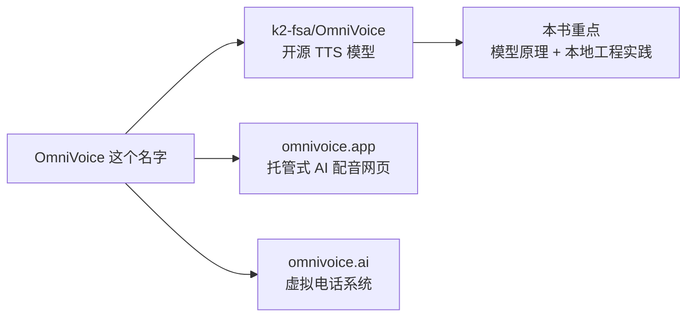
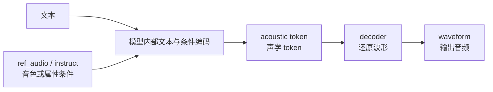

# 第十四章：OmniVoice 生态 —— 名字辨析、模型能力与工程边界

进入实战前，需要先把“OmniVoice”这个名字说清楚。搜索这个词时，你可能会看到开源 TTS 模型、AI 配音网站和虚拟电话系统。它们名字相似，但技术对象完全不同。

本章目标是建立工程边界：本书后续关注的是 k2-fsa/OmniVoice 这个开源 TTS（Text-to-Speech，文本转语音）模型，以及围绕它的本地推理、声音克隆和可控生成。

> 本章信息按 2026-05-20 可访问的官方页面和论文摘要整理。产品价格、模型版本、Star 数、网页能力都可能变化，后续实操前应再看官方 README。

## 本章导图



## 14.1 三个容易混淆的对象

| 名称 | 类型 | 和本书关系 |
| --- | --- | --- |
| k2-fsa/OmniVoice | 开源 TTS 模型 | 本书重点 |
| omnivoice.app | 托管式 AI voice cloning / TTS 网页服务 | 可以作为在线体验入口，但不是本地模型本身 |
| omnivoice.ai | virtual phone service（虚拟电话服务） | 业务电话系统，和开源 TTS 模型不是一回事 |

区分方式很简单：

```text
如果页面讲模型、GitHub、Hugging Face、voice cloning、voice design，多半是 TTS 生态。
如果页面讲电话号码、IVR、voicemail、SMS/MMS，多半是电话系统。
```

## 14.2 k2-fsa/OmniVoice：本书关注的开源 TTS 模型

k2-fsa/OmniVoice 的官方 Hugging Face 页面把它标为 Text-to-Speech（文本转语音）模型，标签包括 zero-shot（零样本）、multilingual（多语言）、voice-cloning（声音克隆）和 voice-design（声音设计）。

官方模型卡和论文摘要里给出的核心能力包括：

| 能力 | 极简解释 |
| --- | --- |
| multilingual TTS（多语言文本转语音） | 支持 600+ / 646 级别语言覆盖，具体以官方页面为准 |
| zero-shot voice cloning（零样本声音克隆） | 使用短参考音频克隆说话人声音，不需要为该说话人单独训练 |
| voice design（声音设计） | 通过 `instruct` 描述说话人属性，例如性别、年龄、音高、口音 |
| pronunciation control（发音控制） | 支持拼音或音素级别纠音 |
| non-verbal symbols（非语言声音符号） | 支持 `[laughter]`、`[sigh]` 等标签 |
| diffusion language model-style architecture（扩散语言模型式架构） | 论文中描述为离散非自回归架构，直接映射文本到多 codebook 声学 token |

从前面章节的知识地图看，它大致落在这里：



注意：上图是学习用简化图，不等于论文完整结构图。

## 14.3 OmniVoice 和前面章节知识点的对应关系

| 前面章节概念 | 在 OmniVoice 实战里怎么看 |
| --- | --- |
| text frontend（文本前端） | 输入文本仍然要处理数字、多语言、发音纠错 |
| speaker / timbre（说话人 / 音色） | `ref_audio` 提供参考音频，用于 voice cloning |
| style / attribute（风格 / 属性） | `instruct` 描述性别、年龄、音高、口音等 |
| codec token（语音编码 token） | 论文摘要提到直接生成多 codebook acoustic tokens |
| diffusion（扩散模型） | 官方描述为 diffusion language model-style architecture |
| sampling steps（采样步数） | `num_step` 控制迭代生成步数，步数和速度、质量有关 |
| speed / duration（语速 / 时长） | 官方参数支持 `speed` 和 `duration` 控制 |

这也是为什么前面要先学 mel、codec token、speaker embedding、duration、diffusion 和 flow matching：实战参数背后都有对应概念。

## 14.4 omnivoice.app：托管式网页服务

`omnivoice.app` 是面向用户的网页产品，页面描述了 voice cloning（声音克隆）、voice design（声音设计）、网页生成、播放和下载等功能。

它适合：

```text
快速体验效果
不想搭本地环境
给非工程同学演示能力
```

但它不等于你本地安装的 Python 包，也不等于模型论文。网页服务可能有自己的产品包装、价格策略、并发限制和功能入口。

学习时建议把它当作“在线体验层”，不要把网页价格或营销文案直接当作模型架构事实。

## 14.5 omnivoice.ai：虚拟电话系统，不是 TTS 模型

`omnivoice.ai` 官方页面描述的是 virtual phone service（虚拟电话服务），包括 call routing（呼叫路由）、voicemail（语音信箱）、SMS/MMS、call queues（呼叫队列）等功能。

它属于企业通讯 / VoIP（网络电话）方向，不是本书讨论的开源 TTS 模型。

这类同名现象很常见，工程调研时要先看页面在讲：

```text
模型、推理、voice cloning、Hugging Face、GitHub
还是
电话号码、IVR、voicemail、business calls
```

## 14.6 选型时不要只看宣传指标

如果把 OmniVoice 和其他 TTS 系统比较，不建议只看“支持多少语言”或“RTF 多低”。工程选型至少要看：

| 维度 | 需要问的问题 |
| --- | --- |
| 发音准确 | 多音字、数字、缩写、中英混读是否稳定 |
| 音色相似 | 目标说话人是否像，跨语言是否漂移 |
| 韵律自然 | 长句、疑问句、情绪句是否自然 |
| 可控性 | `instruct`、`speed`、`duration` 是否足够 |
| 推理速度 | 本机 / 服务器上的 RTF 和 P95 延迟是多少 |
| 部署成本 | 显存、依赖、并发、批量推理是否可控 |
| 许可证 | 是否满足商用和分发要求 |
| 安全边界 | 是否防止未授权声音克隆和冒充 |

本书后续章节更关注工程实操：先跑通，再理解每个参数背后的模型含义。

## 14.7 参考来源

- k2-fsa/OmniVoice Hugging Face 模型卡：<https://huggingface.co/k2-fsa/OmniVoice>
- k2-fsa/OmniVoice GitHub README：<https://github.com/k2-fsa/OmniVoice>
- OmniVoice 论文：<https://arxiv.org/abs/2604.00688>
- omnivoice.app 声音克隆页面：<https://omnivoice.app/voice-cloning>
- omnivoice.ai 虚拟电话服务页面：<https://www.omnivoice.ai/>

## 14.8 本章小结

本章最重要的直觉：

```text
OmniVoice 这个名字对应多个不同对象。
本书关注 k2-fsa/OmniVoice 这个开源 TTS 模型。
omnivoice.app 更像在线体验和托管服务。
omnivoice.ai 是虚拟电话系统，不是 TTS 模型。
工程选型要看真实任务、延迟、质量、许可和安全边界。
```

下一章开始做本地实战：安装依赖、加载模型、准备参考音频，并完成一次 zero-shot voice cloning（零样本声音克隆）。
