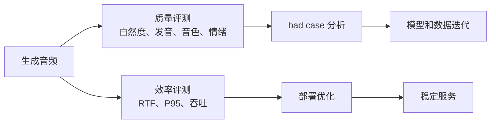

# 第十四章：评测与部署 —— 生成结果如何变成稳定服务

前一章讲模型如何生成声音。本章继续往后走：声音生成出来以后，怎样判断它好不好、快不快、稳不稳，以及怎样把它放进一个可长期运行的服务里。

评测和部署关注的不是“模型会不会生成”，而是：

```text
生成内容是否正确？
声音是否自然？
音色是否相似？
情绪是否到位？
推理是否够快？
服务是否稳定？
失败样本能否定位？
```

## 本章导图



## 14.1 为什么 TTS 评测不能只看一个指标

TTS（Text-to-Speech，文本转语音）的输出是给人听的，所以评测天然比较麻烦。一个音频可能：

```text
发音完全正确，但声音很机械。
声音很自然，但漏读了一个词。
音色很像目标说话人，但情绪不明显。
情绪很强，但音质变差。
RTF 很低，但长文本经常重复。
```

因此，TTS 评测通常要同时看主观听感、客观指标和工程效率。

## 14.2 主观评测：人耳最终说了算

主观评测让人直接听生成结果。

| 指标 | 极简解释 |
| --- | --- |
| MOS（平均意见分） | 人听后给自然度或音质打分 |
| CMOS（比较平均意见分） | 两个系统对比谁更好 |
| AB test（AB 测试） | 两段音频二选一 |
| preference test（偏好测试） | 听众选择更喜欢的结果 |
| speaker similarity test（说话人相似度测试） | 判断像不像目标说话人 |
| emotion similarity test（情绪相似度测试） | 判断情绪是否匹配 |

主观评测的优点是贴近真实体验，缺点是成本高、速度慢、容易受听众偏好影响。

工程上可以把主观评测当作“最终验收”，但不能把它当作唯一监控手段。

## 14.3 客观评测：用工具快速定位问题

客观评测用模型或算法辅助检查生成结果。

| 指标 | 极简解释 |
| --- | --- |
| WER（词错误率） | 用 ASR 检查发音内容是否正确 |
| CER（字错误率） | 中文场景常用字符错误率 |
| MCD（梅尔倒谱失真） | 衡量声学距离，不能完全代表听感 |
| F0 RMSE（基频均方根误差） | 衡量音高预测误差 |
| duration error（时长误差） | 衡量时长预测误差 |
| speaker verification similarity（说话人验证相似度） | 用声纹模型衡量音色相似 |
| emotion classification accuracy（情绪分类准确率） | 用分类器辅助评估情绪控制 |
| RTF（实时率） | 衡量推理速度 |

要注意：

```text
客观指标不能完全代表人耳感受。
```

例如 mel loss 很低，声音可能仍然发闷；WER 很低，情绪表现可能仍然差。客观指标更适合做批量筛查和回归测试，最后仍要回到人工听感。

## 14.4 根据目标选择评测指标

不同研究目标应该选择不同指标：

| 研究目标 | 主要评测 |
| --- | --- |
| 音质 | MOS、CMOS、人工听测 |
| 发音准确 | WER、CER、人工听测 |
| 音色克隆 | speaker similarity、人工相似度测试 |
| 情绪控制 | emotion similarity、MOS、偏好测试 |
| 韵律自然 | MOS、F0 / duration 分析 |
| 推理效率 | RTF、P95 延迟、吞吐 |
| 长文本稳定性 | 漏读率、重复率、人工 bad case |

一个实用评测集通常包含：

```text
短句
长句
数字日期
多音字
中英混读
不同情绪
不同说话人
难读专有名词
```

评测集要尽量固定。否则每次换一批文本，很难判断新模型到底变好了还是只是样本变简单了。

## 14.5 RTF（实时率）和延迟

RTF（real-time factor，实时率）是 TTS 推理常用速度指标：

```text
RTF = 生成耗时 / 音频时长
```

例子：

```text
生成 10 秒音频耗时 1 秒，RTF = 0.1
生成 10 秒音频耗时 12 秒，RTF = 1.2
```

通常：

```text
RTF < 1 表示快于实时播放。
RTF 越低，生成越快。
```

但服务端还要关注：

```text
P50 / P95 / P99 延迟
队列等待时间
文本前端耗时
条件编码耗时
声学模型耗时
vocoder / decoder 耗时
音频编码和上传耗时
```

只看模型 kernel 时间是不够的。一个用户请求经历的是完整链路，不是单个算子。

## 14.6 部署优化

常见部署优化方向：

```text
模型导出
ONNX
TensorRT
TorchScript
量化
半精度推理
批量推理
流式生成
缓存文本前端
缓存 speaker embedding
缓存 prompt speech 表征
音频后处理优化
```

按模块看：

| 模块 | 可优化点 |
| --- | --- |
| 文本前端 | 规则缓存、词典缓存、批处理 |
| 条件编码器 | 缓存 speaker / prompt 表征 |
| diffusion sampler | 减少 sampling steps、使用更快采样器 |
| vocoder / decoder | TensorRT、批量推理、半精度 |
| 音频后处理 | 避免重复重采样和格式转换 |

扩散模型特别要关注采样步数。少步采样能提升速度，但可能损失自然度或稳定性。

## 14.7 服务化常见问题

TTS 服务中常见问题：

| 问题 | 可能原因 |
| --- | --- |
| 数字读错 | 文本规范化缺规则 |
| 多音字读错 | G2P 或消歧失败 |
| 英文缩写奇怪 | 缩写词表或语言识别问题 |
| 漏读重复 | 对齐、长文本切分、模型稳定性 |
| 音频爆音 | vocoder、采样率、音频预处理 |
| 音色漂移 | prompt 太短、speaker embedding 不稳 |
| 情绪不明显 | 情绪标签弱、guidance 太低、训练数据不足 |
| 延迟高 | diffusion steps 多、vocoder 慢、排队严重 |
| 显存高 | batch 太大、长文本、模型过大 |

排查时不要一上来就怀疑“大模型坏了”。很多问题来自文本前端、参考音频、采样率、后处理或部署参数。

## 14.8 线上日志和 bad case 闭环

线上建议记录：

```text
输入文本
文本前端输出
说话人 / 风格条件
模型版本
采样参数
音频时长
各阶段耗时
失败原因
bad case 音频
```

这些日志能帮助区分文本前端问题、声学模型问题、vocoder 问题和服务资源问题。

一个健康的 TTS 服务应该有 bad case 闭环：


没有 bad case 闭环，模型效果会停留在“听起来好像还行”，很难稳定迭代。

## 14.9 本章小结

本章最重要的直觉：

```text
评测要同时看主观听感、客观指标和工程效率。
客观指标适合批量筛查，但不能完全替代人耳。
RTF、P95 延迟和吞吐是部署必须关注的指标。
服务性能取决于完整链路，不只取决于模型本体。
线上日志和 bad case 闭环决定了系统能否长期变好。
```

下一章进入 OmniVoice 工程实践：先厘清 OmniVoice 生态，再开始本地实战和可控生成。
