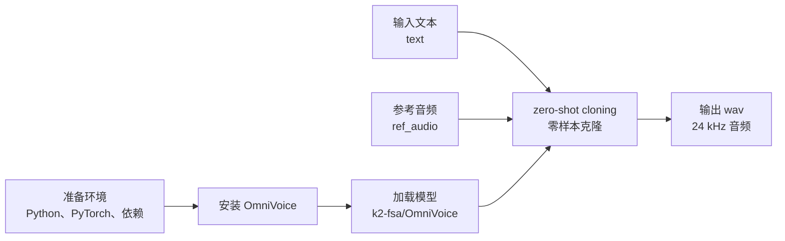

# 第十五章：OmniVoice 本地实战 —— 零样本声音克隆

本章从理论走向实践：在本地跑通 k2-fsa/OmniVoice 的 zero-shot voice cloning（零样本声音克隆）。

本章不追求一次性覆盖所有部署形态，而是先完成最小闭环：

```text
安装依赖 -> 准备参考音频 -> 加载模型 -> 输入文本 -> 生成 wav
```

> 本章命令按官方 GitHub README 在 2026-05-20 可见内容整理。模型版本、依赖版本和安装方式可能变化，实操前应重新查看官方 README。

## 本章导图



## 15.1 先确认你要跑的是什么

这一章跑的是 voice cloning（声音克隆）模式：

```text
text + ref_audio + 可选 ref_text -> generated audio
```

其中：

| 参数 | 作用 |
| --- | --- |
| `text` | 目标文本，也就是希望模型读出来的内容 |
| `ref_audio` | 参考音频，用来提供说话人的音色线索 |
| `ref_text` | 参考音频对应文本；可以手写，也可以省略后让模型用 Whisper 自动转写 |
| `output wav` | 输出音频文件 |

官方示例说明 `model.generate(...)` 返回的是 `np.ndarray` 列表，音频采样率是 24 kHz。

## 15.2 创建干净环境

建议使用独立虚拟环境，避免污染系统 Python。

```bash
python3 -m venv .venv
source .venv/bin/activate
python -m pip install --upgrade pip
```

Apple Silicon 设备可按官方 README 安装 PyTorch：

```bash
pip install torch==2.8.0 torchaudio==2.8.0
```

NVIDIA GPU 设备需要按自己的 CUDA 版本安装对应 PyTorch。官方 README 给了 CUDA 12.8 示例：

```bash
pip install torch==2.8.0+cu128 torchaudio==2.8.0+cu128 --extra-index-url https://download.pytorch.org/whl/cu128
```

安装 OmniVoice：

```bash
pip install omnivoice
```

也可以安装 GitHub 最新源码：

```bash
pip install git+https://github.com/k2-fsa/OmniVoice.git
```

## 15.3 网络和模型下载

首次运行会下载预训练模型。官方 README 提到，如果连接 Hugging Face 下载模型有问题，可以设置：

```bash
export HF_ENDPOINT="https://hf-mirror.com"
```

如果你在 Python 脚本里设置，也要放在加载模型之前：

```python
import os

os.environ["HF_ENDPOINT"] = "https://hf-mirror.com"
```

注意：镜像可用性会随时间变化。遇到下载失败时，先确认网络、代理、镜像站和 Hugging Face 模型页面是否可访问。

## 15.4 准备参考音频

官方 tips 建议使用 3 到 10 秒参考音频。过长音频会拖慢推理，也可能降低克隆质量。

参考音频建议：

```text
说话人单一
背景噪声少
无明显混响
音量适中
不要有长静音
内容和目标语言尽量一致
```

如果做 cross-lingual voice cloning（跨语言声音克隆），要注意官方说明：生成语音可能带有参考音频语言的口音。

## 15.5 设备选择

官方示例使用：

```python
device_map="cuda:0"
dtype=torch.float16
```

Apple Silicon 可以使用：

```python
device_map="mps"
```

为了让脚本更适合本地尝试，可以写一个简单设备选择逻辑：

```python
import torch

def pick_device() -> str:
    if torch.cuda.is_available():
        return "cuda:0"
    if torch.backends.mps.is_available():
        return "mps"
    return "cpu"
```

CPU 也能作为 fallback（回退设备），但速度会明显慢。

## 15.6 最小可运行脚本

把参考音频放到当前目录，命名为 `reference_voice.wav`，然后运行下面脚本。

```python
#!/usr/bin/env python3
import os
from pathlib import Path

import soundfile as sf
import torch
from omnivoice import OmniVoice

MODEL_ID = "k2-fsa/OmniVoice"
REFERENCE_AUDIO = Path("reference_voice.wav")
OUTPUT_AUDIO = Path("omnivoice_clone_result.wav")
SAMPLE_RATE = 24000
TARGET_TEXT = "你好，这是一段使用 OmniVoice 进行零样本声音克隆的测试音频。"


def pick_device() -> str:
    if torch.cuda.is_available():
        return "cuda:0"
    if torch.backends.mps.is_available():
        return "mps"
    return "cpu"


def main() -> None:
    if not REFERENCE_AUDIO.exists():
        raise FileNotFoundError(f"missing reference audio: {REFERENCE_AUDIO}")

    os.environ.setdefault("HF_ENDPOINT", "https://hf-mirror.com")

    device = pick_device()
    dtype = torch.float16 if device != "cpu" else torch.float32

    model = OmniVoice.from_pretrained(
        MODEL_ID,
        device_map=device,
        dtype=dtype,
    )

    audio = model.generate(
        text=TARGET_TEXT,
        ref_audio=str(REFERENCE_AUDIO),
    )

    sf.write(OUTPUT_AUDIO, audio[0], SAMPLE_RATE)
    print(f"saved: {OUTPUT_AUDIO.resolve()}")


if __name__ == "__main__":
    main()
```

这里没有写复杂封装，是为了让你先看清楚核心链路：

```text
加载模型 -> 输入 text 和 ref_audio -> 返回 np.ndarray 音频 -> 写入 wav
```

## 15.7 常见错误和排查

| 现象 | 优先排查 |
| --- | --- |
| 模型下载卡住 | 网络、代理、`HF_ENDPOINT`、Hugging Face 可访问性 |
| `reference_voice.wav` 找不到 | 当前工作目录是否正确 |
| MPS / CUDA 报错 | 先切 CPU 验证功能，再查设备兼容 |
| 生成很慢 | 是否在 CPU 上跑，参考音频是否过长 |
| 音色不像 | 参考音频太短、太噪、多人声、跨语言口音影响 |
| 数字读错 | 先做文本规范化，把数字展开成文字 |
| 输出音频异常 | 检查 `sf.write` 采样率是否为 24000 |

## 15.8 CLI 方式

官方也提供 CLI（命令行）入口。单条 voice cloning 可以使用：

```bash
omnivoice-infer \
  --model k2-fsa/OmniVoice \
  --text "This is a test for text to speech." \
  --ref_audio ref.wav \
  --output hello.wav
```

如果有 `ref_text`，也可以传入；如果省略，官方 README 说明模型会使用 Whisper ASR 自动转写参考音频。

CLI 适合快速验证，Python API 适合集成到你自己的工程流程。

## 15.9 本章小结

本章最重要的直觉：

```text
zero-shot voice cloning 使用 ref_audio 提供音色条件。
官方 API 返回 24 kHz 的 np.ndarray 音频列表。
参考音频质量会直接影响克隆效果。
训练章节里的文本规范化、采样率、音频质量检查，在本地推理中仍然重要。
```

下一章继续看可控生成：`instruct`、`num_step`、`guidance_scale`、`speed`、`duration` 这些参数如何对应前面学过的音色、风格、采样和韵律控制。
