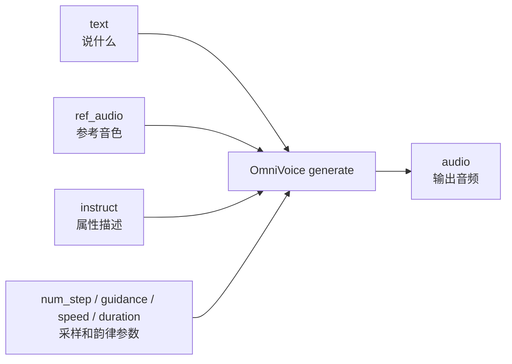

# 第十六章：OmniVoice 可控生成 —— 音色克隆、声音设计与推理参数

完成第十五章的 zero-shot voice cloning（零样本声音克隆）后，本章继续看 OmniVoice 的可控生成能力。

这里要先区分两个概念：

```text
voice cloning（声音克隆）：用 ref_audio 提供参考音色。
voice design（声音设计）：用 instruct 描述想要的说话人属性。
```

两者都属于“控制生成”，但控制入口不同。本章重点是把这些控制入口和前面学过的 TTS 概念对应起来。

## 本章导图



## 16.1 voice cloning：用 `ref_audio` 控制音色

voice cloning（声音克隆）模式的核心输入是：

```text
text + ref_audio + 可选 ref_text
```

它对应前面第六章的：

```text
speaker identity（说话人身份）
timbre（音色）
prompt speech（提示语音）
```

示例：

```python
audio = model.generate(
    text="Hello, this is a test of zero-shot voice cloning.",
    ref_audio="ref.wav",
    ref_text="Transcription of the reference audio.",
)
```

如果省略 `ref_text`，官方 README 说明模型会用 Whisper ASR 自动转写参考音频。工程上，如果你已经有准确转写，手动传入 `ref_text` 更可控。

## 16.2 voice design：用 `instruct` 描述属性

voice design（声音设计）模式使用 `instruct` 参数，不需要参考音频。

官方文档描述的 `instruct` 是一个用逗号分隔的属性字符串，支持 gender（性别）、age（年龄）、pitch（音高）、style（风格）、accent（英文口音）和 dialect（中文方言）等类别。

示例：

```python
audio = model.generate(
    text="Hello, this is a test for voice design.",
    instruct="female, young adult, high pitch, british accent",
)
```

它对应前面章节里的：

```text
style condition（风格条件）
speaker attribute（说话人属性）
pitch control（音高控制）
accent control（口音控制）
```

## 16.3 `instruct` 支持哪些属性

官方 voice design 文档中列出的属性包括：

| 类别 | 示例 |
| --- | --- |
| gender（性别） | `male`、`female` |
| age（年龄） | `child`、`teenager`、`young adult`、`middle-aged`、`elderly` |
| pitch（音高） | `very low pitch`、`low pitch`、`moderate pitch`、`high pitch`、`very high pitch` |
| style（风格） | `whisper` |
| English accent（英文口音） | `american accent`、`british accent`、`australian accent`、`canadian accent`、`indian accent` 等 |
| Chinese dialect（中文方言） | `四川话`、`陕西话`、`东北话` 等 |

几个注意点：

```text
同一类别里通常只选一个属性。
不同类别可以组合。
英文口音主要对英文文本生效。
中文方言主要对中文文本生效。
某些属性组合可能效果不好，模型可能忽略其中一部分。
```

例如：

```text
male, elderly, low pitch, american accent
female, young adult, high pitch, british accent
女，青年，高音调，四川话
```

## 16.4 `ref_audio` 和 `instruct` 不要先假设完全解耦

初学时很容易把它想成：

```text
ref_audio 只控制音色
instruct 只控制口音或风格
```

这个理解有帮助，但不要把它当成严格物理事实。真实模型里，音色、口音、韵律、年龄感、音高范围会互相纠缠。

更稳妥的理解是：

```text
ref_audio 提供参考语音条件，强烈影响音色和说话习惯。
instruct 提供属性条件，影响模型生成声音的方向。
最终结果是多个条件共同作用后的输出。
```

如果你的当前 OmniVoice 版本支持同时传 `ref_audio` 和 `instruct`，可以把它作为实验项验证；如果效果不稳定，先分开测试 voice cloning 和 voice design，确认每个控制入口单独有效。

## 16.5 推理参数：`num_step`、`guidance_scale`、`speed`、`duration`

官方 generation parameters 文档列出了一些常见控制参数。

| 参数 | 极简解释 | 对应前面章节 |
| --- | --- | --- |
| `num_step` | 迭代生成步数；步数多通常更慢，质量可能更稳 | diffusion sampling（扩散采样） |
| `guidance_scale` | classifier-free guidance（无分类器引导）强度 | 条件控制 |
| `speed` | 语速因子；大于 1 更快，小于 1 更慢 | duration（时长） |
| `duration` | 固定输出时长，优先级高于 `speed` | 时长控制 |
| `position_temperature` | mask 位置选择随机性 | sampling（采样） |
| `class_temperature` | token 采样随机性 | sampling（采样） |

示例：

```python
audio = model.generate(
    text="Hello, this is a speed control test.",
    instruct="male, young adult, american accent",
    num_step=32,
    guidance_scale=2.0,
    speed=1.2,
)
```

如果指定 `duration`：

```python
audio = model.generate(
    text="Hello, this output should be close to ten seconds.",
    instruct="female, moderate pitch, british accent",
    duration=10.0,
)
```

官方文档说明：`duration` 优先级高于 `speed`。也就是说同时传时，`speed` 会被忽略。

## 16.6 口音控制实验设计

如果你想验证口音控制，不要只生成一条音频就下结论。建议设计一个小实验：

```text
同一段英文文本
同一组随机种子或尽量固定参数
只改变 instruct 里的 accent
分别生成 american / british / indian 等版本
人工听测 + ASR 检查
```

示例配置：

```python
ACCENT_CASES = {
    "us": "male, elderly, american accent",
    "uk": "male, elderly, british accent",
    "in": "male, elderly, indian accent",
}
```

注意：口音判断有主观性。建议至少看三类结果：

| 检查项 | 说明 |
| --- | --- |
| 发音准确 | 文本有没有读错 |
| 口音方向 | 是否能听出目标口音倾向 |
| 音质自然 | 是否因为控制过强变得怪异 |

## 16.7 批量生成脚本

下面脚本演示 voice design（声音设计）下的多口音批量生成。它不依赖参考音频，先验证 `instruct` 单独是否有效。

```python
#!/usr/bin/env python3
from pathlib import Path

import soundfile as sf
import torch
from omnivoice import OmniVoice

MODEL_ID = "k2-fsa/OmniVoice"
SAMPLE_RATE = 24000
TEXT = (
    "Hello, today I am testing accent control in a text to speech system. "
    "The content is the same, but the speaker attributes are different."
)

CASES = {
    "us": "male, elderly, american accent",
    "uk": "male, elderly, british accent",
    "in": "male, elderly, indian accent",
}


def pick_device() -> str:
    if torch.cuda.is_available():
        return "cuda:0"
    if torch.backends.mps.is_available():
        return "mps"
    return "cpu"


def main() -> None:
    device = pick_device()
    dtype = torch.float16 if device != "cpu" else torch.float32

    model = OmniVoice.from_pretrained(
        MODEL_ID,
        device_map=device,
        dtype=dtype,
    )

    out_dir = Path("omnivoice_accent_outputs")
    out_dir.mkdir(exist_ok=True)

    for name, instruct in CASES.items():
        audio = model.generate(
            text=TEXT,
            instruct=instruct,
            num_step=32,
            guidance_scale=2.0,
        )
        out_path = out_dir / f"{name}.wav"
        sf.write(out_path, audio[0], SAMPLE_RATE)
        print(f"saved {name}: {out_path.resolve()}")


if __name__ == "__main__":
    main()
```

跑通后，再尝试加入 `ref_audio` 做组合实验，并记录结果是否真的“保留音色同时改变口音”。不要直接假设一定成功。

## 16.8 可控生成的排查方法

| 现象 | 优先排查 |
| --- | --- |
| `instruct` 不生效 | 属性是否在官方列表里，文本语言是否匹配口音 / 方言 |
| 口音明显但音质变差 | 控制过强、属性组合冲突、采样参数不合适 |
| 语速不对 | `speed` 和 `duration` 是否同时传入 |
| 输出太随机 | temperature 参数是否过高 |
| 生成太慢 | `num_step` 是否过大，是否在 CPU 上跑 |
| 长文本不稳 | 查看 long-form chunk 参数和文本切句 |

## 16.9 本章小结

本章最重要的直觉：

```text
voice cloning 用 ref_audio 提供参考音色。
voice design 用 instruct 描述目标说话人属性。
instruct 支持性别、年龄、音高、风格、英文口音和中文方言等类别。
num_step、guidance_scale、speed、duration 分别对应采样质量、条件强度和时长控制。
音色、口音、韵律不是完全解耦的，组合控制要通过实验验证。
```

到这里，全书的主线闭环是：

```text
声音基础 -> 语音表征 -> TTS 模型 -> diffusion / flow -> 训练推理 -> OmniVoice 实战
```
