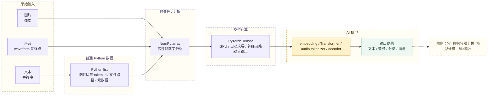
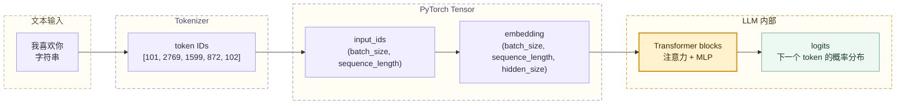
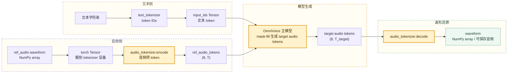

# 第十八章：扩展知识一 —— Python List、NumPy Array 与 PyTorch Tensor

AI 模型看起来在处理文字、图片和声音，但真正进入模型计算的内容几乎全部是数字。文本会被转换成 token ID，图片会被转换成像素矩阵，声音会被转换成采样点序列或声学 token。理解这些数字如何被存放、转换和计算，是阅读模型代码的基础。

Python 项目里最常见的三种数字容器是：

```text
Python list
NumPy array
PyTorch Tensor
```

它们都能存数字，但职责不同：**Python list** 更像普通数据盒子，**NumPy array** 更像高性能数学数组，**PyTorch Tensor** 则是深度学习模型真正用于训练和推理的张量对象。

## 18.1 三种数字容器在 AI 链路中的位置



这张图里的关键关系是：**list、array、Tensor 不是互相替代的同义词**。它们经常出现在同一条链路的不同时刻。

```text
原始数据
-> Python list 临时保存
-> NumPy array 做预处理和分析
-> PyTorch Tensor 送进模型计算
-> 模型输出新的 Tensor
```

## 18.2 Python List：最普通、最灵活的列表

Python list 是 Python 自带的数据结构，可以理解成最普通的列表。

```python
a = [1, 2, 3, 4]
```

它可以存数字，也可以存字符串、布尔值，甚至混合存放不同类型的数据。

```python
b = [1, "hello", True]
```

这种灵活性很强，但 list 不是为大规模数学计算设计的。一个典型例子是：

```python
[1, 2, 3] * 2
```

结果不是每个数字乘以 2，而是列表被复制了一遍：

```python
[1, 2, 3, 1, 2, 3]
```

如果要让每个元素都乘以 2，需要显式写循环或列表推导：

```python
[x * 2 for x in [1, 2, 3]]
```

因此，Python list 更适合普通程序逻辑里的数据收集、临时保存和结构组织。例如：

```python
texts = ["你好", "今天天气不错"]
file_paths = ["a.wav", "b.wav"]
token_ids = [101, 2769, 1599, 872, 102]
```

在 AI 项目里，list 常见于数据读取、batch 拼接前的临时状态、文件路径清单、JSON 字段和少量 token ID 保存。它能装很多东西，但不擅长直接做高性能矩阵计算。

## 18.3 NumPy Array：Python 里的高性能数字数组

NumPy array 是 NumPy 库提供的高性能数组对象，正式名称常写作 `ndarray`。

```python
import numpy as np

a = np.array([1, 2, 3])
```

NumPy array 看起来像 Python list，但它更像专门为数学计算优化过的数字表格。

```python
np.array([1, 2, 3]) * 2
```

结果是每个数字都乘以 2：

```python
array([2, 4, 6])
```

NumPy array 适合做：

```text
向量计算
矩阵计算
统计分析
图像像素处理
音频波形处理
embedding 相似度计算
```

在 AI 里，NumPy array 经常出现在数据预处理阶段。文本经过 tokenizer 后可能先得到 token ID：

```python
token_ids = [101, 2769, 1599, 872, 102]
```

这串 ID 可以转成 NumPy array：

```python
token_ids = np.array([101, 2769, 1599, 872, 102])
```

一句话的 embedding 也可以是 NumPy array：

```python
embedding = np.array([0.12, -0.35, 0.89, 0.04])
```

这类向量可以用来计算相似度、聚类、检索或可视化。NumPy 的优势是 CPU 上的科学计算和数据处理非常成熟；它不是深度学习框架本身，通常不负责神经网络训练时的自动求导。

## 18.4 PyTorch Tensor：AI 模型真正用于计算的张量

PyTorch Tensor 是 PyTorch 框架里的核心数据结构。如果说 NumPy array 是科学计算里的数组，那么 PyTorch Tensor 就是深度学习里的数组。

```python
import torch

x = torch.tensor([1, 2, 3])
```

Tensor 和 NumPy array 一样能表示多维数字数组，但它多了深度学习非常需要的能力：

```text
可以放到 GPU / 加速设备上计算
可以自动求导
可以直接参与神经网络训练和推理
```

例如，把 Tensor 放到 GPU 上：

```python
x = torch.tensor([1.0, 2.0, 3.0])
x = x.to("cuda")
```

大模型训练和推理需要大量矩阵乘法，GPU 更适合这类并行计算。Tensor 的另一个关键能力是自动求导：

```python
x = torch.tensor(2.0, requires_grad=True)
y = x * x
y.backward()
```

这里 PyTorch 会自动计算：

```text
y = x²
当 x = 2 时，dy/dx = 4
```

神经网络训练的基础就是计算 loss 对模型参数的梯度，再根据梯度更新参数。Tensor 因此不仅是数据容器，也是训练计算图中的一部分。

> 💡 **小科普：Tensor 和“张量”是什么关系？**
>
> Tensor 的中文常译为“张量”。初学阶段可以把它理解成多维数字数组：0 维是一个数字，1 维是向量，2 维是矩阵，3 维及以上就是更高维的数字网格。深度学习里的输入、权重、中间结果、logits 和 loss，大多都会用 Tensor 表示。

## 18.5 三者的核心区别

一句话概括：

```text
Python list：普通数据列表
NumPy array：高性能数学数组
PyTorch Tensor：深度学习计算数组
```

更具体的对比如下：

| 类型 | 主要用途 | 是否适合数学计算 | 是否支持 GPU | 是否支持自动求导 |
| --- | --- | --- | --- | --- |
| Python list | 普通数据存储 | 不太适合 | 不支持 | 不支持 |
| NumPy array | 科学计算、数据处理 | 适合 | 通常不直接支持 | 不支持 |
| PyTorch Tensor | AI 训练和推理 | 非常适合 | 支持 | 支持 |

它们在实际工程中经常互相转换：

```python
import numpy as np
import torch

py_list = [1, 2, 3]
np_array = np.array(py_list)
tensor = torch.tensor(np_array)

back_to_numpy = tensor.cpu().numpy()
back_to_list = back_to_numpy.tolist()
```

转换时需要注意设备位置。GPU Tensor 不能直接 `.numpy()`，通常要先 `.cpu()` 搬回 CPU：

```python
tensor.cpu().numpy()
```

这类细节在模型推理代码里很常见。例如音频后处理通常要把 Tensor 从 GPU 拿回 CPU，再转成 NumPy array，最后交给音频保存库写成 `.wav` 文件。

## 18.6 在 LLM 里怎么理解这些容器

LLM 的一个基本事实是：

```text
模型不能直接理解文字，它只能计算数字。
```

“我喜欢你”这句话进入模型前，通常会先经过 tokenizer，变成一串 token ID：

```python
[101, 2769, 1599, 872, 102]
```

随后它可能被转成 PyTorch Tensor：

```python
input_ids = torch.tensor([[101, 2769, 1599, 872, 102]])
```

这个 Tensor 的形状是：

```python
(1, 5)
```

含义是：

```text
1 条文本
每条文本有 5 个 token
```

LLM 里常见的输入形状是：

```text
(batch_size, sequence_length)
```

例如：

```text
(8, 512)
```

表示：

```text
一次输入 8 条文本
每条文本长度是 512 个 token
```

模型随后会把 token ID 转成 embedding。embedding 是更高维的数字向量，常见形状是：

```text
(batch_size, sequence_length, hidden_size)
```

例如：

```text
(8, 512, 4096)
```

表示：

```text
8 条文本
每条 512 个 token
每个 token 用 4096 个数字表示
```



这时候，数据已经不是普通意义上的列表，而是高维 Tensor。LLM 的核心计算基本是在这些高维 Tensor 上做矩阵乘法、注意力计算和概率预测。

## 18.7 在 TTS / OmniVoice 里怎么理解这些容器

TTS 系统处理的是文字和声音，因此 list、NumPy array、Tensor 会同时出现。

在 OmniVoice 这类系统里，可以按下面链路理解：



参考音频进入声音克隆链路时，通常先以 NumPy array 的形式出现。进入 audio tokenizer 前，会转成 PyTorch Tensor：

```python
ref_wav_tensor = torch.from_numpy(ref_wav).to(self.audio_tokenizer.device)
```

再由 audio tokenizer 编码成离散 token：

```python
ref_audio_tokens = self.audio_tokenizer.encode(
    ref_wav_tensor.unsqueeze(0),
).audio_codes.squeeze(0)
```

这里的 `ref_audio_tokens` 形状通常是：

```text
(8, T)
```

含义是：

```text
8 层 codebook
T 个音频时间步
```

模型生成完成后，输出的 target audio tokens 仍然是 Tensor。最后要通过 `audio_tokenizer.decode` 还原成 waveform，再转成 NumPy array，交给 `soundfile.write` 之类的库保存为音频文件。

因此，在 TTS 代码里看到下面几类变量时，可以这样判断：

| 变量类型 | 常见含义 |
| --- | --- |
| `list[str]` | 多条文本、文件路径、语言标签、批量任务字段 |
| `np.ndarray` | waveform、音频后处理结果、保存前的波形 |
| `torch.Tensor` | token IDs、audio tokens、embedding、logits、模型输出 |

## 18.8 常见误区

| 误区 | 更准确的理解 |
| --- | --- |
| Tensor 就是特征 | Tensor 是数字容器，可以装原始数据、特征、权重、中间结果或输出 |
| NumPy array 和 Tensor 没区别 | 二者都能表示数组，但 Tensor 支持 GPU 和自动求导，更适合深度学习 |
| Python list 也能做数学计算 | list 能写循环做计算，但不适合大规模向量化计算 |
| GPU Tensor 可以直接转 NumPy | 通常要先 `.cpu()`，再 `.numpy()` |
| AI 模型直接理解文字、图片和声音 | 模型真正计算的是数字数组和张量 |

三种容器可以用一个比喻记住：

```text
Python list：普通盒子，什么都能装，但不擅长计算。
NumPy array：计算器里的数字表格，适合快速数学计算。
PyTorch Tensor：AI 模型的燃料，可以上 GPU，还能参与训练。
```

本章的核心结论是：

```text
AI 模型所谓的“理解文字、图片、声音”，本质上都要先把它们变成数字数组或张量，再用大量数学计算找规律。
```
