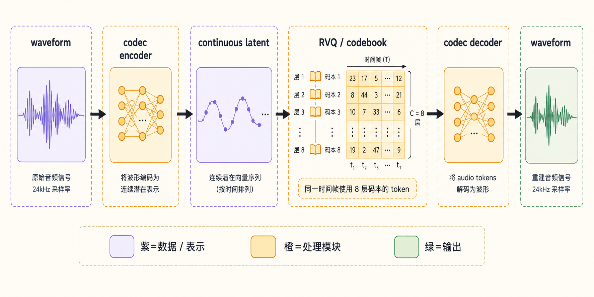
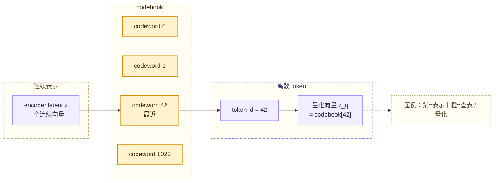
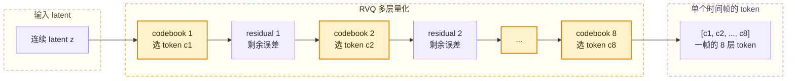
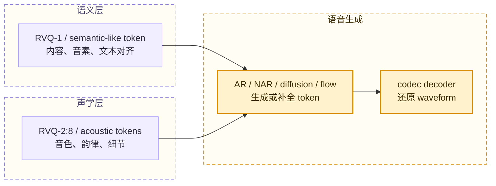
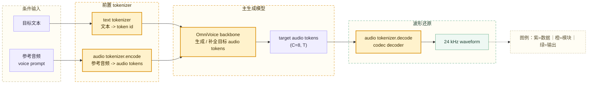

# 第十九章：扩展知识二 —— 神经音频 Codec、Codebook 与语音 Token

现代 TTS 和语音大模型经常把声音转换成 token。文本里的 token 通常来自分词器和词表，语音里的 token 则常常来自 neural audio codec（神经音频编解码器）。理解 codec、codebook、RVQ、semantic token 和 acoustic token，是读懂 OmniVoice、VALL-E、CosyVoice、SpeechTokenizer、EnCodec 这类路线的关键。



本章补充两个常见问题：

```text
语音为什么可以像文本一样变成 token？
一帧声音为什么会有多层 codebook token？
```

## 19.1 声音变成 token 的完整链路

神经音频 codec 的目标是：把 waveform（波形）压缩成更短的中间表示，并且尽量保真地还原回 waveform。它通常包含 encoder、quantizer 和 decoder 三个部分。

```mermaid
flowchart LR
    subgraph rawStage["原始音频"]
        A["waveform<br/>连续采样点"]
    end

    subgraph encodeStage["编码压缩"]
        B["codec encoder<br/>波形 -> 连续 latent"]
        C["continuous latent<br/>按时间排列的连续向量"]
    end

    subgraph quantStage["离散化 / token 化"]
        D["RVQ quantizer<br/>多层 codebook 量化"]
        E["codec / acoustic tokens<br/>离散整数 ID"]
    end

    subgraph decodeStage["波形还原"]
        F["codec decoder<br/>token -> waveform"]
        G["reconstructed waveform<br/>重建音频"]
    end

    A --> B --> C --> D --> E --> F --> G
    G -.-> L["图例：紫=数据 / 表示｜橙=处理模块｜绿=输出"]

    classDef data fill:#F0EEFF,stroke:#9B8CFF,color:#2D2A3A;
    classDef core fill:#FFF2CC,stroke:#D88B00,stroke-width:2px,color:#3B2A00;
    classDef output fill:#EEF8F3,stroke:#5CA982,color:#173B2B;
    classDef note fill:#FFFDF4,stroke:#B7A870,stroke-dasharray:3 3,color:#5A5134;
    class A,C,E data;
    class B,D,F core;
    class G output;
    class L note;
    style rawStage fill:#FFFDF4,stroke:#B7A870,stroke-dasharray:6 4,color:#5A5134;
    style encodeStage fill:#FFFDF4,stroke:#D88B00,stroke-dasharray:6 4,color:#3B2A00;
    style quantStage fill:#FFFDF4,stroke:#D88B00,stroke-dasharray:6 4,color:#3B2A00;
    style decodeStage fill:#FFFDF4,stroke:#5CA982,stroke-dasharray:6 4,color:#173B2B;
```



这条链路里，**encoder** 把原始波形压成连续向量，**quantizer** 把连续向量变成离散编号，**decoder** 再根据这些编号还原声音。

文本 tokenizer 的工作大致是：

```text
文本 -> token -> token id
```

声学 tokenizer / neural codec 的工作更接近：

```text
waveform -> continuous latent -> codec token -> waveform
```

两者都产出整数 ID，但来源不同。文本 token 来自语言符号切分，声学 token 来自神经网络对声音的压缩和量化。

## 19.2 Codebook 是什么

codebook 可以理解成一组模型学出来的“声音向量字典”。每个 codebook 里有很多 codeword（码字），每个 codeword 是一个向量。

```text
codebook 0
  id 0   -> 向量 v0
  id 1   -> 向量 v1
  id 2   -> 向量 v2
  ...
  id 1023 -> 向量 v1023
```

codec encoder 输出的 latent 是连续向量。quantizer 会在 codebook 里找一个最接近的 codeword，然后用这个 codeword 的编号代替原始连续向量。



这个过程叫 Vector Quantization（向量量化，VQ）。它的直觉是：连续世界里的声音细节很多，模型先用有限个“典型声音向量”近似它们，再用整数 ID 表示被选中的向量。

codebook 越大，可选码字越多，理论上量化越精细；但 codebook 太大也会增加训练难度，并可能出现很多码字长期不用的 codebook 利用率问题。

## 19.3 RVQ：一帧为什么有多个 codebook token

一层 VQ 只从一个 codebook 里选一个 codeword，表示能力有限。Residual Vector Quantization（RVQ，残差向量量化）会用多层 codebook 逐步补充细节。

RVQ 的核心过程是：

```text
第 1 层 codebook 先近似原始 latent
计算剩下没表示好的 residual（残差）
第 2 层 codebook 再近似这个 residual
继续计算新的 residual
后续 codebook 继续补充细节
```



因此，**一个时间帧可以对应多个 token**。这不是因为这帧被切成了 8 段，而是因为同一个时间位置的 latent 用 8 层 codebook 共同描述。

可以把它想成一张表：

```text
          t0    t1    t2    t3    ...
cb0       12    88   301    44    ...
cb1      510    23    90   771    ...
cb2       18   302   119    65    ...
...
cb7      700   112     8   433    ...
```

这里横向的 `t0, t1, t2...` 是时间帧，纵向的 `cb0` 到 `cb7` 是 codebook 层。**每一列的 8 个 token 合在一起，描述同一个时间位置的声音。**

## 19.4 `(C=8, T)` 这种形状怎么读

在代码和论文里，声学 token 常写成类似 `[B, Nq, T]` 或 `(C, T)` 的形状。

| 维度 | 含义 | 直觉 |
| --- | --- | --- |
| `B` | batch size | 一次处理几条音频 |
| `Nq` / `C` | codebook 层数 | 每个时间帧用几层 token 描述 |
| `T` | 时间帧数量 | 这段音频被压缩成多少个时间位置 |

OmniVoice 里常看到 `(C=8, T)`，可以读成：

```text
C = 8 个 codebook 层
T = 时间帧数量
```

如果一段音频被编码成 `(8, 250)`，意思不是“8 段音频，每段 250 个点”，而是：

```text
250 个时间帧
每个时间帧有 8 个 codebook token
```

这一点和图像里的通道维度有一点相似：RGB 图像的同一个像素位置会有 R、G、B 三个通道值；多 codebook 声学 token 的同一个时间位置会有多层 token ID。不过语音 codebook 不是颜色通道，而是神经 codec 学出来的分层离散表示。

## 19.5 hop_length 决定时间帧率，不等于简单切块大小

`hop_length` 表示相邻两个时间位置在原始采样点上相隔多少。它更准确叫 frame shift（帧移 / 步长），而不是严格意义上的“每帧大小”。

以 24 kHz 音频和 `hop_length = 960` 为例：

```text
sampling_rate = 24000
hop_length = 960
24000 / 960 = 25
```

所以大致可以得到：

```text
1 秒音频 -> 约 25 个 token 时间帧
每个时间位置间隔约 40ms
```

如果 codec 有 8 个 codebook，那么 1 秒音频大约会形成：

```text
8 层 codebook x 25 个时间帧 = 200 个 token ID
```

这里要避免一个误解：**一帧 token 不等于机械地只看 960 个采样点**。神经 codec 的 encoder 往往包含卷积、下采样和上下文建模，一个时间位置的 latent 可能受到前后邻近音频的影响。工程上说 `hop_length=960`，主要是在说明时间轴上每隔 960 个采样点产出一个 token 帧。

## 19.6 Codebook 越多，信息一定越多吗

每帧使用更多 codebook，理论上可以保留更多声学信息。因为每个时间位置不再只靠一个离散 ID 描述，而是由多层 token 共同描述。

```text
更多 codebook
-> 单帧表达容量更大
-> 重建音质、音色细节和瞬态信息可能更好
```

但它也会带来成本：

```text
更多 token 需要预测
模型训练和推理更复杂
采样空间更大
错误传播和不一致风险更高
```

因此，codebook 数量是一种工程取舍。较少的 codebook 更短、更容易建模，但细节可能不足；较多的 codebook 还原能力更强，但主模型要生成的 token 数量也更多。

在许多 RVQ codec 中，可以用“粗到细”理解多层 codebook：

| 层级 | 常见直觉 | 信息类型 |
| --- | --- | --- |
| 前几层 | 先抓主要结构 | 内容、发音轮廓、能量走势、粗粒度音色 |
| 后几层 | 补充残差信息 | 高频细节、瞬态、纹理、音色边缘 |

这只是直觉，不是所有模型都严格按照固定语义分工排列。具体每层捕捉什么，取决于 tokenizer 的架构、训练目标和数据。

## 19.7 Semantic token 与 acoustic token

语音 token 大致可以分成两类：semantic token（语义 token）和 acoustic token（声学 token）。

| 类型 | 更偏向保存什么 | 常见来源 | 优点 | 局限 |
| --- | --- | --- | --- | --- |
| semantic token | 说了什么、音素结构、较高层内容 | HuBERT、w2v-BERT 等 SSL 模型的聚类，或被语义蒸馏约束的 RVQ 层 | 和文本对齐更好，适合语言建模 | 音色、细节和自然度可能不足 |
| acoustic token | 音色、韵律、局部声学细节、重建信息 | EnCodec、SoundStream、DAC 等 neural codec | 重建质量高，保留声音细节 | 信息复杂，和文本内容不一定强对齐 |

SpeechTokenizer 这类工作试图把两者统一起来：让第一层 RVQ token 更接近 semantic token，承担内容和文本对齐；让后续 RVQ 层补充 timbre（音色）、prosody（韵律）和 acoustic details（声学细节）。



这种分层思路解释了为什么很多系统会采用两阶段或分层生成：

```text
先生成更靠近内容的 token
再生成更靠近声学细节的 token
最后用 decoder 还原成 waveform
```

## 19.8 OmniVoice 中的对应关系

OmniVoice 属于 codec token / Speech LM 思路。主模型并不直接输出 waveform，也不以 mel-spectrogram 作为主要输出，而是在 token 空间里生成多 codebook audio token。



工程上可以这样读 OmniVoice 里的相关概念：

| 概念 | 在 OmniVoice 中的直觉 |
| --- | --- |
| `audio_tokenizer` | 负责 waveform 与 audio tokens 互转的神经音频 tokenizer / codec |
| `num_audio_codebook=8` | 每个时间帧用 8 层 codebook token 表示 |
| `audio_tokens` | 主模型要处理和生成的离散声学 token |
| `audio_tokenizer.encode` | 把参考音频编码成 prompt audio tokens |
| `audio_tokenizer.decode` | 把生成出的 audio tokens 还原成 waveform |
| `hop_length` | 决定 token 时间帧的步长，例如 24 kHz 下 960 约等于 40ms |

声学 tokenizer 在这里不是普通工具函数，而是模型链路中的关键组件。它定义了主模型所在的声学 token 空间，也定义了哪些 token 能被正确还原成声音。

## 19.9 读相关论文时先抓什么

阅读 EnCodec、SoundStream、DAC、SpeechTokenizer 这类论文时，可以先抓以下几个问题。

| 问题 | 关注点 |
| --- | --- |
| codec 的输入输出是什么 | waveform、latent、token、reconstructed waveform |
| token 的形状是什么 | `[B, Nq, T]`、codebook 数、token frame rate |
| 使用几层 codebook | Nq 越多，单帧容量越大，但生成成本也更高 |
| codebook 大小是多少 | 每层有多少可选 codeword |
| token 帧率是多少 | 每秒多少个时间帧，决定序列长度 |
| 训练目标是什么 | waveform 重建、频谱损失、GAN loss、commitment loss、语义蒸馏 |
| token 更偏语义还是声学 | 决定适合先做内容建模，还是直接做高质量重建 |

本书参考目录中的两篇资料可以按下面顺序阅读：

| 文件 | 适合解决的问题 |
| --- | --- |
| [重要：codec,token.pdf](Reference/重要：codec,token.pdf) | 理解 EnCodec、neural codec、RVQ、codebook、`[B, Nq, T]` |
| [重要语义token-声学token.pdf](Reference/重要语义token-声学token.pdf) | 理解 semantic token、acoustic token、SpeechTokenizer 和 RVQ 分层语义 |

## 19.10 常见误区

| 误区 | 更准确的理解 |
| --- | --- |
| `C=8` 表示 8 段时间 | `C=8` 表示 8 层 codebook，同一个时间帧有 8 个 token |
| `hop_length=960` 表示每帧只包含 960 个采样点 | 它主要表示相邻 token 时间位置间隔 960 个采样点；encoder 可能看到上下文 |
| codebook 就是文本词表 | codebook 是神经 codec 学出来的向量字典，不是自然语言词表 |
| acoustic token 就等于语义 token | acoustic token 更重建导向，semantic token 更内容 / 文本对齐导向 |
| codebook 越多一定越好 | 更多 codebook 提高表达容量，也增加生成难度和计算成本 |
| audio tokenizer 可以随便替换 | 主模型、codebook、token 空间和 decoder 强绑定，通常不能随意混用 |

## 19.11 本章小结

神经音频 codec 把 waveform 压缩成连续 latent，再通过 VQ / RVQ 变成离散 codec token，最后由 decoder 还原成 waveform。

codebook 是模型学出来的向量字典。每个时间帧会从每层 codebook 中选出一个 token；如果有 8 层 codebook，一个时间帧就有 8 个 token。

`(C=8, T)` 表示 8 层 codebook 和 T 个时间帧。横向是时间，纵向是 codebook 层。每一列的 8 个 token 合在一起，描述同一个时间位置的声音。

`hop_length` 决定 token 时间帧率。24 kHz 音频下 `hop_length=960` 时，1 秒大约产生 25 个时间帧。

semantic token 更偏“说了什么”，acoustic token 更偏“声音如何被重建”。SpeechTokenizer 这类方法尝试让第一层 RVQ token 承担更多语义信息，让后续层补充声学细节。

OmniVoice 的主模型在 codec token 空间里工作。参考音频先由 audio tokenizer 编成 prompt audio tokens，主模型生成目标 audio tokens，最后由 audio tokenizer 的 decoder 还原成 24 kHz waveform。
