# 第二十章：扩展知识三 —— 推理、Transformer 与 OmniVoice 前向计算

推理（inference）是模型被训练好以后，使用既有权重处理新输入并生成结果的阶段。它不是某一个函数，也不等于一次 `forward()`。在 TTS 系统里，推理通常包含文本处理、参考音频处理、模型前向计算、采样或解码调度、音频还原和后处理等多个环节。

《Attention Is All You Need》提出的 Transformer，让序列中的不同位置可以通过 self-attention 直接交换信息。这个思想后来成为 LLM、speech LM、codec token TTS 和许多扩散 / flow 模型主干的基础。OmniVoice 的推理链路正是一个典型例子：外层 `generate()` 负责组织 TTS 生成流程，内部 `forward()` 调用 Transformer / LLM 主干做一次上下文计算，再由 `audio_heads` 把 hidden states 转成 audio token 的 logits。

本章补充三个问题：

```text
推理为什么是一个阶段，而不是一个函数？
Transformer 的前向计算在推理里负责什么？
OmniVoice 如何把多次 forward 组织成一段声音？
```

## 20.1 推理在完整 TTS 系统中的位置

训练阶段把数据里的规律写进权重，推理阶段使用这些权重生成新声音。完整系统可以先这样看：

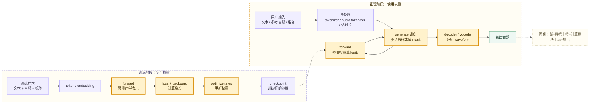

这张图里最重要的区别是：**训练会更新权重，推理通常不更新权重**。训练时，模型预测之后会和真实目标对比，算 loss，再通过反向传播和优化器调整参数。推理时，没有真实答案给模型对比，系统只能使用已经训练好的权重和当前输入，生成一个新的结果。

不过训练和推理又不是割裂的。推理时能输入什么、输出什么、哪些条件有效，基本都由训练时建立的协议决定：

| 训练阶段建立的内容 | 推理阶段如何使用 |
| --- | --- |
| tokenizer 词表和特殊 token | 推理时文本、标签、语言码必须按同一套规则转成 token |
| audio tokenizer / codec 规则 | 推理时参考音频和生成结果都要进入同一套 audio token 空间 |
| 模型结构和权重 | 推理时 `forward()` 按同一结构执行矩阵计算 |
| loss 训练出来的概率分布 | 推理时通过 logits、softmax、采样策略转成具体 token |
| 训练数据里的说话人、风格、语言覆盖 | 推理时决定音色克隆、口音、情绪控制的上限和稳定性 |

因此，推理不是训练的附属小步骤，而是训练结果被真正使用的阶段；训练也不是纯离线过程，它决定了推理阶段能否稳定工作。

## 20.2 Transformer 论文提供的核心直觉

《Attention Is All You Need》的核心贡献不是 TTS，而是提出了一种处理序列的通用网络结构：Transformer。论文最初面向机器翻译任务，输入是源语言 token，输出是目标语言 token。它的重要直觉可以迁移到 TTS：

```text
序列中的每个位置，不必只靠 RNN 那样一步一步传递信息；
它可以通过 self-attention 直接查看同一序列里的其他位置，
再把相关上下文融合成当前位置的新表示。
```

Transformer 的一次层内计算可以粗略理解为：

```mermaid
flowchart LR
    subgraph inputStage["输入表示"]
        A["token id"]
        B["embedding<br/>token 向量"]
        C["position information<br/>位置信息"]
        A --> B --> C
    end

    subgraph attnStage["self-attention"]
        D["Q / K / V<br/>查询、键、值"]
        E["attention weights<br/>看哪些位置"]
        F["context vector<br/>上下文融合"]
        D --> E --> F
    end

    subgraph ffnStage["逐位置变换"]
        G["feed-forward network"]
        H["hidden states<br/>每个位置的新向量"]
    end

    C --> D
    F --> G --> H
    H -.-> L["图例：紫=表示｜橙=Transformer 子模块"]

    classDef data fill:#F0EEFF,stroke:#9B8CFF,color:#2D2A3A;
    classDef core fill:#FFF2CC,stroke:#D88B00,stroke-width:2px,color:#3B2A00;
    classDef note fill:#FFFDF4,stroke:#B7A870,stroke-dasharray:3 3,color:#5A5134;
    class A,B,C,H data;
    class D,E,F,G core;
    class L note;
    style inputStage fill:#FFFDF4,stroke:#8B80D8,stroke-dasharray:6 4,color:#4A436E;
    style attnStage fill:#FFFDF4,stroke:#D88B00,stroke-dasharray:6 4,color:#3B2A00;
    style ffnStage fill:#FFFDF4,stroke:#D88B00,stroke-dasharray:6 4,color:#3B2A00;
```

论文里的 scaled dot-product attention 可以写成：

```text
Attention(Q, K, V) = softmax(QK^T / sqrt(d_k)) V
```

初学时不必急着推公式，可以先把它看成三件事：

| 符号 | 直觉 |
| --- | --- |
| `Q` query | 当前位置想找什么信息 |
| `K` key | 其他位置提供什么索引 |
| `V` value | 其他位置真正提供的内容 |
| `softmax(QK^T / sqrt(d_k))` | 当前位置应该关注其他位置的权重 |

把这张图拆开看，可以按“位置”而不是按“token ID 数字”理解。token ID 只是词表里的整数编号，真正进入 attention 计算的是 token ID 查 embedding 后得到的向量。Transformer 每一层都会围绕序列中的每个位置做计算。

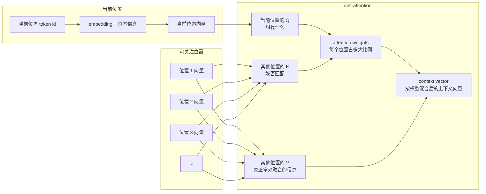

这里有四个容易混淆的点：

| 问题 | 更准确的理解 |
| --- | --- |
| “看哪些位置”是不是看之前的 token ID | 看的是**被 attention mask 允许的位置的向量**，不直接看 token ID 数字。自回归文本模型通常只能看当前位置之前的 token；普通 self-attention 可以看同一序列内所有允许位置；OmniVoice 推理中还会由 `attention_mask` 控制 style、text、参考音频和 target 区域之间的可见关系。 |
| “上下文融合”是什么意思 | 当前这个位置会给其他可见位置分配不同权重，然后把那些位置的 `V` 向量按权重加权求和，得到一个新的 context vector。它不是简单拼接 token，而是把相关位置的信息混成当前位置的新表示。 |
| “上下文表示”是什么意思 | 原始 embedding 只表示这个 token 自己；上下文表示则表示“这个 token 在当前整段输入里的含义”。同一个字或同一个 audio token，在不同文本、参考音频和风格条件下，算出的上下文表示可能不同。 |
| `Q / K / V` 是不是一个 token 的表示 | 更准确地说，每个位置的输入向量会经过三组不同的线性变换，分别变成该位置的 `Q`、`K`、`V`。所以一个位置会有自己的 Q/K/V 向量；multi-head attention 里，每个 head 还会有各自的一套 Q/K/V 投影。 |

“逐位置变换”指的是 feed-forward network。attention 负责让不同位置交换信息；feed-forward network 则在**每个位置内部**继续加工这个已经融合上下文的向量。它通常是两层线性变换加一个非线性激活，可以理解成对每个位置做一次更复杂的特征改写。

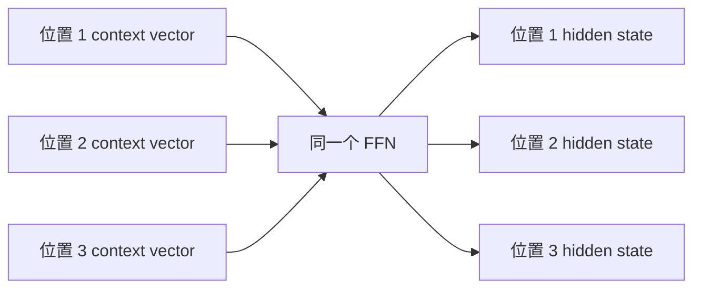

这个 FFN 不负责决定“看谁”，也不在位置之间继续交换信息。位置之间的信息交换主要发生在 self-attention 里；FFN 更像是对每个位置的上下文向量做内部消化和重写，最后得到本层输出的 hidden states。

multi-head attention 则是同时开多个“观察角度”。一个 head 可能更关注邻近位置，另一个 head 可能更关注句法关系、长距离依赖或特殊标签。最后把多个 head 的结果合并，得到更丰富的上下文表示。

> 💡 **小科普：Transformer 不是推理流程**
>
> Transformer 是一种网络结构，负责把输入序列变成上下文表示。推理是系统阶段，可能会多次调用 Transformer，也可能还包括 tokenizer、采样器、decoder、vocoder 和后处理。把 Transformer 当成推理的一部分是准确的，把 Transformer 等同于完整推理则不准确。

## 20.3 从文本翻译到 TTS：输出对象变了，前向计算仍然相似

原始 Transformer 论文里的输出是文本 token。普通语言模型推理时，模型通常做的是：

```text
已有文本 token -> Transformer -> hidden states -> lm_head -> 下一个文本 token 的 logits
```

TTS 的输出对象不同。模型最终要生成的是声音，但很多现代系统不会直接输出 waveform，而是先输出 mel、latent 或 codec token。OmniVoice 属于 codec token / speech LM 路线，主模型生成的是多层 audio codebook token。

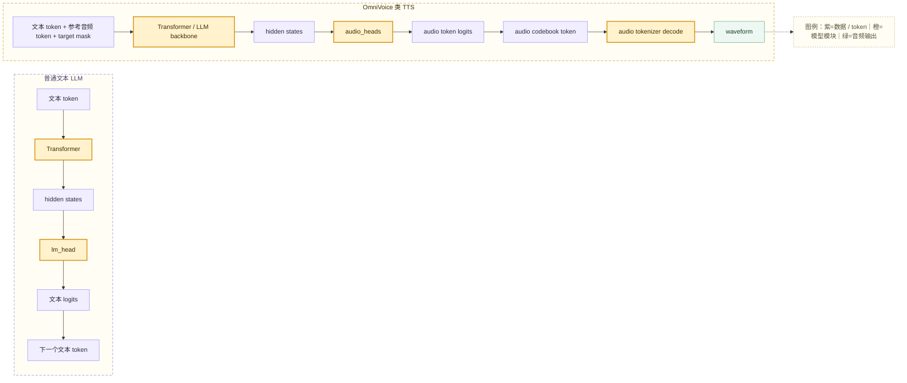

二者的共同点是：

```text
token id 先变成 embedding
Transformer 产生 hidden states
输出头把 hidden states 投影成 logits
采样或 argmax 把 logits 变成具体 token
```

差异在于输出头和后处理不同。文本 LLM 的 `lm_head` 面向文本词表，OmniVoice 的 `audio_heads` 面向 audio codebook 词表。文本 token 可以直接显示为文字，而 audio token 还需要经过 codec decoder / audio tokenizer decode 才能变成 waveform。

## 20.4 OmniVoice 推理链路总览

在 OmniVoice 源码中，端到端推理入口是 `OmniVoice.generate()`。它不是简单调用一次神经网络，而是组织了一条完整 TTS 链路。

相关文件主要集中在：

```text
omnivoice/models/omnivoice.py
```

核心流程可以概括为：

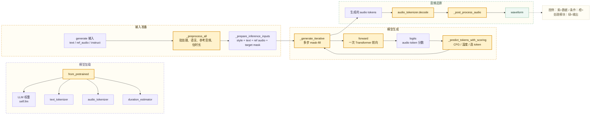

源码中的职责分工大致如下：

| 方法 / 组件 | 位置 | 职责 |
| --- | --- | --- |
| `from_pretrained()` | `omnivoice/models/omnivoice.py` | 加载主模型权重，并在推理模式下装配文本 tokenizer、audio tokenizer、特征提取器、时长估计器和可选 ASR |
| `generate()` | `omnivoice/models/omnivoice.py` | 推理总入口，负责预处理、短长文本分流、调用迭代生成、decode 和后处理 |
| `_preprocess_all()` | `omnivoice/models/omnivoice.py` | 把文本、参考音频、语言、风格指令、speed / duration 统一整理成 `GenerationTask` |
| `_prepare_inference_inputs()` | `omnivoice/models/omnivoice.py` | 拼出模型输入序列：style 段、text 段、可选参考音频 token、目标 MASK token |
| `_generate_iterative()` | `omnivoice/models/omnivoice.py` | 迭代式 mask-fill 解码，多次调用 `forward()`，逐步填充 audio token |
| `forward()` | `omnivoice/models/omnivoice.py` | 执行一次主模型前向计算，输出 audio token logits；训练时还会计算 loss |
| `self.llm(...)` | `OmniVoice.__init__()` 初始化 | 内部 Transformer / LLM 主干，负责上下文建模 |
| `audio_heads` | `OmniVoice.__init__()` 初始化 | 把 hidden states 投影成多层 audio codebook 的 logits |
| `audio_tokenizer.decode()` | 推理后段 | 把生成的 `(C=8, T)` audio token 还原成 waveform |

这里可以看到：**`generate()` 是推理编排器，`forward()` 是一次模型计算，`self.llm` 是这次计算里的 Transformer 主干**。

## 20.5 OmniVoice 的输入序列：文本、参考音频和目标 mask 放在一起

OmniVoice 推理前会把不同来源的信息拼成一个统一序列。`_prepare_inference_inputs()` 里主要有四段：

```text
[style tokens] + [text tokens] + [optional ref_audio_tokens] + [target MASK tokens]
```

其中：

| 序列段 | 来源 | 作用 |
| --- | --- | --- |
| style tokens | `<|denoise|>`、语言标签、风格指令 | 告诉模型语言、风格、是否使用去噪提示 |
| text tokens | 参考文本 + 目标文本，含 `[laughter]` 等非言语标签 | 告诉模型这次要说什么，以及参考音频对应什么文本 |
| ref_audio_tokens | 参考音频经过 audio tokenizer 编码得到 | 提供音色、说话习惯、部分韵律条件 |
| target MASK tokens | 按目标长度铺出来的 mask | 等待模型逐步填成新的 audio token |

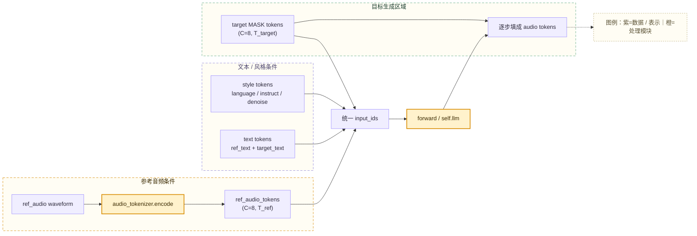

这个设计和文本 LLM 很相似：各种条件被组织成一个模型能读的上下文。不同的是，OmniVoice 的上下文里既有文本 token，也有多层 audio token。`audio_mask` 用来告诉模型：哪些位置应该使用文本 embedding，哪些位置应该使用音频 embedding。

> 💡 **小科普：MASK token 是什么？**
>
> MASK token 可以理解成“这里还没有答案，请模型来补”。OmniVoice 先把目标音频区域铺成一片 MASK，再在多轮迭代中逐步把高置信度位置填成具体 audio token。它不是把参考音频里的内容替换掉，而是根据文本、参考音频和风格条件重新生成目标音频 token。

## 20.6 `forward()`：一次前向计算到底做了什么

在 OmniVoice 中，`forward()` 既服务训练，也服务推理。推理时，它的职责是给当前输入状态计算一次 audio token logits。

一次 `forward()` 的内部流程可以这样看：

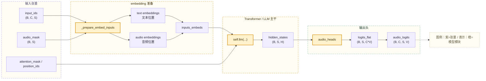

这里有几个关键概念：

| 概念 | 在 OmniVoice 中的含义 |
| --- | --- |
| `input_ids` | 混合序列 token，形状通常是 `(B, C, S)`；文本位置复制到多层，音频位置是多层 codebook token |
| `audio_mask` | 标记哪些序列位置是音频 token，从而决定走文本 embedding 还是 audio embedding |
| `inputs_embeds` | 已经从 token id 转成向量后的模型输入 |
| `self.llm(...)` | 内部 Transformer / LLM 主干的一次前向计算 |
| `hidden_states` | Transformer 为每个序列位置算出的上下文向量，不是最终 token |
| `audio_heads` | 把 hidden states 转成 audio codebook 词表上的 logits |
| `logits` | 每个位置、每层 codebook、每个候选 token 的原始分数 |

`self.llm` 是在 `OmniVoice.__init__()` 中初始化的可调用子模块。如果外部传入了 LLM 实例，就直接使用；否则会通过 `AutoModel.from_config(self.config.llm_config)` 按配置创建。调用 `self.llm(...)` 时，PyTorch 会进入这个子模块的 `forward()`。

可以把它理解为：**`forward()` 负责把当前上下文变成一张“每个 mask 位置该填哪个 audio token”的分数表**。它不负责最终采样策略，也不负责把 token 还原成声音。

## 20.7 hidden states 和 logits：Transformer 到 token 的桥

Transformer 的输出通常叫 hidden states。这个名字容易让人误会，以为它是某种神秘内部状态。其实它就是每个序列位置的一条上下文向量。

例如某个目标音频位置一开始是 MASK。经过 self-attention 后，这个位置的 hidden state 会综合：

```text
目标文本内容
语言 / 风格指令
参考文本
参考音频 token
已经填好的目标 audio token
attention mask 允许看到的位置
```

但 hidden state 仍然只是向量，不能直接当作 token。要得到具体 token，需要输出头：

```text
hidden state -> audio_heads -> logits -> softmax / argmax / sampling -> token id
```

> 💡 **小科普：hidden states 和 audio_heads 分别是什么？**
>
> **hidden states** 是 Transformer 主干算出来的“上下文理解向量”。它们不是 token id，也不是概率，而是每个序列位置的一组连续数字，里面融合了该位置能看到的文本、参考音频、风格条件和已生成 token 信息。
>
> **audio_heads** 是 OmniVoice 接在 Transformer 后面的输出层。它的作用类似文本 LLM 里的 `lm_head`：文本 LLM 用 `lm_head` 把 hidden state 转成“下一个文本 token”的分数；OmniVoice 用 `audio_heads` 把 hidden state 转成“每层 audio codebook token”的分数。这里的 `heads` 指输出头，不是 Transformer 里的 multi-head attention。

可以把二者的关系理解成：

| 名称 | 它是什么 | 它解决什么问题 | 不是啥 |
| --- | --- | --- | --- |
| `hidden_states` | Transformer 输出的上下文向量 | 表示每个位置在当前上下文下“理解到了什么” | 不是 token id，不是音频，不是概率 |
| `audio_heads` | 训练出来的线性输出层 | 把上下文向量翻译成 audio token 词表上的分数 | 不是 audio tokenizer，不负责解码 waveform，也不是 attention head |
| `logits` | `audio_heads` 输出的原始分数 | 告诉采样器每个候选 token 有多值得选 | 不是最终 token，也不是最终声音 |

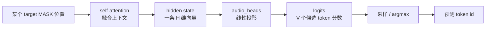

logits 不是概率，而是进入 softmax 之前的原始分数。分数越高，表示模型越倾向于选择这个 token。推理策略会根据这些分数决定是取最大值，还是引入温度、随机采样、top-k 过滤等机制。

在 OmniVoice 中，`audio_heads` 一次性输出所有 codebook 层的分数，然后 reshape 成：

```text
(B, C, S, V)
```

其中：

| 维度 | 含义 |
| --- | --- |
| `B` | batch size |
| `C` | audio codebook 层数，OmniVoice 常见为 8 |
| `S` | 序列长度 |
| `V` | 每层 audio codebook 的词表大小 |

这里可以把刚才的链路压缩成一句话：

```text
一次 self.llm(...) -> 每个 S 位置一个 hidden state
每个 hidden state -> audio_heads -> C 层 codebook × V 个候选 token 分数
推理调度 -> 只从 target 区域里还没填的 MASK 位置挑一批 token 写回
```

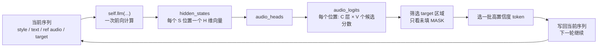

因此，模型不是只在一个时间位置预测一个 token，也不是一个 hidden state 直接对应一个确定 token。更准确地说，**每个序列位置先对应一个 hidden state；这个 hidden state 会被 `audio_heads` 展开成多层 codebook 的候选 token 分数；最后由推理调度逻辑从未填的 MASK 位置里挑一批 token 写回去**。

## 20.8 OmniVoice 的迭代式 mask-fill 生成

原始 Transformer 论文里的 decoder 采用自回归方式：预测第 `i` 个位置时，只能看见前面已经生成的位置。机器翻译推理中常用 beam search 选择更好的输出序列。

OmniVoice 的生成方式不是普通文本 LLM 那种单纯“下一个 token、下一个 token”自回归生成。它更接近迭代式 mask-fill：先把目标音频区域全部设为 MASK，然后每一轮选择一部分位置填上预测 token，再把这些新 token 放回上下文，进入下一轮。

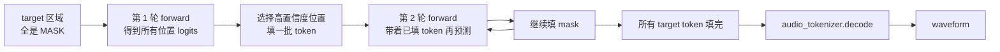

`_generate_iterative()` 中的主循环大致做这些事：

| 步骤 | 作用 |
| --- | --- |
| 构造 cond / uncond 两路输入 | 前 B 条带完整条件，后 B 条只保留目标区域，用于 Classifier-Free Guidance |
| 初始化 `tokens` | 目标区域一开始全是 `audio_mask_id` |
| 生成 `schedules` | 决定每一步要 unmask 多少个 token |
| 调用 `self(...)` | 进入 `forward()`，一次拿到 cond / uncond 两路 logits |
| CFG 融合 | 用条件分布和无条件分布的差异增强条件遵从 |
| 选择 token 和位置 | 根据类别温度、位置温度、置信度和层惩罚决定填哪些 |
| 同步回输入 | 把新 token 写回 cond / uncond 输入，作为下一轮上下文 |

这里的 `self(...)` 是 PyTorch 的调用语法，实际进入 `OmniVoice.forward()`。因此推理阶段会反复调用 `forward()`，但每次 `forward()` 只负责当前状态下的一次 logits 计算。

> 💡 **小科普：Classifier-Free Guidance 是什么？**
>
> Classifier-Free Guidance 常简称 CFG。直觉上，它会同时看“带条件时模型想生成什么”和“没有条件时模型自然想生成什么”，再放大二者差异，让文本、参考音频或风格指令更有影响力。CFG 强度过低可能不够听话，过高可能带来不自然或失真。

## 20.9 推理参数改变的是生成策略，不是模型知识

OmniVoice 的 `OmniVoiceGenerationConfig` 包含多种推理参数：

| 参数 | 影响 |
| --- | --- |
| `num_step` | 迭代解码步数，步数越多通常越慢，结果可能更稳 |
| `guidance_scale` | CFG 强度，影响条件遵从程度 |
| `t_shift` | 时间步分布偏移，影响不同阶段填 mask 的节奏 |
| `layer_penalty_factor` | 让靠前 codebook 层更早被填，体现粗到细的生成顺序 |
| `position_temperature` | 选择填哪些位置时的随机性 |
| `class_temperature` | 选择 token id 时的随机性，0 表示贪心 |
| `duration` / `speed` | 影响目标 token 数和输出时长 |
| `audio_chunk_duration` / `audio_chunk_threshold` | 长文本分块策略 |
| `postprocess_output` | 是否去静音、淡入淡出、边缘 padding |

这些参数属于推理调度，不会改写模型权重。它们能影响输出的稳定性、多样性、时长、条件遵从和速度，但不能凭空创造训练中没有学过的能力。

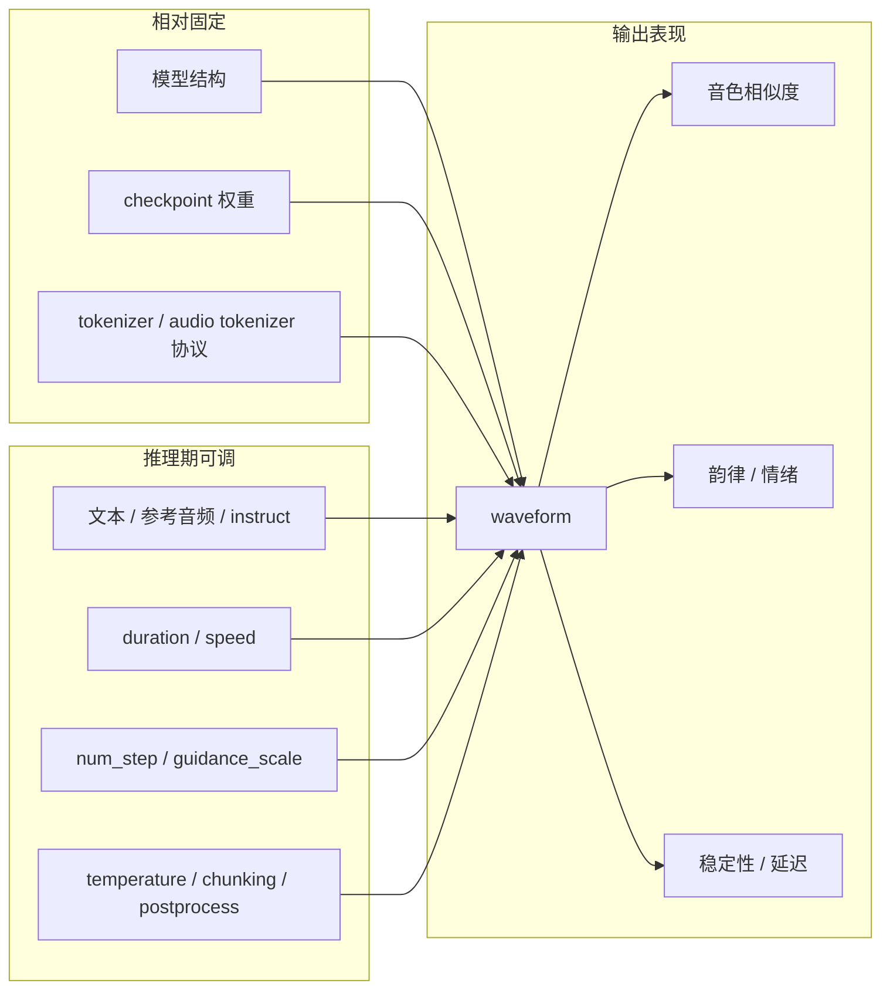

工程上排查效果时，需要把“模型没学会”和“推理参数没调好”区分开：

| 现象 | 更可能的来源 |
| --- | --- |
| 某种语言总是发音差 | 训练数据覆盖、文本前端、tokenizer 协议 |
| 音色不像参考音频 | 参考音频质量、训练中的说话人覆盖、prompt token 表达能力 |
| 偶发重复 / 漏读 | 长文本切分、目标长度估计、采样策略、模型上下文能力 |
| 音质毛刺 | audio tokenizer / decoder、后处理、生成 token 不一致 |
| 生成太慢 | `num_step`、序列长度、分块策略、设备和精度 |

## 20.10 为什么推理和训练密不可分

推理阶段看起来没有 loss、没有 backward、没有 optimizer，但它处处依赖训练阶段建立的东西。

训练 step 可以简化成：

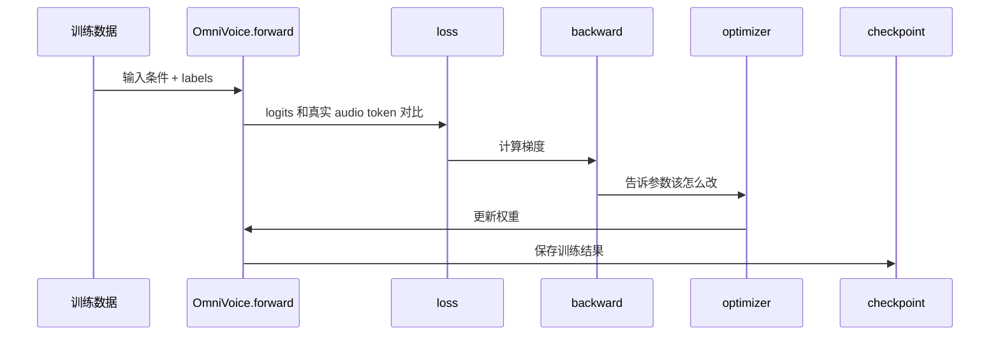

推理 step 可以简化成：

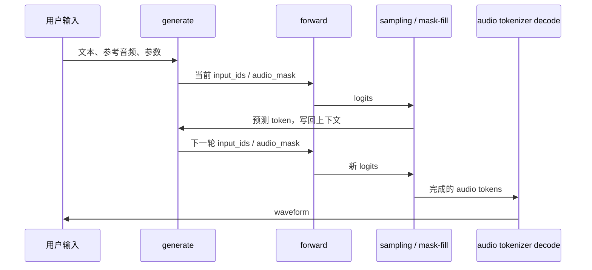

两条链路的共同核心是 `forward()`：

| 阶段 | `forward()` 输出 | 后续动作 | 是否更新权重 |
| --- | --- | --- | --- |
| 训练 | logits + loss | backward + optimizer.step | 更新 |
| 验证 | logits + eval/loss | 记录指标 | 不更新 |
| 推理 | logits | 采样 / mask-fill / decode | 不更新 |

所以，`forward()` 不是“只属于训练”的方法。它是模型结构的核心计算路径。训练用它来知道“现在错多少”，推理用它来知道“下一步哪些 token 更可能”。

## 20.11 读 OmniVoice 推理源码时的定位方法

读推理源码时，可以按四层定位：

```text
第一层：入口层，谁被用户直接调用？
第二层：任务准备层，输入如何变成 token 和目标长度？
第三层：模型计算层，哪里调用 forward 得到 logits？
第四层：音频还原层，生成的 token 如何变成 waveform？
```

对应 OmniVoice：

| 层级 | 关键代码 | 阅读重点 |
| --- | --- | --- |
| 入口层 | `generate()` | 推理总流程，短文本 / 长文本如何分流 |
| 任务准备层 | `_preprocess_all()`、`_prepare_inference_inputs()`、`create_voice_clone_prompt()` | 文本、参考音频、语言、风格、目标长度如何进入输入序列 |
| 模型计算层 | `_generate_iterative()`、`forward()`、`self.llm(...)`、`audio_heads` | 迭代填 mask、hidden states、logits、CFG 如何工作 |
| 音频还原层 | `_decode_and_post_process()`、`audio_tokenizer.decode()` | audio token 如何变成 waveform，后处理如何影响听感 |

读到一个变量时，可以先判断它属于哪一类：

| 类型 | 例子 | 含义 |
| --- | --- | --- |
| 用户条件 | `text`、`ref_audio`、`instruct`、`language` | 本次推理想让模型怎么说 |
| token 表示 | `input_ids`、`ref_audio_tokens`、`target_audio_tokens` | 模型可以处理的离散 ID |
| mask / 长度控制 | `audio_mask`、`attention_mask`、`target_lens` | 控制哪些位置是什么类型、能看见谁、生成多长 |
| 模型中间表示 | `inputs_embeds`、`hidden_states`、`logits` | 神经网络内部计算结果 |
| 采样状态 | `tokens`、`scores`、`pred_tokens` | 迭代生成过程中逐步形成的答案 |
| 音频结果 | `audio_waveform`、`generated_audio` | 可播放或可保存的最终声音 |

这种分层方式可以减少源码阅读时的混乱：看到 `forward()`，定位为“模型计算层”；看到 `generate()`，定位为“推理编排层”；看到 `decode()`，定位为“音频还原层”。

## 20.12 参考资料与源码定位

本章把 Transformer 论文和 OmniVoice 源码按“概念 -> 工程实现”做了对应。回读时可以优先看这些位置：

| 来源 | 重点内容 | 对应到 OmniVoice 的理解 |
| --- | --- | --- |
| 《Attention Is All You Need》3.1 | encoder / decoder stack、residual、layer normalization | Transformer / LLM 主干不是单层计算，而是多层上下文变换 |
| 《Attention Is All You Need》3.2 | scaled dot-product attention、multi-head attention | `self.llm(...)` 内部通过 attention 融合文本、参考音频和目标 token 上下文 |
| 《Attention Is All You Need》3.4 | embedding 与输出前的 linear + softmax | OmniVoice 先把 token 变成 embedding，再用 `audio_heads` 把 hidden states 变成 logits |
| 《Attention Is All You Need》3.5 | positional encoding | 序列模型必须知道位置顺序，否则只看到一堆无序 token |
| 《Attention Is All You Need》5 | optimizer、learning rate schedule、regularization | 训练阶段通过 loss、梯度和 optimizer 改写权重，推理阶段通常不改权重 |
| `omnivoice/models/omnivoice.py` | `OmniVoiceGenerationConfig` | 推理期可调参数集合，控制采样、步数、CFG、分块和后处理 |
| `omnivoice/models/omnivoice.py` | `from_pretrained()` | 加载模型权重，并装配推理所需 tokenizer、audio tokenizer、时长估计器等组件 |
| `omnivoice/models/omnivoice.py` | `generate()` | 端到端 TTS 推理入口，负责把多步流程串起来 |
| `omnivoice/models/omnivoice.py` | `_prepare_inference_inputs()` | 把 style、text、ref audio token 和 target mask 拼成统一输入序列 |
| `omnivoice/models/omnivoice.py` | `_generate_iterative()` | 多轮调用 `forward()`，逐步把 MASK 填成 audio token |
| `omnivoice/models/omnivoice.py` | `forward()` | 单次主模型前向计算，输出 audio token logits；训练时附带 loss |
| `omnivoice/models/omnivoice.py` | `_decode_and_post_process()` | 把生成的 audio token 解码成 waveform，并做音量、静音、淡入淡出等处理 |

这组对应关系也适合排查问题：如果问题发生在文本读音，优先看 tokenizer、文本前端和输入拼接；如果问题发生在生成稳定性，优先看 `_generate_iterative()`、推理参数和 `forward()` 输出；如果问题发生在音质和拼接，优先看 audio tokenizer decode 和后处理。

## 20.13 常见误区

| 误区 | 更准确的理解 |
| --- | --- |
| 推理就是 `forward()` | 推理是阶段，`forward()` 是其中一次模型计算 |
| `generate()` 一定只调用一次模型 | 生成式模型经常多轮调用 `forward()`，逐步生成 token |
| hidden states 是最终结果 | hidden states 是上下文向量，还要经过输出头变成 logits |
| logits 就是概率 | logits 是 softmax 前的原始分数 |
| 推理参数能改变模型能力 | 推理参数改变生成策略，不能替代训练和微调 |
| 参考音频会被直接改字 | 参考音频提供条件，目标音频是模型重新生成的 |
| Transformer 只适合文本 | Transformer 是序列建模结构，可以处理文本 token、audio token、latent token 等多种序列表示 |

## 20.14 本章小结

推理是训练好模型后的使用阶段。它会使用 checkpoint 权重，但通常不会更新权重。`forward()` 是模型的一次前向计算，训练、验证和推理都会用到它，只是后续动作不同：训练接 loss、backward 和 optimizer，推理接采样、mask-fill 和 decoder。

《Attention Is All You Need》提供的关键思想是：序列位置可以通过 self-attention 直接交换上下文信息，Transformer 把 token embedding 转成 hidden states，再由输出头转成 logits。OmniVoice 把这个思想迁移到 TTS：输入序列里混合文本 token、参考音频 token 和目标 MASK token，`self.llm` 负责上下文建模，`audio_heads` 输出 audio codebook logits，`_generate_iterative()` 多轮填充目标 token，最后由 `audio_tokenizer.decode()` 还原成 waveform。

一句话总结：

> 推理是一条工程链路，`forward()` 是链路里的核心计算心脏；Transformer 负责把上下文算明白，采样调度负责把分数变成 token，audio decoder 负责把 token 变成声音。
