# 第二十一章：扩展知识四 —— 注意力机制、QKV 与 Multi-Head Attention

注意力机制（attention）是 Transformer 最核心的结构之一。它解决的问题很直接：**一个 token 的初始向量只知道自己是谁，注意力机制让它知道自己处在什么上下文里**。

在语言模型里，token 可以是文字、子词或标点；在语音模型里，token 也可以是 codec token、音频标签或特殊控制符。无论输入来自文本还是声音，只要进入 Transformer，它们通常都会先变成向量，再通过注意力机制互相读取信息，形成带上下文的 hidden states。

本章补充五个问题：

```text
Transformer 主干推理如何从 token ids 走到 logits 和下一个 token？
Transformer Block 是怎样一层一层堆起来的？
Q / K / V 到底分别是什么？
Self-Attention 如何让 token 获得上下文信息？
Multi-Head Attention 为什么需要多个 head？
```

## 21.1 注意力机制在模型链路中的位置

AI 模型不能直接计算自然语言和声音本身。文本需要先变成 token ID，声音也可能先变成 codec token；这些整数 ID 再通过 embedding 层变成向量。注意力机制处理的对象不是原始字符或原始波形，而是这些向量。

```mermaid
flowchart LR
    subgraph inputStage["输入 / Token 化"]
        A1["文本<br/>我 爱 你"]
        A2["token ids<br/>[101, 256, 872]"]
        A1 --> A2
    end

    subgraph embedStage["初始表示"]
        B1["embedding table<br/>查表"]
        B2["token embeddings<br/>静态 token 向量"]
        B1 --> B2
    end

    subgraph transformerStage["Transformer block"]
        C1["self-attention<br/>注入上下文"]
        C2["MLP / FFN<br/>逐位置加工"]
        C3["hidden states<br/>上下文表示"]
        C1 --> C2 --> C3
    end

    subgraph outputStage["输出头"]
        D1["LM head / audio heads"]
        D2["logits<br/>下一个 token 概率分布"]
        D1 --> D2
    end

    A2 --> B1
    B2 --> C1
    C3 --> D1
    D2 -.-> L["图例：紫=数据 / 表示｜橙=模型模块"]

    classDef data fill:#F0EEFF,stroke:#9B8CFF,color:#2D2A3A;
    classDef core fill:#FFF2CC,stroke:#D88B00,stroke-width:2px,color:#3B2A00;
    classDef note fill:#FFFDF4,stroke:#B7A870,stroke-dasharray:3 3,color:#5A5134;
    class A1,A2,B2,C3,D2 data;
    class B1,C1,C2,D1 core;
    class L note;
    style inputStage fill:#FFFDF4,stroke:#8B80D8,stroke-dasharray:6 4,color:#4A436E;
    style embedStage fill:#FFFDF4,stroke:#8B80D8,stroke-dasharray:6 4,color:#4A436E;
    style transformerStage fill:#FFFDF4,stroke:#D88B00,stroke-dasharray:6 4,color:#3B2A00;
    style outputStage fill:#FFFDF4,stroke:#B7A870,stroke-dasharray:6 4,color:#5A5134;
```

最开始的 embedding 比较“静态”。例如“苹果”这个 token 的初始向量在不同句子里可能相同：

```text
苹果 很 甜
苹果 发布 了 新 手机
```

但是两个句子里的“苹果”含义不同。前者更像水果，后者更像公司或品牌。注意力机制的作用就是让“苹果”的向量能够参考“很甜”或“发布新手机”这些上下文，从而形成不同的上下文表示。

可以把三类向量先分清：

| 名称 | 含义 | 直觉 |
| --- | --- | --- |
| embedding | token 的初始向量 | 只表示这个 token 本身 |
| attention output | 当前 token 按权重汇总上下文后的向量 | 吸收了其他位置的信息 |
| hidden states | Transformer 某一层输出的上下文向量 | attention、残差、归一化和 MLP 共同加工后的结果 |

因此，attention output 是 hidden states 形成过程中的核心部分，但它通常不是一个 Transformer block 的全部输出。完整 block 还会包含 residual connection（残差连接）、normalization（归一化）和 MLP / FFN（前馈网络）。

## 21.2 两条主干流程：从 token 到预测结果，从 hidden states 到新 hidden states

理解注意力机制时，可以先把流程拆成两层：**整模型推理流程**和**单层 Transformer 内部计算流程**。

整模型推理流程回答的是：输入 token 如何一步步变成下一个 token 的预测结果。

```mermaid
flowchart LR
    subgraph inputStage["输入表示"]
        A1["token ids<br/>离散整数 ID"]
        A2["embedding<br/>初始 token 向量"]
        A1 --> A2
    end

    subgraph stackStage["多层 Transformer 主干"]
        B1["第 1 层 Transformer<br/>attention 看上下文<br/>MLP 加工每个位置"]
        B2["第 2 层 Transformer<br/>attention + MLP"]
        B3["..."]
        B4["最终 hidden states<br/>多层上下文表示"]
        B1 --> B2 --> B3 --> B4
    end

    subgraph outputStage["输出预测"]
        C1["LM Head / audio heads<br/>投影到词表或 codebook"]
        C2["logits<br/>每个候选 token 的分数"]
        C3["next token<br/>采样或 argmax 得到结果"]
        C1 --> C2 --> C3
    end

    A2 --> B1
    B4 --> C1
    C3 -.-> L["图例：紫=数据 / 表示｜橙=模型模块｜绿=预测结果"]

    classDef data fill:#F0EEFF,stroke:#9B8CFF,color:#2D2A3A;
    classDef core fill:#FFF2CC,stroke:#D88B00,stroke-width:2px,color:#3B2A00;
    classDef output fill:#EEF8F3,stroke:#5CA982,color:#173B2B;
    classDef note fill:#FFFDF4,stroke:#B7A870,stroke-dasharray:3 3,color:#5A5134;
    class A1,A2,B4,C2 data;
    class B1,B2,B3,C1 core;
    class C3 output;
    class L note;
    style inputStage fill:#FFFDF4,stroke:#8B80D8,stroke-dasharray:6 4,color:#4A436E;
    style stackStage fill:#FFFDF4,stroke:#D88B00,stroke-dasharray:6 4,color:#3B2A00;
    style outputStage fill:#FFFDF4,stroke:#5CA982,stroke-dasharray:6 4,color:#173B2B;
```

这条链路可以读成：

```text
token ids
-> embedding
-> 第 1 层 Transformer：attention 看上下文，MLP 加工每个 token 的表示
-> 第 2 层 Transformer：继续 attention + MLP
-> ...
-> 最终 hidden states
-> LM Head / audio heads
-> logits
-> 下一个 token
```

在文本 LLM 中，输出头通常是 `LM Head`，它把 hidden states 投影到文本词表；在 OmniVoice 这类 codec token TTS 中，输出头可以是面向 audio codebook 的 `audio_heads`，它把 hidden states 投影成 audio token logits。

单层 Transformer 内部计算流程回答的是：一层模型如何把输入 hidden states 变成新的 hidden states。

```mermaid
flowchart LR
    subgraph inputStage["输入"]
        A["输入 hidden states<br/>上一层输出或 embedding"]
    end

    subgraph qkvStage["Attention 权重计算"]
        B1["Wq / Wk / Wv<br/>线性投影"]
        B2["Q / K / V<br/>查询 / 匹配 / 内容"]
        B3["attention weights<br/>QK 匹配 + softmax"]
        B4["加权汇总 V<br/>得到 context"]
        B5["Wo<br/>输出投影"]
        B1 --> B2 --> B3 --> B4 --> B5
    end

    subgraph mlpStage["逐位置加工"]
        C1["Residual + Norm<br/>稳定并保留原信息"]
        C2["MLP / FFN<br/>继续加工每个 token"]
        C3["Residual + Norm"]
        C1 --> C2 --> C3
    end

    subgraph outputStage["输出"]
        D["新的 hidden states<br/>进入下一层或输出头"]
    end

    A --> B1
    B5 --> C1
    C3 --> D
    D -.-> L["图例：紫=hidden states / 表示｜橙=可训练计算模块"]

    classDef data fill:#F0EEFF,stroke:#9B8CFF,color:#2D2A3A;
    classDef core fill:#FFF2CC,stroke:#D88B00,stroke-width:2px,color:#3B2A00;
    classDef note fill:#FFFDF4,stroke:#B7A870,stroke-dasharray:3 3,color:#5A5134;
    class A,B2,B3,B4,D data;
    class B1,B5,C1,C2,C3 core;
    class L note;
    style inputStage fill:#FFFDF4,stroke:#8B80D8,stroke-dasharray:6 4,color:#4A436E;
    style qkvStage fill:#FFFDF4,stroke:#D88B00,stroke-dasharray:6 4,color:#3B2A00;
    style mlpStage fill:#FFFDF4,stroke:#D88B00,stroke-dasharray:6 4,color:#3B2A00;
    style outputStage fill:#FFFDF4,stroke:#8B80D8,stroke-dasharray:6 4,color:#4A436E;
```

这条链路可以读成：

```text
输入 hidden states
-> 用 Wq / Wk / Wv 算 Q / K / V
-> 算 attention 权重
-> 用 attention 权重汇总 V
-> 用 Wo 再投影
-> 经过 MLP 继续加工
-> 得到新的 hidden states
```

这里的 `Wq / Wk / Wv / Wo` 和 MLP 里的矩阵都是模型权重。推理时它们通常不会更新，只是被拿来做前向计算；训练时 loss 会通过反向传播调整这些权重，让 attention head、MLP 和输出头逐渐学会更有用的表示方式。

## 21.3 Self-Attention：同一个序列内部互相读取信息

Self-Attention 的“self”表示：**查询信息、被匹配的信息、被读取的信息都来自同一个输入序列**。

例如输入：

```text
我 爱 你
```

在普通 self-attention 中，每个位置都可以根据规则读取同一序列里的其他位置：

```text
“我” 可以看 “我 / 爱 / 你”
“爱” 可以看 “我 / 爱 / 你”
“你” 可以看 “我 / 爱 / 你”
```

经过 self-attention 后，原来的三个初始向量：

```text
E_我, E_爱, E_你
```

会变成带上下文的信息：

```text
H_我, H_爱, H_你
```

这里的 `H_你` 不再只是“你”这个 token 的静态表示，而是“在我爱你这个上下文里的你”的表示。

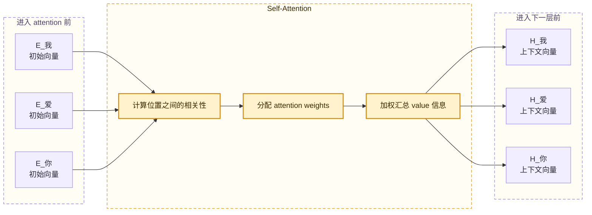

注意力不是平均读取所有 token。模型会给不同位置分配不同权重。以更新“你”这个位置为例，模型可能会得到类似这样的权重：

```text
“我”：0.4
“爱”：0.5
“你”：0.1
```

然后生成新的“你”向量：

```text
新的“你”向量
= 0.4 * “我”的信息
+ 0.5 * “爱”的信息
+ 0.1 * “你”的信息
```

这就是注意力机制最朴素的直觉：**每个位置根据当前需要，决定更应该读取哪些位置的信息**。

## 21.4 Q、K、V：查询、匹配与取内容

注意力机制里的三个核心向量是：

```text
Q = Query
K = Key
V = Value
```

可以用“查资料”来理解：

| 向量 | 作用 | 直觉 |
| --- | --- | --- |
| Q / Query | 当前 token 想找什么信息 | 提问 |
| K / Key | 每个 token 如何被匹配 | 索引 / 标签 |
| V / Value | 每个 token 真正提供什么内容 | 内容 |

例如在句子：

```text
苹果 发布 了 新 手机
```

当模型更新“手机”这个位置时，“手机”的 Q 可能在寻找“产品、发布、品牌”相关信息；“苹果”的 K 如果和这些信息匹配度高，“手机”就会更多关注“苹果”；真正被拿来融合的是“苹果”的 V。

Q、K、V 不是人工提前写好的标签，而是模型权重计算出来的向量。每个位置的输入向量 `X` 会分别经过三组线性层：

```text
Q = XWq
K = XWk
V = XWv
```

其中 `Wq`、`Wk`、`Wv` 是训练学出来的权重矩阵。

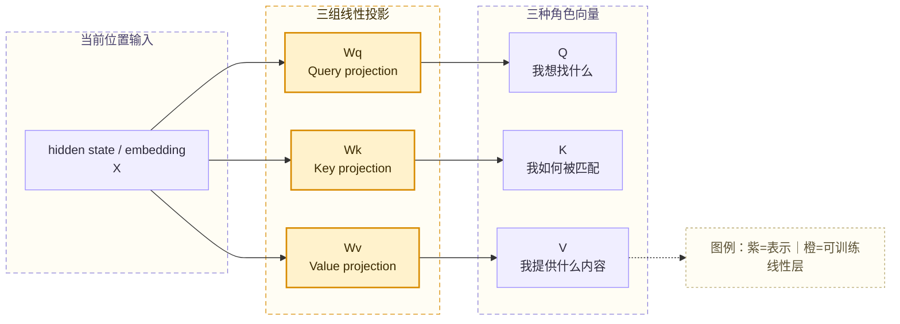

同一个 token 向量需要变成三种角色，是因为“想找什么”“如何被别人匹配”“真正提供什么内容”是三件不同的事。模型用不同的权重矩阵，把同一个输入向量投影成不同用途的向量。

> 💡 **小科普：线性层在这里做什么？**
>
> 线性层可以理解成一个训练出来的矩阵变换。输入向量经过 `Wq` 后更适合作为 query，经过 `Wk` 后更适合作为 key，经过 `Wv` 后更适合作为 value。这些矩阵不是手工规则，而是在训练中通过 loss 和反向传播逐渐学出来的。

## 21.5 Attention 公式：QK 匹配，权重汇总 V

Scaled Dot-Product Attention 的常见公式是：

```text
Attention(Q, K, V) = softmax(QK^T / sqrt(d_k)) V
```

这个公式可以拆成四步：

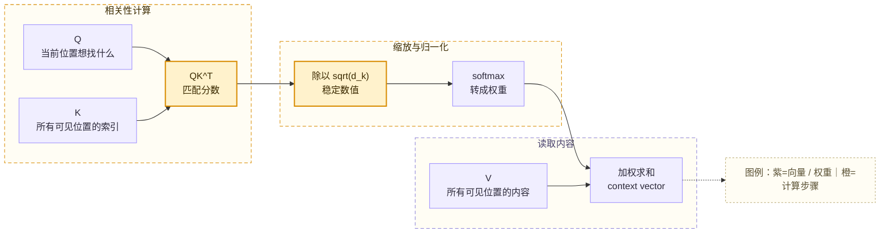

第一步是用 Q 和 K 计算匹配分数。常见做法是点积：

```text
Q · K
```

点积越大，表示当前位置的 query 和某个位置的 key 越匹配。

第二步是除以 `sqrt(d_k)`。如果向量维度较大，点积数值可能变得很大，softmax 后权重容易过于极端；缩放可以让训练和推理更稳定。

第三步是 softmax。它把匹配分数变成权重，例如：

```text
原始分数：
我：2.1
爱：3.0
你：0.5

softmax 后：
我：0.27
爱：0.67
你：0.06
```

这些权重通常加起来等于 1。

第四步是用权重加权汇总 V：

```text
输出向量
= 0.27 * V_我
+ 0.67 * V_爱
+ 0.06 * V_你
```

最终得到的 context vector，就是当前位置融合上下文后的表示。

## 21.6 Mask：哪些位置允许被看见

Self-Attention 不是一定能看见序列里的所有 token。实际模型会用 mask 控制哪些位置可见。

GPT 这类 decoder-only 模型通常做 next token prediction，也就是根据前文预测下一个 token。它不能提前看到未来答案，所以需要 causal mask（因果掩码）。

例如训练句子：

```text
我 爱 你
```

不同位置的可见范围是：

| 当前位置 | 可见 token | 被遮住的未来 token |
| --- | --- | --- |
| 我 | 我 | 爱、你 |
| 爱 | 我、爱 | 你 |
| 你 | 我、爱、你 | 无 |

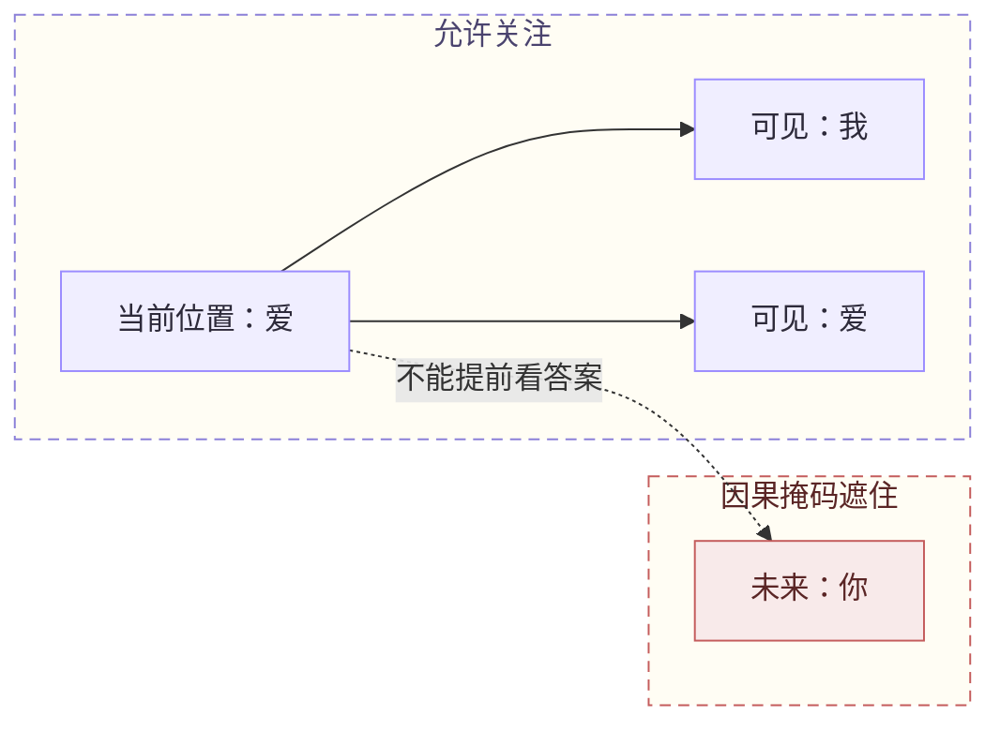

mask 不是只用于文本生成。语音模型也会用 mask 控制不同区域之间的可见关系。例如一些 TTS 模型会把文本 token、参考音频 token、目标音频 token 和特殊控制 token 放进同一个序列，再通过 attention mask 规定哪些位置可以互相读取信息。

常见 mask 作用包括：

| mask 类型 | 作用 |
| --- | --- |
| padding mask | 避免模型关注补齐长度用的 padding token |
| causal mask | 禁止当前位置看到未来 token |
| block / custom mask | 控制不同区域之间的可见关系，例如参考音频、文本、目标生成区域 |

## 21.7 Multi-Head Attention：多个观察角度并行工作

单个 attention head 会学到一种匹配和读取方式。Multi-Head Attention 则让模型同时拥有多个 head，每个 head 有自己的一套 `Wq / Wk / Wv`，可以从不同角度观察同一段序列。

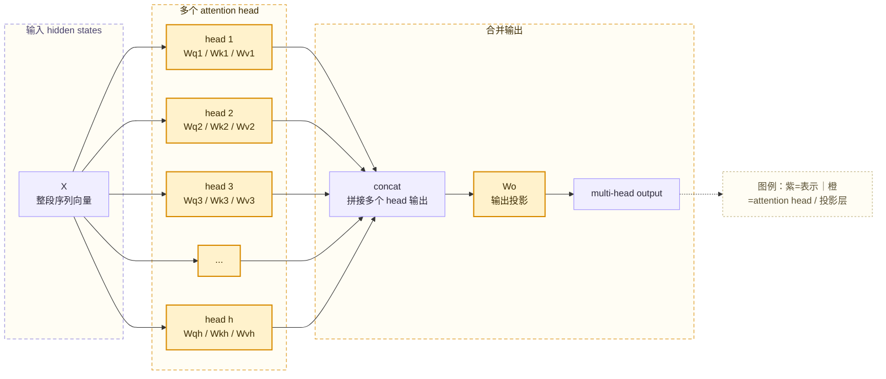

不同 head 并不是人工指定“第一个 head 负责语法，第二个 head 负责情绪”。更准确地说，每个 head 的权重会在训练中自动形成某种有用的匹配模式。训练目标只规定模型最后要预测得更好，至于某个 head 学到邻近依赖、长距离关系、说话人条件还是特殊标签触发，都是优化过程中逐渐形成的内部表示。

Multi-Head Attention 的结果通常会经过两步合并：

```text
多个 head 的输出 concat 到一起
再经过输出投影矩阵 Wo
```

`Wo` 的作用是把多个观察角度重新融合成模型主干需要的维度。这样下一层 Transformer 不需要关心前面有多少个 head，只接收统一形状的 hidden states。

## 21.8 Transformer block：反复堆叠的加工单元

Transformer block 可以理解成大模型主干里反复堆叠的“加工单元”。每经过一个 block，输入 token 的向量都会被重新加工一次，得到一层新的 hidden states。

假设输入是：

```text
我 爱 你
```

embedding 层先得到三个初始向量：

```text
E_我, E_爱, E_你
```

这可以看作第 0 层 hidden states：

```text
X0 = [E_我, E_爱, E_你]
```

后面每一层 Transformer block 都接收上一层 hidden states，并输出新的一层 hidden states：

```text
X1 = Block1(X0)
X2 = Block2(X1)
X3 = Block3(X2)
...
Xn = BlockN(Xn-1)
```

```mermaid
flowchart LR
    subgraph inputStage["输入表示"]
        A1["token ids"]
        A2["embedding"]
        A3["X0<br/>第 0 层 hidden states"]
        A1 --> A2 --> A3
    end

    subgraph blockStage["Transformer 主干"]
        B1["Block 1<br/>输出 X1"]
        B2["Block 2<br/>输出 X2"]
        B3["Block 3<br/>输出 X3"]
        B4["..."]
        B5["Block N<br/>输出 Xn"]
        B1 --> B2 --> B3 --> B4 --> B5
    end

    subgraph outputStage["输出预测"]
        C1["最后一层 hidden states<br/>Xn"]
        C2["LM Head / audio heads"]
        C3["logits"]
        C4["next token"]
        C1 --> C2 --> C3 --> C4
    end

    A3 --> B1
    B5 --> C1
    C4 -.-> L["图例：紫=表示｜橙=Transformer block｜绿=预测结果"]

    classDef data fill:#F0EEFF,stroke:#9B8CFF,color:#2D2A3A;
    classDef core fill:#FFF2CC,stroke:#D88B00,stroke-width:2px,color:#3B2A00;
    classDef output fill:#EEF8F3,stroke:#5CA982,color:#173B2B;
    classDef note fill:#FFFDF4,stroke:#B7A870,stroke-dasharray:3 3,color:#5A5134;
    class A1,A2,A3,C1,C3 data;
    class B1,B2,B3,B4,B5,C2 core;
    class C4 output;
    class L note;
    style inputStage fill:#FFFDF4,stroke:#8B80D8,stroke-dasharray:6 4,color:#4A436E;
    style blockStage fill:#FFFDF4,stroke:#D88B00,stroke-dasharray:6 4,color:#3B2A00;
    style outputStage fill:#FFFDF4,stroke:#5CA982,stroke-dasharray:6 4,color:#173B2B;
```

这里的“一层一层”不是指 token 数量变多，也不是指把句子切成更多片段，而是同一批 token 向量被多次加工。每一层输出的形状通常保持一致：

```text
[sequence_length, hidden_size]
```

例如 3 个 token、隐藏维度为 4 时，可以想成：

```text
X0: [3, 4]
X1: [3, 4]
X2: [3, 4]
...
Xn: [3, 4]
```

变化的是向量里的数值和信息含义，而不是 token 位置数量。越往后，hidden states 往往融合了更多上下文和更复杂的任务信息。

一个 Transformer block 通常不只有 attention。以常见结构为例，它会包含：

```text
输入 hidden states
Self-Attention
Residual Connection
LayerNorm / RMSNorm
MLP / FFN
Residual Connection
LayerNorm / RMSNorm
输出新的 hidden states
```

换成更直观的描述：

```text
输入一批 token 向量
-> 让 token 之间交换上下文信息
-> 稳定数值并保留原信息
-> 对每个 token 的向量进一步加工
-> 再稳定一次
-> 输出新的一批 token 向量
```

```mermaid
flowchart LR
    subgraph inputStage["输入"]
        A["上一层 hidden states<br/>Xi"]
    end

    subgraph attnStage["上下文交互"]
        B1["Self-Attention<br/>token 之间交换信息"]
        B2["Residual<br/>保留原信息"]
        B3["Norm<br/>稳定数值分布"]
        B1 --> B2 --> B3
    end

    subgraph mlpStage["逐位置加工"]
        C1["MLP / FFN<br/>加工每个 token 向量"]
        C2["Residual<br/>保留原信息"]
        C3["Norm<br/>稳定数值分布"]
        C1 --> C2 --> C3
    end

    subgraph outputStage["输出"]
        D["下一层 hidden states<br/>Xi+1"]
    end

    A --> B1
    B3 --> C1
    C3 --> D
    D -.-> L["图例：紫=hidden states｜橙=Transformer 子模块"]

    classDef data fill:#F0EEFF,stroke:#9B8CFF,color:#2D2A3A;
    classDef core fill:#FFF2CC,stroke:#D88B00,stroke-width:2px,color:#3B2A00;
    classDef note fill:#FFFDF4,stroke:#B7A870,stroke-dasharray:3 3,color:#5A5134;
    class A,D data;
    class B1,B2,B3,C1,C2,C3 core;
    class L note;
    style inputStage fill:#FFFDF4,stroke:#8B80D8,stroke-dasharray:6 4,color:#4A436E;
    style attnStage fill:#FFFDF4,stroke:#D88B00,stroke-dasharray:6 4,color:#3B2A00;
    style mlpStage fill:#FFFDF4,stroke:#D88B00,stroke-dasharray:6 4,color:#3B2A00;
    style outputStage fill:#FFFDF4,stroke:#8B80D8,stroke-dasharray:6 4,color:#4A436E;
```

不同模型实现可能采用 Pre-Norm 或 Post-Norm，也就是 Norm 放在 attention / MLP 之前还是之后。这个细节会影响训练稳定性和工程实现，但不改变本章要抓住的主线：**attention 负责位置之间的信息交换，MLP / FFN 负责每个位置内部的进一步加工，残差连接和 Norm 负责稳定深层网络**。

每一层 Transformer block 都会基于当前层输入重新计算 Q、K、V：

```text
第 1 层：X0 -> Q1 / K1 / V1 -> attention -> X1
第 2 层：X1 -> Q2 / K2 / V2 -> attention -> X2
第 3 层：X2 -> Q3 / K3 / V3 -> attention -> X3
```

并且每一层通常有自己的权重矩阵：

```text
第 1 层：Wq1, Wk1, Wv1, Wo1
第 2 层：Wq2, Wk2, Wv2, Wo2
第 3 层：Wq3, Wk3, Wv3, Wo3
```

因此，多层 Transformer 不是同一套 QKV 矩阵简单循环使用，而是多组不同参数在不同深度上逐层加工表示。

```mermaid
flowchart LR
    subgraph layer1["第 1 层 Block"]
        A1["X0"]
        B1["Wq1 / Wk1 / Wv1"]
        C1["Q1 / K1 / V1"]
        D1["X1"]
        A1 --> B1 --> C1 --> D1
    end

    subgraph layer2["第 2 层 Block"]
        A2["X1"]
        B2["Wq2 / Wk2 / Wv2"]
        C2["Q2 / K2 / V2"]
        D2["X2"]
        A2 --> B2 --> C2 --> D2
    end

    subgraph layerN["更深层 Block"]
        A3["X2 ..."]
        B3["WqN / WkN / WvN"]
        C3["QN / KN / VN"]
        D3["Xn"]
        A3 --> B3 --> C3 --> D3
    end

    D1 --> A2
    D2 --> A3
    D3 -.-> L["图例：紫=hidden states / QKV｜橙=每层自己的权重"]

    classDef data fill:#F0EEFF,stroke:#9B8CFF,color:#2D2A3A;
    classDef core fill:#FFF2CC,stroke:#D88B00,stroke-width:2px,color:#3B2A00;
    classDef note fill:#FFFDF4,stroke:#B7A870,stroke-dasharray:3 3,color:#5A5134;
    class A1,C1,D1,A2,C2,D2,A3,C3,D3 data;
    class B1,B2,B3 core;
    class L note;
    style layer1 fill:#FFFDF4,stroke:#D88B00,stroke-dasharray:6 4,color:#3B2A00;
    style layer2 fill:#FFFDF4,stroke:#D88B00,stroke-dasharray:6 4,color:#3B2A00;
    style layerN fill:#FFFDF4,stroke:#D88B00,stroke-dasharray:6 4,color:#3B2A00;
```

多层堆叠的意义在于逐步加工。以“苹果 发布 了 新 手机”为例，初始 embedding 只给每个 token 一个基本表示；浅层可能先捕捉“苹果”和“发布”的局部关系、“新”和“手机”的搭配关系；更深层可能把“发布新手机”整合成事件，并让“苹果”更偏向科技公司而不是水果。

这只是帮助理解的直觉。真实模型不会按人类语言明确分工，但多层 block 确实会让 hidden states 从浅层特征逐渐变成更复杂的上下文表示。

最终，最后一层 hidden states 会进入输出头。文本 LLM 通常取当前位置，尤其是最后一个可预测位置的 hidden state，经过 `LM Head` 得到词表 logits；语音模型则可能用 audio heads 把对应位置的 hidden states 投影成 audio token logits。

| 阶段 | 输入 | 输出 | 作用 |
| --- | --- | --- | --- |
| Embedding | token ids | `X0` | 把离散 ID 变成初始向量 |
| Transformer Block 1 | `X0` | `X1` | 第一次上下文交互和加工 |
| Transformer Block 2 | `X1` | `X2` | 继续加工上下文表示 |
| Transformer Block N | `Xn-1` | `Xn` | 得到最后一层 hidden states |
| 输出头 | `Xn` | logits | 预测下一个 token 或 audio token |

> 💡 **小科普：为什么不能只堆 attention？**
>
> Attention 擅长让不同位置交换信息，但它本身不是完整的表示加工流水线。MLP / FFN 提供逐位置的非线性加工能力，残差连接帮助深层网络保留原始信息，Norm 让数值更稳定。Transformer block 把这些部件组合起来，才能稳定地堆成很深的模型主干。

一个 Transformer block 的职责可以压缩成一句话：

```text
把上一层 hidden states 加工成下一层 hidden states。
```

再展开一点：

```text
上一层 hidden states
-> Self-Attention：让 token 之间交换上下文信息
-> MLP / FFN：进一步加工每个 token 的向量
-> Residual + Norm：稳定深层计算并保留信息
-> 下一层 hidden states
```

因此，attention 是 Transformer 的核心，但不是 Transformer 的全部。最终传给输出头的是多层 Transformer block 反复加工后的 hidden states。

## 21.9 Self-Attention、Cross-Attention 与 TTS

在 TTS 系统里，注意力机制经常承担两类职责。

第一类是 self-attention：让同一序列内部的文本 token、音频 token、控制 token 互相建模。语音大模型或 codec token TTS 经常把不同类型的 token 放进统一序列，依靠 Transformer 主干建模上下文关系。

第二类是 cross-attention：让一个序列主动读取另一个序列。例如生成声学表示时，decoder 侧表示可以读取 encoder 侧的文本或音素表示；扩散 / flow 模型也可能用 cross-attention 读取文本条件、说话人条件或风格条件。

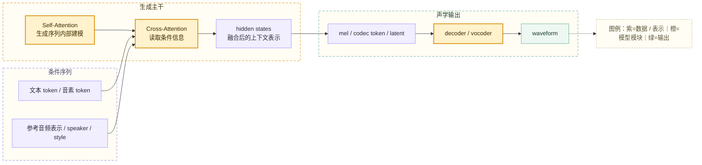

OmniVoice 这类 speech LM / codec token 路线可以这样理解：文本、参考音频和目标音频位置被组织成模型可处理的 token 序列；Transformer / LLM 主干通过注意力机制建模这些位置之间的关系；输出头把 hidden states 转成 audio token 的 logits；最后 audio tokenizer / codec decoder 再把 token 还原成 waveform。

这说明注意力机制不是只属于文本模型。只要任务需要处理序列，并且需要让不同位置互相影响，attention 就可能成为核心建模工具。

## 21.10 代码阅读补充：索引赋值、单元素维度与广播

OmniVoice 在准备 Cond 输入时有下面这行代码：

```python
batch_input_ids[i, :, :c_len] = inp["input_ids"]
```

这行代码可以拆成三个阶段：

```text
左侧索引：圈定 batch_input_ids 中需要修改的区域
右侧适配：处理多余的前导单元素维度，并检查形状是否兼容
写入数据：用右侧元素覆盖左侧区域中的原值
```

### 21.10.1 左侧索引定位了哪块区域

假设：

```text
batch_input_ids.shape = (2B, C, max_c_len) = (4, 2, 9)
i = 1
c_len = 9
```

三个索引分别表示：

| 索引 | 作用 | 结果 |
| --- | --- | --- |
| `i` | 选择 batch 中索引为 `i` 的一条数据 | 第 0 维被整数索引消除 |
| `:` | 选择全部 `C` 个 codebook | 保留 codebook 维 |
| `:c_len` | 选择序列前 `c_len` 个位置 | 保留序列维 |

因此：

```python
batch_input_ids[i, :, :c_len].shape
# (C, c_len) = (2, 9)
```

这里第 0 维被去掉，不是因为它没有意义，而是因为整数索引 `i` 表示“取出一条确定的数据”，结果不再表示一个 batch。

如果希望结果仍然保留 batch 维，应使用切片：

```python
batch_input_ids[i : i + 1, :, :c_len].shape
# (1, C, c_len) = (1, 2, 9)
```

两种写法的区别是：

```text
i          → 取一条数据，消除第 0 维
i : i + 1  → 取一个只含一条数据的子 batch，保留第 0 维
```

### 21.10.2 右侧为什么多一个第 0 维

单条 `inp["input_ids"]` 在前面的预处理阶段按照 batch 形式构造，因此形状是：

```python
inp["input_ids"].shape
# (1, C, c_len) = (1, 2, 9)
```

其中最前面的 `1` 表示它只包含一条样本。当前赋值中两边的原始形状是：

```text
左侧目标区域：(2, 9)
右侧输入数据：(1, 2, 9)
```

PyTorch 的索引赋值可以兼容右侧多余的前导单元素维度。这个过程没有沿 batch 维复制数据，可以直观理解为先执行：

```python
source = inp["input_ids"].squeeze(0)
source.shape
# (2, 9)

batch_input_ids[i, :, :c_len] = source
```

因此，原代码等价于把右侧的两行数据逐元素写入左侧选中的 `(2, 9)` 区域。

如果希望两侧显式保留完全相同的三维形状，也可以写成：

```python
batch_input_ids[i : i + 1, :, :c_len] = inp["input_ids"]
```

此时左右形状都是 `(1, 2, 9)`，不需要去掉右侧的第 0 维。

### 21.10.3 完整赋值示例

赋值前，假设 `batch_input_ids` 中第 1 条数据全部由 padding token `99` 填充：

```text
batch_input_ids[1] =
[
    [99, 99, 99, 99, 99, 99, 99, 99, 99],
    [99, 99, 99, 99, 99, 99, 99, 99, 99],
]
```

右侧数据为：

```text
inp["input_ids"] =
[
    [
        [101, 102, 201, 202, 203, 11, 12, 1024, 1024],
        [101, 102, 201, 202, 203, 21, 22, 1024, 1024],
    ]
]

shape = (1, 2, 9)
```

执行：

```python
batch_input_ids[1, :, :9] = inp["input_ids"]
```

可以按下面的过程理解：

```text
1. 左侧定位到 batch_input_ids[1] 的全部 2 个 codebook、前 9 个位置
   → 目标区域形状为 (2, 9)

2. 右侧前导单元素维度被兼容处理
   → (1, 2, 9) 可理解为变成 (2, 9)

3. 右侧 18 个元素逐一覆盖左侧目标区域的 18 个原值
```

赋值后：

```text
batch_input_ids[1] =
[
    [101, 102, 201, 202, 203, 11, 12, 1024, 1024],
    [101, 102, 201, 202, 203, 21, 22, 1024, 1024],
]
```

### 21.10.4 什么时候是真正的广播

去掉前导单元素维度和广播不是同一个操作：

| 操作 | 形状示例 | 含义 |
| --- | --- | --- |
| 去掉单元素维度 | `(1,2,9) → (2,9)` | 元素数量不变，只移除长度为 1 的维度 |
| 广播 | `(1,9) → (2,9)` | 同一行数据被两个 codebook 位置共同使用 |

例如右侧只有一行：

```text
source.shape = (1, 9)
source =
[
    [7, 7, 7, 7, 7, 7, 7, 7, 7]
]
```

执行：

```python
batch_input_ids[1, :, :9] = source
```

左侧需要两行，而右侧第 0 维长度为 `1`。PyTorch 可以把这一行沿 codebook 维广播到两行，结果是：

```text
[
    [7, 7, 7, 7, 7, 7, 7, 7, 7],
    [7, 7, 7, 7, 7, 7, 7, 7, 7],
]
```

广播不会改变源张量本身，可以理解为在计算和赋值时让同一份数据被多个目标位置复用。

### 21.10.5 什么时候可以去掉维度

一个维度可以安全去掉，通常需要同时满足：

1. 该维度长度为 `1`。
2. 后续计算不再需要这一维表达 batch、通道或其他结构含义。
3. 去掉后能够与目标张量的形状正确对应。

例如：

```python
x.shape
# (1, 2, 9)

x.squeeze(0).shape
# (2, 9)
```

下面几种情况不应该去掉：

- 该维度长度大于 `1`，因为它包含多条不同数据，不能在不丢失结构的情况下消除。
- 后续模型要求输入带 batch 维，例如期望 `(B,C,S)`，此时即使 `B=1` 也要保留。
- 同时存在多个长度为 `1` 的维度，但只想去掉其中一个维度。此时应写 `squeeze(0)`，不要直接写 `squeeze()`。

例如：

```python
x.shape
# (1, 1, 9)

x.squeeze().shape
# (9,)：两个单元素维度都被去掉

x.squeeze(0).shape
# (1, 9)：只去掉指定的第 0 维
```

因此，是否去掉维度不能只看它的长度，还要看这一维在数据结构和后续计算中承担什么职责。

## 21.11 小结

注意力机制的核心作用是：**让 token 向量根据上下文重新组织信息**。

可以用一句话串起来：

```text
embedding 给 token 一个初始向量；
Q / K 计算当前位置应该关注谁；
attention weights 决定各位置贡献多少；
V 提供真正被汇总的内容；
Wo 把 attention 结果重新投影回主干空间；
multi-head 从多个角度并行读取信息；
Transformer block 把这些结果加工成 hidden states。
```

在 LLM 里，这些 hidden states 会被输出头投影成文本 token 的 logits；在 TTS 和语音大模型里，它们也可以被投影成 mel、latent 或 audio codebook token 的预测结果。注意力机制因此是连接“离散 token”和“上下文语义 / 声学结构”的关键桥梁。
