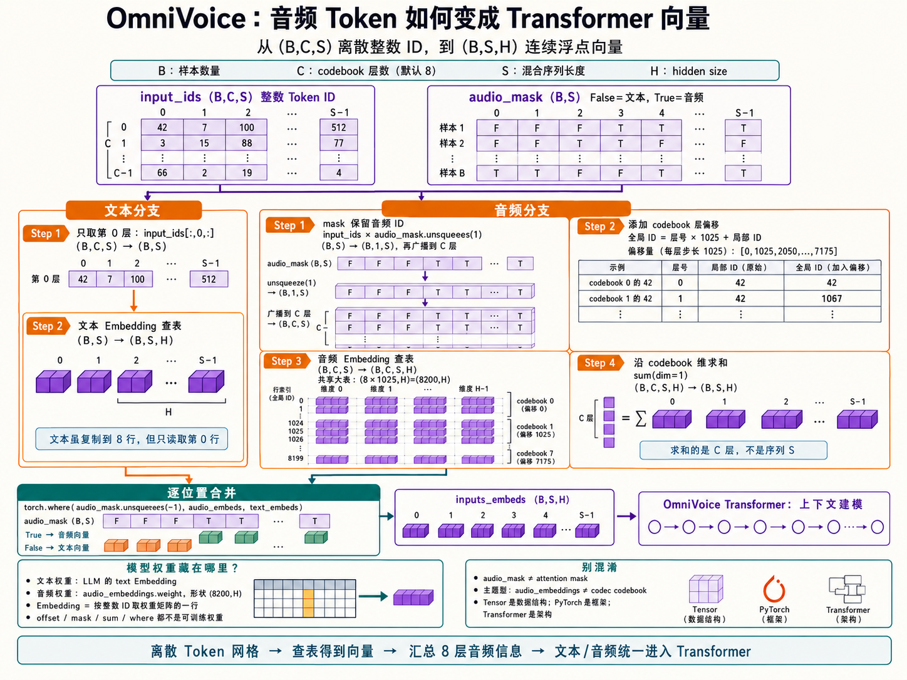
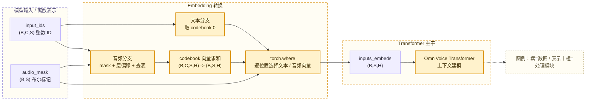
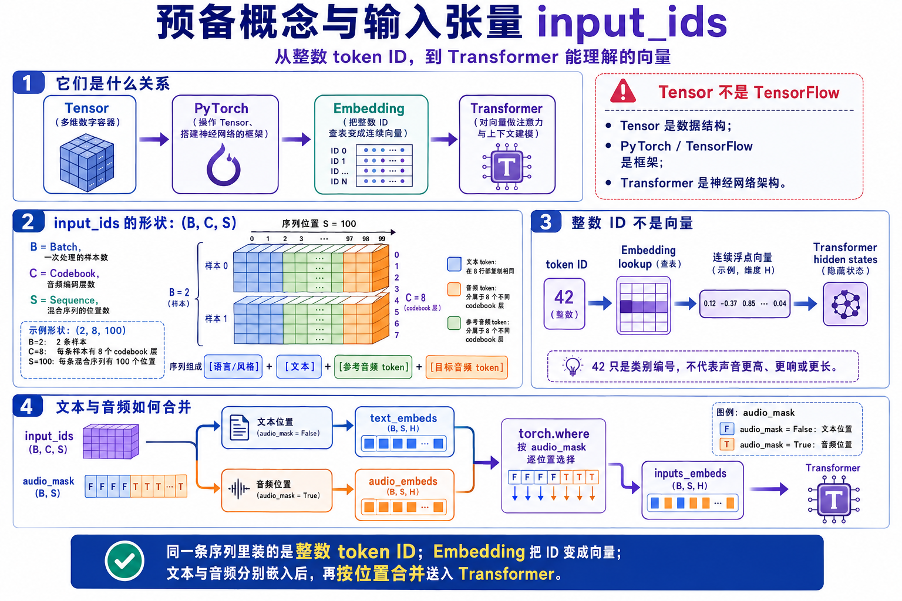
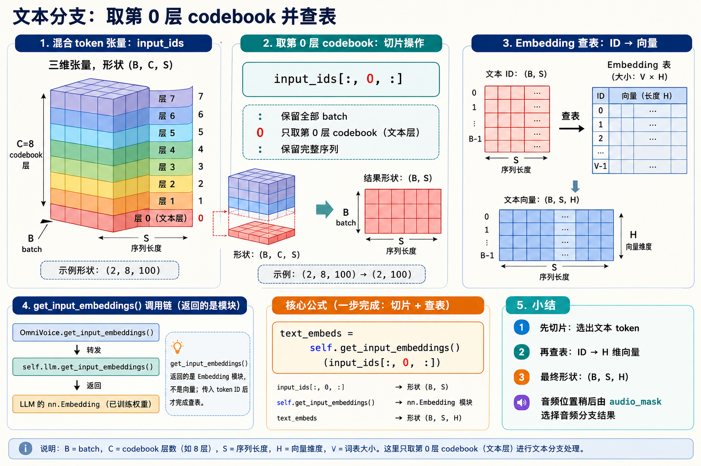
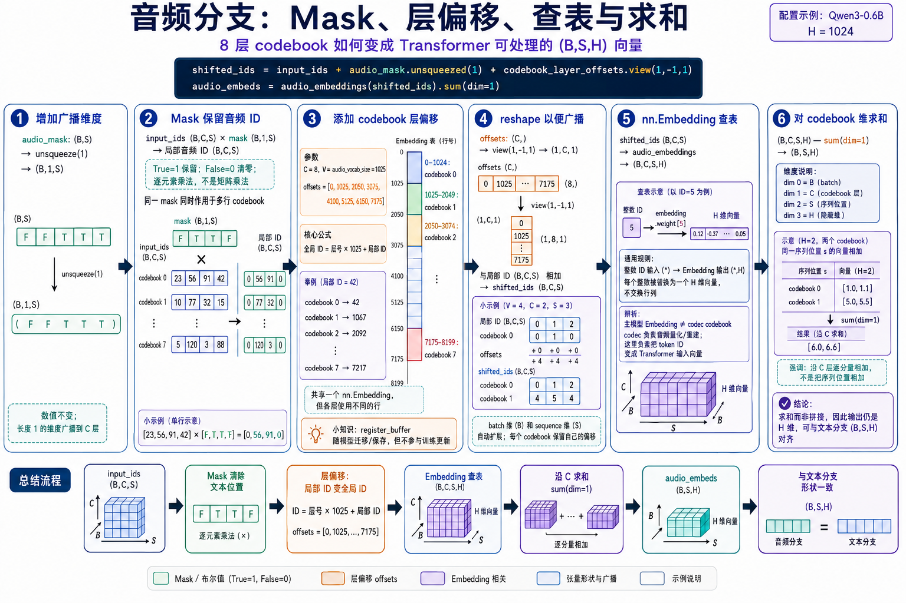

# 第二十二章：扩展知识五 —— OmniVoice 音频 Token 从 `(B, C, S)` 到 Transformer 向量

OmniVoice 会把文本 token、参考音频 token 和待生成的目标音频 token 组织成形状为 `(B, C, S)` 的整数 Tensor。Transformer 不能直接把这些整数 ID 当成声音特征进行注意力计算，因此模型还要先把每个序列位置转换成长度为 `H` 的连续浮点向量。



这段转换发生在 `omnivoice/models/omnivoice.py` 的 `_prepare_embed_inputs()` 中。它的整体目标可以写成：

```text
input_ids:    (B, C, S) 整数 token ID
audio_mask:  (B, S)    文本 / 音频位置标记
                         ↓
inputs_embeds: (B, S, H) 连续浮点向量
```

其中：

- `B`：batch size，一次处理的样本数量。
- `C`：codebook 层数，OmniVoice 默认是 8。
- `S`：完整混合序列长度，包括风格、文本、参考音频和目标音频位置。
- `H`：Transformer 的 hidden size，即每个序列位置最终使用的向量长度。



## 1. 预备概念与输入张量 `input_ids`



### Tensor、PyTorch、Embedding 和 Transformer 的关系

Tensor 是一种多维数字容器。二维 Tensor 可以看成矩阵，三维 Tensor 可以看成多个矩阵叠在一起，更多维 Tensor 则继续增加组织数据的轴。

> 💡 **小科普：Tensor 是 TensorFlow 吗？**
>
> Tensor 是数据结构；PyTorch 和 TensorFlow 是操作 Tensor、构建神经网络的框架；Transformer 是一种神经网络架构。OmniVoice 使用 PyTorch，因此代码中的对象是 `torch.Tensor`，Transformer 则由许多 PyTorch 模块和 Tensor 运算实现。

Embedding 位于整数 token 和 Transformer 之间：

```text
整数 token ID
    ↓ Embedding lookup
连续浮点向量
    ↓ Transformer
带上下文的 hidden states
```

整数 ID 只表示类别编号。例如 token ID `42` 的数字大小并不表示声音更高、更响或更长。Embedding 会为 ID `42` 找到一个模型学习出来的向量，Transformer 才能对这些向量做注意力和线性变换。

### `(B, C, S)` 到底装了什么

OmniVoice 的 `input_ids` 形状是 `(B, C, S)`：

```text
B 个样本
└── 每个样本有 C 个 codebook 行
    └── 每行有 S 个序列位置
```

以 `(2, 8, 100)` 为例：

```text
B = 2：一次处理两条样本
C = 8：每条样本有 8 个 codebook 层
S = 100：每条样本的混合序列有 100 个位置
```

这里使用 `S` 而不是纯音频常用的 `T`，是因为序列中既有文本位置，也有音频位置：

```text
[语言 / 风格] + [文本] + [参考音频 token] + [目标音频 token]
```

这个 `(B, C, S)` 整数张量在代码里就叫 `input_ids`，也是本章后面反复出现的主角。它不是凭空存在的，而是把上面几段 token **在整数 ID 层面**用 `torch.cat` 沿序列维 `S` 首尾拼接而成——拼接的是 token ID，不是向量。完整的拼接示例见[《Token 示例：一条 OmniVoice 输入如何组成完整 Tensor》](token示例.md)。

文本原本只有一行 token。为了和 8 层音频 token 放进同一个规则 Tensor，OmniVoice 会把文本 token 复制到 8 行。因此：

- **文本位置**的 8 行 ID 相同，只需要读取第 0 行。
- **音频位置**的 8 行分别属于不同 codebook，需要全部读取。

`audio_mask` 用于区分这两类位置：

```text
False：文本位置
True：音频位置
```

### 转换分文本、音频两条分支

有了 `input_ids (B, C, S)` 和 `audio_mask (B, S)`，`_prepare_embed_inputs()` 会把它们送进两条并行分支，最后合并成一份向量：

```text
文本分支：处理文本位置 → text_embeds  (B, S, H)
音频分支：处理音频位置 → audio_embeds (B, S, H)
                    ↓ torch.where 按 audio_mask 逐位置选择
              inputs_embeds (B, S, H)
```

两条分支其实都会覆盖整条序列，只是各自只在"属于自己"的位置上产生有效向量。下面第 2 节先看较简单的文本分支，第 3 节看音频分支，第 5 节讲两者如何合并。

## 2. 文本分支：取第 0 层 codebook 并查表



文本分支的输入就是上一节的 `input_ids`（形状 `(B, C, S)` 的混合 token 网格），代码只有一行：

```python
text_embeds = self.get_input_embeddings()(input_ids[:, 0, :])
```

假设：

```text
input_ids.shape = (B, C, S)
```

索引 `input_ids[:, 0, :]` 表示：

```text
第一个 :  → 获取所有 batch 样本
0         → 每个样本只获取第 0 个 codebook 行
最后一个 : → 获取完整序列
```

所以形状变化为：

```text
(B, C, S) → (B, S)
```

例如 `input_ids.shape=(2,8,100)` 时：

```text
input_ids[:, 0, :].shape = (2,100)
```

它实际取出：

```text
input_ids[0, 0, :]  # 样本 0 的第 0 行
input_ids[1, 0, :]  # 样本 1 的第 0 行
```

随后，LLM 自带的文本 Embedding 把每个整数 ID 替换成长度为 `H` 的向量：

```text
文本 ID：(B,S)
          ↓ text embedding
文本向量：(B,S,H)
```

文本分支虽然也会在音频位置计算出向量，但这些位置最后不会使用文本向量，而会由 `audio_mask` 选择音频分支的结果。

### `get_input_embeddings()` 返回的是什么

代码里的文本查表写成一行：

```python
text_embeds = self.get_input_embeddings()(input_ids[:, 0, :])
```

它其实是两步连写：

```text
self.get_input_embeddings()      → 先拿到文本 Embedding 模块
(...)(input_ids[:, 0, :])         → 再调用该模块做查表
```

`get_input_embeddings()` 是 Hugging Face 模型的标准接口，返回模型的输入文本 `nn.Embedding`，也就是保存 token 向量的那张查找表。注意它返回的是**模块**，不是向量；只有再传入 token ID 调用一次，才真正取出向量。

OmniVoice 采用“外层模型 + 内部 LLM 主干”的结构，文本 Embedding 属于内部 LLM（如 Qwen）。因此这个方法只是把请求转发给内部主干：

```text
OmniVoice.get_input_embeddings()
        ↓ 转发
self.llm.get_input_embeddings()
        ↓
LLM 的文本 nn.Embedding（含训练好的权重）
```

这样做的好处是文本 Embedding 只保存一份，避免外层再复制一张表导致不一致。使用标准接口而不是直接访问 `weight`，也让新增特殊 token 后的 `resize_token_embeddings()`、checkpoint 加载与保存、输入输出权重共享等通用流程能够自动复用。

> 💡 **小科普：这个接口定义在哪里？**
>
> `get_input_embeddings()` / `set_input_embeddings()` 定义在 `EmbeddingAccessMixin` 中。Mixin 是一种“能力拼装类”，通常不单独实例化，而是被其他类继承以补充一组小能力。`OmniVoice` 继承它后即可复用这组标准 Embedding 访问接口，无需自行重写。

## 3. 音频分支：mask、层偏移、查表与求和



音频分支要处理 8 层 codebook，步骤比文本分支多。核心代码是：

```python
shifted_ids = (
    input_ids * audio_mask.unsqueeze(1)
) + self.codebook_layer_offsets.view(1, -1, 1)

audio_embeds = self.audio_embeddings(shifted_ids).sum(dim=1)
```

它可以拆成六个小步骤逐个理解。

### 第一步：`audio_mask.unsqueeze(1)` 增加广播维度

`audio_mask` 原本形状为 `(B,S)`。例如：

```python
audio_mask = torch.tensor([
    [False, False, True, True, True],
    [False, True,  True, True, False],
])
```

它的形状是 `(2,5)`：

```text
[
  [F, F, T, T, T],
  [F, T, T, T, F]
]
```

执行：

```python
audio_mask.unsqueeze(1)
```

会在第 1 维插入一个长度为 1 的新维度：

```text
(B,S) → (B,1,S)
(2,5) → (2,1,5)
```

数值没有变化，只是中间多了一层组织结构：

```text
[
  [[F, F, T, T, T]],
  [[F, T, T, T, F]]
]
```

这个长度为 1 的维度会在后续运算中广播到 `C` 个 codebook 层，让同一条样本的所有 codebook 共用同一份文本 / 音频位置标记。

### 第二步：用 mask 保留音频 ID

代码中的乘法是：

```python
input_ids * audio_mask.unsqueeze(1)
```

`*` 表示逐元素相乘，不是矩阵乘法。两个 Tensor 的形状为：

```text
input_ids:                 (B,C,S)
audio_mask.unsqueeze(1):   (B,1,S)
```

PyTorch 会把 `(B,1,S)` 中长度为 1 的 codebook 维广播到 `C`：

```text
(B,1,S) → (B,C,S)
```

布尔值参与乘法时，可以按 `True=1`、`False=0` 理解：

```text
mask=True  → token_id × 1 → 保留原 ID
mask=False → token_id × 0 → 变成 0
```

最简单的例子：

```text
input_ids:  [23, 56, 91, 42]
audio_mask: [ F,  T,  T,  F]
结果:       [ 0, 56, 91,  0]
```

对于多 codebook 输入，同一份 mask 会作用于每一行：

```text
input_ids:
codebook 0  [9, 1, 2]
codebook 1  [9, 3, 1]

audio_mask: [F, T, T]

相乘后:
codebook 0  [0, 1, 2]
codebook 1  [0, 3, 1]
```

这里得到的是各 codebook 内部的**局部 token ID**。文本位置被临时改成局部 ID `0`，避免把文本词表中的较大 ID 错当成音频 ID。后续虽然也会为这些位置计算音频 embedding，但最终会被 `torch.where` 丢弃。

### 第三步：为什么不同 codebook 需要添加偏移量

OmniVoice 默认配置为：

```text
num_audio_codebook = 8
audio_vocab_size = 1025
```

`1025` 包含：

```text
0～1023：正常 codec token ID
1024：audio_mask_id
```

模型没有创建 8 个独立的 `nn.Embedding`，而是创建一张大表：

```python
self.audio_embeddings = nn.Embedding(
    config.num_audio_codebook * config.audio_vocab_size,
    self.config.llm_config.hidden_size,
)
```

这张表的形状是：

```text
(8 × 1025, H) = (8200,H)
```

逻辑上可以划分为 8 个区域：

```text
大表第 0～1024 行       → codebook 0
大表第 1025～2049 行    → codebook 1
大表第 2050～3074 行    → codebook 2
...
大表第 7175～8199 行    → codebook 7
```

这里的“共享一张大表”是指共用一个 `nn.Embedding` 模块。各 codebook 占用不同的行，并不会让不同 codebook 中相同的局部 ID 使用同一个向量。

层偏移量由下面的代码生成：

```python
self.register_buffer(
    "codebook_layer_offsets",
    torch.arange(config.num_audio_codebook) * config.audio_vocab_size,
)
```

默认得到：

```text
[0, 1025, 2050, 3075, 4100, 5125, 6150, 7175]
```

它把各层的局部 ID 转换成共享大表中的全局行号：

```text
全局行号 = codebook 层号 × 1025 + 局部 token ID
```

例如不同层都出现局部 token ID `42`：

```text
codebook 0：0    + 42 = 42
codebook 1：1025 + 42 = 1067
codebook 2：2050 + 42 = 2092
```

三个 ID 最终会查询大表中的三行不同向量。

> 💡 **小科普：`register_buffer()` 保存的是什么？**
>
> `codebook_layer_offsets` 是固定计算规则，不需要通过训练更新，因此不是模型参数。注册为 buffer 后，它会随模型移动到 CPU / GPU，也会进入模型状态，但优化器不会把它当成可训练权重。

### 第四步：`view(1, -1, 1)` 如何帮助广播

原始的 `codebook_layer_offsets` 形状为：

```text
(C,)
```

默认情况下就是：

```text
(8,)
```

执行：

```python
self.codebook_layer_offsets.view(1, -1, 1)
```

会把形状改成：

```text
(1,C,1)
```

其中 `-1` 表示由 PyTorch 根据元素总数自动推断，该位置最终是 `C=8`。数值没有改变，也没有发生转置：

```text
原来：(8,)
[0, 1025, 2050, ..., 7175]

view 后：(1,8,1)
[
  [
    [0],
    [1025],
    [2050],
    ...
    [7175]
  ]
]
```

它与 `(B,C,S)` 相加时会广播：

```text
局部音频 ID：(B,C,S)
层偏移量：   (1,C,1)
                 ↓ 广播
全局音频 ID：(B,C,S)
```

长度为 1 的 batch 维会扩展到所有样本，长度为 1 的序列维会扩展到所有序列位置，而每个 codebook 保留自己的偏移量。

一个缩小到两个 codebook 的例子：

```text
局部音频 ID:
codebook 0  [0, 1, 2]
codebook 1  [0, 1, 0]

假设每层词表大小 V=4：
offsets = [0, 4]

添加偏移后:
codebook 0  [0, 1, 2]
codebook 1  [4, 5, 4]
```

### 第五步：`nn.Embedding` 把整数 ID 查成向量

`nn.Embedding` 是 PyTorch 的神经网络模块类。创建实例时：

```python
embedding = nn.Embedding(num_embeddings, embedding_dim)
```

它会创建一个可训练参数矩阵：

```text
embedding.weight.shape = (num_embeddings, embedding_dim)
```

每个整数 ID 就是这个矩阵的行号：

```text
ID 0 → embedding.weight[0]
ID 1 → embedding.weight[1]
ID 2 → embedding.weight[2]
```

#### 最简单的一维查表示例

假设有一张演示用 Embedding 表：

```text
ID 0 → [0.0, 0.0]
ID 1 → [1.0, 1.1]
ID 2 → [2.0, 2.2]
```

输入为：

```text
[1, 2, 0]
shape = (3,)
```

查表过程是：

```text
1 → [1.0, 1.1]
2 → [2.0, 2.2]
0 → [0.0, 0.0]
```

输出为：

```text
[
  [1.0, 1.1],
  [2.0, 2.2],
  [0.0, 0.0]
]
shape = (3,2)
```

这个过程没有交换行列。原来的每个整数都被替换成一个长度为 2 的向量，所以只是在输入形状末尾增加了向量维度。

通用规则是：

```text
整数 ID 输入：(*)
Embedding 输出：(*,H)
```

对应 OmniVoice 音频分支：

```text
shifted_ids:                    (B,C,S)
self.audio_embeddings(...):     (B,C,S,H)
```

调用：

```python
self.audio_embeddings(shifted_ids)
```

表面上像调用函数，实际会经过 `nn.Module.__call__()` 执行 `Embedding` 的前向查表。项目不需要手动调用 `.forward()`。

> 💡 **小科普：这里的 Embedding 是 codec codebook 吗？**
>
> 不是。Audio Tokenizer 内部的 codec codebook 用于把连续音频 latent 量化成 token，并供 codec decoder 重建声音；`self.audio_embeddings` 则属于 OmniVoice 主生成模型，用于把这些 token ID 转成 Transformer 能处理的输入向量。两者通过 token ID 对应，但属于不同模块，向量也承担不同职责。

### 第六步：`sum(dim=1)` 对 codebook 维求和

查表后的音频向量形状是：

```text
(B,C,S,H)
```

四个维度从 0 开始编号：

```text
dim=0 → B，batch
dim=1 → C，codebook
dim=2 → S，序列位置
dim=3 → H，向量分量
```

代码执行：

```python
audio_embeds = self.audio_embeddings(shifted_ids).sum(dim=1)
```

`sum(dim=1)` 表示对 codebook 维求和：

```text
(B,C,S,H) → (B,S,H)
```

对每一个 batch、每一个序列位置，都把 `C` 个 codebook 向量逐分量相加：

```text
输出[b,s,h] = Σ 输入[b,c,s,h]
                  c
```

#### 两个 codebook 的数字示例

为了便于展开，假设：

```text
B = 1
C = 2
S = 3
H = 2
```

查表后，忽略最外层 batch，可以看到两个 codebook 矩阵：

```text
codebook 0:
[
  [1.0, 1.1],
  [2.0, 2.2],
  [0.0, 0.0]
]

codebook 1:
[
  [5.0, 5.5],
  [4.0, 4.4],
  [7.0, 7.7]
]
```

`sum(dim=1)` 在完整 `(B,C,S,H)` Tensor 上沿 `C` 求和，所以计算的是两个 codebook 的对应位置：

```text
序列位置 0：[1.0,1.1] + [5.0,5.5] = [6.0,6.6]
序列位置 1：[2.0,2.2] + [4.0,4.4] = [6.0,6.6]
序列位置 2：[0.0,0.0] + [7.0,7.7] = [7.0,7.7]
```

得到：

```text
[
  [
    [6.0, 6.6],
    [6.0, 6.6],
    [7.0, 7.7]
  ]
]
shape = (1,3,2)
```

这里没有把同一个 codebook 内的三行相加。若单独取出一个 `(3,2)` 矩阵再执行 `sum(dim=0)`，才会得到把三行相加后的 `(2,)` 向量。维度编号必须结合**当前完整 Tensor 的 shape**理解。

上面用 `H=2` 只是为了便于展示，此时不同层组合的和可能恰好相等（如两组都得到 `[6.0,6.6]`）；真实情况下 `H` 很高，且向量是训练学出来的，求和结果一般是可区分的，本项目主干为 `Qwen/Qwen3-0.6B`，`H=hidden_size=1024`。

OmniVoice 使用求和而不是拼接，因此每个音频序列位置最终仍然得到一个 `H` 维向量，能够与文本分支的 `(B,S,H)` 保持一致。

## 4. 模型权重藏在这个函数的哪里

`_prepare_embed_inputs()` 里看不到显式的矩阵乘法，也没有直接出现 `weight` 变量，容易让人以为它没有用到训练好的权重。实际上，权重被“藏”在两次 Embedding 调用里。

### 权重集中在两次查表上

文本分支：

```python
text_embeds = self.get_input_embeddings()(input_ids[:, 0, :])
```

音频分支：

```python
audio_embeds = self.audio_embeddings(shifted_ids).sum(dim=1)
```

这两次调用分别从文本 Embedding 和音频 Embedding 的权重表里，按行号取出向量。函数中的其余操作只是整理形状或做选择，不含可训练权重：

| 代码 | 作用 | 是否使用权重 |
| --- | --- | --- |
| `input_ids[:, 0, :]` | 取第 0 层文本 ID | 否 |
| `input_ids * audio_mask.unsqueeze(1)` | 文本位置 ID 归零 | 否 |
| `+ codebook_layer_offsets.view(1,-1,1)` | 加层偏移，得到全局行号 | 否（buffer，非训练参数） |
| `self.get_input_embeddings()(...)` | 按行号查文本权重表 | **是** |
| `self.audio_embeddings(...)` | 按行号查音频权重表 | **是** |
| `.sum(dim=1)` | 8 层向量相加 | 否 |
| `torch.where(...)` | 文本 / 音频逐位置选择 | 否 |

### `nn.Embedding(...)` 不是空值，而是创建了一张权重表

初始化里的这行常被误解为“赋了空值”：

```python
self.audio_embeddings = nn.Embedding(
    config.num_audio_codebook * config.audio_vocab_size,
    self.config.llm_config.hidden_size,
)
```

它其实是在**构造一个模块对象**。构造时，模块内部会立即创建一张形状为 `(num_embeddings, embedding_dim)` 的矩阵，并填入随机初始值：

```text
num_embeddings = num_audio_codebook × audio_vocab_size = 8 × 1025 = 8200
embedding_dim = hidden_size = H

self.audio_embeddings.weight.shape = (8200, H)
初始内容：随机小数
```

所以这张表在创建时并不是空的，而是“尺寸已确定、数值待学习”。它会在两种情况下变得有意义：

```text
训练时：反向传播不断更新这些数字
加载模型时：from_pretrained() 用 checkpoint 里训练好的数字覆盖随机初始值
```

同一个 ID 的向量，训练前后差别很大：

```text
训练前：weight[42] = [0.01, -0.03, 0.02, ...]   # 随机初始化
训练后：weight[42] = [0.87,  0.12, -0.55, ...]  # 学到的表示
```

### `.weight` 就是这张可训练的权重表

`.weight` 是 Embedding 模块内部那张矩阵，类型是 `nn.Parameter`（可训练参数）：

```python
self.audio_embeddings.weight        # (8200, H) 可训练矩阵
self.audio_embeddings.weight[42]    # 第 42 行，一个长度 H 的向量
```

“查表”本质上就是从这张权重矩阵里取行：

```text
self.audio_embeddings(ids) 等价于 self.audio_embeddings.weight[ids]
```

> 💡 **小科普：为什么查表看不到乘法？**
>
> Embedding 在数学上等价于“用 one-hot 向量乘以权重矩阵”，但那样会做大量乘 0 的无用计算。PyTorch 直接用整数索引取对应行，结果相同却更高效，因此代码里看不到乘号。它可以理解成普通线性层的“查表特例”。

### “模型权重”指什么

“权重”是模型里**可以被训练调整的数字**。一个神经网络的本领，就存在这些数字里。可以按是否参与训练分成两类：

| 类型 | 例子 | 是否可训练 | 说明 |
| --- | --- | --- | --- |
| 权重参数 | `audio_embeddings.weight`、`Linear.weight` | 是 | 训练时被梯度更新，存进 checkpoint |
| 普通张量 / buffer | `codebook_layer_offsets`、mask | 否 | 固定规则或中间数据，不被训练 |

对 Embedding 来说，权重的含义特别直观：

```text
每一行 = 一个 token ID 对应的向量
训练目标 = 学出“每个 token 应该用什么向量表示”
```

### 权重如何保存与加载

音频 Embedding 的向量表保存在：

```text
self.audio_embeddings.weight
```

可以这样查看：

```python
print(model.audio_embeddings.weight.shape)
print(model.audio_embeddings.weight[42])
print(model.state_dict()["audio_embeddings.weight"].shape)
```

模型训练时，反向传播会更新被使用到的 Embedding 行。调用 Hugging Face 的模型保存接口时，这张表会和 LLM 主干、输出层等权重一起进入 checkpoint；调用 `OmniVoice.from_pretrained()` 时，再从 checkpoint 恢复训练好的向量。

因此，“ID 到向量的映射”不是写死在 Python 字典中的人工规则，而是一张由模型训练学到的参数矩阵：

```text
整数 ID 负责定位行
Embedding 权重负责保存向量
训练过程负责学习每一行应该表示什么
```

## 5. 合并两个分支与完整微型示例

### `torch.where` 如何合并文本和音频分支

此时两个分支已经具有相同形状：

```text
text_embeds:  (B,S,H)
audio_embeds: (B,S,H)
```

代码使用：

```python
torch.where(audio_mask.unsqueeze(-1), audio_embeds, text_embeds)
```

`audio_mask` 形状是 `(B,S)`。执行 `unsqueeze(-1)` 后：

```text
(B,S) → (B,S,1)
```

最后一个长度为 1 的维度会广播到 `H`，使同一序列位置的整个向量使用同一个选择条件：

```text
audio_mask=True  → 选择 audio_embeds
audio_mask=False → 选择 text_embeds
```

最终得到：

```text
inputs_embeds: (B,S,H)
```

> 💡 **小科普：这里是"选择"，不是"拼接"**
>
> `torch.where` 对每个序列位置在文本向量和音频向量之间二选一，序列长度 `S` 不变；如果是拼接，长度会变成"文本长度 + 音频长度"。真正把文本段和音频段接成一条序列的拼接发生得更早，是第 1 节里在 **token ID 层面**用 `torch.cat` 完成的。可以记成：**ID 层用 `torch.cat` 决定序列怎么排布，向量层用 `torch.where` 决定每个位置用文本还是音频 embedding。**

### 从 mask 到最终向量的完整微型示例

下面用很小的数字走完音频分支和最终选择。假设：

```text
B = 1
C = 2
S = 3
H = 2
每个 codebook 的演示词表大小 V = 4
```

混合输入中，第 0 个位置是文本，后两个位置是音频：

```text
input_ids:
codebook 0  [6, 1, 2]
codebook 1  [6, 1, 0]

audio_mask: [False, True, True]
```

#### 第一步：mask 局部音频 ID

```text
codebook 0  [0, 1, 2]
codebook 1  [0, 1, 0]
```

#### 第二步：添加 codebook 偏移

演示词表大小是 4，因此：

```text
offsets = [0,4]
```

得到共享音频 Embedding 表的全局行号：

```text
codebook 0  [0, 1, 2]
codebook 1  [4, 5, 4]
```

#### 第三步：查询音频 Embedding

假设大表中的相关行是：

```text
ID 0 → [0.0, 0.0]
ID 1 → [1.0, 1.1]
ID 2 → [2.0, 2.2]
ID 4 → [4.0, 4.4]
ID 5 → [5.0, 5.5]
```

查表后：

```text
codebook 0:
[
  [0.0,0.0],
  [1.0,1.1],
  [2.0,2.2]
]

codebook 1:
[
  [4.0,4.4],
  [5.0,5.5],
  [4.0,4.4]
]
```

#### 第四步：对 codebook 求和

```text
audio_embeds:
[
  [4.0,4.4],
  [6.0,6.6],
  [6.0,6.6]
]
```

第 0 个位置虽然也计算出了音频向量 `[4.0,4.4]`，但它是文本位置，稍后不会使用。

#### 第五步：选择文本或音频向量

假设文本 Embedding 为第 0 个文本位置产生：

```text
text_embeds[0] = [0.5,0.6]
```

按照：

```text
audio_mask = [False, True, True]
```

逐位置选择后：

```text
inputs_embeds:
[
  [0.5,0.6],  # 文本位置，来自 text_embeds
  [6.0,6.6],  # 音频位置，来自 audio_embeds
  [6.0,6.6]   # 音频位置，来自 audio_embeds
]
```

加回 batch 维后，最终形状是：

```text
(1,3,2) = (B,S,H)
```

## 6. 总结与常见误区

### 一行公式总结完整过程

音频分支可以概括为：

```text
local_ids
= input_ids × audio_mask.unsqueeze(1)

shifted_ids
= local_ids + codebook_layer_offsets.view(1,C,1)

audio_vectors
= audio_embeddings(shifted_ids)          # (B,C,S) -> (B,C,S,H)

audio_embeds
= audio_vectors.sum(dim=1)                # (B,C,S,H) -> (B,S,H)
```

文本分支和最终合并为：

```text
text_embeds
= text_embedding(input_ids[:,0,:])        # (B,S) -> (B,S,H)

inputs_embeds
= where(audio_mask, audio_embeds, text_embeds)
```

最终，OmniVoice 把规则但离散的 `(B,C,S)` token 网格，转换成 Transformer 能处理的 `(B,S,H)` 连续向量序列。文本位置使用 LLM 的文本 Embedding，音频位置汇总 8 层 codebook 的音频 Embedding；两类位置在进入 Transformer 前被统一到相同的 hidden size。

### 常见误区

| 常见误区 | 更准确的理解 |
| --- | --- |
| 这个函数没有用到模型权重 | 权重藏在文本、音频两次 Embedding 查表里，只是没有显式矩阵乘法 |
| `nn.Embedding(...)` 是赋空值 | 它构造模块并立即创建一张随机初始化的 `(num,dim)` 权重矩阵 |
| Embedding 会对 token ID 做复杂数值运算 | Embedding 首先是按 ID 查表，每个 ID 选择参数矩阵中的一行 |
| `(B,C,S)` 经过查表时发生了转置 | 原维度顺序不变，只在末尾增加 `H`，变成 `(B,C,S,H)` |
| `sum(dim=1)` 把时间序列全部加在一起 | 在完整四维 Tensor 中，`dim=1` 是 codebook 维，时间维 `S` 会保留 |
| 不同 codebook 中相同 ID 使用同一向量 | 添加层偏移后，它们查询共享大表中的不同行 |
| 文本本身也有 8 层 codebook | 文本只是复制到 8 行以统一形状，文本 Embedding 只读取第 0 行 |
| 文本向量和音频向量是拼接在一起的 | 向量层用 `torch.where` 逐位置二选一，`S` 不变；拼接发生在更早的 token ID 层（`torch.cat`） |
| `input_ids` 一开始就是完整张量 | 它由 style / 文本 / 参考音频 / 目标 MASK 几段 token 沿 `S` 维 `torch.cat` 拼成 |
| `audio_mask` 就是 attention mask | `audio_mask` 用于选择文本 / 音频 Embedding；attention mask 用于控制注意力可见范围 |
| 主模型的 `audio_embeddings` 就是 codec codebook | 前者服务 Transformer 建模，后者服务音频量化与波形重建 |
| Tensor 就是 TensorFlow 或 Transformer | Tensor 是数据结构，PyTorch / TensorFlow 是框架，Transformer 是模型架构 |
