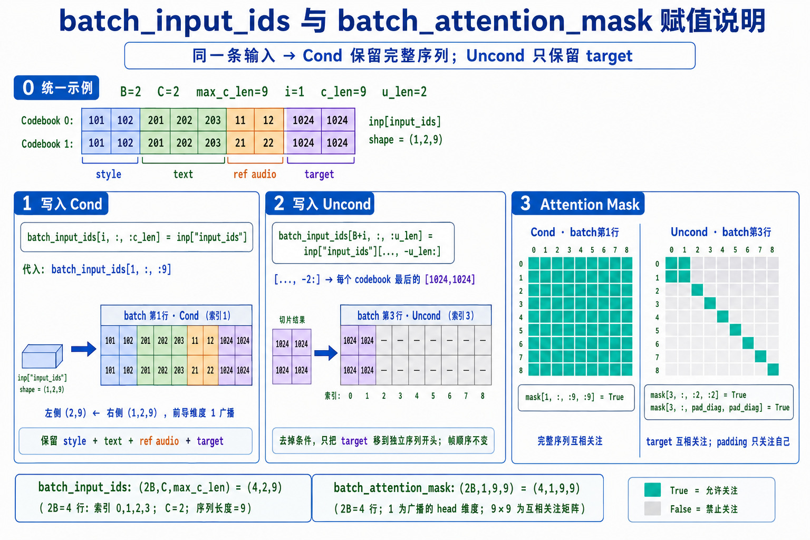

# `batch_input_ids` 与 `batch_attention_mask` 赋值说明



本文用同一组数据说明三个操作：

1. 将完整输入写入 Cond。
2. 将 target 段写入 Uncond。
3. 设置 Cond 和 Uncond 的 attention mask。

## 统一示例

假设：

```text
B=2，C=2，max_c_len=9，i=1，c_len=9，u_len=2

位置：       style       text          ref audio     target
Codebook 0：[101,102] [201,202,203]    [11,12]     [1024,1024]
Codebook 1：[101,102] [201,202,203]    [21,22]     [1024,1024]
```

当前输入为：

```python
inp["input_ids"] = [
    [
        [101, 102, 201, 202, 203, 11, 12, 1024, 1024],
        [101, 102, 201, 202, 203, 21, 22, 1024, 1024],
    ]
]  # shape: (1, C, c_len) = (1, 2, 9)
```

同一条输入会在 batch 中形成一对数据：

```text
batch 第 i 行：   [style][text][ref audio][target]  ← Cond
batch 第 B+i 行： [target][padding...]              ← Uncond
```

代入 `B=2`、`i=1`，它们分别位于 batch 第 `1` 行和第 `3` 行。

为了直观看出赋值位置，下面用 `99` 表示尚未写入的空位。实际代码中
`pad_id = audio_mask_id = 1024`，空位实际也填 `1024`，由其他 mask 区分
有效 target 和 padding。

赋值前：

```python
batch_input_ids = [
    [
        [99, 99, 99, 99, 99, 99, 99, 99, 99],
        [99, 99, 99, 99, 99, 99, 99, 99, 99],
    ],  # batch 第 0 行：Cond
    [
        [99, 99, 99, 99, 99, 99, 99, 99, 99],
        [99, 99, 99, 99, 99, 99, 99, 99, 99],
    ],  # batch 第 1 行：Cond，本例写入位置
    [
        [99, 99, 99, 99, 99, 99, 99, 99, 99],
        [99, 99, 99, 99, 99, 99, 99, 99, 99],
    ],  # batch 第 2 行：Uncond
    [
        [99, 99, 99, 99, 99, 99, 99, 99, 99],
        [99, 99, 99, 99, 99, 99, 99, 99, 99],
    ],  # batch 第 3 行：Uncond，本例写入位置
]  # shape: (2B, C, max_c_len) = (4, 2, 9)
```

## 1. 写入 Cond：保留完整序列

```python
batch_input_ids[i, :, :c_len] = inp["input_ids"]
```

左侧各维度的含义：

- `i`：选择 batch 第 `i` 行 Cond 数据。
- `:`：选择全部 `C` 个 codebook。
- `:c_len`：选择序列前 `c_len` 个位置。

代入 `i=1`、`c_len=9`：

```python
batch_input_ids[1, :, :9] = inp["input_ids"]
```

左侧形状为 `(C, c_len) = (2, 9)`，右侧形状为 `(1, 2, 9)`。赋值时，
PyTorch 将右侧最前面的单元素维度 `1` 作为可广播维度处理。

赋值后，batch 第 `1` 行为：

```python
[
    [101, 102, 201, 202, 203, 11, 12, 1024, 1024],
    [101, 102, 201, 202, 203, 21, 22, 1024, 1024],
]  # [style][text][ref audio][target]
```

## 2. 写入 Uncond：只保留 target

```python
batch_input_ids[B + i, :, :u_len] = inp["input_ids"][..., -u_len:]
```

右侧 `[..., -u_len:]` 保留前面的所有维度，并取得序列末尾的 target 段：

```python
inp["input_ids"][..., -2:] = [
    [
        [1024, 1024],
        [1024, 1024],
    ]
]  # shape: (1, 2, 2)
```

左侧 `B+i = 2+1 = 3`，因此实际赋值为：

```python
batch_input_ids[3, :, :2] = inp["input_ids"][..., -2:]
```

赋值后，batch 第 `3` 行为：

```python
[
    [1024, 1024, 99, 99, 99, 99, 99, 99, 99],
    [1024, 1024, 99, 99, 99, 99, 99, 99, 99],
]  # [target][padding...]
```

Uncond 去掉 style、text 和 ref audio，只保留 target，供 CFG 计算无条件预测。
target 只是移动到这条独立序列的开头，音频帧顺序没有改变。

## 3. 设置 `batch_attention_mask`

`batch_attention_mask` 控制序列位置之间是否可以互相关注：

```text
True：允许关注
False：禁止关注
```

### 3.1 创建

```python
batch_attention_mask = torch.zeros(
    (2 * B, 1, max_c_len, max_c_len),
    dtype=torch.bool,
)
```

本例形状为 `(4, 1, 9, 9)`，即 `4` 个初始全为 `False` 的 `9×9`
attention 矩阵。最后两个维度分别表示“当前位置”和“可以关注的位置”。

### 3.2 Cond：完整序列互相关注

```python
batch_attention_mask[i, :, :c_len, :c_len] = True
```

代入示例参数：

```python
batch_attention_mask[1, :, :9, :9] = True
```

batch 第 `1` 行对应的整个 `9×9` 区域被设置为 `True`，因此 Cond 的
`[style][text][ref audio][target]` 所有位置都可以互相关注。

### 3.3 Uncond：target 互相关注，padding 只关注自己

首先开放左上角的 `2×2` target 区域：

```python
batch_attention_mask[B + i, :, :u_len, :u_len] = True
# 等价于 batch_attention_mask[3, :, :2, :2] = True
```

然后生成 padding 位置索引，并只开放这些位置的对角线：

```python
pad_diag = torch.arange(u_len, max_c_len)
# pad_diag = [2, 3, 4, 5, 6, 7, 8]

batch_attention_mask[B + i, :, pad_diag, pad_diag] = True
```

最终 batch 第 `3` 行的 attention 矩阵为：

```text
[
  [T, T, F, F, F, F, F, F, F],
  [T, T, F, F, F, F, F, F, F],
  [F, F, T, F, F, F, F, F, F],
  [F, F, F, T, F, F, F, F, F],
  [F, F, F, F, T, F, F, F, F],
  [F, F, F, F, F, T, F, F, F],
  [F, F, F, F, F, F, T, F, F],
  [F, F, F, F, F, F, F, T, F],
  [F, F, F, F, F, F, F, F, T],
]
```

左上角 `2×2` 表示两个 target 位置可以互相关注；其余对角线上的 `T`
表示每个 padding 位置只允许关注自己。
