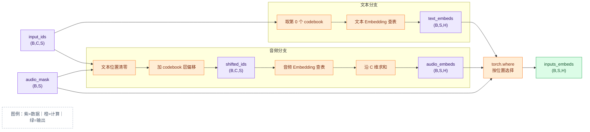

# `_prepare_embed_inputs()`：输入 Embedding 的计算过程

`_prepare_embed_inputs()` 把文本 token 和多层 audio token 转换成 Transformer
需要的统一向量序列。源码位于
[`omnivoice/models/omnivoice.py`](../../omnivoice/models/omnivoice.py)。

## 1. 输入、输出和整体流程

```text
input_ids   (B,C,S)  文本 token 与多层 audio token
audio_mask  (B,S)    False=文本位置，True=音频位置
返回结果     (B,S,H)  Transformer 输入向量
```

`B` 是 batch 数量，`C` 是 codebook 数量，`S` 是序列长度，`V` 是每层
audio token 词表大小，`H` 是 `hidden_size`。



## 2. 第一步：计算文本 Embedding

```python
text_input_ids = input_ids[:, 0, :]  # (B,C,S) → (B,S)
text_embedding_layer = self.get_input_embeddings()
text_embeds = text_embedding_layer(text_input_ids)
```

文本 token 会复制到各 codebook 层，因此取第 `0` 层即可。
`text_embedding_layer` 是内部 LLM 的 `nn.Embedding`，调用链为：

```text
text_embedding_layer(text_input_ids)
→ nn.Module.__call__()
→ nn.Embedding.forward()
→ 根据 token ID 查询向量表
→ text_embeds (B,S,H)
```

`input_ids` 保存整数 ID；查表后，每个 ID 才变成长度为 `H` 的向量。

## 3. 第二步：音频分支清零文本位置【重要 1】

```python
input_ids * audio_mask.unsqueeze(1)
```

`audio_mask.unsqueeze(1)` 将 `(B,S)` 变成 `(B,1,S)`。乘法前先广播：

```text
(B,C,S) * (B,1,S) → (B,C,S)
```

广播从右向左比较，每一维必须相等，或者其中一维为 `1`。例如：

```text
(B,C,S,1)
(B,1,S,A)
-----------
(B,C,S,A)
```

`*` 表示广播后逐元素相乘，`@` 表示矩阵乘法。布尔值参与乘法时：

```text
audio_mask=True  → token ID × 1，保留音频位置
audio_mask=False → token ID × 0，文本位置清零
```

## 4. 第三步：添加 codebook 层偏移【重要 2】

`codebook_layer_offsets` 在 `OmniVoice.__init__()` 中通过 `register_buffer`
注册，保存每层偏移量：

```text
[0, V, 2V, ..., (C-1)V]   shape=(C,)
```

```python
self.codebook_layer_offsets.view(1, -1, 1)
# (C,) → (1,C,1)
```

`view()` 不改变元素；`-1` 根据 `1×?×1=C` 推算为 `C`。与前一步结果相加时：

```text
(B,C,S) + (1,C,1) → (B,C,S)
```

`+` 也是广播后逐元素计算。最终：

```text
shifted_ids[b,c,s]
= input_ids[b,c,s] × audio_mask[b,s] + c×V
```

`shifted_ids` 是加过层偏移的全局 audio embedding 行号，不是向量。文本位置原本
被清零，加偏移后会变为该 codebook 的偏移量，但这些位置最终不会被采用。

## 5. 第四步：查询并合并音频 Embedding

```python
codebook_audio_embeds = self.audio_embeddings(shifted_ids)
# (B,C,S) → (B,C,S,H)
```

`self.audio_embeddings` 是形状为 `(C×V,H)` 的 `nn.Embedding` 向量表。
每个 `shifted_id` 查询一行，得到一个 `H` 维向量。

```python
audio_embeds = codebook_audio_embeds.sum(dim=1)
# (B,C,S,H) → (B,S,H)
```

`dim=1` 是 codebook 维。同一序列位置的 `C` 个向量逐元素相加；消失的是 `C`
维，`S` 维不变。这里相加的是 embedding 向量，不是 token ID。

## 6. 第五步：使用 `torch.where()` 汇合两条分支

```python
return torch.where(
    audio_mask.unsqueeze(-1),  # (B,S) → (B,S,1)
    audio_embeds,              # (B,S,H)
    text_embeds,               # (B,S,H)
)
```

`(B,S,1)` 会沿 `H` 维广播。`torch.where(condition,x,y)` 的规则是：

```text
audio_mask=True  → 选择 audio_embeds
audio_mask=False → 选择 text_embeds
```

最终每个序列位置只保留一个 `H` 维向量，输出形状为 `(B,S,H)`。

## 7. 最小示例

假设 `C=2、S=3、V=5`：

```text
audio_mask = [False, True, True]
input_ids =
codebook 0：[3, 2, 4]
codebook 1：[3, 1, 4]
```

音频分支：

```text
乘 audio_mask 后：[[0,2,4], [0,1,4]]
加偏移 [0,5] 后：[[0,2,4], [5,6,9]] = shifted_ids
```

在位置 `1`，音频向量为：

```text
AudioEmbedding[2] + AudioEmbedding[6]
```

由于 `audio_mask[1]=True`，`torch.where()` 选择该音频向量；位置 `0` 的 mask
为 `False`，选择 `TextEmbedding[3]`。最终得到统一的 `(B,S,H)` 输入向量。

## 8. 科普图


