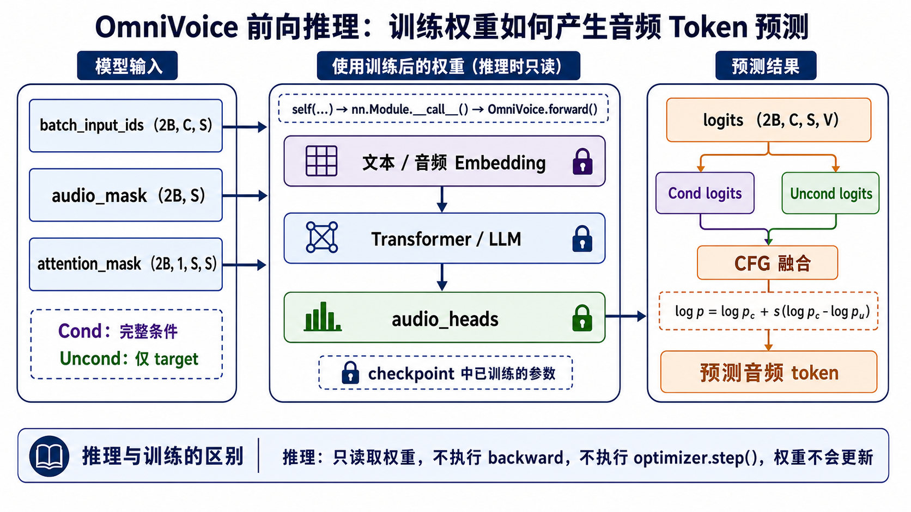
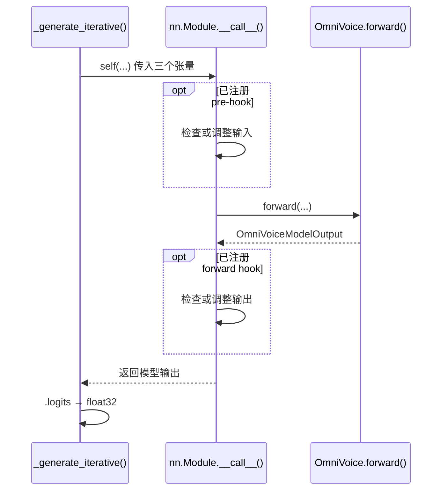
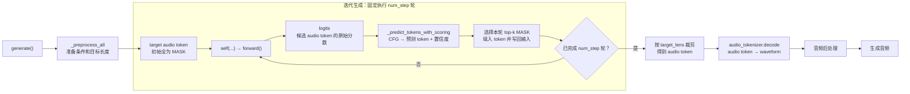
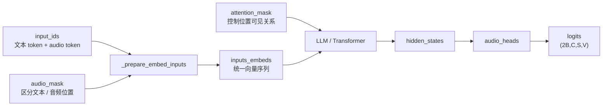
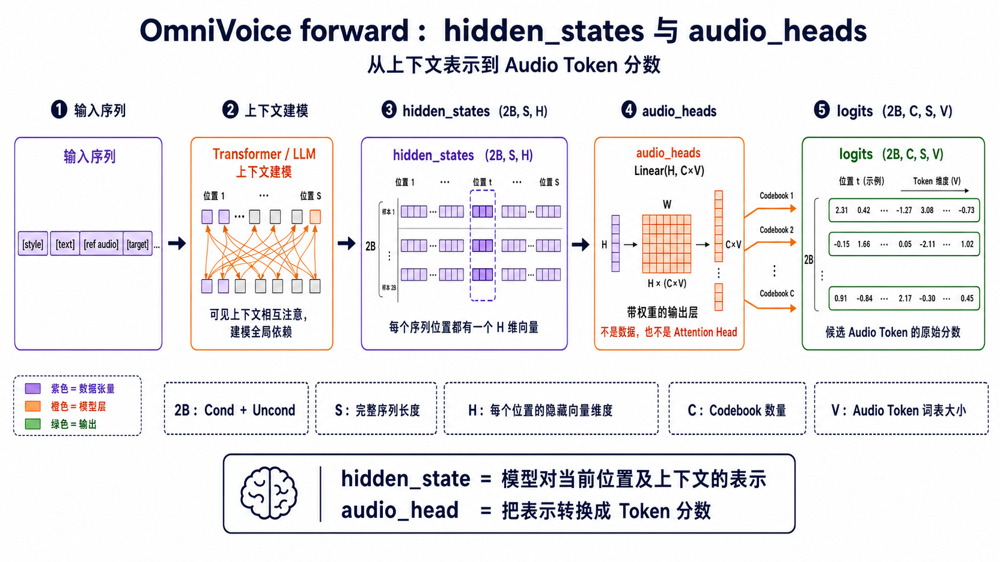
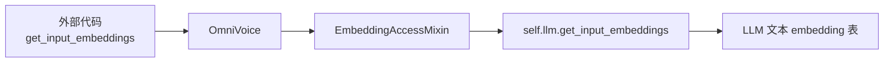
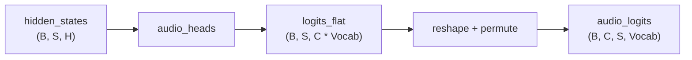
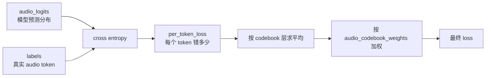

# 从 `self(...)` 到 OmniVoice `forward()`



本文从 `_generate_iterative()` 中的 `self(...)` 调用开始，依次解释它为什么会进入
`OmniVoice.forward()`、`forward()` 内部执行了什么，以及这次前向计算在训练和
推理中的不同作用。

## 1. 从 `self(...)` 这行代码开始

推理循环中的核心代码是：

```python
batch_logits = self(
    input_ids=batch_input_ids,
    audio_mask=batch_audio_mask,
    attention_mask=batch_attention_mask,
).logits.to(torch.float32)
```

这里的 `self` 是 `OmniVoice` 模型实例。这行代码向模型传入三个张量，并从模型
输出中取出 `.logits`，保存为 `batch_logits`。

### 输入：三个张量

本次调用传入三个张量：

```text
batch_input_ids       (2B, C, S)     Cond 与 Uncond 的 token
batch_audio_mask      (2B, S)        区分文本位置和音频位置
batch_attention_mask  (2B, 1, S, S)  控制序列位置之间能否互相关注
```

前 `B` 条是 Cond 完整输入，后 `B` 条是只保留 target 的 Uncond 输入。

### 输出：`batch_logits`

返回值中的 `.logits` 是模型预测结果；`.to(torch.float32)` 将其转换为
`float32`，供后续 CFG、概率和置信度计算使用。

CFG 是 **Classifier-Free Guidance（无分类器引导）**：它融合 Cond 和 Uncond
两路预测，增强文本、参考音频和风格等条件对生成结果的影响。

`batch_logits` 的形状为：

```text
(2B, C, S, V)
```

四个维度分别表示：

| 维度 | 含义 |
| --- | --- |
| `2B` | 前 `B` 条 Cond，加上后 `B` 条 Uncond |
| `C` | audio codebook 数量 |
| `S` | 序列位置数量 |
| `V` | audio token 词表大小，即每个位置的候选 token 数量 |

为了便于观察，假设 `B=1`、`C=2`、`S=3`、`V=4`：

```python
batch_logits = [
    [  # batch 0：Cond
        [  # codebook 0
            [0.2, 1.4, -0.3, 0.7],
            [2.1, 0.1,  0.4, 0.8],
            [0.3, 0.5,  2.2, 0.1],
        ],
        [  # codebook 1
            [0.6, 0.2,  1.7, 0.4],
            [0.1, 1.8,  0.3, 0.2],
            [0.9, 0.4, -0.2, 2.0],
        ],
    ],
    [  # batch 1：Uncond
        [  # codebook 0
            [0.1, 1.0, 0.2, 0.5],
            [1.5, 0.3, 0.6, 0.2],
            [0.4, 0.7, 1.6, 0.1],
        ],
        [  # codebook 1
            [0.3, 0.1, 1.2, 0.5],
            [0.2, 1.3, 0.4, 0.1],
            [0.8, 0.2, 0.1, 1.4],
        ],
    ],
]  # shape: (2, 2, 3, 4)
```

例如：

```python
batch_logits[0, 1, 2, :]
# [0.9, 0.4, -0.2, 2.0]
```

它表示：Cond 数据中，`codebook 1` 里索引为 `2` 的序列位置（第三个位置），
对 `4` 个候选 audio token 给出的原始分数。最高分是 `2.0`，对应候选 token `3`。

这些数值是 logits，不是概率，也不是最终生成的 token。后续代码还会分别取出
Cond 和 Uncond 的 target logits，经过 CFG 和 token 选择后才得到预测结果。

## 2. 从 `self(...)` 进入 `forward()`

### 2.1 调用链、中间处理与参数对应

#### 调用时序

`OmniVoice` 通过 `PreTrainedModel` 最终继承自 PyTorch 的 `nn.Module`。
模型对象可以像函数一样写成 `self(...)`。从发起调用到返回结果的过程如下：



图中有四个关键点：

1. `self(...)` 会进入继承自 `nn.Module` 的 `__call__()`，而不是直接跳进
   `forward()`。
2. `__call__()` 在 `forward()` 前后执行已注册的 hook；hook 可以检查或调整输入、
   输出。
3. 如果 hook 没有调整参数，本次调用的三个命名参数会按原名称传给
   `OmniVoice.forward()`。
4. `forward()` 返回的 `OmniVoiceModelOutput` 经过 `__call__()` 返回给调用方，
   随后代码从中取出 `.logits`。

因此通常调用 `self(...)`，而不是使用会绕过上述 PyTorch 调用机制的
`self.forward(...)`。

#### 参数对应关系

本次调用使用命名参数，因此按参数名称一一对应：

| `self(...)` 中传入的内容 | `forward()` 接收参数 | 保存的信息 |
| --- | --- | --- |
| `input_ids=batch_input_ids` | `input_ids` | Cond 与 Uncond 的 token |
| `audio_mask=batch_audio_mask` | `audio_mask` | 区分文本位置和音频位置 |
| `attention_mask=batch_attention_mask` | `attention_mask` | 控制序列位置之间能否互相关注 |

没有传入的参数使用默认值：

```text
labels=None
document_ids=None
position_ids=None
```

`self` 参数由 Python 自动绑定为当前 `OmniVoice` 实例，不需要显式传入。

### 2.2 `forward()` 在训练和推理中的角色

同一个 `forward()` 会同时用于训练和推理。两者都执行前向计算，主要区别是：
训练时通常传入 `labels` 并计算 loss，推理时通常不传 `labels`，只返回 logits。

#### 2.2.1 训练阶段

训练阶段，`forward()` 会根据 `labels` 计算 loss，供外层训练器反向传播并更新模型权重；这里只说明其作用，不展开训练流程。

#### 2.2.2 推理阶段

推理时通常不传 `labels`，因此 `forward()` 只返回 logits，不计算 loss，也不会
更新权重。完整调用链是：



图中各节点的含义如下：

1. **什么时候进入最后的解码阶段**：`_generate_iterative()` 固定执行
   `gen_config.num_step` 轮。`schedules` 提前分配每轮要填写的位置数量，最后一轮
   会处理剩余位置；循环完成后才裁剪 audio token 并进入解码。
2. **`logits` 是什么**：它是 `forward()` 对每个序列位置、每个 codebook 和每个
   候选 audio token 给出的原始分数，形状为 `(2B, C, S, V)`。它不是概率、
   最终 token，也不是音频波形。
3. **`_predict_tokens_with_scoring()` 做什么**：从 Cond 和 Uncond 的 target
   logits 出发，通过 CFG 融合两路预测，为每个 target 位置得到预测 token 和
   置信度。
4. **“选择并写回”做什么**：排除已经填写的位置，再根据置信度选择本轮的 top-k
   个 MASK 位置；把预测 token 写入结果以及 Cond、Uncond 输入，作为下一轮
   `forward()` 的上下文。
5. **后面的节点做什么**：循环结束后先按 `target_lens` 去掉 padding，
   `audio_tokenizer.decode()` 再把离散 audio token 还原为 waveform，最后进行
   音量调整等后处理并返回生成音频。

### 2.3 `forward()` 内部执行什么

了解 `forward()` 在训练和推理中的位置后，再看它内部的一次前向计算。核心链路是：



各模块职责以及使用的模型权重如下：

| 模块 | 作用 | 使用的训练权重 |
| --- | --- | --- |
| `_prepare_embed_inputs()` | 文本位置使用 text embedding，音频位置使用 `audio_embeddings` | 文本 embedding 与音频 embedding 权重 |
| `self.llm()` | Transformer 通过 self-attention 建模上下文 | Transformer / LLM 主干权重 |
| `audio_heads` | 把 hidden state 投影为各 codebook 的 audio token logits | `audio_heads` 输出层权重 |

这些权重通常由 `from_pretrained()` 从 checkpoint 加载。`forward()` 只使用当前
权重完成计算；`backward()` 和 `optimizer.step()` 由外层训练流程负责。

下图重点放大 Transformer 后半段，区分 `hidden_states` 数据与 `audio_heads`
输出层，并展示它们之间的形状变化：



#### 2.3.1 `hidden_states`：每个位置的上下文表示

`hidden_states` 是 Transformer 输出的**张量数据**。在本次 Cond 与 Uncond
合并推理中，其形状是：

```text
(2B, S, H)
```

- `2B`：前 `B` 条是 Cond，后 `B` 条是 Uncond。
- `S`：padding 后的完整序列长度，即 `max_c_len`，不只是 target 长度。Cond 中
  包含 `[style][text][ref audio][target]`，Uncond 中包含 `[target][padding]`。
- `H`：Transformer 的隐藏维度 `hidden_size`，表示每个位置由多少个数来描述。

每个 batch 中的每个序列位置都有一个 `H` 维 hidden-state 向量：

```python
hidden_states[b, s, :]  # shape: (H,)
```

因此，每个 MASK 或已生成的 target token 位置都有自己的向量；同一个 target
位置在 Cond 和 Uncond 中也会分别产生一个向量，因为它们能够参考的上下文不同。
对于 target 位置，可以把这个向量理解为模型综合 style、text、ref audio 和
已生成 target token 后得到的上下文表示。

#### 2.3.2 `audio_heads`：从上下文表示得到 token 分数

`audio_heads` 不是数据，也不是 self-attention 中的 attention head，而是一个带有
训练权重的输出层：

```python
self.audio_heads = nn.Linear(H, C * V, bias=False)
```

`head` 在神经网络中表示将主干隐藏表示转换成最终预测的**输出头**。这里虽然用
一个融合的 `nn.Linear` 实现，但输出在逻辑上分属于 `C` 个 audio codebook，
因此变量名使用复数 `audio_heads`。

调用该层时，形状变化如下：

```text
hidden_states  (2B, S, H)
      ↓ audio_heads
logits_flat    (2B, S, C×V)
      ↓ reshape + permute
audio_logits   (2B, C, S, V)
```

它把每个位置的 hidden-state 向量转换成各 codebook 中所有候选 audio token 的
原始分数。可以简单记为：

> `hidden_state` 是模型对当前位置及其上下文的“理解结果”；`audio_head` 负责把
> 这份理解转换成某个 codebook 中各候选 audio token 的分数。

## Mixin 是什么

代码里有一个 `EmbeddingAccessMixin`。Mixin 可以理解成“能力拼装类”：它通常不单独创建对象，而是被其他类继承，用来给目标类补充一组小能力。

在这里，`EmbeddingAccessMixin` 提供的是 embedding 访问能力：

```python
get_input_embeddings()
set_input_embeddings(value)
```

OmniVoice 外层模型包了一层音频 token 逻辑，但文本 token 的 embedding 仍然由内部 LLM 管理。所以这个 Mixin 的作用是把外层模型的 embedding 访问请求转发给 `self.llm`。



这样做的好处是，外部训练和加载逻辑可以把 OmniVoice 当作一个标准 Hugging Face 模型来处理。例如新增 special token 后 resize embedding，或者加载 checkpoint 时对齐 embedding，都可以复用通用接口。

## 输入和输出

`forward()` 的主要输入包括：

| 参数 | 含义 |
| --- | --- |
| `input_ids` | 混合序列 token，通常形状为 `(B, C, S)` |
| `audio_mask` | 标记哪些序列位置是音频 token，形状为 `(B, S)` |
| `labels` | 训练目标 audio token，值为 `-100` 的位置不参与 loss |
| `attention_mask` | 普通 attention mask，常用于 SDPA 路径 |
| `document_ids` | sequence packing 时的样本边界，用于 flex attention |
| `position_ids` | 可选位置 id，透传给 LLM |

输出是 `OmniVoiceModelOutput`：

| 字段 | 含义 |
| --- | --- |
| `logits` | 每层 audio codebook 的 token 分类分布 |
| `loss` | 如果传入 `labels`，返回训练 loss；否则为 `None` |

`logits` 的形状是：

```text
(B, C, S, audio_vocab_size)
```

其中：

| 维度 | 含义 |
| --- | --- |
| `B` | batch size |
| `C` | audio codebook 层数，OmniVoice 默认是 8 |
| `S` | 序列长度 |
| `audio_vocab_size` | 每层 audio token 的词表大小 |

训练、验证和推理都会用到 `logits`，但用途不同：

| 场景 | 是否传 `labels` | `logits` 用途 | `loss` 用途 |
| --- | --- | --- | --- |
| 训练 | 是 | 和 labels 对比，计算 loss | 反向传播，更新权重 |
| 验证 | 是 | 和 labels 对比，计算 eval/loss | 只评估，不更新权重 |
| 推理 | 否 | 采样或贪心选择 audio token | 不计算 loss |

## audio head 做了什么

Transformer 输出的是 `hidden_states`，形状通常是：

```text
(B, S, hidden_size)
```

`hidden_states` 的意思是“隐藏状态”或“中间表示”。它不是最终 token，也不是音频波形，而是 Transformer 给每个序列位置算出来的一条上下文向量。

可以把它理解成：

```text
每个位置在看过上下文之后，模型内部对这个位置的理解。
```

例如某个目标音频 mask 位置的 hidden state，会融合它能 attend 到的文本、参考音频 token、已经填好的目标 audio token 等上下文信息。后续 `audio_heads` 再把这个向量转换成“每个 audio token 的概率”。

因为训练目标是 8 层 audio codebook token，所以 `forward()` 用 `audio_heads` 把 hidden state 投影到 audio token 词表：



这一步可以理解为：模型在每个序列位置、每个 codebook 层上，都预测一个 audio token 分类分布。

## loss 的含义

OmniVoice 的训练目标是预测 audio codebook token，所以这里使用的是 cross entropy loss。



直觉上，cross entropy 回答的是：

```text
模型给正确 audio token 的概率够不够高？
```

如果正确 token 的概率很高，loss 小；如果模型把概率分给了错误 token，loss 大。

## `-100` 为什么会被忽略

`labels` 中值为 `-100` 的位置会被 `ignore_index=-100` 忽略，不参与 loss。

这是因为一个 batch 里并不是所有位置都需要监督。例如文本位置、prompt 位置或 padding 位置通常不是这一步要预测的目标 audio token。训练只应该惩罚真正需要模型预测的目标音频位置。

## 为什么要按 codebook 加权

OmniVoice 默认有 8 层 audio codebook。配置里有：

```json
"audio_codebook_weights": [8, 8, 6, 6, 4, 4, 2, 2]
```

模型初始化时会把它归一化成 `normalized_audio_codebook_weights`。计算 loss 时，先得到每一层 codebook 的平均 loss，再按这些权重加权求和。

```text
最终 loss = 第 1 层 loss * w1 + 第 2 层 loss * w2 + ... + 第 8 层 loss * w8
```

权重前高后低的直觉是：前面的 codebook 层通常承载更重要、更粗粒度的语音信息；后面的 codebook 层更多补充细节，因此训练时给后面层较低权重。

## forward、backward、generate 和 optimizer 的分工

`forward()` 不等于完整训练，也不等于完整推理。它是“跑一次模型，给出 logits / loss”的核心计算单元。

完整训练 step 至少包含：

| 阶段 | 发生在哪里 | 做什么 |
| --- | --- | --- |
| forward | `OmniVoice.forward()` | 根据当前权重预测 audio token，并计算 loss |
| backward | `OmniTrainer.train()` | 根据 loss 计算每个参数的梯度 |
| optimizer step | `OmniTrainer.train()` | 根据梯度更新模型权重 |

也就是说：

```text
forward 负责算“现在错多少”。
backward 负责算“每个参数该怎么改”。
optimizer.step 负责真正修改权重。
```

验证阶段也会调用 `forward()` 计算 `eval/loss`，但验证阶段包在 `torch.no_grad()` 中，不会执行 backward，也不会更新权重。

完整推理则是：

| 阶段 | 发生在哪里 | 做什么 |
| --- | --- | --- |
| 预处理 | `generate()` / `_preprocess_all()` | 准备文本、参考音频 token、目标长度 |
| 迭代生成调度 | `_generate_iterative()` | 决定每一步填多少 mask、如何做 CFG 和采样 |
| 单次预测 | `forward()` | 根据当前 token 状态输出 logits |
| token 选择 | `_predict_tokens_with_scoring()` | 从 logits 中选出要填入的 audio token |
| 波形还原 | `audio_tokenizer.decode()` | 把完整 audio token 还原成 waveform |

## 一句话总结

`OmniVoice.forward()` 是主模型的核心前向计算路径：训练时，它输出 logits 并用加权 cross entropy loss 衡量模型预测 audio token 的错误程度；推理时，它反复输出 logits，供 `_generate_iterative()` 逐步填充 mask audio token，最后再由 `audio_tokenizer.decode()` 还原成声音。
