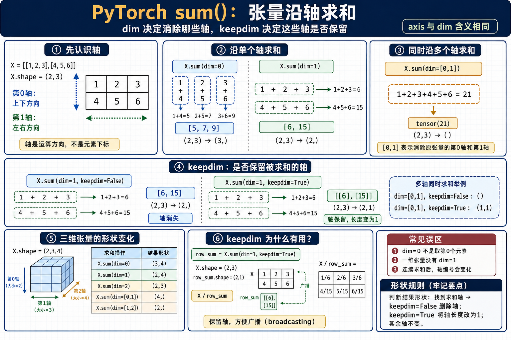

<!-- markdownlint-disable-file MD024 -->

# PyTorch 常用张量函数说明

本文档汇总阅读 OmniVoice 等 Transformer / TTS 源码时高频出现的张量函数，给出每个函数的作用、基本写法和最小示例。第一个函数是 `sum()`。

本文所有二维矩阵示例统一使用同一个张量：

```python
X = torch.arange(20).reshape(5, 4)
# tensor([[ 0,  1,  2,  3],
#         [ 4,  5,  6,  7],
#         [ 8,  9, 10, 11],
#         [12, 13, 14, 15],
#         [16, 17, 18, 19]])   # shape (5, 4)
```

其中 `torch.arange(20)` 先生成 `0, 1, ..., 19` 的一维序列，`.reshape(5, 4)` 在元素总数不变的前提下把它排成 5 行 4 列。数值连续、互不相同，便于追踪每一步求和。

***

## `sum()`：对张量元素求和

`sum()` 把张量中的元素相加。它既能对所有元素求和，也能沿某一个或多个轴（`dim`）求和，并通过 `keepdim` 控制被求和的轴是否保留。



### 1. 函数作用与基本写法

基本写法：

```python
X.sum(dim=None, keepdim=False)
```

也可以写成函数形式：

```python
torch.sum(X, dim=None, keepdim=False)
```

`axis` 是 `dim` 的别名，`X.sum(axis=0)` 等价于 `X.sum(dim=0)`；PyTorch 中更常用 `dim`。

**不指定 `dim` 时对全部元素求和**，结果是一个零维标量：

```python
X = torch.arange(20).reshape(5, 4)

X.sum()          # 0+1+2+...+19 = 190
# tensor(190)
X.sum().shape
# torch.Size([])
```

### 2. `dim`：沿哪个轴求和

`dim` 指定沿**哪个轴**做求和，而不是取第几个元素。二维张量有两个轴：

```text
                 第 1 轴（列方向，从左到右）
               → → → →
        ┌────────────────
第 0 轴 ↓ │  0   1   2   3
（行方向）│  4   5   6   7
         │  8   9  10  11
         │ 12  13  14  15
         │ 16  17  18  19
```

**`dim=0`**：沿第 0 轴求和，把每一列的元素相加，第 0 轴消失：

```python
X.sum(dim=0)     # 逐列相加，如第 0 列 0+4+8+12+16
# tensor([40, 45, 50, 55])     shape (5, 4) -> (4,)
```

**`dim=1`**：沿第 1 轴求和，把每一行的元素相加，第 1 轴消失：

```python
X.sum(dim=1)     # 逐行相加，如第 0 行 0+1+2+3
# tensor([ 6, 22, 38, 54, 70]) shape (5, 4) -> (5,)
```

**多轴**用列表或元组指定，对这些轴同时归约（不分先后）：

```python
X.sum(dim=[0, 1])   # 等价于全部相加
# tensor(190)                  shape (5, 4) -> ()
```

轴也支持负数，从最后一个轴倒数，`dim=-1` 即最后一个轴：

```python
X.sum(dim=-1)       # 等价于 dim=1，(5, 4) -> (5,)
X.sum(dim=-2)       # 等价于 dim=0，(5, 4) -> (4,)
```

> 💡 **小科普：`dim` 不是元素下标**
>
> `X.sum(dim=0)` 是「沿第 0 轴求和」，不是「取第 0 个元素」。取元素要用索引 `X[0]`。记住核心规则：**被求和的轴会被消除，其余轴保持不变。**

### 3. `keepdim`：被求和的轴是否保留

`keepdim` 默认为 `False`，被求和的轴会从结果中消失；设为 `True` 时该轴保留，长度变为 `1`：

| 代码 | 结果 | 结果形状 |
| --- | --- | --- |
| `X.sum(dim=0)` | `[40, 45, 50, 55]` | `(4,)` |
| `X.sum(dim=0, keepdim=True)` | `[[40, 45, 50, 55]]` | `(1, 4)` |
| `X.sum(dim=1)` | `[6, 22, 38, 54, 70]` | `(5,)` |
| `X.sum(dim=1, keepdim=True)` | `[[6], [22], [38], [54], [70]]` | `(5, 1)` |

`keepdim=True` 最主要的用途是**保持轴结构，方便结果继续和原张量做广播**。例如计算每行占该行总和的比例：

```python
X = torch.arange(20).reshape(5, 4).float()

row_sum = X.sum(dim=1, keepdim=True)   # shape (5, 1)
# tensor([[ 6.],
#         [22.],
#         [38.],
#         [54.],
#         [70.]])

X / row_sum        # (5, 4) / (5, 1) 可广播
# tensor([[0.0000, 0.1667, 0.3333, 0.5000],
#         [0.1818, 0.2273, 0.2727, 0.3182],
#         [0.2105, 0.2368, 0.2632, 0.2895],
#         [0.2222, 0.2407, 0.2593, 0.2778],
#         [0.2286, 0.2429, 0.2571, 0.2714]])
```

若写成 `X.sum(dim=1)`，结果形状是 `(5,)`，无法直接和 `(5, 4)` 按预期广播。

### 4. 结果形状规则与速查

通用规则：先找到被求和的轴，`keepdim=False` 删除这些轴，`keepdim=True` 把这些轴长度改成 `1`，其余轴不变。

仍以 `X = torch.arange(20).reshape(5, 4)` 为例：

| 代码 | 结果形状 | 含义 |
| --- | --- | --- |
| `X.sum()` | `()` | 所有元素求和 |
| `X.sum(dim=0)` | `(4,)` | 消除第 0 轴 |
| `X.sum(dim=1)` | `(5,)` | 消除第 1 轴 |
| `X.sum(dim=-1)` | `(5,)` | 等价 `dim=1`，消除最后一轴 |
| `X.sum(dim=[0, 1])` | `()` | 消除第 0、1 轴 |
| `X.sum(dim=0, keepdim=True)` | `(1, 4)` | 第 0 轴长度变为 1 |
| `X.sum(dim=1, keepdim=True)` | `(5, 1)` | 第 1 轴长度变为 1 |

规则对更高维张量同样成立。例如三维张量 `torch.arange(24).reshape(2, 3, 4)`：

| 代码 | 结果形状 | 含义 |
| --- | --- | --- |
| `X.sum(dim=[0, 1])` | `(4,)` | 消除第 0、1 轴 |
| `X.sum(dim=[1, 2])` | `(2,)` | 消除第 1、2 轴 |
| `X.sum(dim=1, keepdim=True)` | `(2, 1, 4)` | 第 1 轴长度变为 1 |

一句话总结：

```text
未指定 dim   → 所有元素求和，得到标量
dim / axis   → 指定沿哪些轴求和
keepdim=False → 被求和的轴消失
keepdim=True  → 被求和的轴保留，长度变为 1
```

***

## 逐元素运算与广播（`+ - * /` 与 `@`）

`+`、`-`、`*`、`/` 都是**逐元素运算**：对应位置一个个计算，遵循同一套广播规则。这和 `sum()` 一节里 `keepdim=True` 之后能直接 `X / row_sum` 是同一回事。

### 逐元素运算

形状完全相同的两个张量，逐元素运算就是对应位置各自计算：

```python
A = torch.arange(20).reshape(5, 4)
A * A            # 每个位置各自平方，结果仍是 (5, 4)
```

注意 `*` 是逐元素乘（Hadamard 积），不是矩阵乘法。

### 广播：形状不同也能算

当两个张量形状不同但「兼容」时，PyTorch 会先把长度为 `1` 的维度拉伸对齐，再逐元素计算。规则是从最右边的维度开始逐维比较：

```text
每一维： 相等               → 保留
        有一方是 1（或缺失）  → 把这一方拉伸到另一方
        两方都不是 1 且不相等 → 报错
```

要点：**拉伸的永远是长度为 1 的那一维，可能是任意一方，甚至两方同时扩**，不是固定「第二个」被扩。

```text
(5,4) / (5,1)   → 第二个扩列              → (5,4)
(1,4) + (5,1)   → 两个都扩                → (5,4)
(5,4) * (4,)    → (4,) 补成 (1,4) 再扩行   → (5,4)
(5,4) + (5,3)   → 最后一维 4≠3 且都不是 1  → 报错
```

以 `sum()` 一节的按行归一化为例，`row_sum` 的 `(5,1)` 被广播成 `(5,4)` 再相除：

```text
row_sum (5,1)        广播成 (5,4)
[[ 6],               [[ 6,  6,  6,  6],
 [22],                [22, 22, 22, 22],
 [38],        →       [38, 38, 38, 38],
 [54],                [54, 54, 54, 54],
 [70]]                [70, 70, 70, 70]]
```

### `*`（逐元素）与 `@`（矩阵乘）不是一回事

```text
A * B   逐元素乘，遵循广播，要求形状可广播
A @ B   矩阵乘法，按「行 × 列求和」，遵循 matmul 维度规则，如 (m,k) @ (k,n) -> (m,n)
```

> 💡 **小科普：PyTorch 没有「矩阵除法」**
>
> 线性代数里没有「两个矩阵直接相除」的运算，PyTorch 的 `/` 永远是逐元素除。需要矩阵乘法时用 `@` / `torch.matmul`；`+ - * /` 与比较运算则统一是逐元素 + 广播。

***

## `cumsum()`：沿轴累积求和

### 1. 它是什么意思

一句话：**从头一路加到当前位置**，把「每一步的当前累计总数」逐个记下来。

和 `sum()` 对比就很清楚：

- `sum()` 只给你**一个最终总数**。
- `cumsum()` 给你**一路上每一步的当前总数**，所以结果的个数和原来一样多（形状不变）。

生活里的比喻：你每天往存钱罐里放钱，`sum` 告诉你「这几天一共放了多少」，`cumsum` 告诉你「每天结束时罐子里累计有多少」。

### 2. 一个例子，一步步算

假设连续 4 天，每天放进存钱罐的钱是：

```text
每天放入: [2, 3, 5, 1]
```

`cumsum` 要算「每天结束时罐子里累计有多少」，做法是从左往右一路累加：

```text
第 1 天结束: 2                = 2
第 2 天结束: 2 + 3            = 5
第 3 天结束: 2 + 3 + 5        = 10
第 4 天结束: 2 + 3 + 5 + 1    = 11
```

换个角度看，每个新位置其实就是「**前一个累计结果 + 当前这天的数**」：

```text
2
2  + 3   = 5      （上一步的 2  再加 3）
5  + 5   = 10     （上一步的 5  再加 5）
10 + 1   = 11     （上一步的 10 再加 1）
```

所以结果是：

```python
torch.tensor([2, 3, 5, 1]).cumsum(dim=0)
# tensor([ 2,  5, 10, 11])
```

两个要点：

- 结果还是 4 个数，和原来一样长——这就是「形状不变」。
- 最后一个数 `11` 正好是这 4 天的总和，也就是 `sum()` 的结果（累加到终点自然就是全部之和）。

多维矩阵只是多了个方向选择：用 `dim` 指定沿哪个方向累加。比如本文的 `X = torch.arange(20).reshape(5, 4)`，`X.cumsum(dim=1)` 就是**每一行各自从左往右累加**，第 0 行 `[0,1,2,3]` 会变成 `[0,1,3,6]`，规则和上面完全一样。

### 3. 在 AI 里可能怎么用（通俗版）

#### 用法一：生成文字 / 语音时的「top-p 采样」挑候选

模型每生成一个词，会给成千上万个候选词各打一个概率。常见做法是「只在最靠谱的一小撮候选里随机挑」：

1. 把候选按概率**从高到低**排好；
2. 用 `cumsum` 一路累加这些概率；
3. 一旦累计超过阈值（比如 0.9），就在这条线之前的候选里抽签。

`cumsum` 的作用就是快速回答「排在前面的候选，加到第几个才够 90%」。通俗说：按概率从高到低排队，累加到够 90% 就划一条线，线内的才有资格参与抽签。

#### 用法二：语音合成里把「时长」变成「位置」

TTS 里有个模块会预测每个字要读多少帧（时间长度）。把这些时长用 `cumsum` 累加，就得到每个字**结束在第几帧**，从而知道每个字对应输出音频的哪一段。通俗说：知道每段各多长，累加一下就知道每段从第几帧开始、到第几帧结束。

> 💡 **一句话记忆**：凡是需要「到目前为止的累计量」——累计概率、累计时长、累计计数——都可能用到 `cumsum`。

***

## 点积（`torch.dot`）

### 1. 它是什么意思

点积（dot product）是对**两个等长的一维向量**做的运算：把对应位置的元素两两相乘，再把这些乘积全部加起来，最后得到**一个数**（标量）。

写成式子就是：

```text
x · y = x[0]*y[0] + x[1]*y[1] + ... + x[n-1]*y[n-1]
```

它其实就是前面两节的组合：**先逐元素乘 `*`，再用 `sum` 求和**。所以下面两种写法等价：

```python
torch.dot(x, y)  ==  (x * y).sum()
```

注意点积的输入是两个向量、输出是一个标量；它只处理一维向量，矩阵之间要用矩阵乘法 `@` / `torch.matmul`。

### 2. 一个例子，一步步算

假设去买 3 种水果，已知每种的**单价**和**数量**：

```text
单价 price = [3, 2, 4]     # 苹果 3 元、香蕉 2 元、橙子 4 元
数量 count = [2, 5, 1]     # 分别买 2、5、1 个
```

求一共花了多少钱，就是「单价 × 数量」再全部加起来——正好是点积。

第一步，对应位置相乘：

```text
3 * 2 = 6      （苹果：3 元 × 2 个）
2 * 5 = 10     （香蕉：2 元 × 5 个）
4 * 1 = 4      （橙子：4 元 × 1 个）
```

第二步，把乘积求和：

```text
6 + 10 + 4 = 20
```

所以总价是一个数 `20`：

```python
price = torch.tensor([3., 2., 4.])
count = torch.tensor([2., 5., 1.])

torch.dot(price, count)   # tensor(20.)
(price * count).sum()     # tensor(20.)  等价写法
```

### 3. 在 AI 里可能怎么用（通俗版）

#### 用法一：神经网络最基础的「加权求和」

一个神经元做的事，本质就是点积：把每个输入乘以它的权重，再加起来。

```text
输入   x = [x1, x2, x3]        # 比如三个特征
权重   w = [w1, w2, w3]        # 模型学到的「每个特征有多重要」
加权和 = x · w = x1*w1 + x2*w2 + x3*w3
```

通俗说：每个输入按「重要程度（权重）」折算后汇总成一个数。当权重非负且加起来为 1 时，点积就是**加权平均**。整个神经网络，就是由海量这样的点积堆起来的。

#### 用法二：衡量两个向量「有多像」——注意力与检索

点积也能衡量两个向量的**相似度 / 对齐程度**：方向越一致，点积越大。

- **注意力机制**：Transformer 用 Query 和 Key 的点积算「当前这个词该关注那个词多少」，点积越大代表越相关、分到的注意力越多。
- **向量检索**：把句子或图片变成向量后，用点积（或归一化后的余弦相似度）比较谁和谁更接近，用于语义搜索、推荐。

通俗说：两个向量就像两支箭，方向越接近，点积越大，代表它们越「相关」。

> 💡 **一句话记忆**：点积 = 逐元素乘 + 求和，把两个等长向量压成一个数；它既能表示「加权求和」，也能表示「两个向量有多相似」。

***

## 矩阵-向量积（`torch.mv`）

### 1. 它是什么意思

矩阵-向量积就是「拿矩阵的**每一行**分别和向量做一次**点积**」。矩阵有几行，就做几次点积，得到几个数，拼成结果向量。

它直接建立在上一节的点积之上：点积是「两个向量 → 一个数」，矩阵-向量积是「做 m 次点积 → m 个数」。

形状规则（关键）：

```text
[m, n]  ·  [n,]  ->  [m,]
 矩阵       向量      结果
```

- 矩阵是 `(m, n)`：m 行 n 列；
- 向量长度必须 = 矩阵**列数 n**（因为每行长度是 n，要和向量逐元素相乘）；
- 结果是一个长度为 `m` 的向量，`m` 正好是矩阵**行数**。

> 💡 **小科普：向量一般不区分行向量和列向量**
>
> 在 PyTorch 里，向量通常就是一维张量 `(n,)`，没有行 / 列方向。数学上把 `v` 画成竖着的列向量，只是为了让「行 × 列」在纸面上讲得通；写代码时直接用一维 `v` 即可，不需要手动摆成 `(n, 1)`。

### 2. 一个例子，一步步算

设矩阵 `A` 和向量 `v`：

```text
A = [[1, 2, 3],      # 形状 (2, 3)：2 行 3 列
     [4, 5, 6]]

v = [1, 0, 1]        # 形状 (3,)：长度 = A 的列数 3 ✓
```

做法是**用 A 的每一行和 v 做点积**（对应位置相乘，再求和）：

```text
第 0 行 [1, 2, 3] 与 v [1, 0, 1]：
    1*1 + 2*0 + 3*1
  =  1  +  0  +  3
  =  4

第 1 行 [4, 5, 6] 与 v [1, 0, 1]：
    4*1 + 5*0 + 6*1
  =  4  +  0  +  6
  = 10
```

A 有 2 行，所以做 2 次点积，得到 2 个数，拼成长度为 2 的结果向量：

```text
结果 = [4, 10]       形状 (2,) = 行数 m
```

对应代码：

```python
A = torch.tensor([[1, 2, 3], [4, 5, 6]])   # (2, 3)
v = torch.tensor([1, 0, 1])                 # (3,)

torch.mv(A, v)     # tensor([ 4, 10])   (2,)
A @ v              # tensor([ 4, 10])   等价写法
```

`torch.mv(A, v)` 要求 `A` 是二维矩阵、`v` 是一维向量；更通用的 `@` / `torch.matmul` 也能算，并且可以进一步推广到矩阵乘矩阵。

### 3. 在 AI 里可能怎么用（通俗版）

#### 用法一：一层「全连接」就是一次矩阵-向量积

神经网络里最常见的全连接层（Linear），本质就是矩阵-向量积再加偏置：

```text
输出 = W · x + b
```

- `x` 是输入向量（长度 n，比如 n 个特征）；
- `W` 是权重矩阵 `(m, n)`，每一行代表「一个输出神经元怎么看待这 n 个输入」；
- `W · x` 把 x 变成 m 个数（m 个输出神经元），每个数就是「该行权重与输入的点积」，也就是一次加权求和。

通俗说：矩阵的每一行是一套「打分规则」，矩阵-向量积就是**用 m 套规则同时给同一个输入打出 m 个分**。

#### 用法二：一次处理一批（升级成矩阵 × 矩阵）

实际中往往不是一个向量，而是一批（batch）向量。把这批向量拼成一个矩阵，运算就从「矩阵 × 向量」升级成「矩阵 × 矩阵」（`@` / `torch.matmul`），一次把整批算完，规则完全一样，只是多做了几列点积。

> 💡 **一句话记忆**：矩阵-向量积 = 矩阵每一行和向量做一次点积；`[m, n] · [n,] -> [m,]`，向量长度对齐列数、结果长度等于行数；向量本身不分行 / 列。

***

## 矩阵乘积（`torch.mm` / `@`）

有了点积和矩阵-向量积做基础，矩阵乘积就很好理解了。

### 1. 它是什么意思

矩阵乘积是矩阵-向量积的「批量版」：矩阵-向量积是「A 的每一行和**一个**向量做点积」，矩阵乘积是「A 的每一行和 **B 的每一列**都各做一次点积」。

把两个矩阵**拆成向量表**看最清楚：

- 第一个矩阵 `A (m, k)` 拆成 **m 个行向量**，每个长度 `k`；
- 第二个矩阵 `B (k, n)` 拆成 **n 个列向量**，每个长度 `k`；
- 结果 `C` 的第 `i` 行第 `j` 列 = 「A 的第 i 行 · B 的第 j 列」这一次点积。

形状规则：

```text
[m, k] · [k, n]  ->  [m, n]
```

中间的 `k` 必须相等（要做点积的两个向量长度都得是 k）；结果是 `m × n`。

### 2. 一个例子，一步步算

```text
A = [[1, 2, 3],       # (2, 3)  → m=2, k=3
     [4, 5, 6]]

B = [[1, 0],          # (3, 2)  → k=3, n=2
     [0, 1],
     [1, 1]]
```

先按上面的说法拆成向量表——A 按行拆、B 按列拆，每个向量长度都是 `k=3`：

```text
A 的行向量：                 B 的列向量：
  a0 = [1, 2, 3]              b0 = [1, 0, 1]   ← B 的第 0 列
  a1 = [4, 5, 6]              b1 = [0, 1, 1]   ← B 的第 1 列
```

结果 `C` 的每个位置 = 「一行 · 一列」的点积：

```text
C[0,0] = a0 · b0 = 1*1 + 2*0 + 3*1 = 4
C[0,1] = a0 · b1 = 1*0 + 2*1 + 3*1 = 5
C[1,0] = a1 · b0 = 4*1 + 5*0 + 6*1 = 10
C[1,1] = a1 · b1 = 4*0 + 5*1 + 6*1 = 11
```

一共算了 `m × n = 2 × 2 = 4` 次点积，拼成形状 `(m, n) = (2, 2)`：

```python
A = torch.tensor([[1, 2, 3], [4, 5, 6]])    # (2, 3)
B = torch.tensor([[1, 0], [0, 1], [1, 1]])  # (3, 2)

torch.mm(A, B)     # tensor([[ 4,  5],
                   #         [10, 11]])      (2, 2)
A @ B              # 等价写法
```

### 3. 在 AI 里可能怎么用（通俗版）

- **全连接层的批量计算**：矩阵-向量积一次只处理一个输入向量；把一批输入拼成矩阵后，用矩阵乘积一次算完整批，效率高得多。
- **注意力分数**：Transformer 把所有 Query 排成矩阵 `Q`、所有 Key 排成矩阵 `K`，用 `Q @ Kᵀ`（K 转置）一次算出「每个词对每个词」的相关性分数矩阵——本质就是把大量点积一次做完。

> 💡 **一句话记忆**：矩阵乘积 = A 的每一行 × B 的每一列做点积；`[m, k] · [k, n] -> [m, n]`，中间 `k` 必须相等。`torch.mm` 只处理二维，通用场景用 `@` / `torch.matmul`。

***

## 范数（`torch.norm`）

### 1. 它是什么意思

范数衡量一个向量「有多长 / 多大」，把一个向量压成一个**非负的数**（标量）。

最常用的是 **L2 范数**（欧几里得范数）：各元素**平方和再开根号**，也就是几何上从原点到该点的「箭头长度」。还有 **L1 范数**：各元素**绝对值之和**。

它和点积有直接联系：`L2 范数 = √(v · v)`（向量和自己做点积，再开根号）。

> 💡 **小科普：矩阵也有范数**
>
> 对矩阵，最常见的是 **Frobenius 范数**：把矩阵所有元素平方和再开根号，相当于把矩阵拉平成一个长向量算 L2。`torch.norm(A)` 默认算的就是它。

### 2. 一个例子，一步步算

取一个二维向量（经典的 3-4-5 直角三角形）：

```text
v = [3, 4]
```

**L2 范数**（平方和开根号）：

```text
第一步 平方:   3² = 9,  4² = 16
第二步 求和:   9 + 16 = 25
第三步 开根号: √25 = 5
```

**L1 范数**（绝对值求和）：

```text
|3| + |4| = 7
```

对应代码：

```python
v = torch.tensor([3., 4.])

torch.norm(v)          # tensor(5.)   L2 范数（默认）
torch.norm(v, p=1)     # tensor(7.)   L1 范数
torch.abs(v).sum()     # tensor(7.)   L1 的等价写法
```

平方会自动消掉负号，所以哪怕分量是负的，长度也总是非负；比如 `[3, -4]` 的 L2 范数同样是 5。新代码里也可以用 `torch.linalg.norm`。

### 3. 在 AI 里可能怎么用（通俗版）

- **归一化成单位向量**：把向量除以它的 L2 范数，就缩放成长度为 1、只保留方向。常用于余弦相似度、embedding 检索——先「统一长度」，再只比方向。
- **正则化 / 权重衰减**：在损失函数里加上权重的范数，鼓励权重别太大，抑制过拟合。L2 让权重平滑变小，L1 还能把部分权重压成 0（稀疏）。
- **梯度裁剪**：训练时用范数给梯度「量个长度」，太长（超过阈值）就按比例剪短，防止梯度爆炸导致训练发散。

> 💡 **一句话记忆**：范数把一个向量压成「长度」这一个非负数；L2 = 平方和开根号（= √(v·v)），L1 = 绝对值之和；常用于归一化、正则化和梯度裁剪。

***

## `len()`：只看第 0 轴长度

### 1. 它是什么意思

对张量调用 Python 内置的 `len()`，返回的**只是第 0 轴（最外层）的长度**，等于 `X.shape[0]`，也等于 `X.size(0)`：

```python
len(X) == X.shape[0] == X.size(0)
```

它**不是元素总数**，也和后面几个轴的长度无关。可以理解成：把张量看成「最外层的一个列表」，`len()` 只数这个列表里有几个元素。

### 2. 一个例子，一步步算

以形状 `(2, 3, 4)` 的张量为例：

```python
X.shape        # torch.Size([2, 3, 4])
len(X)         # 2   ← 只看第 0 轴
```

```text
X.shape = (2, 3, 4)
           ↑
        第 0 轴长度 = len(X)
```

可以把 `X` 理解成由 2 个 `(3, 4)` 矩阵组成，所以最外层有 2 个元素：

```text
X
├── X[0]：形状 (3, 4)
└── X[1]：形状 (3, 4)
```

一层层剥开，`len()` 每次都只看「当前这层」的第 0 轴：

```python
X.shape        # (2, 3, 4)
len(X)         # 2

X[0].shape     # (3, 4)
len(X[0])      # 3    ← X[0] 的第 0 轴

X[0][0].shape  # (4,)
len(X[0][0])   # 4    ← X[0][0] 的第 0 轴
```

注意 `len(X)` 不是元素总数。总元素数是各轴长度相乘 `2 × 3 × 4 = 24`，要用 `numel()`：

```python
X.numel()      # 24
```

对照速查：

| 表达式 | 结果 | 含义 |
| --- | ---: | --- |
| `len(X)` | `2` | 第 0 轴长度 |
| `X.shape[0]` | `2` | 第 0 轴长度 |
| `X.ndim` | `3` | 轴的数量（有几个维度） |
| `X.numel()` | `24` | 所有元素的总数 |

### 3. 在 AI 里可能怎么用（通俗版）

- **数 batch 大小 / 样本数**：张量第 0 轴通常是 batch 维，`len(X)` 就是「这一批有几条样本」，比写 `X.shape[0]` 更顺手。
- **数序列条数**：一批句子 / 音频 token 排成 `(batch, seq_len, ...)` 时，`len(X)` 直接告诉你有多少条。
- **配合遍历**：`for i in range(len(X))` 或直接 `for row in X` 都是沿第 0 轴逐条取出子张量。

> 💡 **一句话记忆**：`len(X)` 只看最外层，也就是张量第 0 轴的长度（`= X.shape[0]`）；要元素总数用 `numel()`，要维度个数用 `ndim`。
