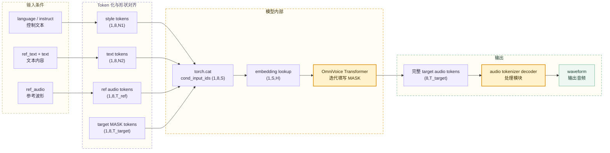

# Token 示例：一条 OmniVoice 输入如何组成完整 Tensor

OmniVoice 会把语言标签、风格指令、文本、参考音频和目标 MASK 组织成统一的模型输入。下列 token ID 为结构示例，不对应真实词表。

## 1. 假设输入与预处理结果

```text
语言 language：zh
声音设计 instruct：女，青年，耳语

参考文本 ref_text：早上好
目标文本 text：你好

参考音频 ref_audio：编码后有 2 个时间帧

目标音频长度：3 个时间帧
codebook 层数：8
```

## 2. Style 段：语言、风格和控制标签

代码先构造：

```text
<|lang_start|>zh<|lang_end|>
<|instruct_start|>女，青年，耳语<|instruct_end|>
```

假设文本 tokenizer 将它转换成 4 个演示 token ID：

```text
style input_ids = [[91, 92, 93, 94]]
shape = (1, 4)

其中 input_ids[0] = [91, 92, 93, 94]，这一行本身的形状是 (4,)。
```

文本 token 只有一层。为了和 8 层音频 codebook 对齐，代码执行
`repeat(8, 1)` 复制到 8 行，再用 `unsqueeze(0)` 增加 batch 维：

```text
(1, 4) -> (8, 4) -> (1, 8, 4)
```

忽略最外面的 batch 包装后，`style_tokens` 是：

```text
codebook 0  [91, 92, 93, 94]
codebook 1  [91, 92, 93, 94]
codebook 2  [91, 92, 93, 94]
codebook 3  [91, 92, 93, 94]
codebook 4  [91, 92, 93, 94]
codebook 5  [91, 92, 93, 94]
codebook 6  [91, 92, 93, 94]
codebook 7  [91, 92, 93, 94]
```

这里的“codebook 0～7”只是为了占据统一的 Tensor 行。Style 文本并没有 8 层声学含义，后续计算文本 embedding 时只读取第 0 行。

## 3. Text 段：参考文本加目标文本

`_combine_text()` 先把两段文本合成：

```text
早上好你好
```

再添加文本边界标签：

```text
<|text_start|>早上好你好<|text_end|>
```

假设 tokenizer 得到 5 个演示 ID：

```text
text input_ids = [[81, 82, 83, 84, 85]]
shape = (1, 5)

其中 input_ids[0] = [81, 82, 83, 84, 85]，这一行本身的形状是 (5,)。
```

同样复制到 8 行并增加 batch 维，得到 `(1,8,5)`：

```text
codebook 0  [81, 82, 83, 84, 85]
codebook 1  [81, 82, 83, 84, 85]
codebook 2  [81, 82, 83, 84, 85]
codebook 3  [81, 82, 83, 84, 85]
codebook 4  [81, 82, 83, 84, 85]
codebook 5  [81, 82, 83, 84, 85]
codebook 6  [81, 82, 83, 84, 85]
codebook 7  [81, 82, 83, 84, 85]
```

## 4. Reference Audio 段：多 codebook token

假设参考音频被 Audio Tokenizer 编成 2 个时间帧。它的形状是 `(8,2)`：

```text
              ref_t0  ref_t1
codebook 0      101     102
codebook 1      201     202
codebook 2      301     302
codebook 3      401     402
codebook 4      501     502
codebook 5      601     602
codebook 6      701     702
codebook 7      801     802
```

增加 batch 维后，`ref_audio_tokens` 的形状是 `(1,8,2)`。这里每一行确实对应一个 codebook，每一列的 8 个 ID 共同描述一个参考音频时间帧。

## 5. Target 段：等待模型填写的 MASK

目标音频预计有 3 个时间帧，因此需要创建 `(1,8,3)` 的目标区域。生成开始前还不知道正确的音频 token，所有位置先填 `audio_mask_id=1024`：

```text
              target_t0  target_t1  target_t2
codebook 0       1024       1024       1024
codebook 1       1024       1024       1024
codebook 2       1024       1024       1024
codebook 3       1024       1024       1024
codebook 4       1024       1024       1024
codebook 5       1024       1024       1024
codebook 6       1024       1024       1024
codebook 7       1024       1024       1024
```

`1024` 是“这个目标位置尚未生成”的特殊整数 ID，不是正常的 codec codeword。

## 6. `torch.cat(parts, dim=2)` 后的完整输入

四个片段的形状为：

```text
style_tokens        (1, 8, 4)
text_tokens         (1, 8, 5)
ref_audio_tokens    (1, 8, 2)
target_audio_tokens (1, 8, 3)
```

沿第 2 维，也就是序列维首尾拼接：

```text
S = 4 + 5 + 2 + 3 = 14
cond_input_ids.shape = (1, 8, 14)
```

忽略最外层 batch 后，完整矩阵是：

```text
             |------ style ------| |-------- text --------| |- ref -| |--- target MASK ---|
codebook 0   [91, 92, 93, 94,      81, 82, 83, 84, 85,      101,102,  1024,1024,1024]
codebook 1   [91, 92, 93, 94,      81, 82, 83, 84, 85,      201,202,  1024,1024,1024]
codebook 2   [91, 92, 93, 94,      81, 82, 83, 84, 85,      301,302,  1024,1024,1024]
codebook 3   [91, 92, 93, 94,      81, 82, 83, 84, 85,      401,402,  1024,1024,1024]
codebook 4   [91, 92, 93, 94,      81, 82, 83, 84, 85,      501,502,  1024,1024,1024]
codebook 5   [91, 92, 93, 94,      81, 82, 83, 84, 85,      601,602,  1024,1024,1024]
codebook 6   [91, 92, 93, 94,      81, 82, 83, 84, 85,      701,702,  1024,1024,1024]
codebook 7   [91, 92, 93, 94,      81, 82, 83, 84, 85,      801,802,  1024,1024,1024]
```

拼接没有把 token ID 做数值加法，只是保持相同 batch 和 codebook 行的对应关系，把各片段沿序列维接在一起。

## 7. `audio_mask` 如何区分文本和音频

Style 和 Text 共有 `4+5=9` 个位置，属于文本表示；Reference Audio 和 Target 共有 `2+3=5` 个位置，属于音频表示。

```text
位置下标：   0    1    2    3    4    5    6    7    8    9   10   11   12   13
片段：     style style style style text text text text text  ref  ref  target target target
audio_mask: F    F    F    F    F    F    F    F    F    T    T    T     T     T
```

它的形状是 `(1,14)`：

```text
[[False, False, False, False, False, False, False, False, False,
  True,  True,  True,  True,  True]]
```

- `False`：该位置使用文本 embedding。
- `True`：该位置使用 8 层 codebook 的音频 embedding。

`audio_mask` 是位置类型标记，不是 attention mask，也不是值为 1024 的目标 MASK token。

## 8. 进入 Transformer 前发生什么

模型不会直接拿整数 ID 做注意力计算。`_prepare_embed_inputs()` 会把它们转换成连续浮点 embedding：

```text
cond_input_ids: (1, 8, 14) 整数 ID
audio_mask:     (1, 14)    文本 / 音频位置标记
                         ↓
文本位置：读取第 0 行 token ID，查询 text embedding
音频位置：8 层 codebook ID 分别查询 audio embedding，再相加
                         ↓
inputs_embeds:  (1, 14, H) 连续浮点向量
```

其中 `H` 是 Transformer hidden size。转换完成后，每个序列位置只对应一个 `H` 维向量，随后进入 OmniVoice 的 Transformer 主干。

`(B,C,S)` 如何经过 `audio_mask`、codebook 层偏移、`nn.Embedding` 查表和 `sum(dim=1)` 变成 `(B,S,H)`，可继续阅读 [扩展知识五：OmniVoice 音频 Token 从 `(B,C,S)` 到 Transformer 向量](chapter22_扩展知识五_音频Token到Transformer向量.md)。

## 9. 模型迭代生成时，Target MASK 如何变化

离散掩码扩散会逐轮把目标区域中的 `1024` 替换成预测的正常 codec ID。它会在所有 codebook 和时间位置中优先填写高置信度位置，并不严格按照时间从左到右生成。只观察某一个 codebook 行时，过程可能是：

```text
生成前： [1024, 1024, 1024]
第 1 轮：[1024,  218, 1024]
第 2 轮：[  37,  218, 1024]
生成后： [  37,  218,  506]
```

8 个 codebook 行都会完成这一过程，最终形成 `(8,3)` 的完整目标音频 token 矩阵，再交给 `audio_tokenizer.decode()` 还原为 waveform。

## 10. 一眼看懂完整链路


