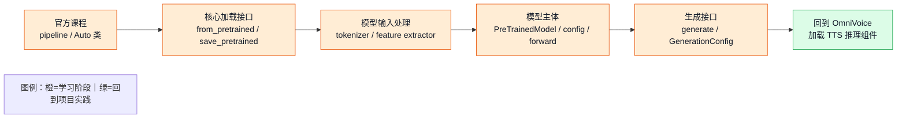

# 第零章：Transformers 学习路径

Transformers 是 Hugging Face 生态中最核心的深度学习模型库。它把模型配置、tokenizer、预训练权重、推理生成、训练接口和模型仓库组织成统一的工程接口。阅读 OmniVoice 这类项目时，重点不在于完整掌握 Transformers 的全部源码，而在于理解几个高频入口如何把模型从 checkpoint 变成可调用对象。

## 官方入口

系统学习优先从官方资料开始：

- Hugging Face 官网：[https://huggingface.co](https://huggingface.co)
- Transformers 官方文档：[https://huggingface.co/docs/transformers](https://huggingface.co/docs/transformers)
- Hugging Face 官方课程：[https://huggingface.co/learn/llm-course](https://huggingface.co/learn/llm-course)
- 模型仓库 Hub：[https://huggingface.co/models](https://huggingface.co/models)

官方课程适合作为入门主线。它会先介绍 `pipeline()`、`AutoTokenizer`、`AutoModel`、`from_pretrained()`，再进入数据处理、fine-tuning、Trainer 和模型发布。官方文档更适合作为查 API 和理解具体参数的手册。

## 推荐书籍

一本常见的系统书是 O'Reilly 的 **Natural Language Processing with Transformers**：

[https://www.oreilly.com/library/view/natural-language-processing/9781098103231/](https://www.oreilly.com/library/view/natural-language-processing/9781098103231/)

这本书适合建立 Hugging Face 工程用法和 NLP Transformer 模型的整体框架。对于 TTS 项目阅读，它的价值主要在于解释 tokenizer、model、datasets、Trainer、Hub 和 fine-tuning workflow，而不是直接覆盖语音合成的全部模块。

## 面向 OmniVoice 的学习顺序

阅读 OmniVoice 工程代码时，Transformers 可以按下面顺序学习：



这条路径先建立通用框架，再回到 OmniVoice 的具体代码。`from_pretrained()` 负责把 checkpoint 加载成模型对象；tokenizer 和 feature extractor 负责把文本、音频等输入转成模型可消费的表示；`forward()` 定义一次前向计算；`generate()` 在自回归或采样循环中不断调用模型，生成最终 token 或声学表示。

## 必须优先理解的接口

Transformers 的接口很多，工程阅读阶段优先理解下面几个：

- `AutoConfig.from_pretrained()`：读取 `config.json`，得到模型结构配置。
- `AutoTokenizer.from_pretrained()`：加载 tokenizer，把文本转成 token id。
- `AutoModel.from_pretrained()` / `PreTrainedModel.from_pretrained()`：读取配置和权重，创建可推理模型。
- `model.forward()`：定义一次模型前向计算，训练 loss 通常也在这里产生。
- `model.generate()`：生成式模型的推理入口，负责采样、停止条件、解码策略等。
- `model.save_pretrained()`：把模型保存成 Hugging Face 标准目录格式。
- `GenerationConfig.from_pretrained()`：读取生成参数，例如采样温度、top-p、最大长度等。

这些接口构成了 Hugging Face 模型的常见生命周期：

```text
config 描述结构
tokenizer 处理输入
from_pretrained 加载权重
forward 执行一次计算
generate 组织推理生成
save_pretrained 保存模型资产
```

## 和 OmniVoice 的对应关系

OmniVoice 的 `OmniVoice.from_pretrained()` 在 Transformers 通用加载流程之上增加了 TTS 推理组件：

- 主模型权重由父类 `PreTrainedModel.from_pretrained()` 加载。
- `AutoTokenizer.from_pretrained()` 加载文本 tokenizer。
- `HiggsAudioV2TokenizerModel.from_pretrained()` 加载音频 tokenizer，用于音频与 codec token 之间的转换。
- `AutoFeatureExtractor.from_pretrained()` 加载音频特征提取器。
- `RuleDurationEstimator()` 提供目标音频长度估计。
- `load_asr_model()` 可选加载 Whisper ASR，用于自动转写参考音频。

理解这层关系后，OmniVoice demo 中的 `--model`、`--device`、`--no-asr`、`--asr-model` 就能映射到具体工程效果：模型来源、设备放置、资源占用、参考文本获取方式和端到端推理链路。

## 本专题的阅读方式

本目录用于补充 Transformers 相关的最小工程知识，不展开完整源码学习。建议先阅读本章，再阅读 [第一章：`from_pretrained` 如何把模型加载起来](chapter01_from_pretrained.md)、[第二章：模型、权重与 Transformers 到底是什么](chapter02_模型权重与Transformers.md) 和 [第三章：预训练与微调：模型能力是怎样形成的](chapter03_预训练与微调.md)。后续章节可以围绕 `AutoTokenizer`、`generate()`、`PretrainedConfig` 和 `save_pretrained()` 继续补充，每章只解释一个核心入口，并优先结合 OmniVoice 代码说明参数如何传递、影响哪些模块。
