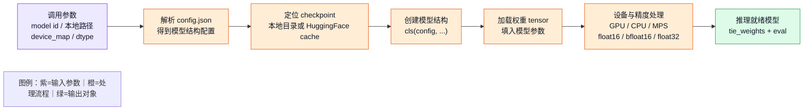
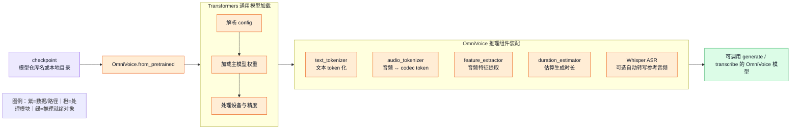

# 第一章：`from_pretrained` 如何把模型加载起来

`from_pretrained()` 是 Transformers 生态里最常见的模型加载入口。它的职责不是单纯读取一个权重文件，而是把 **配置、模型结构、checkpoint 权重、设备放置、精度设置和生成配置** 组织成一个可以直接推理的模型对象。

在 OmniVoice demo 中，模型加载入口位于 `omnivoice/cli/demo.py`：

```python
model = OmniVoice.from_pretrained(
    checkpoint,
    device_map=device,
    dtype=torch.float16,
    load_asr=not args.no_asr,
    asr_model_name=args.asr_model,
)
```

这段代码可以分成两层理解：第一层是 HuggingFace `PreTrainedModel.from_pretrained()` 的通用加载流程；第二层是 OmniVoice 自己在通用加载流程之外补上的 TTS 推理组件。

## 通用加载流程

Transformers 的通用 `from_pretrained()` 通常完成以下步骤：



这里的 `checkpoint` 可以是 HuggingFace 模型仓库名，也可以是本地 checkpoint 目录。对于仓库名，Transformers 会根据 `revision`、`cache_dir`、`token` 等参数定位或下载文件；对于本地目录，它会在目录中寻找 `config.json`、`model.safetensors`、`pytorch_model.bin` 或分片权重索引文件。

`config.json` 描述模型结构，例如隐藏层维度、词表大小、注意力层数、特殊 token 设置等。`__init__(config)` 根据这些配置搭出模型结构；checkpoint 权重再被加载到这些结构参数中。缺失、多余或形状不匹配的权重会被记录为 `missing_keys`、`unexpected_keys`、`mismatched_keys`，严重时会直接报错。

> 💡 **小科普：`__init__` 和 `from_pretrained` 的区别**
>
> `__init__(config)` 只负责搭模型结构，参数通常还是随机初始化或空初始化。`from_pretrained()` 会先准备 config，再创建结构，随后把训练好的 checkpoint 权重填进去。工程上加载可用模型时通常调用 `from_pretrained()`，而不是直接调用 `__init__()`。

## OmniVoice 的外层包装

OmniVoice 在 `omnivoice/models/omnivoice.py` 中重写了 `from_pretrained()`。它先解析自定义参数，再调用父类的通用加载流程：

```python
resolved_path = _resolve_model_path(pretrained_model_name_or_path)
model = super().from_pretrained(resolved_path, *args, **kwargs)
```

父类调用完成后，主模型权重已经加载好。OmniVoice 继续装配推理所需的 TTS 周边组件：



这层包装让 `OmniVoice.from_pretrained()` 不只是加载 LLM 主干，还会把端到端 TTS 推理链路补齐。推理阶段需要文本分词器把输入文本变成 token，需要 audio tokenizer 处理参考音频和声学 token，需要 feature extractor 读取音频特征，需要 duration estimator 估算目标音频长度。`load_asr=True` 时，还会加载 Whisper ASR，用于没有手动填写参考文本时自动转写参考音频。

## demo 参数如何影响加载结果

### `checkpoint`

`checkpoint` 来自命令行参数 `--model`，默认值是：

```text
k2-fsa/OmniVoice
```

它会作为 `pretrained_model_name_or_path` 传入 `OmniVoice.from_pretrained()`。如果值是 HuggingFace 仓库名，加载器会解析并缓存远端模型文件；如果值是本地目录，加载器会直接从本地目录读取 `config.json` 和权重文件。

在 OmniVoice 中，这个路径还会影响周边组件的来源。`audio_tokenizer/` 子目录存在时，优先使用 checkpoint 自带的 audio tokenizer；不存在时，代码回退到 `eustlb/higgs-audio-v2-tokenizer`。

### `device_map=device`

`device` 来自命令行参数 `--device`，没有显式指定时由 `get_best_device()` 自动选择。常见取值包括：

```text
cuda
mps
cpu
```

`device_map` 决定主模型权重放到哪里。`"cuda"` 表示加载到 NVIDIA GPU，`"mps"` 表示加载到 Apple Silicon 的 Metal 后端，`"cpu"` 表示只使用 CPU。对于大模型，Transformers 也支持 `"auto"` 这类自动切分策略，把不同层放在不同设备上。

OmniVoice 对 audio tokenizer 有一个额外处理：如果主模型在 MPS 上，audio tokenizer 会被强制放到 CPU。这是因为 Higgs Audio V2 tokenizer 内部某些卷积计算在 MPS 上可能不受支持。也就是说，`device_map` 不只影响主模型位置，还间接影响音频 tokenizer 的设备选择。

### `dtype=torch.float16`

`dtype` 表示加载或推理时希望使用的权重精度。`torch.float16` 通常可以减少显存占用，也能提高 GPU 推理速度。相对于 `float32`，它占用的显存更低；相对于 `bfloat16`，它在部分设备上兼容性更常见。

Transformers 通用接口中常见的参数名是 `torch_dtype`。阅读 demo 时可以把这里的 `dtype=torch.float16` 理解为“希望以半精度加载模型”的工程意图；如果运行环境中的 Transformers 版本不接受 `dtype`，同类配置通常需要写成：

```python
torch_dtype=torch.float16
```

精度参数主要影响主模型权重的 dtype。它不会改变输入文本内容，也不会改变 checkpoint 本身；它改变的是加载到内存和设备后的 tensor 表示方式。显存紧张时，半精度通常更实用；需要更稳定数值或 CPU 推理时，`float32` 更保守。

### `load_asr=not args.no_asr`

`--no-asr` 是 demo 的命令行开关。默认不加这个开关时：

```python
load_asr=True
```

OmniVoice 会加载 Whisper ASR。它的作用不是生成声音，而是把用户上传的参考音频自动转写成文字。声音克隆场景常需要参考音频和参考文本同时存在；如果用户没有手动填写 `ref_text`，ASR 可以补上这一步。

加上 `--no-asr` 后：

```python
load_asr=False
```

模型加载更轻，启动更快，占用更少显存或内存，但 demo 失去自动转写参考音频的能力。此时用户需要自己提供参考文本，否则 voice clone 链路可能缺少关键条件。

### `asr_model_name=args.asr_model`

`asr_model_name` 指定 ASR 模型来源，默认值是：

```text
openai/whisper-large-v3-turbo
```

它只在 `load_asr=True` 时生效。取值可以是 HuggingFace 仓库名，也可以是本地模型路径。更大的 ASR 模型通常转写质量更好，但加载更慢、占用更多资源；更小的模型启动更快，但在口音、噪声或跨语言场景中可能更容易出错。

在 OmniVoice 推理链路中，ASR 的输出会作为参考文本参与后续生成条件。ASR 转写错误不会直接破坏主模型权重，但会改变模型看到的参考内容条件，从而影响声音克隆或风格迁移的稳定性。

## 一条完整链路

demo 启动时，`from_pretrained()` 的参数沿着下面的路径生效：

```mermaid
flowchart LR
    A["命令行参数<br/>--model / --device / --no-asr / --asr-model"] --> B["demo.py<br/>整理 checkpoint 与 device"]
    B --> C["OmniVoice.from_pretrained"]
    C --> D["父类 from_pretrained<br/>加载 config + 主模型权重"]
    D --> E["按 device_map / dtype<br/>决定设备与精度"]
    E --> F["加载 tokenizer / audio tokenizer<br/>feature extractor / duration estimator"]
    F --> G{"load_asr ?"}
    G -- "是" --> H["加载 Whisper ASR<br/>使用 asr_model_name"]
    G -- "否" --> I["跳过 ASR<br/>需要手动 ref_text"]
    H --> J["Gradio demo 可生成音频"]
    I --> J

    classDef input fill:#ede9fe,stroke:#7c3aed,color:#111827;
    classDef process fill:#ffedd5,stroke:#ea580c,color:#111827;
    classDef decision fill:#fef9c3,stroke:#ca8a04,color:#111827;
    classDef output fill:#dcfce7,stroke:#16a34a,color:#111827;
    class A input;
    class B,C,D,E,F,H,I process;
    class G decision;
    class J output;
```



这条链路体现了 `from_pretrained()` 在工程中的核心地位：它把“模型文件”变成“可调用对象”。对于 OmniVoice 这类 TTS 系统，模型对象不只是一个神经网络主干，还包括文本 token 化、参考音频处理、声学 token 编解码、时长估计和可选 ASR。理解这层加载关系后，`--model`、`--device`、`--no-asr`、`--asr-model` 就不再只是命令行参数，而是分别控制模型来源、运行位置、资源占用和参考文本获取方式的工程开关。
