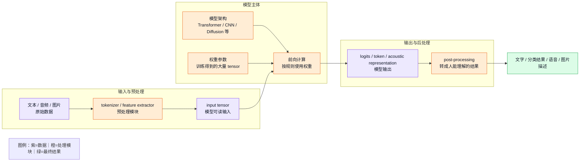
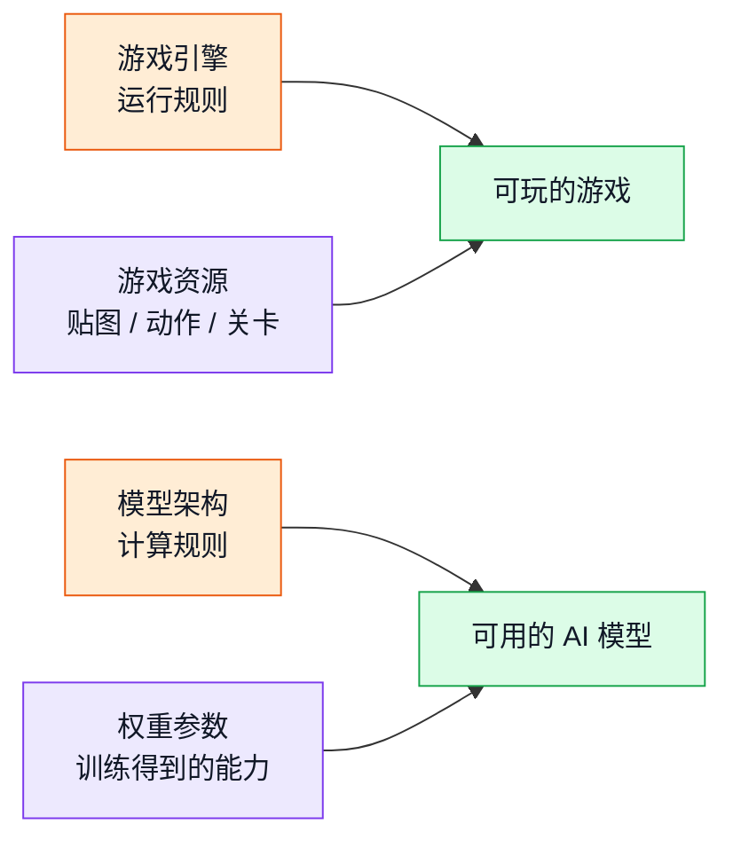
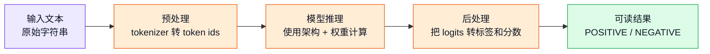
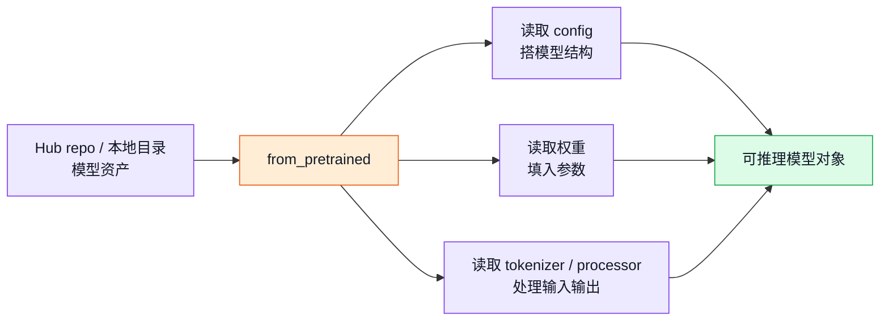

# 第二章：模型、权重与 Transformers 到底是什么

阅读大模型工程代码时，“模型”“权重”“Transformer”“Transformers”这几个词经常同时出现。它们指向的层级并不相同：**模型架构**规定数据如何流动，**权重参数**保存训练得到的具体能力，**Transformers 库**提供加载、调用、训练和发布模型的工程工具。

一个可运行的模型通常不是单个文件，而是一组资产和代码共同组成的系统：



## 架构决定“怎么算”

模型架构可以理解成一套计算规则。最简单的线性模型可以写成：

```text
y = x * w + b
```

这里的 `x` 是输入，`y` 是输出，`w` 和 `b` 是参数。这个公式本身规定了“输入怎样经过计算得到输出”。大模型的公式远比这复杂，会包含 embedding、self-attention、feed-forward network、layer normalization、residual connection 等模块，但本质仍然是：**架构规定数据从哪里来、经过哪些层、怎样一步步变成输出**。

Transformer 架构的核心优势是自注意力机制。它让序列中的每个位置都能根据上下文重新组织信息。例如一句话里的某个词，可以根据前后词决定它在当前语境中的含义。语音模型也可以使用类似主干，把文本 token、音频 token、speaker 条件、style 条件组织到同一个生成过程中。

架构只提供计算方式。没有权重时，它只是一个空结构。就像一张复杂电路图，线路和元件连接方式已经定好，但没有经过训练得到的参数，它不会表现出具体语言能力、识别能力或发音风格。

## 权重决定“学到了什么”

权重参数是模型训练后留下来的大量数字。它们通常以 tensor 的形式存储在 checkpoint 文件中，例如：

```text
model.safetensors
pytorch_model.bin
model-00001-of-000xx.safetensors
```

这些数字不是人工逐个写出来的规则，而是模型在训练数据中不断预测、犯错、反向传播、更新参数后形成的结果。训练过程中，模型会反复调整每一层的权重，使输出越来越接近目标答案。

权重保存的是模型的具体行为倾向。相同架构配上不同权重，可以变成不同模型：一个用于英文情感分类，一个用于代码生成，一个用于语音识别，一个用于文本转语音。架构规定“如何计算”，权重决定“计算后更可能得到什么结果”。

> 💡 **小科普：权重不是数据库**
>
> 权重不是一条条可检索的知识记录，而是分布在大量 tensor 中的数值模式。模型回答问题时，不是先查找某个固定条目，再复制出来；它是在当前输入条件下，通过多层计算得到下一步输出的概率分布。因此，权重更像训练经验压缩后的计算状态，而不是普通数据库。

## 游戏引擎与游戏本体

一个常见比喻是游戏引擎和游戏资源。游戏引擎提供物理、渲染、输入控制和运行规则；具体游戏还需要角色模型、贴图、动作、地图、剧情和关卡数据。



同一种引擎可以支撑完全不同的游戏。同一种模型架构也可以支撑不同任务：换一套权重，模型的能力边界、语言风格、任务目标都会改变。这个比喻适合帮助建立直觉，但工程上还要补充一点：模型除了架构和权重，还需要 tokenizer、config、generation config、feature extractor 等配套文件，否则输入输出未必能正确对齐。

## Transformers 有两层含义

“Transformers”在工程语境里容易有两层含义：

1. **Transformer 架构**：一种神经网络结构，常用于文本、语音、图像和多模态模型。
2. **Hugging Face Transformers 库**：一个 Python 工具库，提供模型加载、tokenizer、pipeline、训练接口、生成接口和 Hub 交互能力。

Hugging Face 官方课程中的 `pipeline()` 展示的是第二层含义。它把预处理、模型推理和后处理封装成一个简单接口：

```python
from transformers import pipeline

classifier = pipeline("sentiment-analysis")
classifier("I've been waiting for a Hugging Face course my whole life.")
```

这段代码背后会完成三步：



`pipeline()` 的价值在于降低上手门槛。用户直接输入文本、图片或音频，工具库会选择合适的 tokenizer、模型和后处理方式，把结果变成人能读懂的形式。官方课程列出的文本分类、文本生成、翻译、摘要、图像分类、语音识别、文本转语音等任务，都可以按类似模式组织。

## Hub、checkpoint 与本地模型文件

Hugging Face Hub 可以理解成模型资产仓库。一个模型仓库通常包含：

```text
config.json                  # 模型结构配置
model.safetensors             # 权重参数
tokenizer.json / vocab files   # 文本 tokenizer 资产
generation_config.json         # 生成参数
preprocessor_config.json       # 图像 / 音频预处理配置
README.md                      # 模型说明卡
```

`from_pretrained()` 做的事情，就是根据仓库名或本地路径找到这些文件，把它们组合成可运行对象。对于文本模型，它常见地加载 config、tokenizer 和权重；对于语音模型，还可能加载 feature extractor、audio tokenizer 或 vocoder。模型越复杂，配套资产越多。



## 和 OmniVoice 的关系

OmniVoice 的加载过程体现了这套分层关系：

- `OmniVoiceConfig` 描述主模型结构。
- `OmniVoice` 类定义模型如何前向计算、如何生成音频 token。
- checkpoint 权重保存训练得到的 TTS 能力。
- `AutoTokenizer` 处理文本输入。
- `HiggsAudioV2TokenizerModel` 处理音频与 codec token 的转换。
- `AutoFeatureExtractor` 读取音频预处理配置，例如采样率。
- Whisper ASR 是可选组件，用于自动转写参考音频。

因此，`OmniVoice.from_pretrained("k2-fsa/OmniVoice")` 不只是“下载一个模型”。它会把主模型架构、权重、文本 tokenizer、音频 tokenizer、feature extractor、时长估计器和可选 ASR 组织成一条端到端 TTS 推理链路。

## 最小心智模型

读 Transformers 和 OmniVoice 代码时，可以先记住下面这组对应关系：

```text
架构 / class / config：规定怎么算
权重 / checkpoint：保存学到的参数
tokenizer / feature extractor：把原始输入变成 tensor
forward：执行一次模型计算
generate：组织多步生成过程
pipeline：把预处理、模型、后处理封装成简单接口
Hub：存放模型资产和说明文档的仓库
```

一个完整模型不是“架构”或“权重”单独任何一方，而是 **架构 + 权重 + 输入输出处理 + 推理代码** 的组合。架构提供运行机制，权重提供训练经验，Transformers 库提供工程接口，三者合在一起，模型才能从一段文本、图片或音频输入中产生可用结果。
